# Lab 01 – Java-Dev - Deploy a Java web app to Azure App Service


After you complete this module, you will be able to:

- Create a PrimeFaces Java web application.

- Configure your Java project to deploy to Azure App Service.

- Deploy your Java web application to Azure App Service.

**What is Azure App Service?**

Azure provides Azure App Service as a platform as a service (PaaS) for
running Tomcat. It features a Windows and Linux environment, security,
load balancing, autoscaling, and DevOps integration. You can leave the
OS and Tomcat management to Azure and concentrate on building
applications.


## Task 0 : Set up Environment Variables

1.  Search for [**Environment
    variables**](urn:gd:lg:a:send-vm-keys) from your Windows start menu
    and select Edit Environment variables.

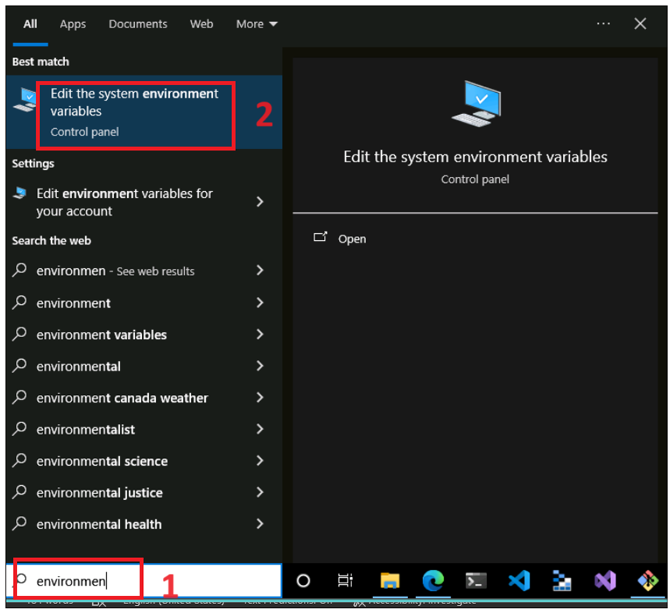

2.  On System Properties window, Click on **Advanced -\> Environment
    variables**.


3.  Select **JAVA_HOME** and then click on **Edit** button .Update the
    value to [**C:\Program
    Files\Java\jdk1.8.0_202**](urn:gd:lg:a:send-vm-keys) and then click
    on **OK**.


4.  Click on New and Add below MAVEN variable and value and then click
    on **OK**.

Variable Name : [**MAVEN_HOME**](urn:gd:lg:a:send-vm-keys)

Variable value : [**C:\Software
folder\apache-maven-3.9.4**](urn:gd:lg:a:send-vm-keys)

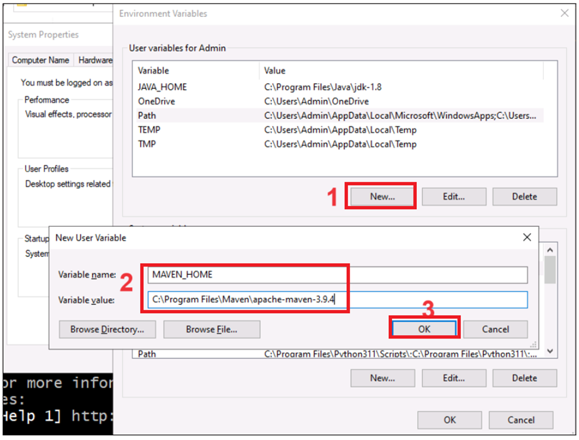

5.  Make sure **TOMCAT** variable set correctly.

Variable Name : [**TOMCAT_HOME**](urn:gd:lg:a:send-vm-keys)

Variable value : [**C:\Program Files\Apache Software Foundation\Tomcat
9.0**](urn:gd:lg:a:send-vm-keys)


6.  Select the **Path** and then click on **Edit**.

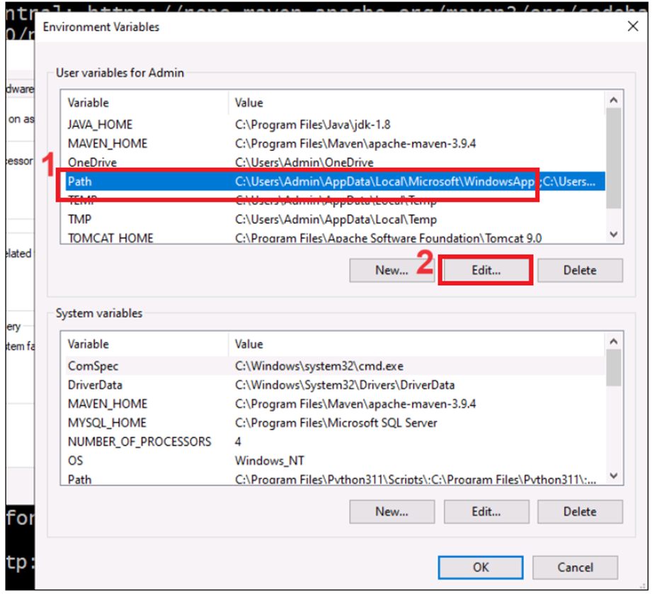

7.  Click on New and add below variable
    paths [**%JAVA_HOME%\bin**](urn:gd:lg:a:send-vm-keys)


8.  Click on **New** again and add below path.

>```copy
>%MAVEN_HOME%\bin
>


9.  Click on New and add Chocolatey
    path 
    
>```copy    
>C:\ProgramData\chocolatey\bin
>

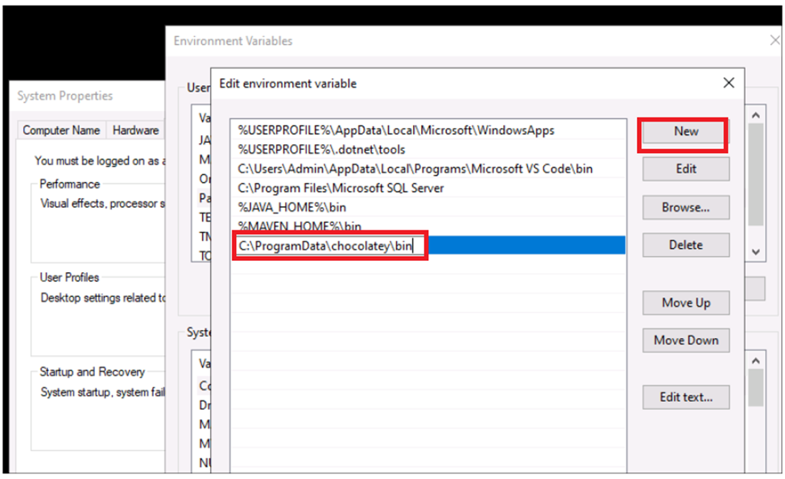

10. Click OK on **edit Environment Variables** and Environment
    variables.


11. On System variables windows, click on **OK**.


## Task 1 : Cloud slice resource group

1.  Open a browser and go to <https://portal.azure.com> and sign in with
    the cloud slice account specified in home page.


2.  On the **Home** page, click on the **Resource groups** tile.

> 

3.  Make sure resource group already got created in your cloud slice
    account .You will be using the same resource and creating all your
    resources within this resource in this course.

> 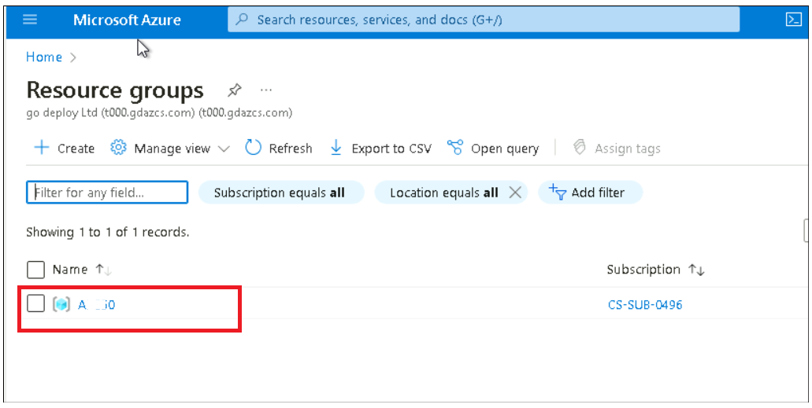 style="width:6.49236in;height:3.27292in" />

## Task 2 : Get sample JSF applications

To deploy a Java web application, you can get a PrimeFaces JavaServer
Faces (JSF) web application repo in C:\Labfiles

4.  Open **Gitbash**  as administrator from windows start and run [**az
    login**](urn:gd:lg:a:send-vm-keys) command.

>**Note**: If see WARNING: A web browser has been opened at
https://login.microsoftonline.com/organizations/oauth2/v2.0/authorize.
Please continue the login in the web browser. If no web browser is
available or if the web browser fails to open, use device code flow
with [**az login --use-device-code**](urn:gd:lg:a:send-vm-keys).
>

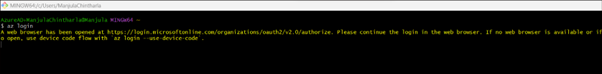

2.  Default browser opens to sign in .Sign in with your Azure
    subscription account.

> 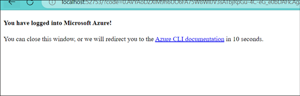 alt="Screenshot" />
>
>  alt="Screenshot" />

3.  Open **intellij IDEA** as administrator and open the above project
    from C:\Labfiles. Select the **Start trail** radio button and then
    click on Start trail button.


4.  Click on **Allow access** button.

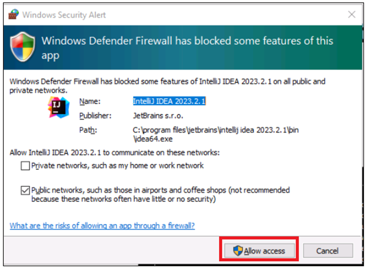

5.  Click on **Accept all.**


6.  Switch back to IntelliJ window and then click on Continue button.

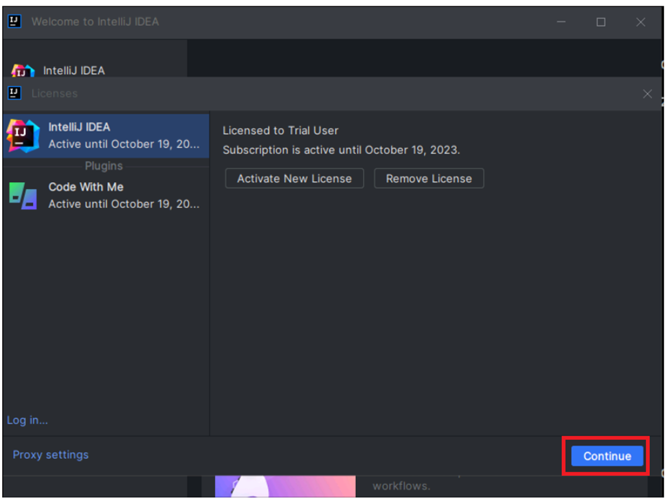

7.  Click on **Open** and browse the above project
    from **C:\LabFiles\Deploy-PrimeFaces-JSF-Web-App-on-Tomcat-9.0-master\Deploy-PrimeFaces-JSF-Web-App-on-Tomcat-9.0-master.**

>  alt="Screenshot" />
>
>  alt="Screenshot" />

8.  Click on **Trust the project.**

>  alt="Screenshot" />

9.  Then you'll see the following files in the directory:

> Deploy-PrimeFaces-JSF-Web-App-on-Tomcat-9.0
>
> ├── pom.xml
>
> └── src
>
> └── main
>
> ├── java
>
> │ └── com
>
> │ └── microsoft
>
> │ └── azure
>
> │ └── samples
>
> │ ├── controller
>
> │ │ └── TodoListController.java
>
> │ ├── dao
>
> │ │ ├── ItemManagement.java
>
> │ │ └── TodoItemManagementInMemory.java
>
> │ └── model
>
> │ └── TodoItem.java
>
> └── webapp
>
> ├── META-INF
>
> │ └── context.xml
>
> ├── WEB-INF
>
> │ ├── beans.xml
>
> │ ├── classes
>
> │ │ └── logging.properties
>
> │ ├── faces-config.xml
>
> │ └── web.xml
>
> └── index.xhtml
>

>  alt="Screenshot" />

## Exercise 1 : Maven Plugin for Azure App Service

Microsoft provides the Maven Plugin for Azure App Service to make it
easier for Java developers to deploy applications to Azure. By using
this plug-in, you can easily configure and deploy your application to
Azure. Execute the following command to use Maven Plugin for Azure App
Service.

### Task 1 : Configure the Maven Plugin for Azure App Service

1.  Navigate back to the **Gitbash**  and navigate the project directory

>```copy
>cd "C:\LabFiles\Deploy-PrimeFaces-JSF-Web-App-on-Tomcat-9.0-master\Deploy-PrimeFaces-JSF-Web-App-on-Tomcat-9.0-master"
>


2.  To configure the Maven Plugin for Azure App Service, execute the
    following **command:**

>```copy
> mvn com.microsoft.azure:azure-webapp-maven-plugin:2.5.0:config
>

>  alt="Screenshot" />

3.  After the command, some questions will appear at the prompt, so
    enter and select the appropriate items and set them. Enter the
    following options:

| **Item**                       | **Input value**                |
|--------------------------------|--------------------------------|
| Subscription                   | Choose your Azure Subscription |
| Define value for OS            | 2: Linux                       |
| Define value for Java version  | Java 8                         |
| Define value for runtime stack | 4: TOMCAT 9.0                  |
| Define value for pricing tier  | P1v2                           |
| Confirm (Y/N)                  | Y                              |

>  alt="Screenshot" />

4.  After you execute the command, the results will appear:

>  alt="Screenshot" />

5.  Check your **Intelliji**. You'll see a new section in the  section
    in your **pom.xml** file.

>  alt="Screenshot" />

6.  Change below values in pom.xml and save it

- **maven.compiler.source to 1.8 ( line \#12)**

- maven.compiler.target to **1.8 (line \#13 )**

- resourceGroup – your Cloud slice resource group name (line \#69)

- region – eastus (line \#72)

> 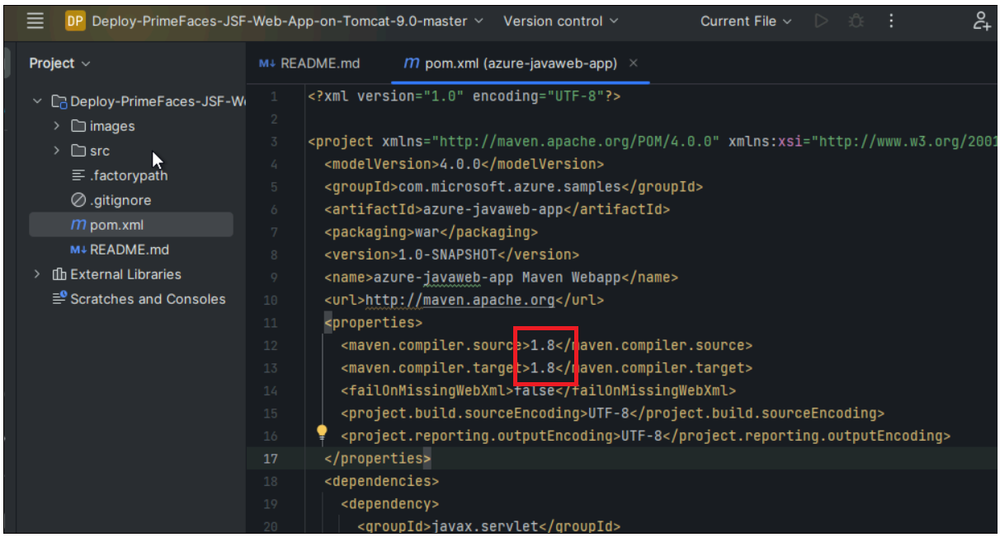 style="width:6.49375in;height:3.49375in" />
>
>  style="width:6.49375in;height:3.13472in" />

### Task 2 : Compile and deploy to Azure App Service

1.  Now that the settings for deploying to Azure App Service are
    complete, compile the source code again . Go back to the Gitbash and
    run below command

>```copy
> mvn clean package
>

> 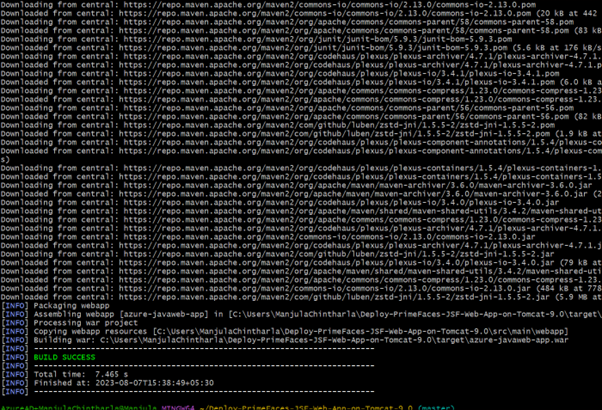 alt="Screenshot" />

2.  Once compiled, use the Maven Plugin for Azure Web Apps command to
    deploy your application. Execute the following command:

>```copy
> mvn azure-webapp:deploy
>

**IMPORTANT**: Raise a support ticket if you see below error -
subscription is not allowed to create or update Azure Web App
-[**https://learn.microsoft.com/en-gb/azure/azure-portal/supportability/how-to-create-azure-support-request**](urn:gd:lg:a:send-vm-keys) 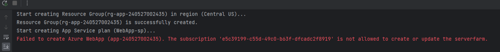

When the deployment is completed, the following message will be output.

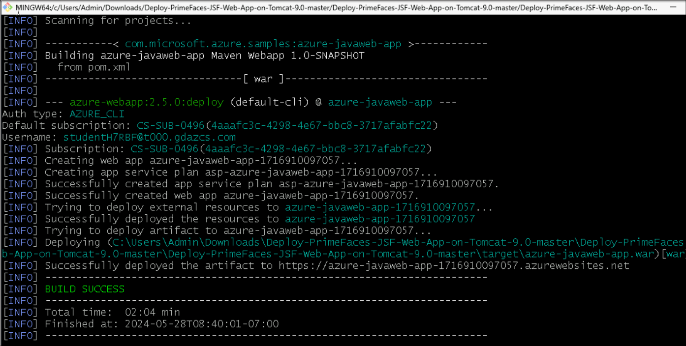

3.  The public URL of the deployed application is displayed
    in Successfully deployed the artifact to. Access your URL with a
    browser.

> 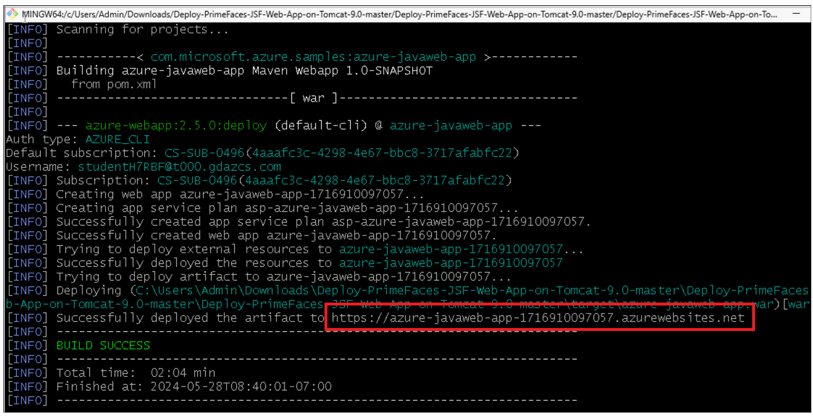 style="width:6.4875in;height:3.32708in" />

 [**https://azure-javaweb-app-XXXXXXXXXX.azurewebsites.net**](urn:gd:lg:a:send-vm-keys)

>  alt="A screenshot of a computer Description automatically generated" />

### Task 3 : Confirm the log stream from the command line

1.  To access the log stream, update the below command with your appname
    and execute the following Gitbash CLI command. (Replace
    XXXXXXXXXXXXXX with your code)

>```copy
> az webapp log tail -g azure-javaweb-app-XXXXXXXXXXXXXX-rg -n
> azure-javaweb-app-XXXXXXXXXXXXXX
>

> eg : az webapp log tail -g azure-javaweb-app-1691402277330-rg -n
> azure-javaweb-app-1691402277330
>

 Then you can see the following result:

>  alt="Screenshot" />
>
> 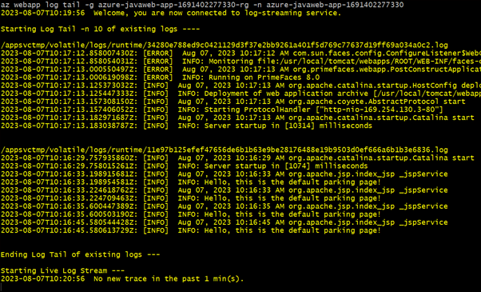 alt="Screenshot" />

## Exercise 3 : Auto scale a web app by using custom metrics

### Task 1 : Configure autoscale

**Configure the autoscale settings for your App Service plan.**

1.  Open a new tab in browser and go
    to [**https://portal.azure.com**](urn:gd:lg:a:send-vm-keys) and sign
    in with your Office 365 admin tenant credentials.

2.  Search and select [**autoscale**](urn:gd:lg:a:send-vm-keys) in the
    search bar or select **Autoscale** under **Settings** in the menu
    bar on the left.

>  alt="Screenshot" />

3.  Select your **App Service plan**. You can only configure production
    plans.

> 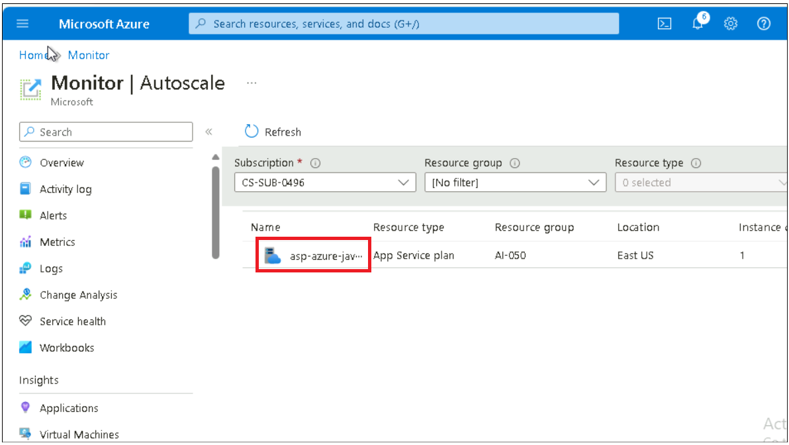

### Task 2 : Set up a scale-out rule

**Set up a scale-out rule so that Azure spins up another instance of the web app when your web app is handling more than 70 sessions per instance.**

1.  Select **Custom autoscale**.In the **Rules** section of the default
    scale condition, select **Add a rule**.

> 
>
> 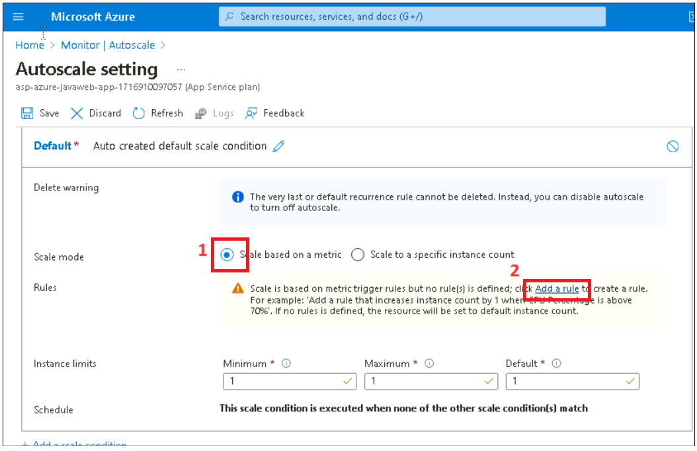 style="width:6.49236in;height:4.19722in" />

2.  From the **Metric source** dropdown, select **Other resource**.

3.  From **Resource type**, select **App Service plans**.

4.  From the **Resource** dropdown, select your web app.

5.  Select a **Metric namespace** to base your scaling on. For example,
    use **CPU Percentage**.

> 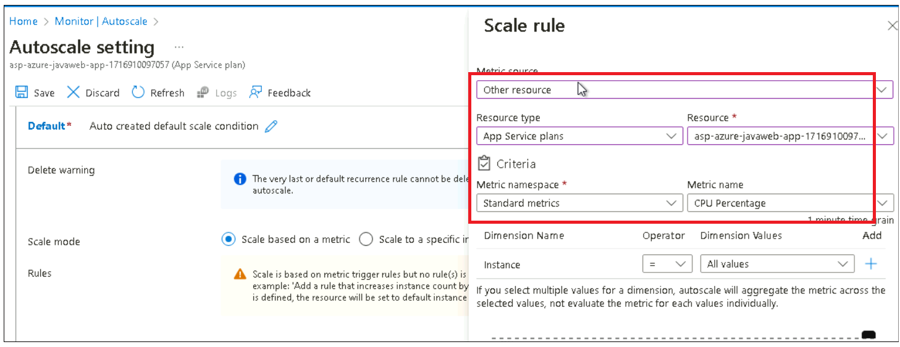

6.  Select the **Enable metric divide by instance count** checkbox so
    that the number of sessions per instance is measured.

7.  From the **Operator** dropdown, select **Greater than**.

8.  Enter the **Metric threshold to trigger the scale action**. For
    example, use **70**.

9.  Under **Action**, set **Operation** to **Increase count by**.
    Set **Instance count** to **1**.

10. Select **Add**.

>  style="width:6.49236in;height:3.91667in" />

### Task 3 : Limit the number of instances

1.  Set the maximum number of instances that can be spun up in
    the **Maximum** field of the **Instance limits** section. For
    example, use **4**.

2.  Select **Save**.

>  alt="Screenshot" />

### Task 4 : Clean up resources:

**Do not delete resource group and the app as the same application will
be used in
Lab 13 - Configuring your App Service or Azure Functions app to use Entra ID login
to test authentication and authorization features.**

**Summary:**

In this labguide, we learnt how to create and package a Java web
application, how to use the Maven Plugin for Azure Web Apps, and how to
deploy your application to Azure App Service. These steps are applicable
not only for JSF applications but also most Java web applications.
