# Lab 02 - Java-Dev -Containerize and deploy a Java app to Azure


By the end of this module, you'll be able to:

- Containerize a Java app.

- Build a container image for the Java app.

- Run the container image locally.

- Push the container image to Azure Container Registry.

- Deploy the container image to Azure Kubernetes Service

## Exercise 1 : Set up your Azure environment

In this exercise, you will use the Azure CLI to create the Azure
resources that will be needed in later units. Using the Azure CLI,
perform the following steps

### Task 1: Authenticate with Azure Resource Manager

1.  Open Gitbash from Desktop and run below command login to the Azure
    portal

> ```Copy
>
> az login
>


**Note**: If see WARNING: A web browser has been opened at
https://login.microsoftonline.com/organizations/oauth2/v2.0/authorize.
Please continue the login in the web browser. If no web browser is
available or if the web browser fails to open, use device code flow
with [**az login --use-device-code**](urn:gd:lg:a:send-vm-keys).


2.  This command will take you to the default browser to login. Log in
    with your Cloud slice account.

>  alt="Screenshot" />
>
>  alt="Screenshot" />

3.  Once authenticated switch back to the Gitbash

> 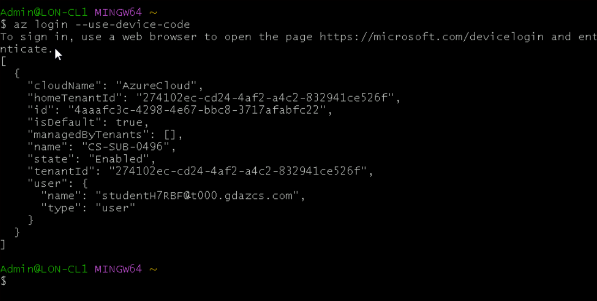 alt="A computer screen shot of a computer code Description automatically generated" />

4.  Now we will enable our Azure subscription execute the below command

>```copy
> az account set --subscription "<YOUR_SUBSCRIPTION_ID>"
>
> az account list --output table
>

> 

5.  Define local variables To simplify the commands that will be
    executed further down, set up the following environment variables

>```copy

> export AZ_RESOURCE_GROUP=Should be your Cloud slice resource group.

> export AZ_CONTAINER_REGISTRY="javaaksregist"$RANDOM

> export AZ_KUBERNETES_CLUSTER="javaakscluster"$RANDOM

> export AZ_LOCATION="eastus"

> export AZ_KUBERNETES_CLUSTER_DNS_PREFIX="javaakscontainer"

>

**Note:** You'll want to replace with your region of choice, for
example: eastus You'll want to replace with a unique value as this is
used to generate a unique FQDN (fully qualified domain name) for your
Azure Container Registry when it is created, for example:
someuniquevaluejavacontainerregistry.


**Note:** This module uses the **jq** tool, which is installed by
default on [***Azure Cloud Shell***](https://shell.azure.com/) to
display JSON data and make it more readable. If you don't want to use
the **jq** tool, you can safely remove the **\| jq** part of all
commands in this module.

8.  Azure Container Registry allows you to build, store, and manage
    container images, which are ultimately where the container image for
    the Java app will be stored. Create an Azure Container Registry with
    the following commands.

>```copy
>az acr create --resource-group $AZ_RESOURCE_GROUP --name $AZ_CONTAINER_REGISTRY --sku Basic | jq
>


9.  Configure Azure CLI to use this newly created Azure Container
    Registry

>```copy
> az configure --defaults acr=$AZ_CONTAINER_REGISTRY
>


10. Authenticate to the newly created Azure Container Registry

>```copy
> az acr login -n $AZ_CONTAINER_REGISTRY
>

> 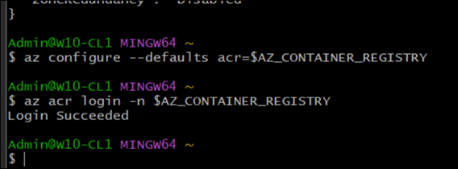 alt="Screenshot" />

11. Create an Azure Kubernetes Cluster, You'll need an Azure Kubernetes
    Cluster to deploy the Java app (container image) to.

>```copy
> az aks create --resource-group \$AZ_RESOURCE_GROUP --name
> \$AZ_KUBERNETES_CLUSTER --attach-acr \$AZ_CONTAINER_REGISTRY
> --dns-name-prefix=\$AZ_KUBERNETES_CLUSTER_DNS_PREFIX
> --generate-ssh-keys \| jq
>

> 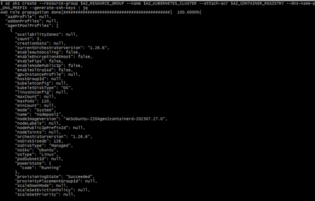 alt="Screenshot" />
>

> **Note:** Azure Kubernetes Cluster creation can take up to 10 minutes,
> once you run the command above, you can optionally let it continue in
> that Azure CLI tab and move on to the next unit.

### Task 2 : Launch Docker

1.  On the Start menu, click on **DockerDesktop**

>  alt="Screenshot" />
>

> 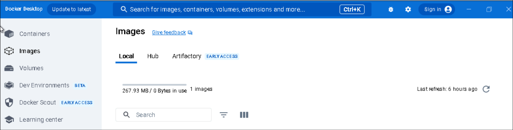 alt="A screenshot of a computer Description automatically generated" />

## Exercise 2: Containerize a Java app

In this exercise, you will containerize a Java application.

### Task 1 : Build Java Application

First you will clone the Flight Booking System for Airline Reservations
repository and cd to the Airlines web application project folder.

**Note:** If the Azure Kubernetes Service creation has successfully
completed in your CLI tab, use that one, otherwise if it's still
running, open a new tab and cd to the location of where you prefer to
clone the Flight Booking System for Airline Reservations.

Optionally, if you have Java & Maven installed, you can run the
following command(s) in your CLI to get an sense of the experience in
building the application without Docker. If you do not have Java & Maven
installed, you can safely jump ahead to the next section titled
"Construct a Docker file", In that section you'll use Docker to pull
down Java and Maven to execute the builds on your behalf.

1.  Run the following command in your CLI to navigate to the project.

>```copy
>cd "C:\Labfiles\containerize-and-deploy-Java-app-to-Azure-master\Project\Airlines"
>


2.  Run the following command in your CLI

>```copy
> mvn clean install
>

> 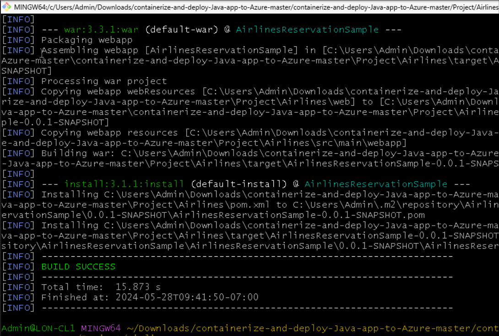 alt="A screenshot of a computer program Description automatically generated" />
>

> **Note:** The mvn clean install command was used to illustrate the
> operational challenges of not using Docker multi-stage builds, that we
> will cover next. Again this step is optional, either way you can
> safely move along without executing the Maven command.

3.  Maven should have successfully built the Flight Booking System for
    Airline Reservations Web Application Archive artifact
    FlightBookingSystemSample-0.0.-SNAPSHOT.war, as seen in the
    following image

> 

### Task 2 : Construct a Docker file

1.  Within the root of your project,
    containerize-and-deploy-Java-app-to-Azure/Project/Airlines, Create a
    file called **Dockerfile.**

>```copy
> vi Dockerfile
>

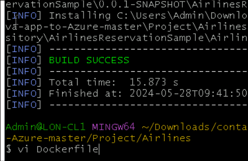

2.  Add the following contents to Dockerfile and then save and exit

>```copy
> **\#**
>
> *\# Build stage*
>
> **\#**
>
> FROM maven:3.6.0-jdk-11-slim AS build
>
> WORKDIR /build
>
> COPY pom.xml .
>
> COPY src ./src
>
> COPY web ./web
>
> RUN mvn clean package
>
> **\#**
>
> *\# Package stage*
>
> **\#**
>
> FROM tomcat:8.5.72-jre11-openjdk-slim
>
> COPY tomcat-users.xml /usr/local/tomcat/conf
>
> COPY --from=build /build/target/\*.war
> /usr/local/tomcat/webapps/FlightBookingSystemSample.war
>
> EXPOSE 8080
>
> CMD \["catalina.sh", "run"\]
>

> 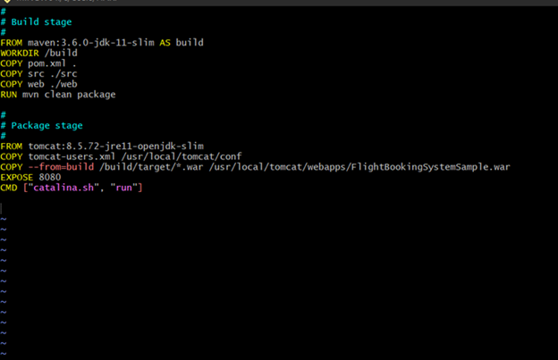 alt="Screenshot" />
>
> **Note:** Optionally, the Dockerfile_Solution in the root of your
> project contains the contents needed.As you can see, this Docker file
> Build stage has six instructions.

## Exercise 3 : Build and run a container image for the Java app

In this unit, you will build and run the container image. As mentioned
earlier, a running instance of an image is a container.

### Task 1 : Build a container image

Now that you've successfully constructed a Dockerfile, you can instruct
Docker to build a container image for you.

**Note:** Ensure your Docker runtime is configured to build Linux
containers. This is important as the Dockerfile being used references
container images (JDK/JRE) for the Linux architecture.

1.  **Docker build** is the command used to build container images.
    The **-t** argument will be used to specify a container label and
    the **.** is the location for Docker to find the Dockerfile. Run the
    following command in your CLI.

>```copy
docker build -t flightbookingsystemsample .
>

> 

2.  Docker build is something similar

>  alt="A screenshot of a computer Description automatically generated" />
>
> **Note:** As you saw previously, Docker has executed the instructions
> from the lines that you've previously written in the prior unit. Each
> instruction is a step in sequential order. Rerun the **docker
> build** command again, notice the differences in the steps, you'll
> notice **---\>** Using cache for layers that haven't changed. If your
> not making app changes (before rerunning the **docker
> build** command), then you'll notice all cached layers as the binaries
> are untouched and can be sourced from Docker cache). This is an
> important takeaway when optimizing your container images and the
> associated compute costs with time spent building them.

3.  Docker can also display the available images that are resident. This
    is helpful for viewing what's available to run. Run the following
    command in your CLI

>```copy
> docker image ls
>

 You will see something similar:


>  alt="A black screen with white text Description automatically generated" />

### Task 2 : Run a container image

1.  Now that you have successfully built a container image, you can run
    it.

2.  Docker run is the command used to run a container image. The -p
    \####:#### argument will be used to forward localhost HTTP (the
    first port before the colon) traffic to the container at runtime
    (the second port after the colon). Remember from the Dockerfile that
    the Tomcat app server is listening for HTTP traffic on port 8080
    hence that is the container port that needs to be exposed. Lastly
    the image tag flightbookingsystemsample is needed to instruct Docker
    of what image to run. Run the following command in your CLI:

>```copy
> docker run -p 8080:8080 flightbookingsystemsample
>

> Note : If you see the error with port not available. 1. Open cmd as
administrator and run **netstat -ano \| findStr 8080** to get the
process id . run command to kill the process to freeup port . Re-run the
above command **taskkill /F /PID XXXX**

You'll see something similar:

> 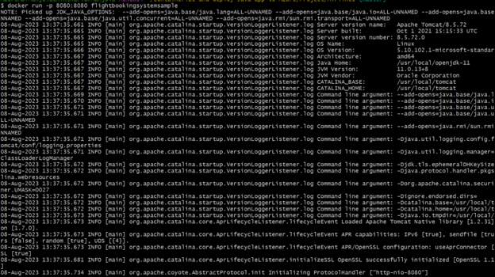 alt="Screenshot" />
>

> 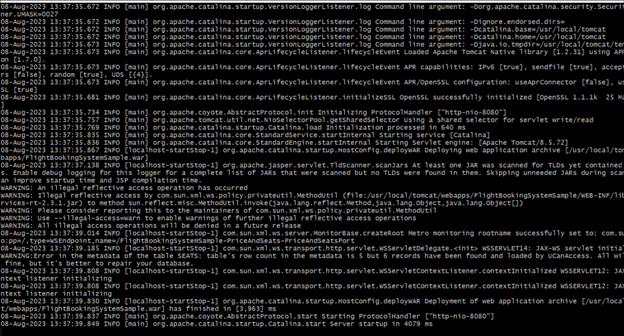 alt="Screenshot" />

> Note: if the command “docker run -p 8080:8080 flightbookingsystemsample”
comes up with an error, then use the below mentioned port

>```copy
> docker run -p 8081:8080 flightbookingsystemsample
>

3.  Open up a browser and visit the Flight Booking System for Airline
    Reservations landing page
    at [**http://localhost:8080/FlightBookingSystemSample**](urn:gd:lg:a:send-vm-keys). You should see the following:

>  alt="Screenshot" />

4.  You can optionally sign in with any user from tomcat-users.xml for
    example

> Username : [**someuser@azure.com**](urn:gd:lg:a:send-vm-keys)
>

>  alt="Screenshot" />
>
> Password : [**password**](urn:gd:lg:a:send-vm-keys)

5.  Leave this git bash instance as it is

## Exercise 4: Push the container image to Azure Container Registry

### Task 1: push a container image to Azure Container Registry

1.  In this task, you will push a container image to Azure Container
    Registry.Azure Container Registry allows you to build, store, and
    manage container images and artifacts in a private registry for all
    types of container deployments. Use Azure container registries with
    your existing container development and deployment pipelines.

2.  Switch back to your Azure portal in your browser and click on your
    cloud slice resource group.

> 

3.  You should see the **Azure container registry** and Azure
    **Kubernetes service** resources. Save the names of these services
    in a notepad


4.  Open new instance of Gitbash and run az command to sign into Azure
    portal.

>```copy
> az login
>

5.  use the following command in your CLI

>```copy
> cd
>:C:\Labfiles\containerize-and-deploy-Java-app-to-Azure-master\Project\Airlines”
>

6.  We will be using the same Authenticate with Azure Resource Manager
    we have created earlier in Exercise 1 Task 1.set below variables

>| **Value**                                                  |
>|------------------------------------------------------------|
>```copy
>| export AZ_RESOURCE_GROUP = Your Cloud slice resource group |
>| export AZ_CONTAINER_REGISTRY=javaaksregistXXXX             |
>| export AZ_KUBERNETES_CLUSTER=javaaksclusterXXXX            |
>| export AZ_LOCATION= eastus                                 |
>| export AZ_KUBERNETES_CLUSTER_DNS_PREFIX=javaakscontainer   |
>

> **Note:** If your session has idled out, your doing this step at
> another point in time and/or from another CLI you may have to re
> initialize your environment variables and re authenticate with the
> following CLI commands.
>

>  alt="A computer screen shot of a black screen Description automatically generated" />

### Task 2: Push a container image

In this task You can push your newly built container image to the Azure
Container Registry. By doing so, your container image will be network
close to all of your Azure resources, such as your Azure Kubernetes
Cluster. You'll ultimately configure AKS to pull the
flightbookingsystemsample image from Azure Container Registry.

1.  To push the container image to Azure Container Registry, run the
    following three commands in your CLI

2.  Sign in **Azure Container Registry** execute the below command

>```copy
> az acr login -n \$AZ_CONTAINER_REGISTRY
>

> 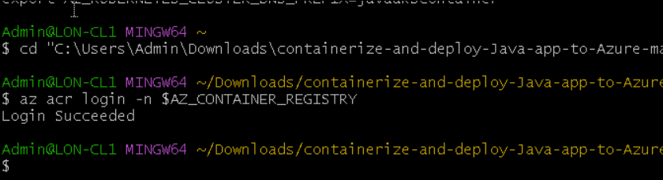 alt="A screen shot of a computer Description automatically generated" />

3.  First tag the previously built container image with your Azure
    Container Registry:

>```copy
> docker tag flightbookingsystemsample
> \$AZ_CONTAINER_REGISTRY.azurecr.io/flightbookingsystemsample
>

>  alt="A screen shot of a computer program Description automatically generated" />

4.  Second, push the container image to Azure Container Registry

>```copy
> docker push
> \$AZ_CONTAINER_REGISTRY.azurecr.io/flightbookingsystemsample
>

> 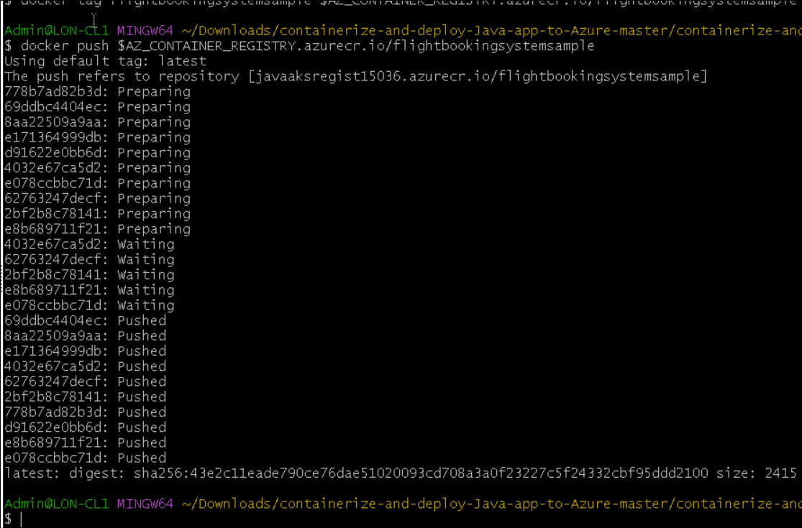 alt="A screen shot of a computer Description automatically generated" />

5.  Now view the Azure Container Registry image meta-data of the newly
    pushed image. Run the following command in your CLI

>```copy
> az acr repository show -n \$AZ_CONTAINER_REGISTRY --image
> flightbookingsystemsample:latest
>

> You'll see something similar:
>
>  alt="A screenshot of a computer screen Description automatically generated" />

6.  Container image is now resident within Azure Container Registry and
    ready for deployments by Azure Services such as Azure Kubernetes
    Service.

## Exercise 5: Deploy the container image to Azure Kubernetes Service

In this exercise, you will deploy a container image to Azure Kubernetes
Service.

### Task 1: Deploy a container image

1.  You will deploy this the **flightbookingsystemsample** container
    image to your Azure Kubernetes Cluster.

2.  Within the root of your
    project, **Flight-Booking-System-JavaServlets_App/Project/Airlines**,
    Create a file called deployment.yml. Run the following command in
    your CLI:

>```copy
> vi deployment.yml
>


3.  Add the following contents to deployment.yml and then save and exit:

> **Note:** You'll want to update with your AZ_CONTAINER_REGISTRY
> environment variable value that was set earlier, Exercise 1 Task1(AZ_CONTAINER_REGISTRY= javaaksregist )
>

>```copy
> apiVersion: apps/v1
>
> kind: Deployment
>
> metadata:
>
> name: flightbookingsystemsample
>
> spec:
>
> replicas: 1
>
> selector:
>
> matchLabels:
>
> app: flightbookingsystemsample
>
> template:
>
> metadata:
>
> labels:
>
> app: flightbookingsystemsample
>
> spec:
>
> containers:
>
> - name: flightbookingsystemsample
>
> image:
> <AZ_CONTAINER_REGISTRY\>.azurecr.io/flightbookingsystemsample:latest
>
> resources:
>
> requests:
>
> cpu: "1"
>
> memory: "1Gi"
>
> limits:
>
> cpu: "2"
>
> memory: "2Gi"
>
> ports:
>
> - containerPort: 8080
>
> ---
>
> apiVersion: v1
>
> kind: Service
>
> metadata:
>
> name: flightbookingsystemsample
>
> spec:
>
> type: LoadBalancer
>
> ports:
>
> - port: 8080
>
> targetPort: 8080
>
> selector:
>
> app: flightbookingsystemsample
>

> 


4.  Press Esc and: and then type [**wq**](urn:gd:lg:a:send-vm-keys) and
    press enter to save the file.

> **Note:** Optionally, the deployment_solution.yml in the root of your
> project contains the contents needed, you may find it easier to
> rename/update the contents of that file.

5.  In the deployment.yml above you'll notice this deployment.yml
    contains a Deployment and a Service. The deployment is used to
    administer a set of pods while the service is used to allow network
    access to the pods. You'll notice the pods are configured to pull a
    single image,
    the <AZ_CONTAINER_REGISTRY>.azurecr.io/flightbookingsystemsample:latest from
    Azure Container Registry. You'll also notice the service is
    configured to allow incoming HTTP pod traffic to port 8080,
    similarly to the way you ran the container image locally with
    the -p port argument.

6.  By now your Azure Kubernetes Cluster creation should have
    successfully completed.

7.  Now configure your Azure CLI to access your Azure Kubernetes Cluster
    via the kubectl command. Install kubectl locally using the az aks
    install-cli command. Run the following command in your CLI

>```copy
> az aks install-cli
>

>  alt="A black screen with white text Description automatically generated" />

8.  Configure kubectl to connect to your Kubernetes cluster using the az
    aks get-credentials command. Run the following command in your CLI

>```copy
> az aks get-credentials --resource-group $AZ_RESOURCE_GROUP --name
> $AZ_KUBERNETES_CLUSTER

- You will see something similar:


8.  Now instruct Azure Kubernetes Service to apply deployment.yml
    changes to your cluster. Run the following command in your CLI

>```copy
> kubectl apply -f deployment.yml
>

- You will see something similar:

>  alt="A black screen with white text Description automatically generated" />

9.  Now use **kubectl** to monitor the status of the deployment. Run the
    following command in your CLI

>```copy
> kubectl get all

- You will see something similar:

> 
>
> **Note:** You'll want to substitute the ip address in the following,
> 20.81.13.151, with that of your EXTERNAL-IP and note down the POD
> name, we will be using that in the next steps.

10. If your **POD** status is **Running** then the app should be
    accessible.

11. You can view the app logs within each pod as well. Run the following
    command in your CLI

>```copy
> kubectl logs
> pod/flightbookingsystemsample-\<POD_IDENTIFIER_FROM_YOUR_RUNNING_POD\>
>

>  style="width:6.49236in;height:4.56042in" />
>

>  alt="A screenshot of a computer screen Description automatically generated" />

12. Now use the **EXTERNAL-IP** from your kubectl get services
    flightbookingsystemsample output to access the running app within
    Azure Kubernetes Service.

> **Note:** You'll want to substitute the ip address in the following,
> 20.81.13.151, with that of your EXTERNAL-IP from the command you
> previously executed.

13. Open up a browser and visit the Flight Booking System Sample landing
    page at  (update with your external IP address )

    - You'll see something similar:

>  alt="A plane flying in the sky Description automatically generated" />
>
> **Note**: You can optionally sign in with any user from
> tomcat-users.xml for example someuser@azure.com: password

### Task 2 : Clean Up Resources

IMPORTANT: **DO NOT DELETE RESOURCE GROUP**. Delete **only** resources
with in the resource group.

1.  Navigate back to the Azure portal tab and click on **Resource
    grups.**

> 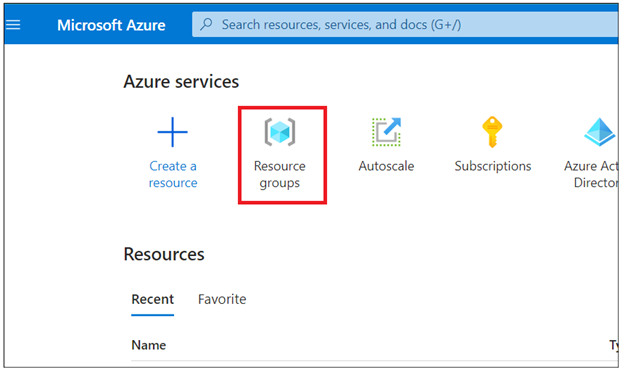 alt="Screenshot" />

2.  Click on the cloud resource group .

>  style="width:6.49236in;height:3.24236in" />

3.  Select the resources created for this lab and click on **Delete**

> 

4.  Enter **delete** in the text box and click on **Delete** button.

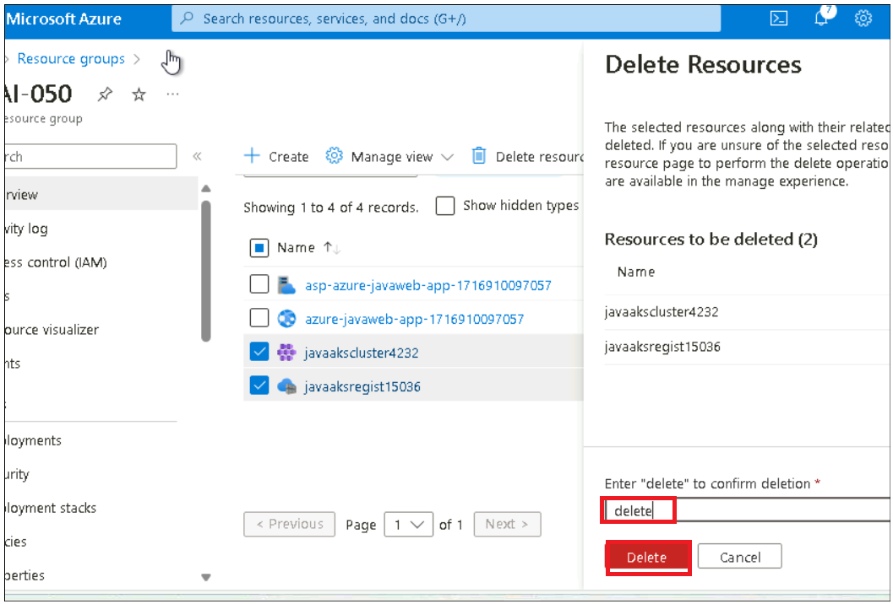

5.  Confirm the deletion by clicking on the copy **delete** button on the
    confirmation window.


**Summary:** Congratulations! We have containerized and deployed a
Java app to Azure Kubernetes Service. As part of the lab we
containerized a Java app, push the container image to Azure Container
Registry, and then deploy to Azure Kubernetes Service.
