# Lab 04 -Java - Dev- Build and Deploy web app in IntelliJ IDEA

## Exercise 1 - Build a web app in IntelliJ IDEA

In this exercise, you'll use the Azure Explorer to examine your Azure
subscription.

### **Task 1: Create a web app project**

Before you can examine your Azure resources with the Azure Explorer, you
must create a new project. Let's create a web app project by using a
Maven archetype:

1.  Go to **Start** .Search
    for [**IntelliJ**](urn:gd:lg:a:send-vm-keys) and select **IntelliJ
    IDEA**.

2.  In the Welcome to IntelliJ IDEA window, select **Create new
    project.** or if it is already opened a projec then go to **File -\>
    New -\> Project**

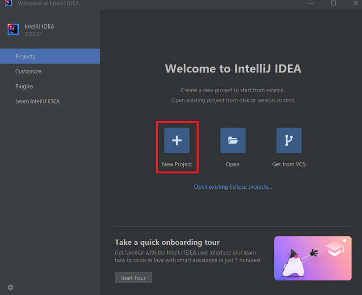

3.  In the menu on the left, select **Maven Archtype** and enter the
    Name :[**webapp**](urn:gd:lg:a:send-vm-keys)

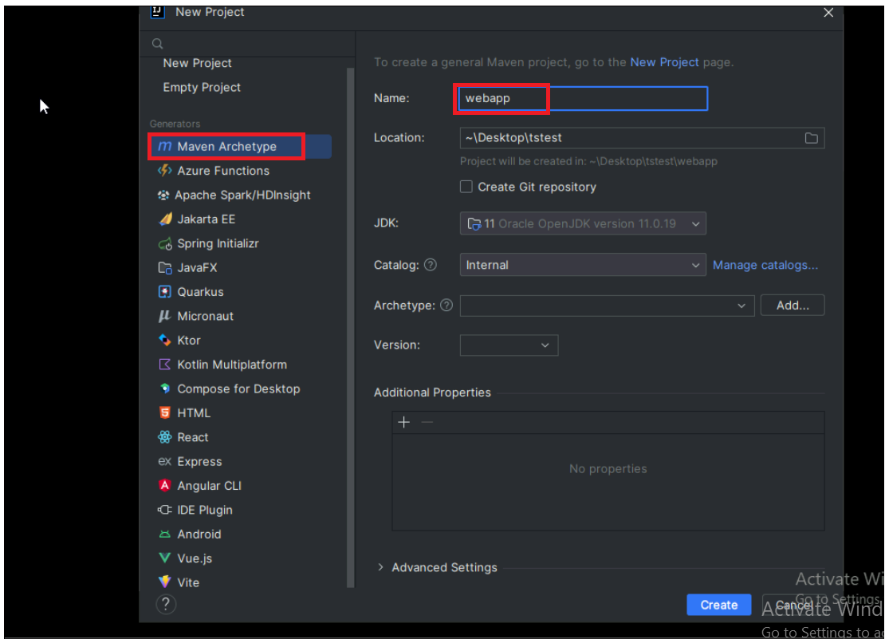

4.  In the list of archetypes, search and
    select [**org.apache.maven.archetypes**](urn:gd:lg:a:send-vm-keys) and
    select **org.apache.maven.archetypes.maven-arctype-webapp**

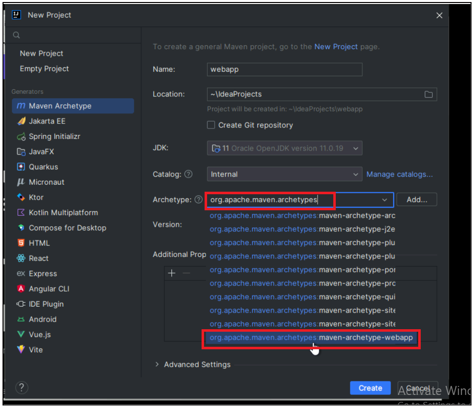

5.  Accept the default Maven settings, click **Create**.

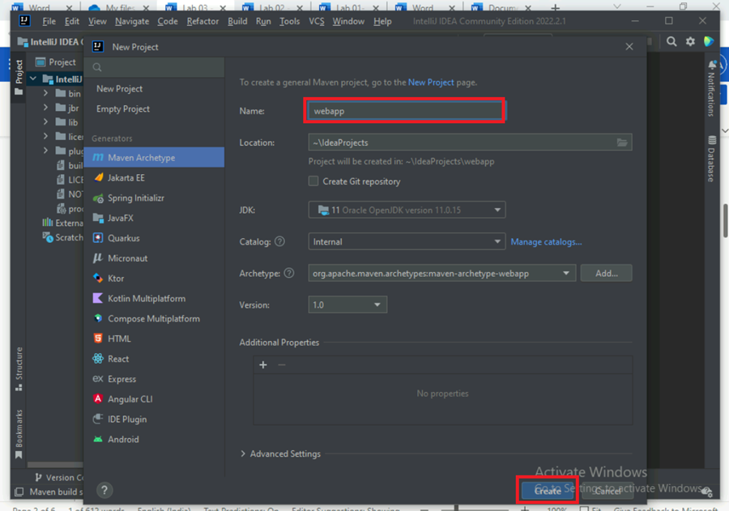

**Task 2: Complete the web app**

Let's start by adding some simple code to the web app:

1.  In the **Project** window, expand **src/main/webapp** and then
    open **index.jsp**.

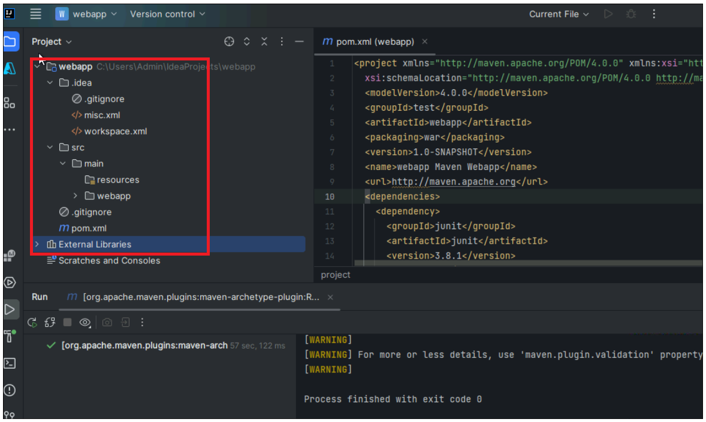

2.  Remove all of the existing code and replace it with the following
    HTML:

>```copy
><%@ page language="java" contentType="text/html; charset=UTF-8" >pageEncoding="UTF-8"%>
><%@ page import ="java.util.*" %>
><%@ page import ="java.text.*" %>
><!DOCTYPE html>
><html>
><head>
><meta charset="UTF-8">
><title>Sample Web App</title>
></head>
><body>
>    <%! DateFormat fmt = new SimpleDateFormat("dd/MM/yy HH:mm:ss"); %> 
>    <p>Today's date is <%= fmt.format(new Date()) %></p>
>    <p>Your IP address is <%= request.getRemoteAddr() %></p>
></body>
></html>
>


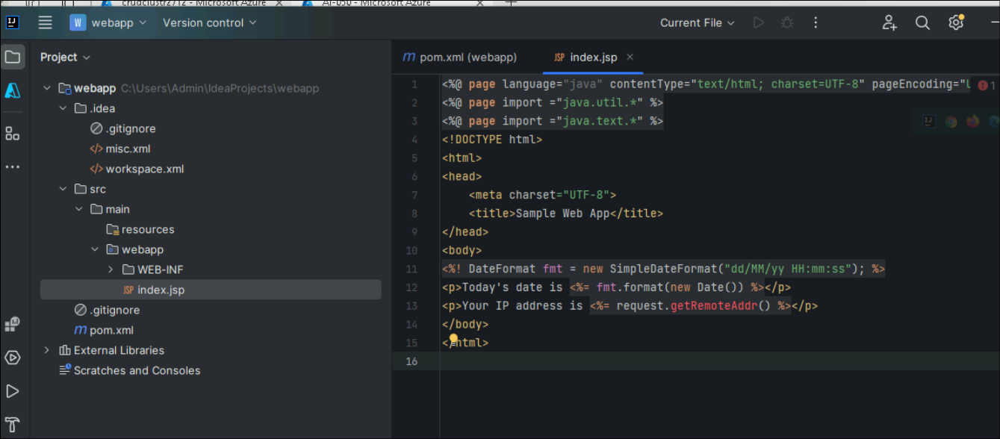

3.  On the File menu, select **Save All**.

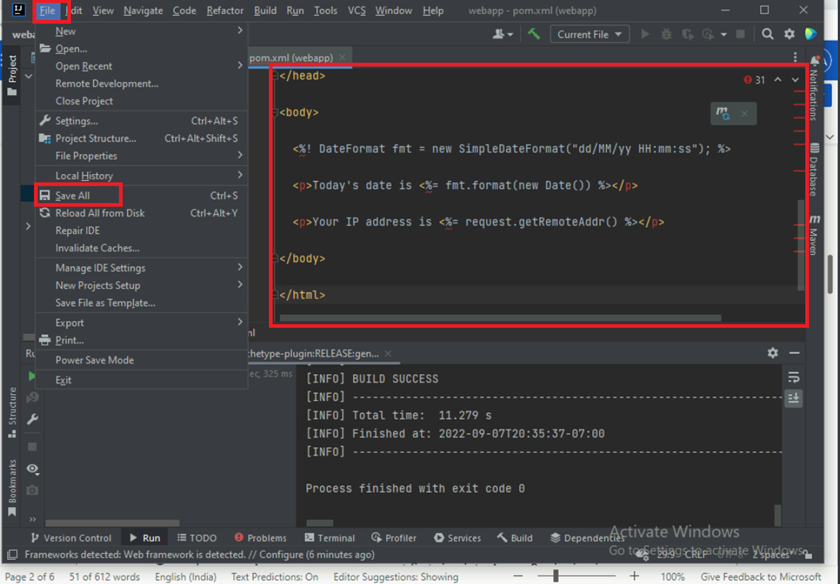

## Exercise 2 - Deploy a web app to Azure

In this exercise, you will use the deployment wizard to deploy a web app
to Azure.

**Task 1: Sign into Azure**

To explore your Azure resources, you must first sign into Azure. By
signing in, you specify the subscription and directory where you want to
create resources.

1.  Click on **Azure Toolkit plugin** and then click on **Sign
    in** button.

>  alt="Screenshot" />

2.  Select **OAuth 2.0** and then click on **Sign in**.

> 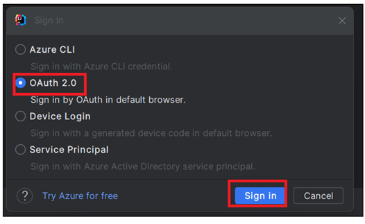 alt="Screenshot" />

3.  New tab opens in the default browser. Sign in with your Cloud slice
    account.

>  alt="Screenshot" />

4.  Select your subscription and then click on the **Select** button.

>  alt="A screenshot of a computer Description automatically generated" />

### **Task 2 : Configure and deploy the web app**

Now, you can use the **Deploy to Azure** wizard to create a new app in
Azure App Service and then deploy your project to it

1.  In IntelliJ IDEA, in the **Project** window, right-click
    the **webapp** project, select **Azure**, and then select **Deploy
    to Azure Web Apps.**

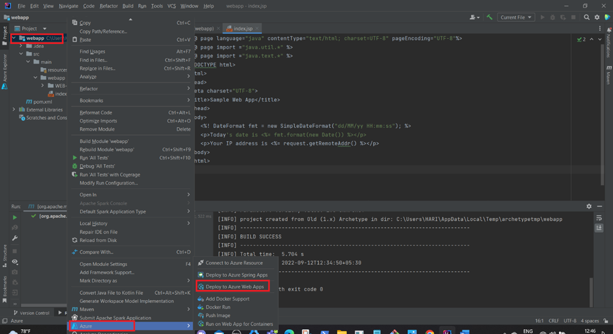

2.  In the **Deploy to Azure** dialog, Click the + button for **Web
    App.**

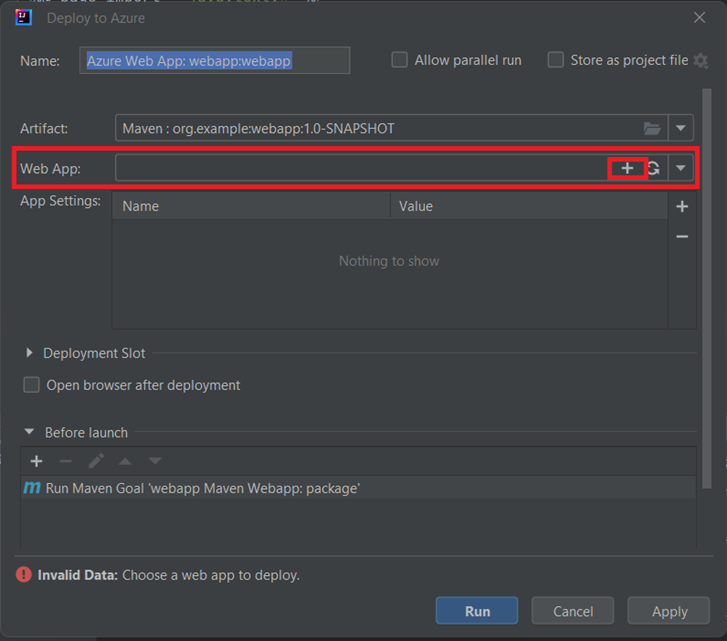

3.  In the **Create Web App** dialog, select platform as :
    **windows-java11-Tomcat 9.0** and then click **More Settings**.

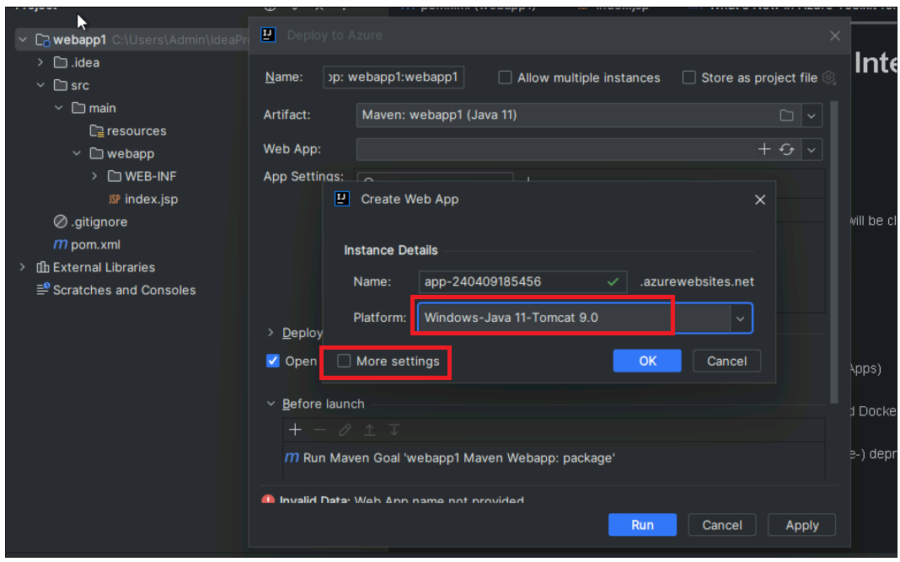

4.  In the **Create Web App** dialog, click the + button for **Plan**,
    type any name in Name([**WebApp-sp**](urn:gd:lg:a:send-vm-keys)) and
    select **Standard S1** for Pricing Tier.

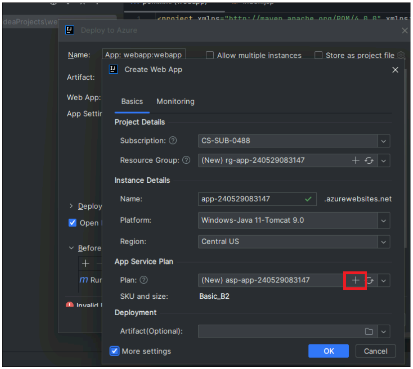


5.  In the **Create Web App** dialog, select your Azure Cloud resource
    group and then click on **OK**.

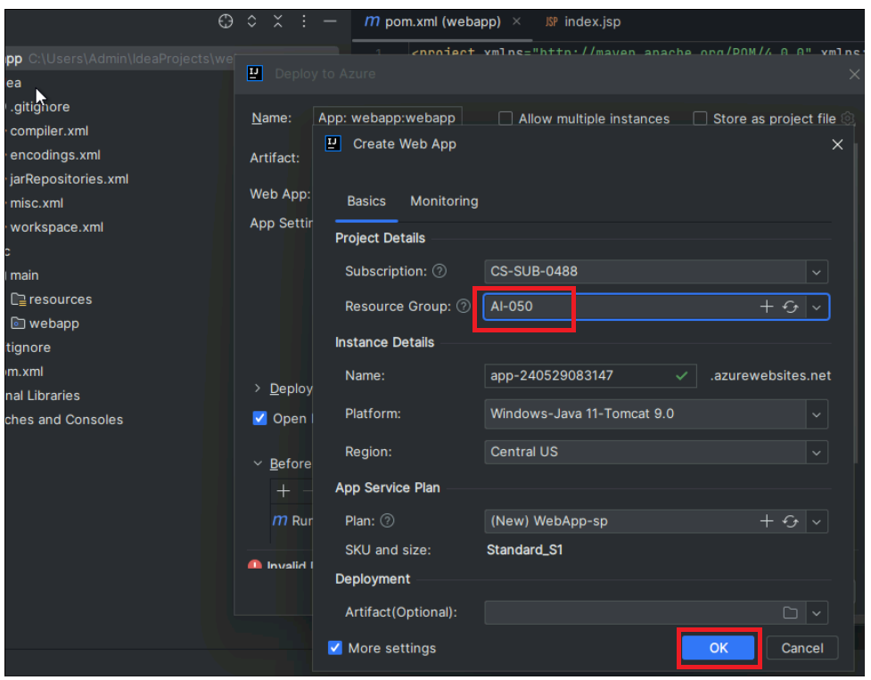

6.  In the **Deploy to Azure** dialog, click on **Run**.

**IMPORTANT**: Raise a support ticket if you see below error -
subscription is not allowed to create or update Azure Web App
-[**https://learn.microsoft.com/en-gb/azure/azure-portal/supportability/how-to-create-azure-support-request**](urn:gd:lg:a:send-vm-keys) 

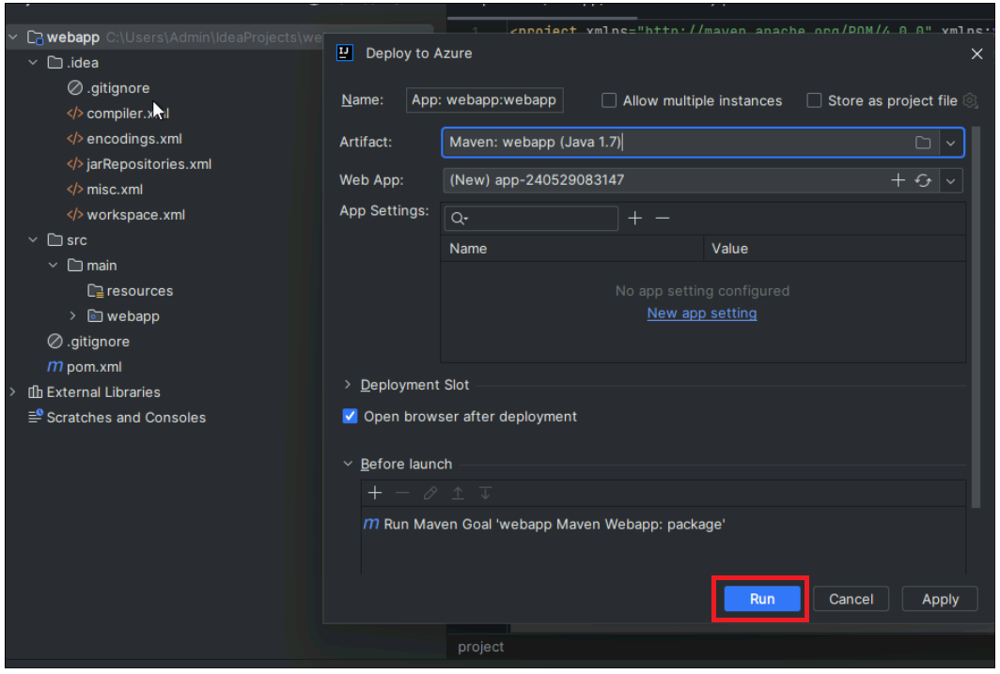

7.  The Azure Toolkit for IntelliJ deploys the web app to Azure and
    displays the site in your default web browser.

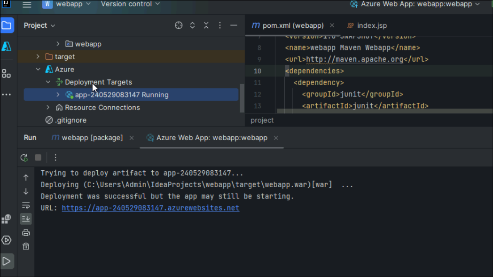

8.  Select web browser and Open the generated **URL** in a browser.


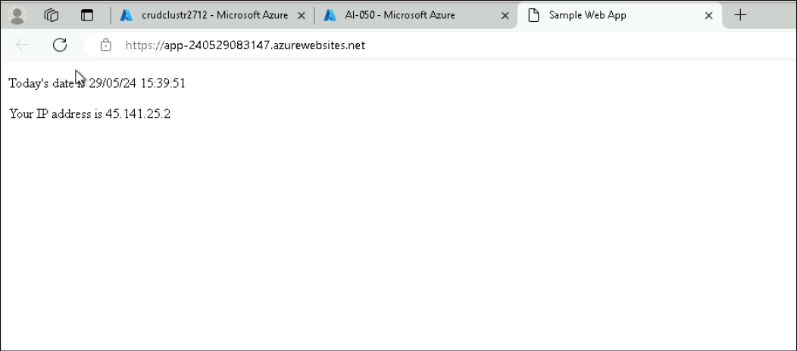

### **Task 3: Delete resources in Resource group**

**IMPORTANT :DO NOT DELETE CLOUD SLICE RESOURCE GROUP. Delete only
resources created in cloud slice resource group.**

1.  Open a browser and go
    to [**https:\portal.azure.com**](urn:gd:lg:a:send-vm-keys) and sign
    in with your Azure Cloud slice accout.

2.  Click on **Resource Groups** tile.

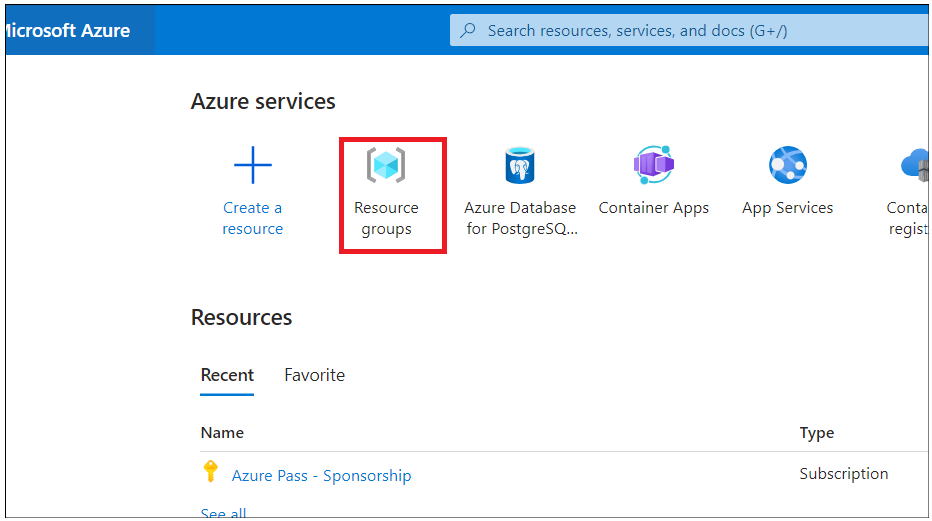

3.  Click on your cloud slice resource group name.

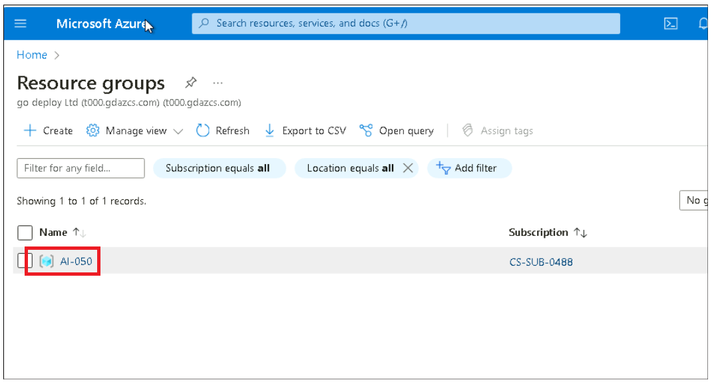

3.  Select all the resources created in this lab and click on
    **Delete**.

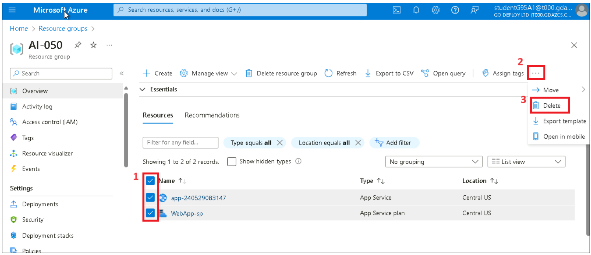

4.  Type **delete** in the text box and click on the **Delete** button.

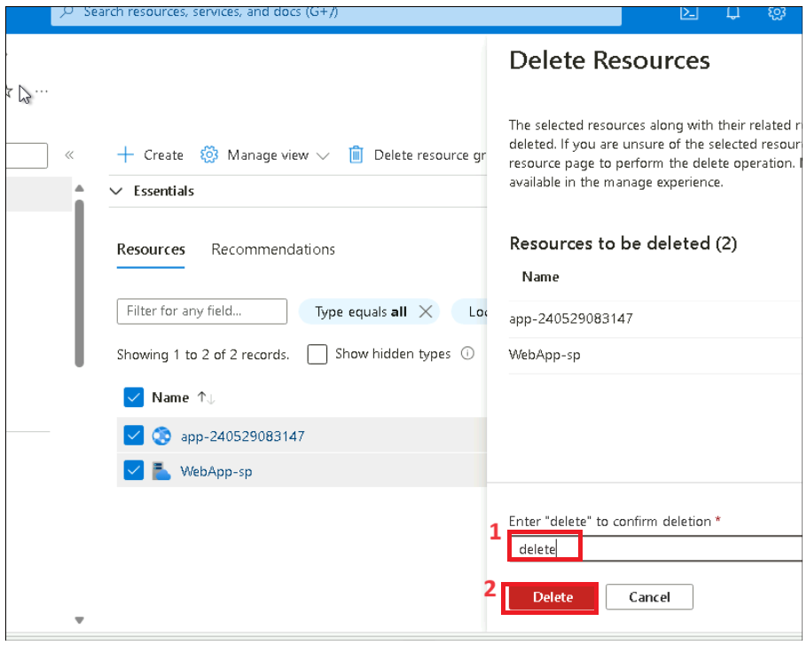

5.  On the “**Delete confirmation**” window, click on **Delete** button.

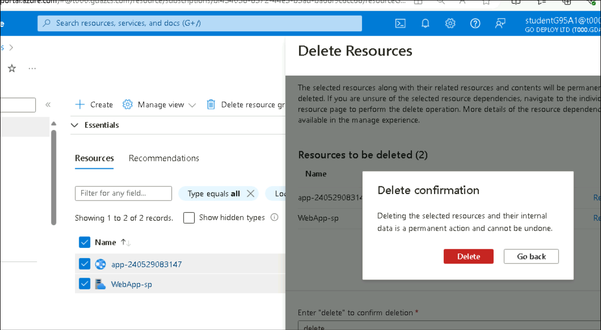
