# Lab 05 -Java - Dev-Build Java app to connect and run SQL commands on
Azure Cosmos DB for PostgreSQL


By the end of this lab, we'll be able to:

1.  Create a cluster in the Azure portal.

2.  Connect to the cluster with psql to run SQL commands.

3.  Create and distribute tables with our dataset.

## Exercise 1 : Create an Azure Cosmos DB for PostgreSQL cluster in the Azure portal

Azure Cosmos DB for PostgreSQL is a managed service that allows you to
run horizontally scalable PostgreSQL databases in the cloud.

### Task 1 : Create a cluster

1.  Open a browser and go
    to [**https://portal.azure.com**](urn:gd:lg:a:send-vm-keys) and sign
    in with your Azure subscription account.

2.  Search for [**Azure Cosmos DB**](urn:gd:lg:a:send-vm-keys) and
    select it.

> 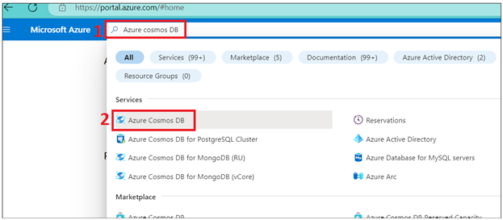 alt="Screenshot" />

3.  Click on **Create**.

> 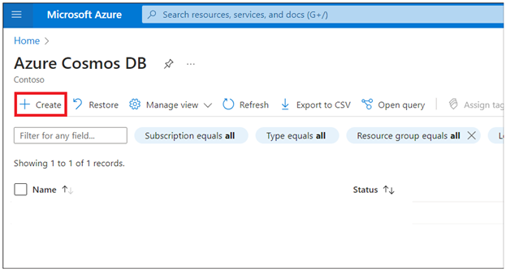 alt="Screenshot" />

4.  On **Azure Cosmos DB for PostgreSQL** tile, click on **Create.**

>  alt="Screenshot" />

5.  Enter below values and then click on Next: Networking

> Azure subscription: Your **Azure subscription**
>
> Resource group – Select your Cloud slice resource group.
>
> 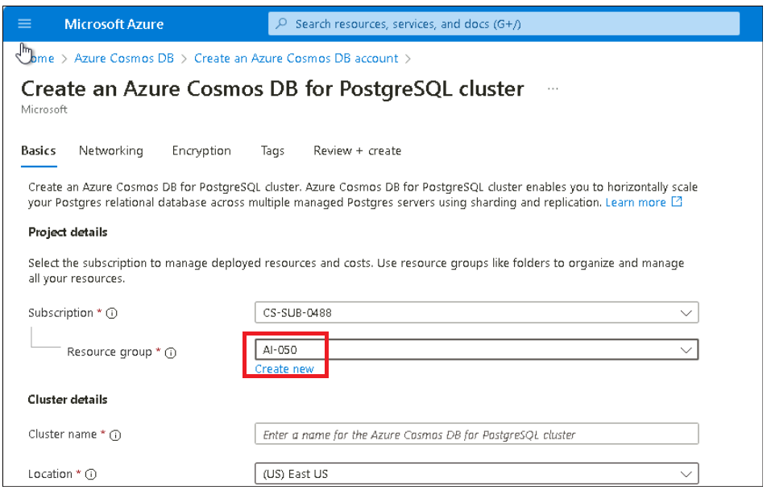
>
> Cluster Name : **[crudcluster](urn:gd:lg:a:send-vm-keys)XXX (XXX can
> be unique number)**
>
> Location : East US
>
> PostgreSQL version :15
>
> Database name : citus
>
> Admin username: citus
>
> Password : **[P@55w.rd123](urn:gd:lg:a:send-vm-keys)4**
>
> Confirm password : **[P@55w.rd123](urn:gd:lg:a:send-vm-keys)4**
>
> 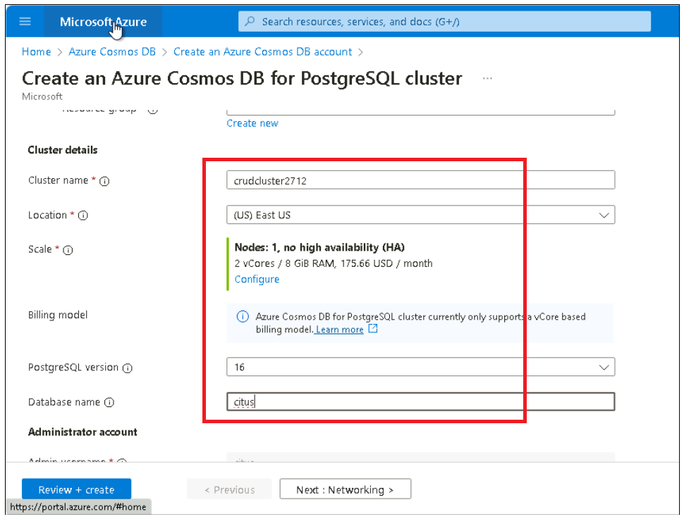
>
> 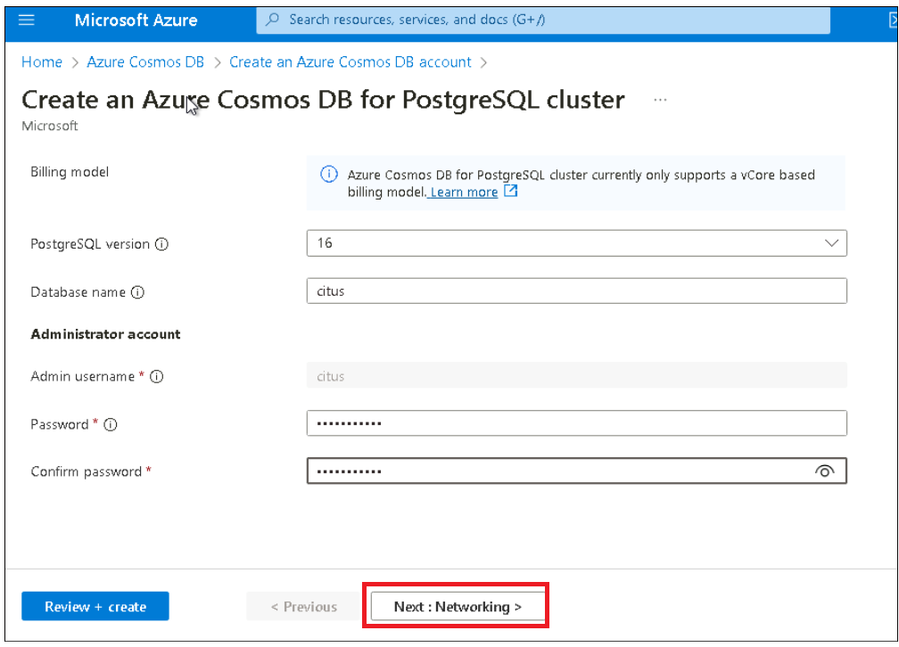 style="width:6.49236in;height:4.67431in" />

6.  Select Public access radio button ,select Allow public access from
    Azure service and resources within Azure to this cluster checkbox
    and then add Current client IP and other public IP as shown in below
    images.

> 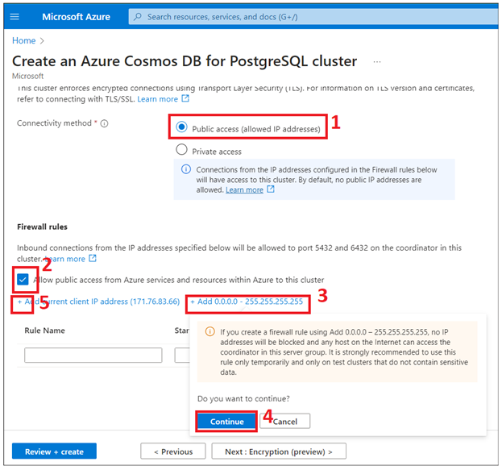 alt="Screenshot" />

7.  Click on **Review + create** button.

> 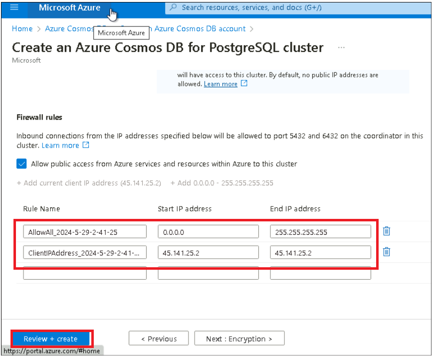 style="width:6.49236in;height:5.35625in" />

8.  Once the validation is passed , click on **Create** button to create
    cluster.

> 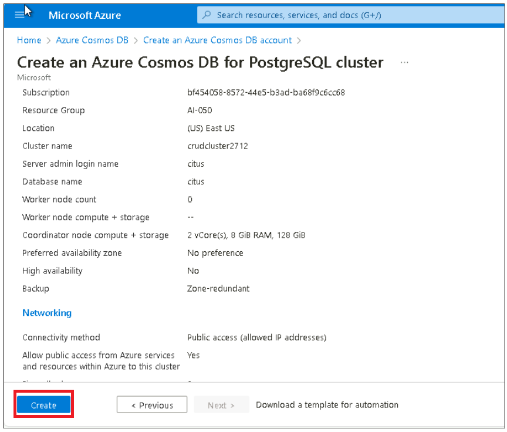 style="width:6.49236in;height:5.53056in" />

9.  Wait for the deployment to complete. It takes 3-5 minutes.

> 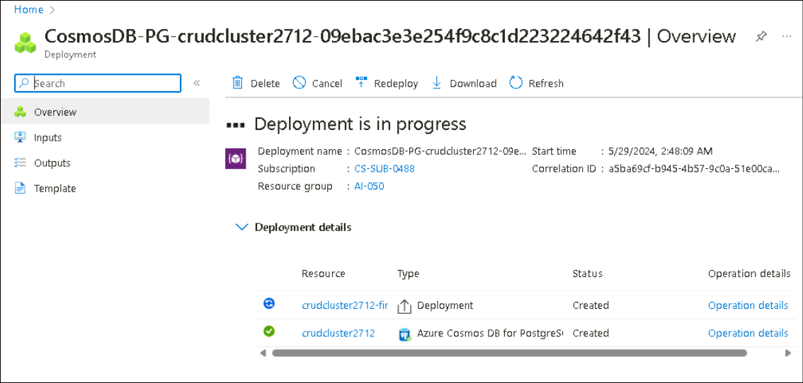 alt="A screenshot of a computer Description automatically generated" />
>
>  alt="A screenshot of a computer Description automatically generated" />

10. Stay back in the same tab to continue with the next task.

### Task 2 : Connect to a cluster with psql - Azure Cosmos DB for PostgreSQL

Your cluster has a default database named citus. To connect to the
database, you use a connection

1.  Click on **Go to resource**.

> 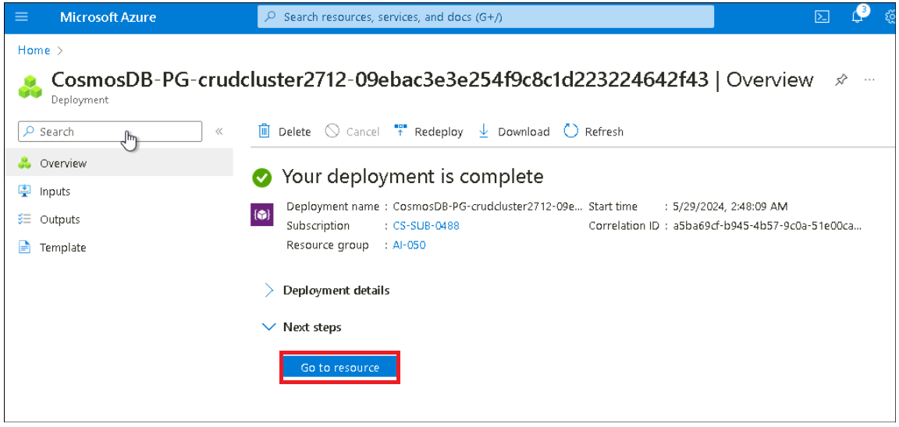

2.  On your cluster, click on **Connection strings** and copy the **Psql
    URL**.

> 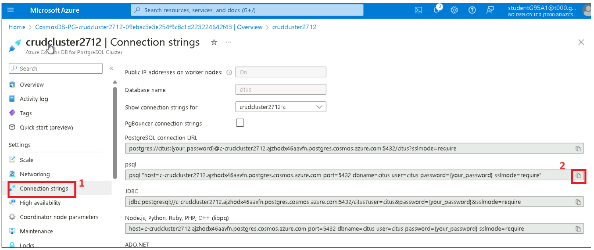

3.  Update url with your password
    : [**P@55w.rd123**](urn:gd:lg:a:send-vm-keys)

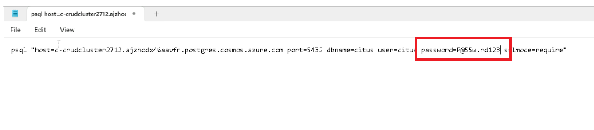

4.  Copy the cluster name and unique id to
    update ***application.properties*** in Exercise 2 -- Task 2.

> 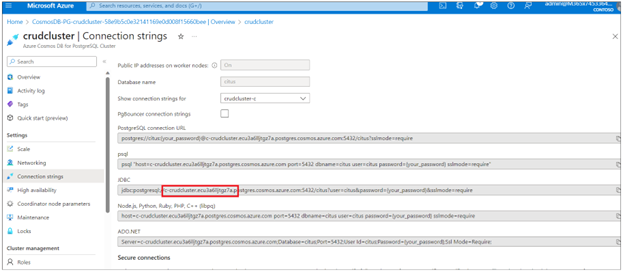 alt="Screenshot" />

5.  Right click on browser tab and then click on Duplicate tab.

> 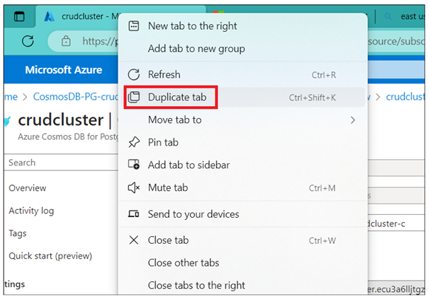 alt="Screenshot" />

6.  Click on **CloudShell -\> Bash** and select **Bash**.

> 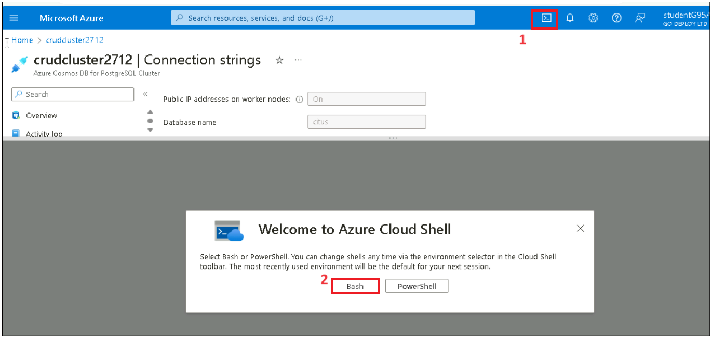 style="width:6.49236in;height:3.08333in" />

7.  Select below values and then click on **Apply**.

    - No storage account required

    - Subscription : Select your subscirption

> 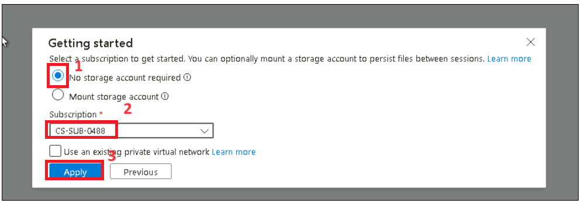 style="width:6.49236in;height:2.27292in" />

8.  Enter the URL which was copied and updated with password in Step 3
    and then hit enter. When psql successfully connects to the database,
    you see a newcitus=\> (or the custom name of your database) prompt:

> 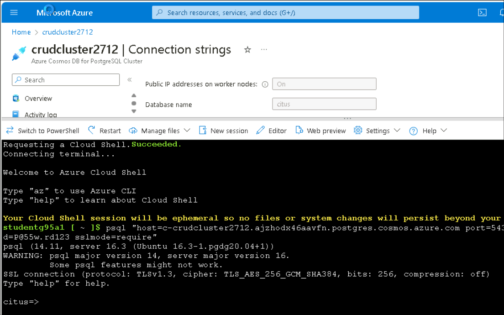 alt="A computer screen with text and images Description automatically generated" />

9.  Run a test query. Paste the following command into the psql prompt,
    and then press Enter.

Note : If command is not pasting in Cloud shell then copy it to Notepad
and then use in Cloushell.

SHOW server_version;

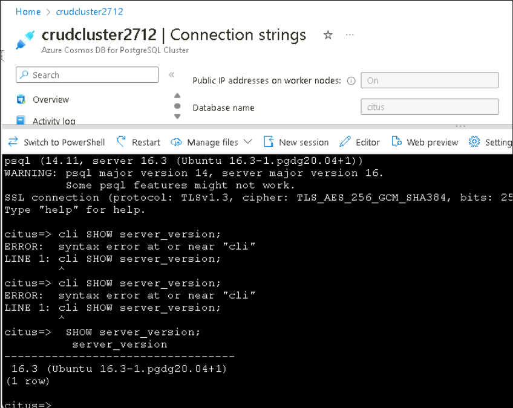

## Exercise 2 : Set up the Java project and connection

Create a new Java project and a configuration file to connect to Azure
Cosmos DB for PostgreSQL.

### Task 1 : Create a new Java project

Using your favorite integrated development environment (IDE), create a
new Java project with groupId test and artifactId crud. In the project's
root directory, add a *pom.xml* file with the following contents. This
file configures **Apache Maven**, to use Java 11 and a recent PostgreSQL
driver for Java.

1.  Make sure your **JAVA_HOME** set to **jdk-11** and maven in
    environment variables.

2.  Open Intellij IDEA from the Start menu and then click on New project
    button.

> 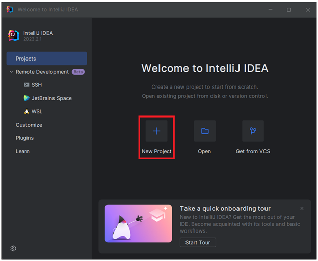 alt="Screenshot" />

3.  Select below values and then click on **Create** button.

> a\. Language : Java
>
> b\. Build system :Maven
>
> c\. JDK : Java 11
>
> d\. Expand Advanced System :
>
>       i\. Groupid : [**test**](urn:gd:lg:a:send-vm-keys)
>
>       ii\. Artifactid : [**crud**](urn:gd:lg:a:send-vm-keys)
>

> 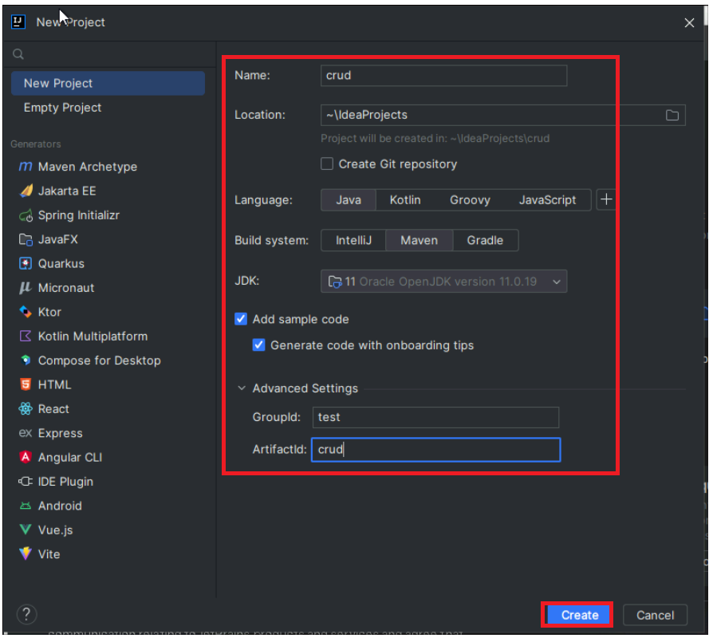

4.  Replace the existing content of  ***pom.xml*** file with the
    following contents and save the file.

>```copy
><?xml version="1.0" encoding="UTF-8"?>
>
><project xmlns="http://maven.apache.org/POM/4.0.0" xmlns:xsi="http://www.w3.org/2001/XMLSchema-instance"
>xsi:schemaLocation="http://maven.apache.org/POM/4.0.0 http://maven.apache.org/xsd/maven-4.0.0.xsd">
><modelVersion>4.0.0</modelVersion>
>
><groupId>test</groupId>
> <artifactId>crud</artifactId>
>  <version>0.0.1-SNAPSHOT</version>
>  <packaging>jar</packaging>
>
>  <name>crud</name>
>  <url>http://www.example.com</url>
>
>  <properties>
>    <project.build.sourceEncoding>UTF-8</project.build.sourceEncoding>
>    <maven.compiler.source>11</maven.compiler.source>
>    <maven.compiler.target>11</maven.compiler.target>
>  </properties>
>
>  <dependencies>
>    <dependency>
>      <groupId>org.junit.jupiter</groupId>
>      <artifactId>junit-jupiter-engine</artifactId>
>      <version>5.7.1</version>
>      <scope>test</scope>
>    </dependency>
>    <dependency>
>      <groupId>org.postgresql</groupId>
>      <artifactId>postgresql</artifactId>
>      <version>42.2.12</version>
>    </dependency>
>    <!-- https://mvnrepository.com/artifact/com.zaxxer/HikariCP -->
>    <dependency>
>      <groupId>com.zaxxer</groupId>
>      <artifactId>HikariCP</artifactId>
>      <version>5.0.0</version>
>    </dependency>
>    <dependency>
>      <groupId>org.junit.jupiter</groupId>
>      <artifactId>junit-jupiter-params</artifactId>
>      <version>5.7.1</version>
>      <scope>test</scope>
>    </dependency>
> </dependencies>
>
>  <build>
>    <plugins>
>      <plugin>
>        <groupId>org.apache.maven.plugins</groupId>
>        <artifactId>maven-surefire-plugin</artifactId>
>        <version>3.0.0-M5</version>
>     </plugin>
>    </plugins>
>  </build>
></project>
>

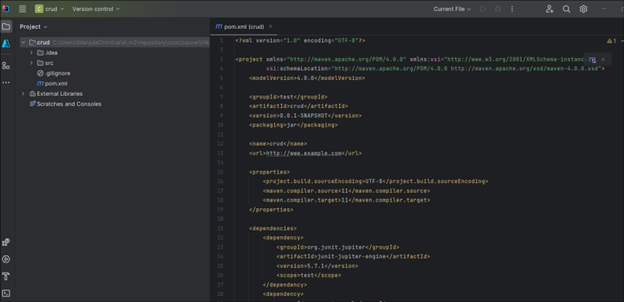

### Task 2 : Configure the database connection

1.  In ***src/main/resources/*,** create
    an [**application.properties**](urn:gd:lg:a:send-vm-keys) file

> 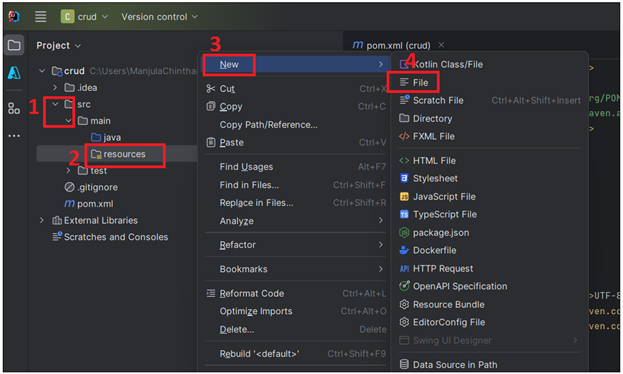 alt="Screenshot" />
>
> 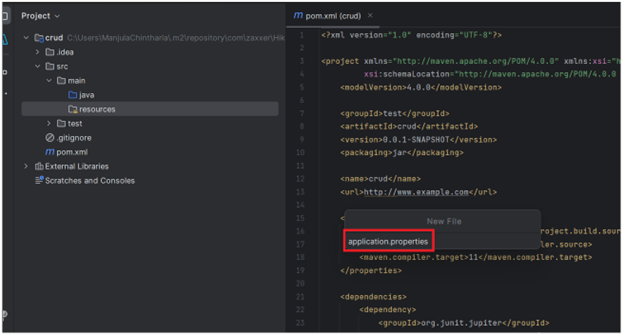 alt="Screenshot" />

2.  with the following contents. Replace with your cluster name, and
    replace with your administrative password
    : [**P@55w.rd123**](urn:gd:lg:a:send-vm-keys) .

>```copy
>driver.class.name=org.postgresql.Driver
>db.url=jdbc:postgresql://c-<cluster>.<uniqueID>.postgres.cosmos.azure.>com:5432/citus?ssl=true&sslmode=require
>db.username=citus
>db.password=<password>
>

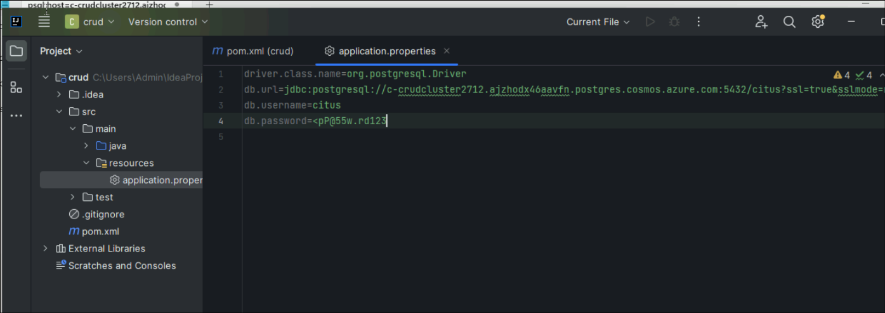

The ?ssl=true&sslmode=require string in the db.url property tells the
JDBC driver to use Transport Layer Security (TLS) when connecting to the
database. It's mandatory to use TLS with Azure Cosmos DB for PostgreSQL,
and is a good security practice.

3.  Copy the **application.properties** file from resources and paste it
    on **src/Java.**

> 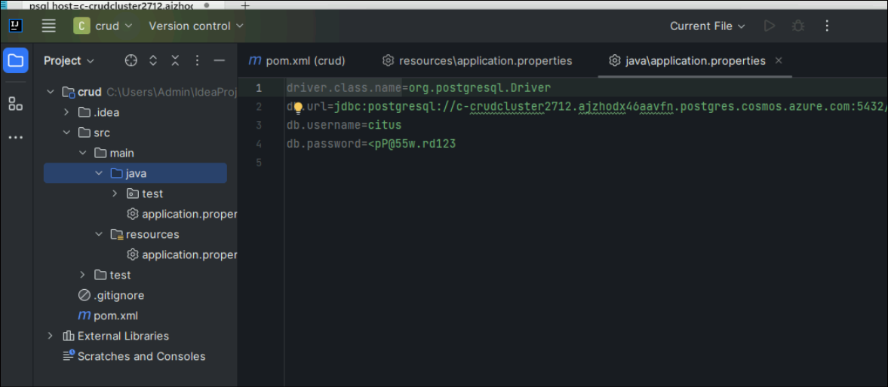 alt="A screenshot of a computer Description automatically generated" />

## Exercise 3 :Create tables

Configure a database schema that has distributed tables. Connect to the
database to create the schema and tables.

## Exercise 4 : Generate the database schema

1.  Right click on  ***src/main/resources/ - \> New -\> File***, create
    a [**schema.sql**](urn:gd:lg:a:send-vm-keys) file.

> 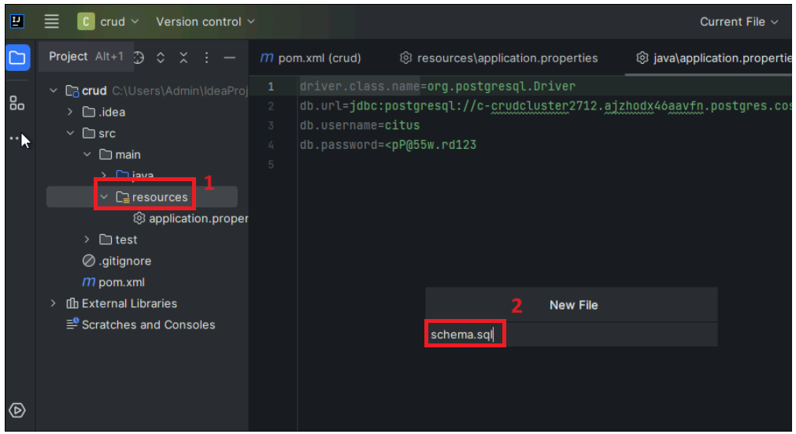 style="width:6.49236in;height:3.53819in" />

2.  Update the file with the following contents:

>```copy
>DROP TABLE IF EXISTS public.pharmacy;
>
>CREATE TABLE public.pharmacy(pharmacy_id integer,pharmacy_name text,city text ,state text ,zip_code integer);
>
>CREATE INDEX idx_pharmacy_id ON public.pharmacy(pharmacy_id);
>

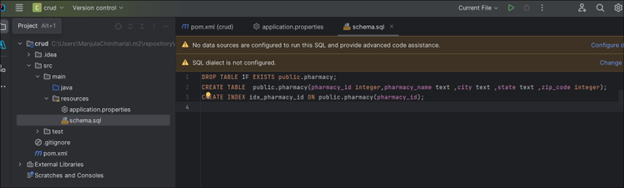

### Task 1 : Distribute tables

1.  Azure Cosmos DB for PostgreSQL gives you the super power of
    distributing tables across multiple nodes for scalability. The
    command below enables you to distribute a table.

> **Note:** Distributing tables lets them grow across any worker nodes
> added to the cluster.

2.  To distribute tables, append the following line to
    the *schema.sql* file you created in the previous section.

>```copy
select create_distributed_table('public.pharmacy','pharmacy_id');
>

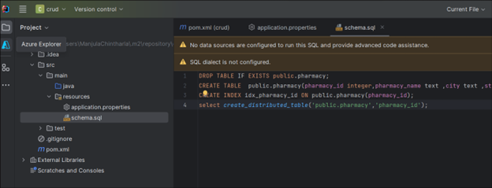

### Task 2 : Connect to the database and create the schema

Next, add the Java code that uses JDBC to store and retrieve data from
your cluster. The code uses
the *application.properties* and *schema.sql* files to connect to the
cluster and create the schema.

1.  Create a [**DButil.java**](urn:gd:lg:a:send-vm-keys) file with the
    following code, which contains the DButil class. The DBUtil class
    sets up a connection pool to PostgreSQL
    using [<u>HikariCP</u>](https://github.com/brettwooldridge/HikariCP).
    You use this class to connect to PostgreSQL and start querying.

> **Tip:** The sample code below uses a connection pool to create and
> manage connections to PostgreSQL. Application-side connection pooling
> is strongly recommended because:

- It ensures that the application doesn't generate too many connections
  to the database, and so avoids exceeding connection limits.

- It can help drastically improve performance--both latency and
  throughput. The PostgreSQL server process must fork to handle each new
  connection, and reusing a connection avoids that overhead.

> 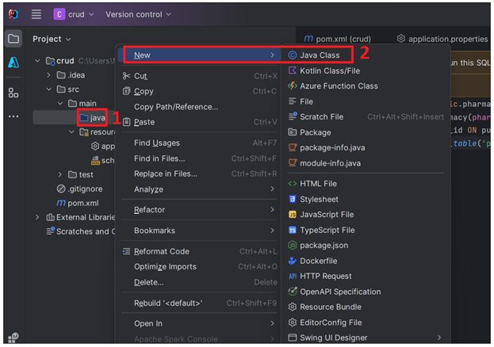 alt="Screenshot" />
>

>  alt="Screenshot" />

2.  Update the file with below content.

>```copy
> //DButil.java
>
> package test.crud;
>
> import java.io.FileInputStream;
>
> import java.io.IOException;
>
> import java.sql.SQLException;
>
> import java.util.Properties;
>
> import javax.sql.DataSource;
>
> import com.zaxxer.hikari.HikariDataSource;
>
> public class DButil {
>
> private static final String DB_USERNAME = "db.username";
>
> private static final String DB_PASSWORD = "db.password";
>
> private static final String DB_URL = "db.url";
>
> private static final String DB_DRIVER_CLASS = "driver.class.name";
>
> private static Properties properties =null;
>
> private static HikariDataSource datasource;
>
> static {
>
> try {
>
> properties = new Properties();
>
> properties.load(new
> FileInputStream("src/main/resources/application.properties"));
>
> datasource = new HikariDataSource();
>
> datasource.setDriverClassName(properties.getProperty(DB_DRIVER_CLASS
> ));
>
> datasource.setJdbcUrl(properties.getProperty(DB_URL));
>
> datasource.setUsername(properties.getProperty(DB_USERNAME));
>
> datasource.setPassword(properties.getProperty(DB_PASSWORD));
>
> datasource.setMinimumIdle(100);
>
> datasource.setMaximumPoolSize(1000000000);
>
> datasource.setAutoCommit(true);
>
> datasource.setLoginTimeout(3);
>
> } catch (IOException | SQLException e) {
>
> e.printStackTrace();
>
> }
>
> }
>
> public static DataSource getDataSource() {
>
> return datasource;
>
> }
>
> }
>

> 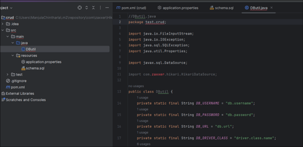 alt="Screenshot" />

3.  Right-click on the package error and select **Show Quick Fixes.**

> 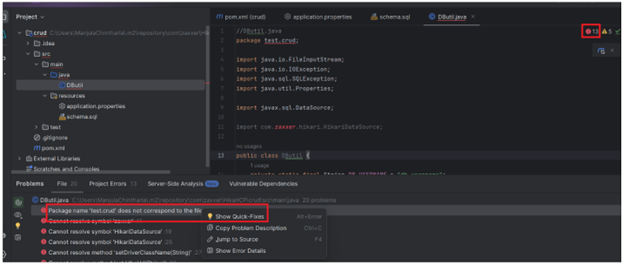 alt="Screenshot" />

4.  Select move to package **'test.crud'**

> 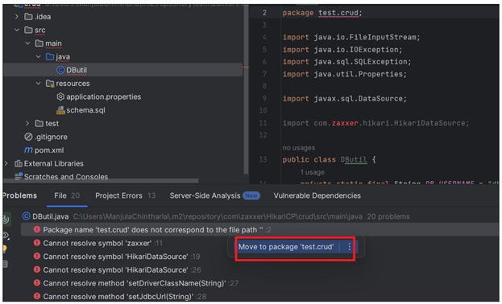 alt="Screenshot" />

5.  Select the main folder and then click on OK.

> 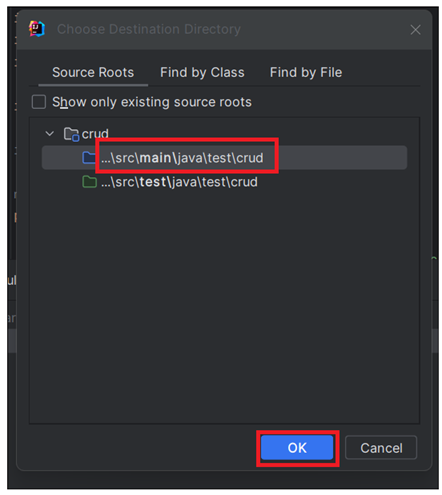 alt="Screenshot" />
>
> **Note:** You can also create test.crud package and add above java
> class.

6.  In ***src/main/java**/*, create
    a [**DemoApplication.java**](urn:gd:lg:a:send-vm-keys) file

> 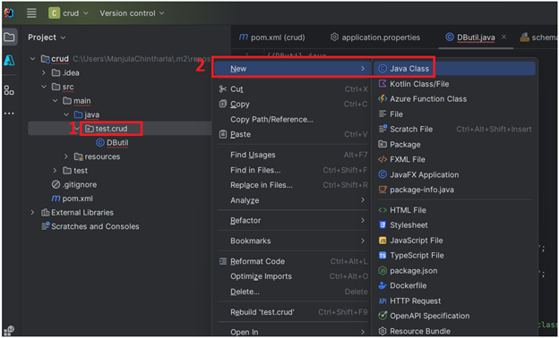 alt="Screenshot" />
>
> 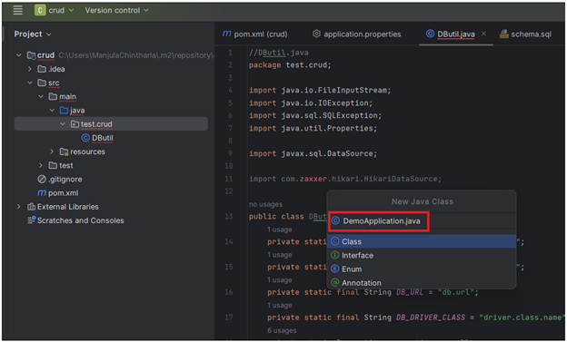 alt="Screenshot" />

7.  Replace the content with the following code:

>```copy
>package test.crud;
>
>import java.io.IOException;
>
>import java.sql.*;
>
>import java.util.*;
>
>import java.util.logging.Logger;
>
>import java.io.FileInputStream;
>
>import java.io.FileOutputStream;
>
>import org.postgresql.copy.CopyManager;
>
>import org.postgresql.core.BaseConnection;
>
>import java.io.IOException;
>
>import java.io.Reader;
>
>import java.io.StringReader;
>
>public class DemoApplication {
>
>private static final Logger log;
>
>static {
>
>System.setProperty("java.util.logging.SimpleFormatter.format","[%4$-7s] %5$s %n");
>
>log =Logger.getLogger(DemoApplication.class.getName());
>
>}
>
>public static void main(String[] args)throws Exception
>
>{
>
>log.info("Connecting to the database");
>
>Connection connection = DButil.getDataSource().getConnection();
>
>System.out.println("The Connection Object is of Class: " + connection.getClass());
>
>log.info("Database connection test: " + connection.getCatalog());
>
>log.info("Creating table");
>
>log.info("Creating index");
>
>log.info("distributing table");
>
>Scanner scanner = new
>Scanner(DemoApplication.class.getClassLoader().getResourceAsStrea("schema.sql"));
>
>Statement statement = connection.createStatement();
>
>while (scanner.hasNextLine()) {
>
>statement.execute(scanner.nextLine());
>
>}
>
>log.info("Closing database connection");
>
>connection.close();
>
>}
>
>}
>


8.  Make sure below configuration is done in your **project Structure**.

> 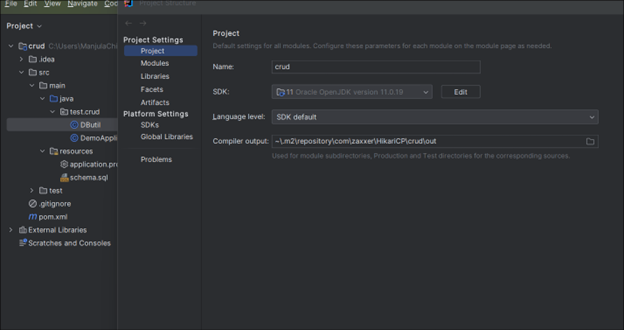 alt="Screenshot" />

9.  To add dependency jars, Click on **File- \>Project Structure-
    \>Artifacts\> + JAR-\> From modules with dependencies.**.

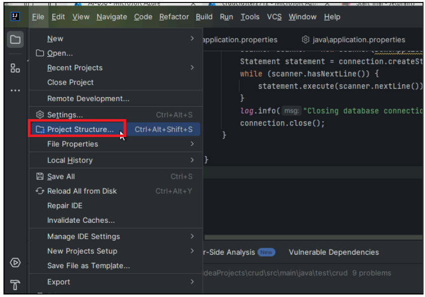

> 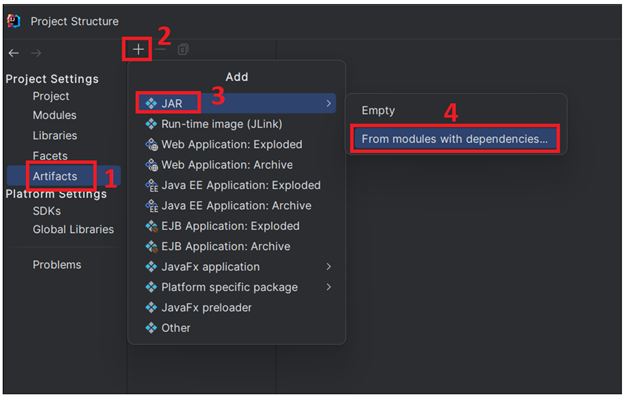 alt="Screenshot" />

10. Click on the folder next to the Main class textbox.

> 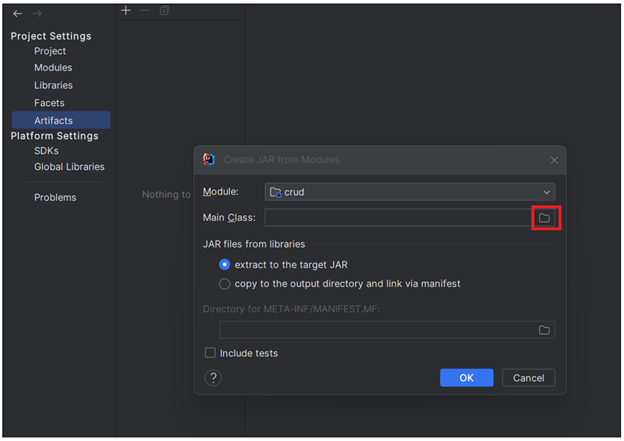 alt="Screenshot" />

11. Select your main class and then click on **Ok**.

> 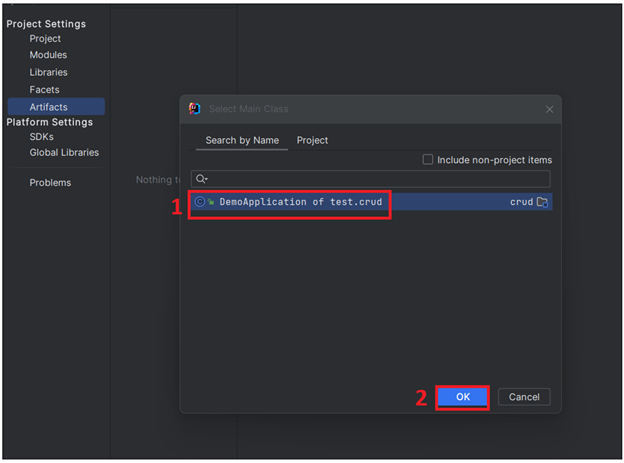 alt="Screenshot" />

12. On Create JAR from Modules, click **Ok**.

>  alt="Screenshot" />

13. Make sure SDK is set to **JAVA 11** class path.

> 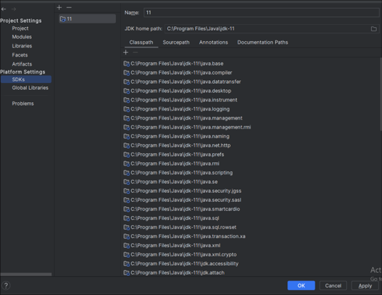 alt="Screenshot" />

14. Click on **Apply** and then click on **Ok**.

> 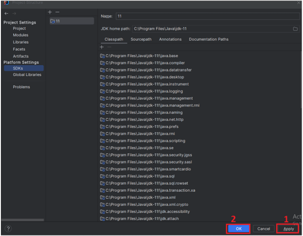 alt="Screenshot" />

15. Click on **pom.xml** and then click on **Code -\> Generate** or
    **alt + Insert** from your keyboard. On the **Generate window**,
    select **Dependency**.

> 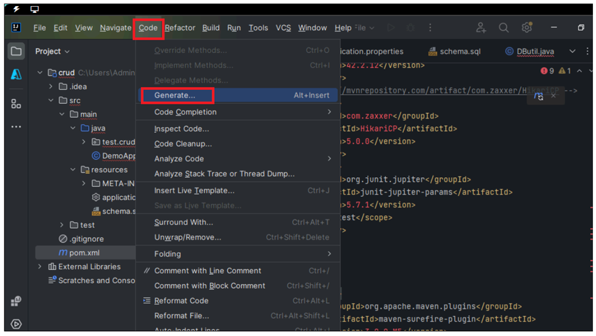 alt="Screenshot" />
>
> 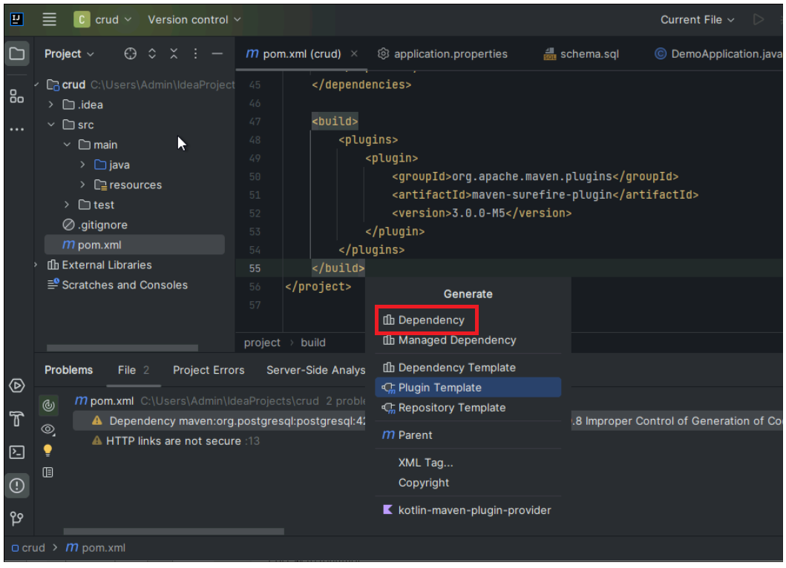 style="width:6.49375in;height:4.69861in" />

16. Search for [**HikariDataSource**](urn:gd:lg:a:send-vm-keys) class
    and select and then **Add** it.

> 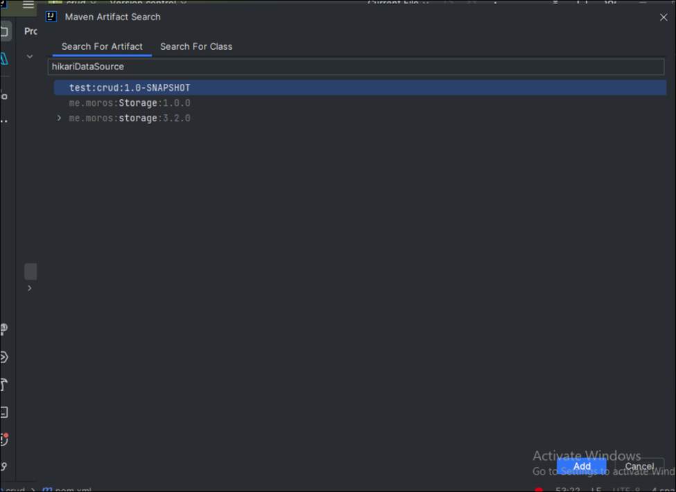 alt="Screenshot" />

17. Repeat the above step and **search for class** -
    [**org.postgresql.copy.CopyManager**](urn:gd:lg:a:send-vm-keys) .Select
    and **add** it.

> 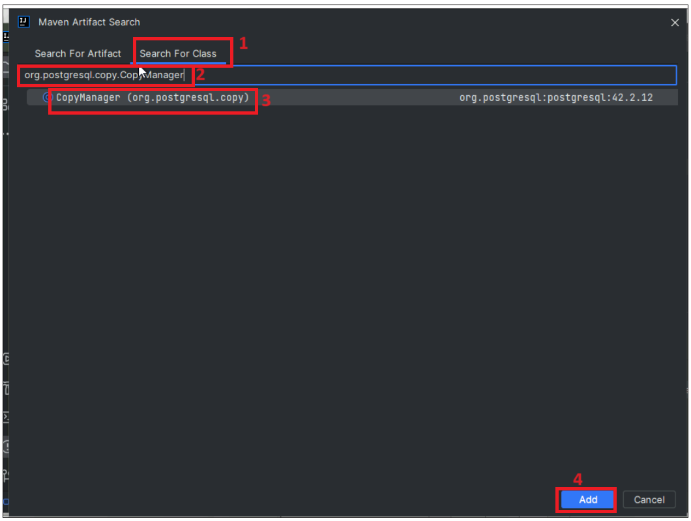 style="width:6.49375in;height:4.89722in" />

18. Save all the files and then click on **File-\> Invalidate
    caches** and then click on **Restart**

> 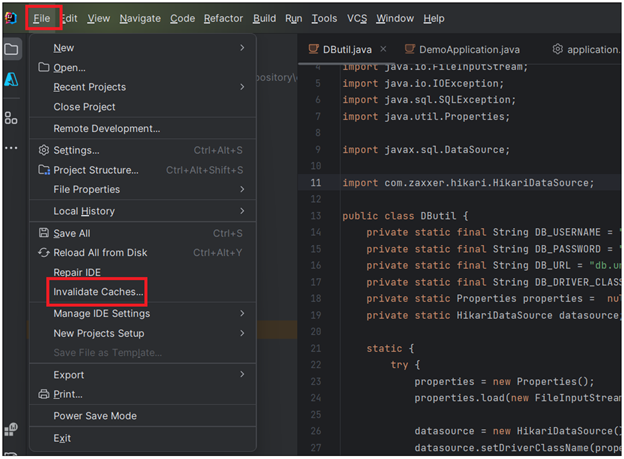 alt="Screenshot" />
>
> 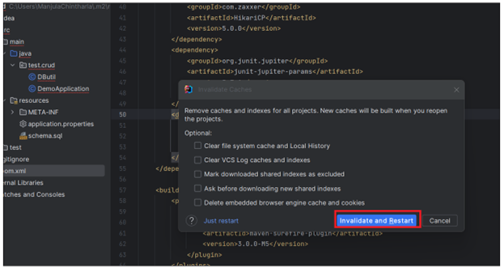 alt="Screenshot" />

### Task 3 : Connect Azure from Intellij

1.  Click on **Azure Toolkit plugin** and then click on **Sign
    in** button.

> 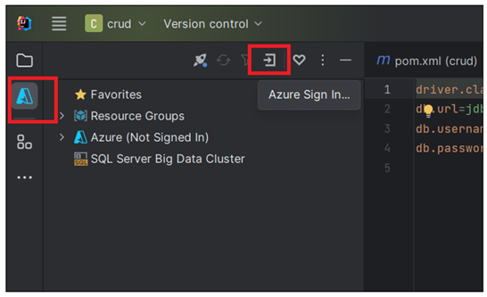 alt="Screenshot" />

2.  Select **OAuth 2.0** and then click on **Sign in**.

>  alt="Screenshot" />

3.  New tab opens in the default browser. Sign in with your Cloud slice
    account.

> 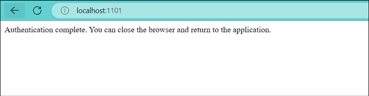 alt="Screenshot" />

4.  Select your subscription and then click on the **Select** button.

> 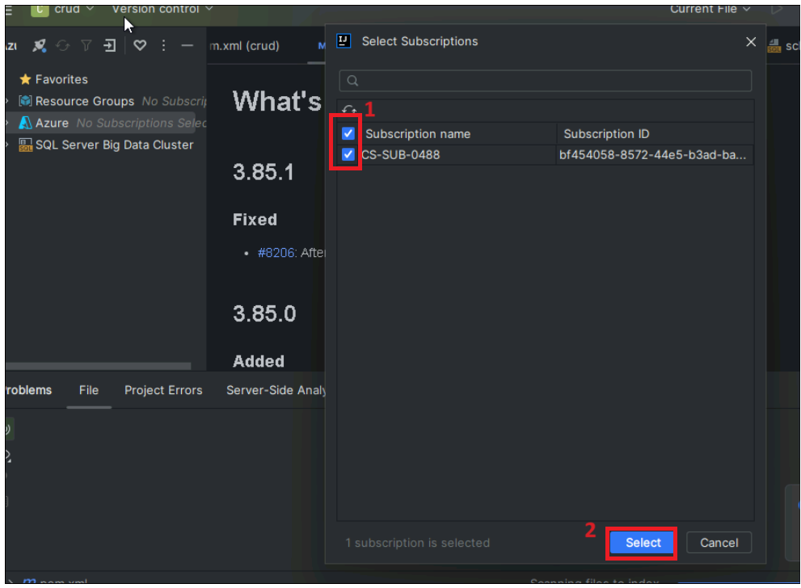

### Task 4 : Run the java app

**Note:** The database user and password credentials are used when
executing DriverManager.getConnection(properties.getProperty("url"),
properties);. The credentials are stored in
the *application.properties* file, which is passed as an argument.You
can now execute this main class with your favorite tool:

1.  Click on **Build- \> Build project** to build the project first.

> 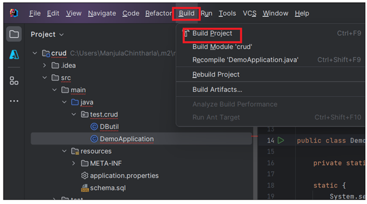 alt="Screenshot" />

2.  Using your IDE, you should be able to right-click on
    the **DemoApplication** class and **Run** it.

>  alt="Screenshot" />
>
> **Note:** Using Maven, you can run the application by executing:  
> mvn exec:java -Dexec.mainClass="com.example.demo.DemoApplication".

3.  The application should connect to the Azure Cosmos DB for
    PostgreSQL, create a database schema, and then close the connection,
    as you should see in the console logs:

> 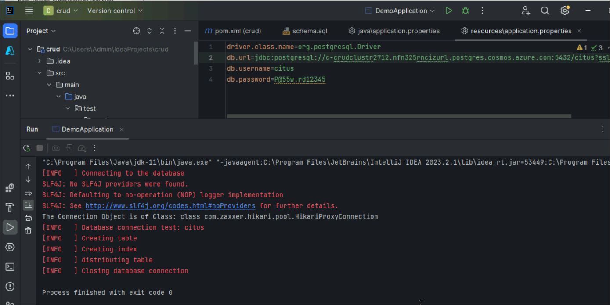 alt="A screenshot of a computer program Description automatically generated" />

### Task 5 : Create a domain class

1.  Create a new [**Pharmacy**](urn:gd:lg:a:send-vm-keys)  Java class,
    next to the **DemoApplication** class.

> 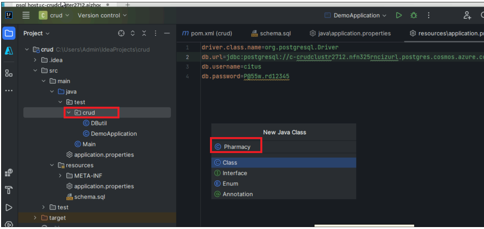 style="width:6.4875in;height:3.07708in" />

2.  Add the following code:

>```copy
> package test.crud;
>
> public class Pharmacy {
>
> private Integer pharmacy_id;
>
> private String pharmacy_name;
>
> private String city;
>
> private String state;
>
> private Integer zip_code;
>
> public Pharmacy() { }
>
> public Pharmacy(Integer pharmacy_id, String pharmacy_name, String
> city,String state,Integer zip_code)
>
> {
>
> this.pharmacy_id = pharmacy_id;
>
> this.pharmacy_name = pharmacy_name;
>
> this.city = city;
>
> this.state = state;
>
> this.zip_code = zip_code;
>
> }
>
> public Integer getpharmacy_id() {
>
> return pharmacy_id;
>
> }
>
> public void setpharmacy_id(Integer pharmacy_id) {
>
> this.pharmacy_id = pharmacy_id;
>
> }
>
> public String getpharmacy_name() {
>
> return pharmacy_name;
>
> }
>
> public void setpharmacy_name(String pharmacy_name) {
>
> this.pharmacy_name = pharmacy_name;
>
> }
>
> public String getcity() {
>
> return city;
>
> }
>
> public void setcity(String city) {
>
> this.city = city;
>
> }
>
> public String getstate() {
>
> return state;
>
> }
>
> public void setstate(String state) {
>
> this.state = state;
>
> }
>
> public Integer getzip_code() {
>
> return zip_code;
>
> }
>
> public void setzip_code(Integer zip_code) {
>
> this.zip_code = zip_code;
>
> }
>
> @Override
>
> public String toString() {
>
> return "TPharmacy{" +
>
> "pharmacy_id=" + pharmacy_id +
>
> ", pharmacy_name='" + pharmacy_name + '\" +
>
> ", city='" + city + '\" +
>
> ", state='" + state + '\" +
>
> ", zip_code='" + zip_code + '\" +
>
> '}';
>
> }
>
> }
>
> This class is a domain model mapped on the Pharmacy table that you
> created when executing the ***schema.sql*** script.

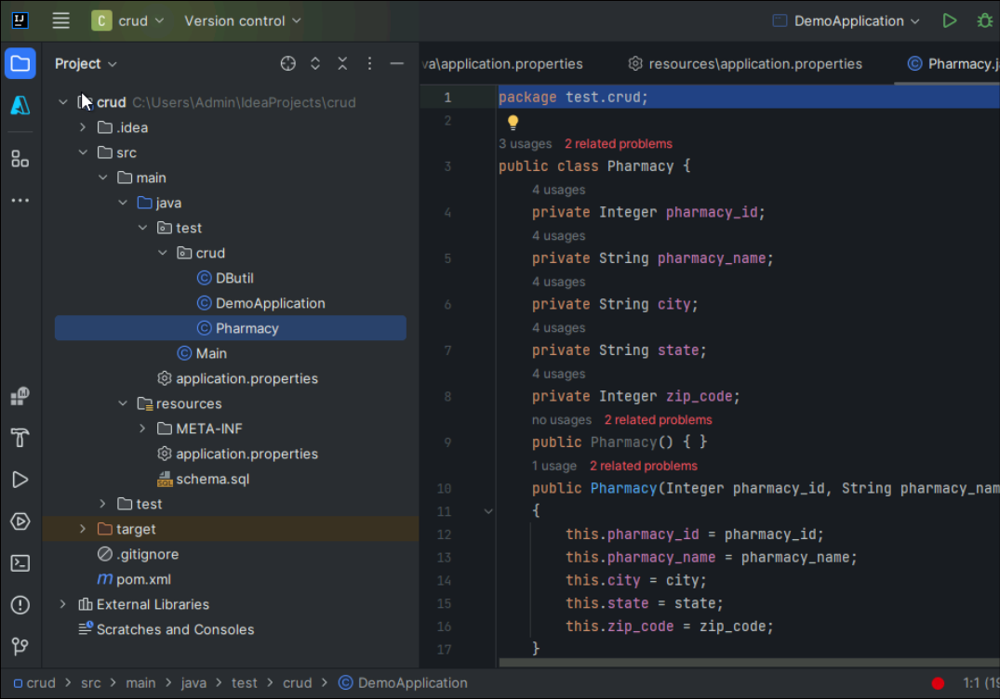

### Task 6 : Insert data

1.  In the ***DemoApplication.java*** file, after the **main method**,
    add the following method that uses the INSERT INTO SQL statement to
    insert data into the database:

>```copy
>private static void insertData(Pharmacy todo, Connection connection) throws SQLException {log.info("Insert data");
>
>PreparedStatement insertStatement = connection
>
>.prepareStatement("INSERT INTO pharmacy(pharmacy_id,pharmacy_name,city,state,zip_code) VALUES (?, ?, ?, ?, ?);");
>
>insertStatement.setInt(1, todo.getpharmacy_id());
>
>insertStatement.setString(2, todo.getpharmacy_name());
>
>insertStatement.setString(3, todo.getcity());
>
>insertStatement.setString(4, todo.getstate());
>
>insertStatement.setInt(5, todo.getzip_code());
>
>insertStatement.executeUpdate();
>
>}
>

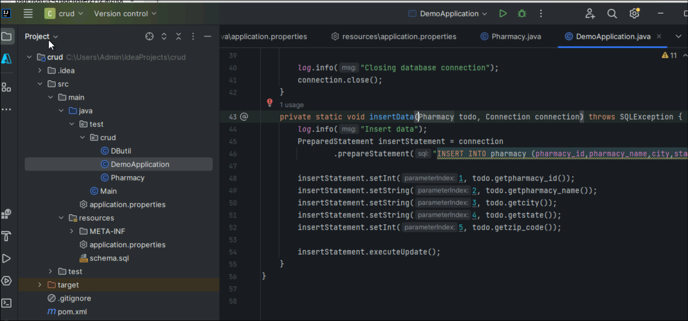

2.  Add the two following lines in the main method:

>```copy
> Pharmacy todo = new Pharmacy(0,"Target","Sunnyvale","California",94001);
>
> insertData(todo, connection);
>

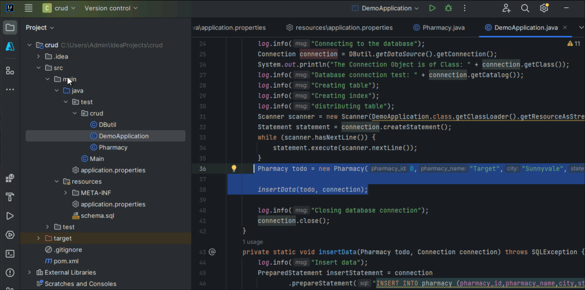

3.  Executing the main class should now produce the following output:

> 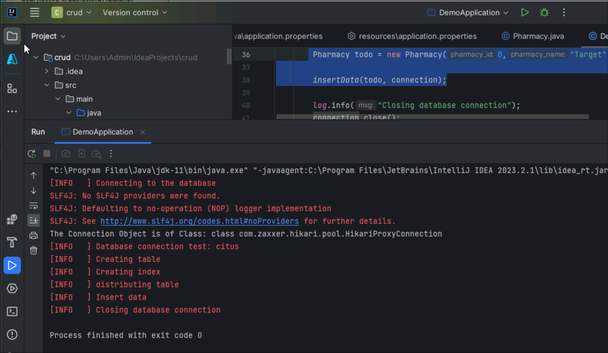 alt="A screenshot of a computer program Description automatically generated" />

### Task 7 : Read data

Read the data you previously inserted to validate that your code works
correctly.

1.  In the ***DemoApplication.java*** file, after
    the **insertData** method, add the following method that uses the
    SELECT SQL statement to read data from the database:

>```copy
> private static Pharmacy readData(Connection connection) throws
> SQLException {
>
> log.info("Read data");
>
> PreparedStatement readStatement = connection.prepareStatement("SELECT
> * FROM Pharmacy;");
>
> ResultSet resultSet = readStatement.executeQuery();
>
> if (!resultSet.next()) {
>
> log.info("There is no data in the database!");
>
> return null;
>
> }
>
> Pharmacy todo = new Pharmacy();
>
> todo.setpharmacy_id(resultSet.getInt("pharmacy_id"));
>
> todo.setpharmacy_name(resultSet.getString("pharmacy_name"));
>
> todo.setcity(resultSet.getString("city"));
>
> todo.setstate(resultSet.getString("state"));
>
> todo.setzip_code(resultSet.getInt("zip_code"));
>
> log.info("Data read from the database: " + todo.toString());
>
> return todo;
>
> }
>

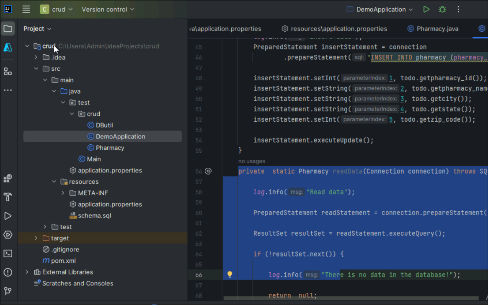

2.  Add the following line in the main method:

>```copy
> todo = readData(connection);
>

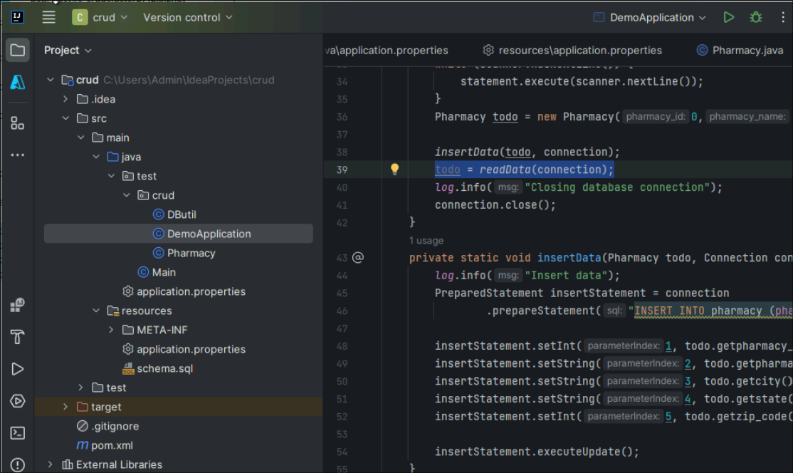

3.  Executing the main class should now produce the following output:

> 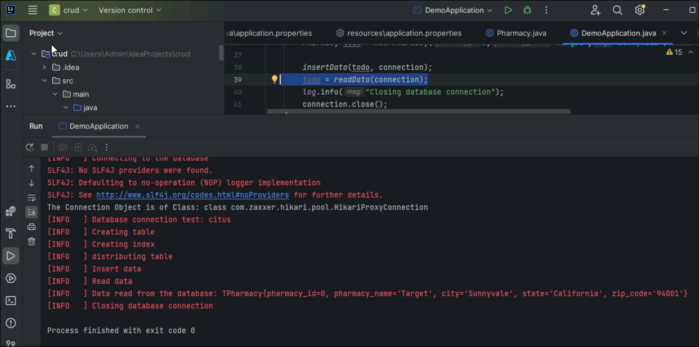 alt="A screenshot of a computer program Description automatically generated" />

### Task 8. Update data

Update the data you previously inserted.

1.  Still in the ***DemoApplication.java*** file, after
    the **readData** method, add the following method to update data
    inside the database by using the UPDATE SQL statement:

>```copy
> private static void updateData(Pharmacy todo, Connection connection)
> throws SQLException {
>
> log.info("Update data");
>
> PreparedStatement updateStatement = connection
>
> .prepareStatement("UPDATE pharmacy SET city = ? WHERE pharmacy_id =
> ?;");
>
> updateStatement.setString(1, todo.getcity());
>
> updateStatement.setInt(2, todo.getpharmacy_id());
>
> updateStatement.executeUpdate();
>
> readData(connection);
>
> }
>

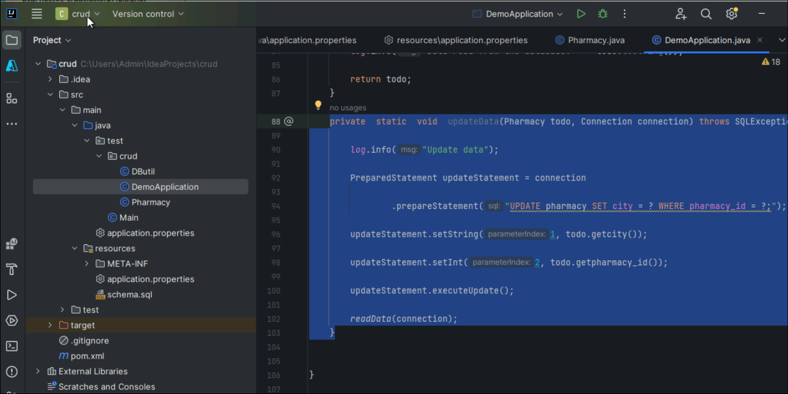

2.  Add the two following lines in the main method:

>```copy
> todo.setcity("Guntur");
>
> updateData(todo, connection);
>
>

> 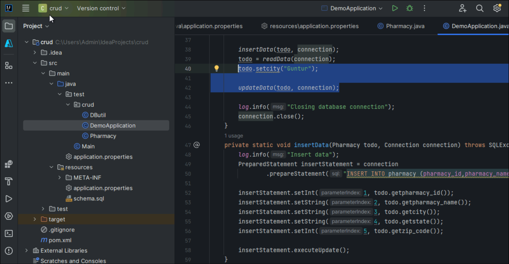 alt="A screenshot of a computer program Description automatically generated" />

3.  Executing the main class should now produce the following output:

> 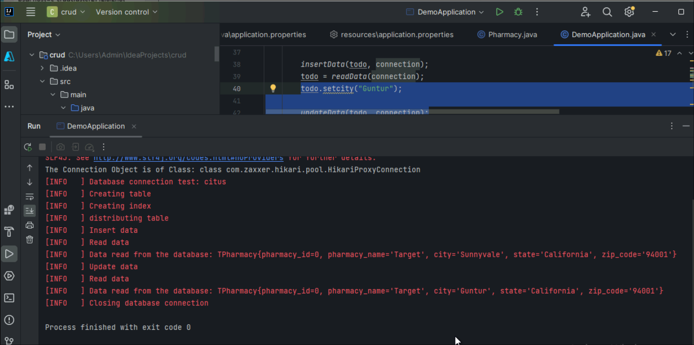 alt="A screenshot of a computer Description automatically generated" />

### Task 9: Delete data

1.  Finally, delete the data you previously inserted. Still in
    the ***DemoApplication.java*** file, after
    the **updateData** method, add the following method to delete data
    inside the database by using the DELETE SQL statement:

>```copy
> private static void deleteData(Pharmacy todo, Connection connection)
> throws SQLException {
>
> log.info("Delete data");
>
> PreparedStatement deleteStatement =
> connection.prepareStatement("DELETE FROM pharmacy WHERE pharmacy_id =
> ?;");
>
> deleteStatement.setLong(1, todo.getpharmacy_id());
>
> deleteStatement.executeUpdate();
>
> readData(connection);
>
> }
>

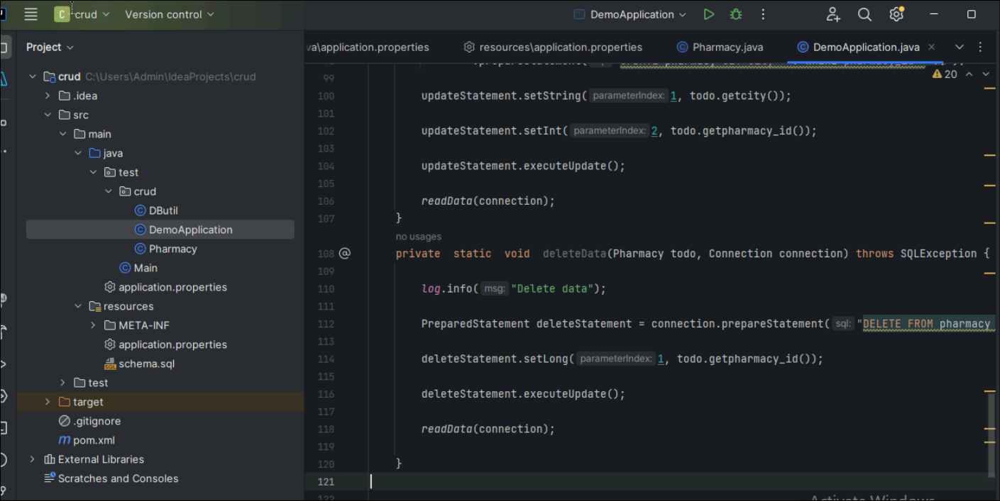

2.  You can now add the following line in the main method:

>```copy
> deleteData(todo, connection);
>

> 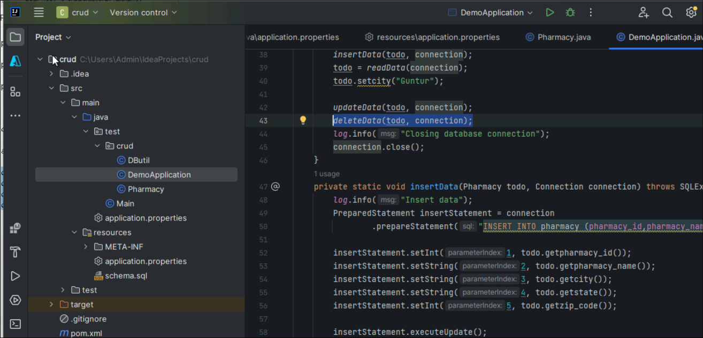 alt="A screenshot of a computer Description automatically generated" />

3.  Executing the main class should now produce the following output

> 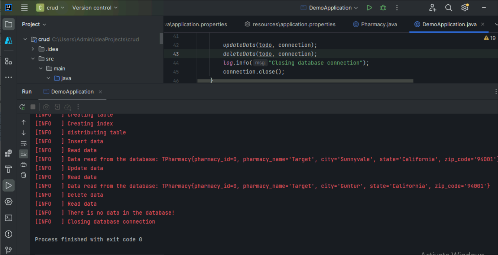 alt="A screenshot of a computer program Description automatically generated" />

### Task 10: Delete Resource in the resource group

1.  Switch back to Azure portal tab or open new tab in browser and go
    to [**https:\portal.azure.com**](urn:gd:lg:a:send-vm-keys) and sign
    in with your Azure subscription account.

2.  Click on **Resource groups**.

>  alt="Screenshot" />

3.  Click on your Cloud slice resource group.

> 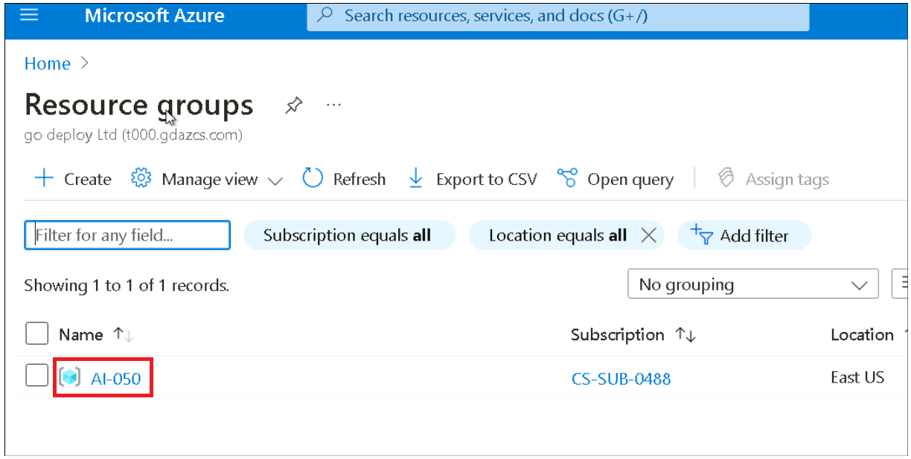

4.  Select Azure Cosmos DB for Postgresql resource created above and
    delete it.

> 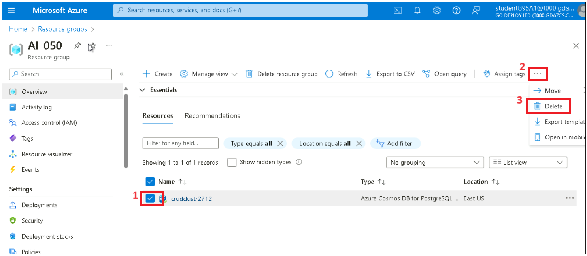

5.  Enter **delete** and click on **Delete** button.

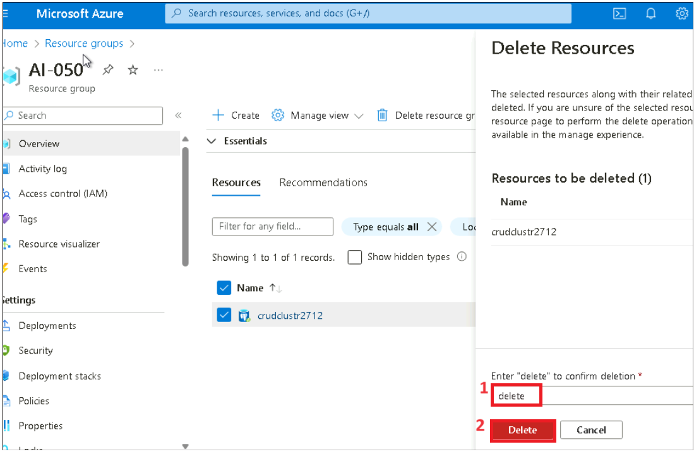

6.  Confirm the deletion of the resource by clicking on the **Delete**
    button in the Confirmation window.

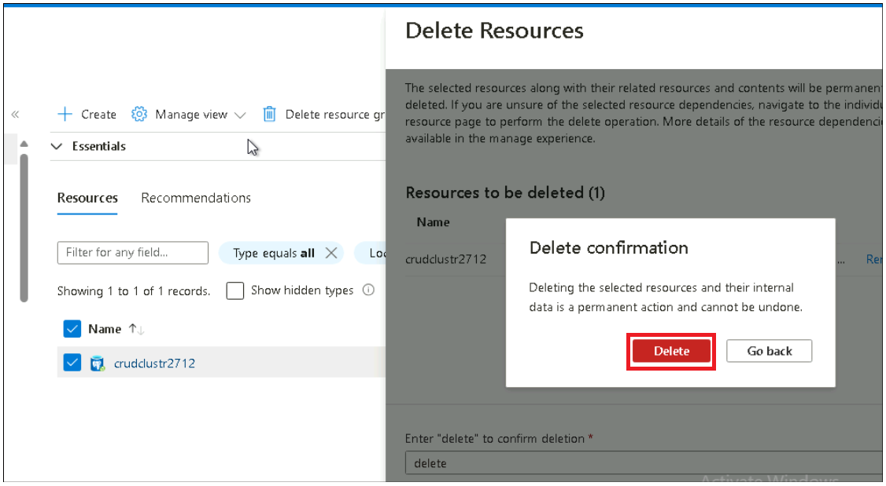

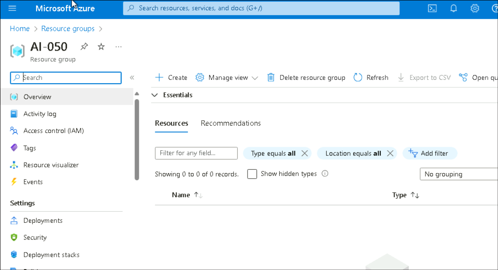

**Summary:**

In this labguide, we learnt how to use Java code to connect to a
cluster, and use SQL statements to create a table. How to insert, query,
update, and delete data in the database
