**Usecase 05- [Deploying a data-driven Python Restaurant web app  with
the Azure Database for
PostgreSQL ](https://learn.microsoft.com/en-us/azure/app-service/tutorial-python-postgresql-app?tabs=flask%2Cwindows&pivots=azure-portal)**

Bottom of Form

**Objective:**

This usecase deploy a Python web app using the Flask framework and the
Azure Database for PostgreSQL relational database service. The Flask app
is hosted in a fully managed Azure App Service. This app is designed to
be run locally and then deployed to Azure

You ‘ll deploy a data-driven Python web app (**Django** or **Flask**)
to **Azure App Service** with the **Azure Database for
PostgreSQL** relational database service. Azure App Service
supports Python in a Linux server environment.

**Key technologies used** – Java 17, Azure Database for PostgreSQL

**Estimated duration** – 45 minutes

**Lab Type:** Instructor Led

**Pre-requisites:**

GitHub account – You are expected to have your own GitHub login
credentials. If you do not have, please create one from here -
**+++<https://github.com/signup?user_email=&source=form-home-signupobjectives>+++**

The [requirements.txt](https://github.com/Azure-Samples/msdocs-flask-postgresql-sample-app/blob/main/requirements.txt) has
the following packages, all used by a typical data-driven Flask
application:

[TABLE]

## 

## Task 1 : Run the sample

This usecase has a dev container configuration, which makes it easier to
develop apps locally, deploy them to Azure, and monitor them. The
easiest way to run this sample application is inside a GitHub codespace.
Follow these steps:

1.  Open a browser and go to +++**https:\\\github.com+++** and sign in
    with your Github account.

2.  Fork this repository to your account by clicking on **Fork** as
    shown in below image.

> <https://github.com/technofocus-pte/msdocs-flask-postgresql-sample-app>

3.  Enter unique name and then click on **Create repo**.

> 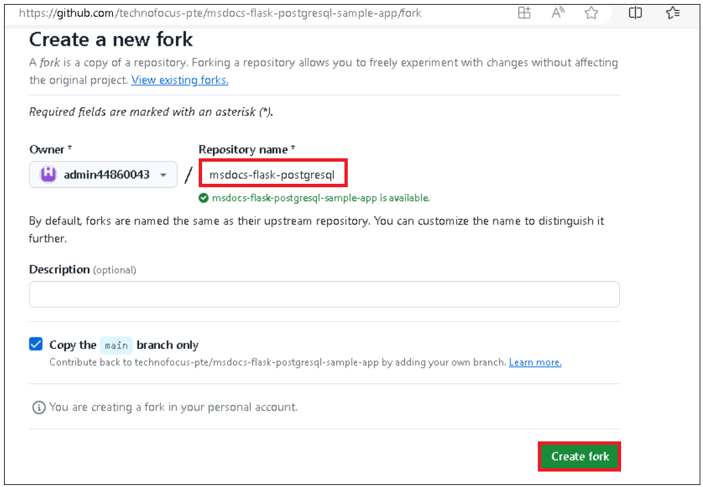

4.  From the repository root of your fork,
    select **Code** \> **Codespaces** \> **+**.

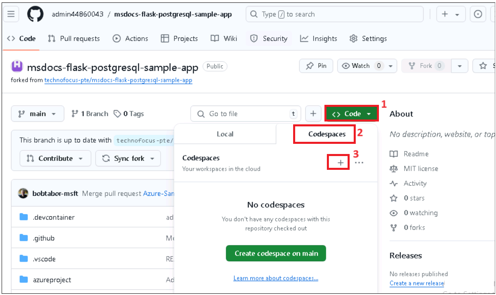

5.  Wait for the workspace to setup.

6.  In the codespace terminal, run the following commands:

> \# Install requirements
>
> python3 -m pip install -r requirements.txt
>
> python3 -m flask run
>
> 

4\. Run below command to create environment varaible

> \# Create .env with environment variables
>
> cp .env.sample.devcontainer .env
>
> 

7.  Run below command for data migration

> \# Run database migrations
>
> python3 -m flask db upgrade
>
> 

8.  Run below command to

> \# Start the development server

python3 -m flask run

> 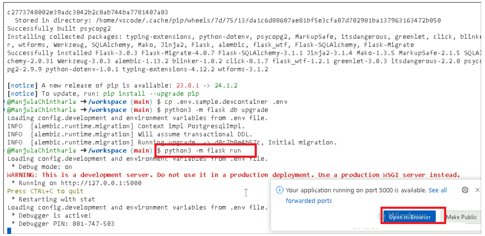

9.  When you see the message Your application running on port is
    available., click **Open in Browser**.

10. Click on **Add new restaurant** button.

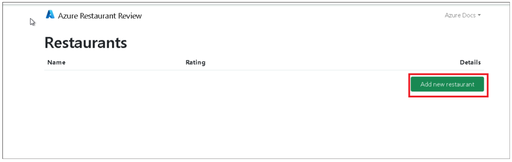

11. Enter the details below and click on **Submit** button.

Name **: +++Contoso Rica+++**

Street Adress - **+++3A ,8th cross, Ferns street , Singapore+++**

Description **- +++**This is a medium to high priced restaurant in the
city shopping center+++

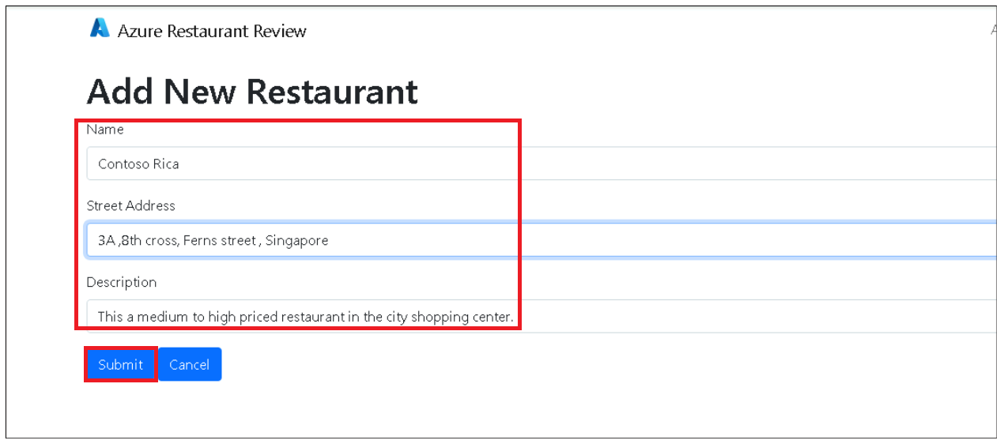

12. Click on **Add new review** button.

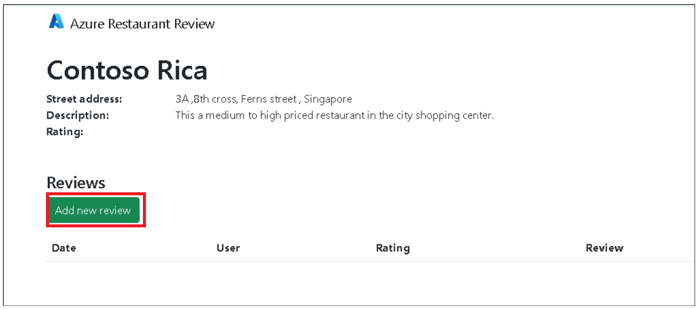

13. Enter your review and then click on button. **Save changes**

> **Your name : your name**
>
> **Rating : your rating**

+++ This a medium to high priced restaurant in the city shopping center.
Service was a little bit confusing as we had at least 6 waiters coming
to ask us things. Food took some time to come. We had 2 menus: one
indian and one thai. The thai is 30% cheaper so we went for some
appetizers and thai red curry. Food took some time but it was worth it.
It was delicious and very well prepared. Overall, this is a good eat.+++

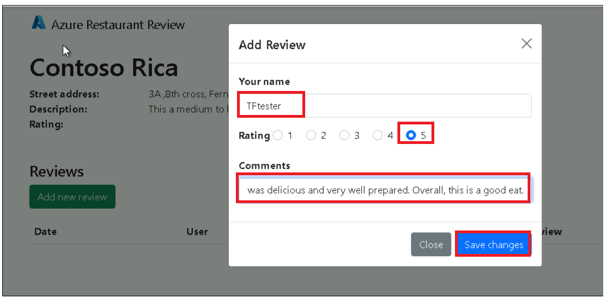

> 

14. Add some more reviews and new restaurant with comments.

> 

**Task 2: Deploy the app to Azure.**

This project is designed to work well with the [Azure Developer
CLI](https://learn.microsoft.com/azure/developer/azure-developer-cli/overview),
which makes it easier to develop apps locally, deploy them to Azure, and
monitor them.

1.  Switch back to Github code space tab, Run below command to
    Initialize a new azd environment:

> +++azd init+++

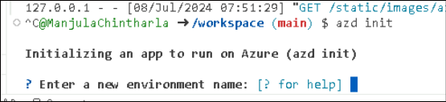

2.  It will prompt you to provide a environment name (like
    +++flask-appXXXX+++ (XXXX can be unique number)), which will later
    be used in the name of the deployed resources.

3.  Login if required +++**azd auth login+++** .copy the code and press
    enter.

4.  Enter the code and then sign in with your Azure subscription
    account.

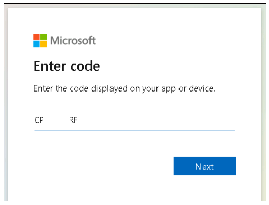

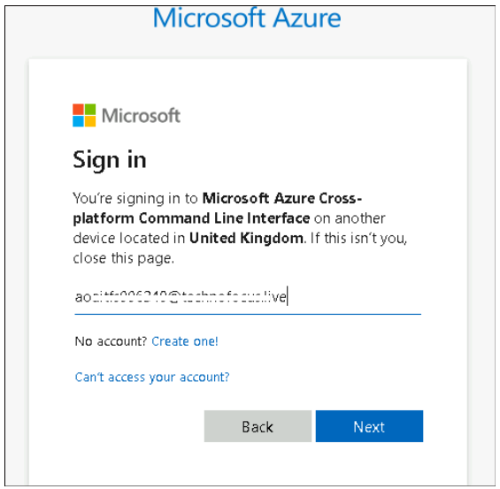

5.  Switch back Gtihub codespace tab and run below command to provision
    and deploy all the resources:

> **+++azd up+++**
>
> It will prompt you to login, pick a subscription, and provide a
> location (like "eastus"). Then it will provision the resources in your
> account and deploy the latest code. If you get an error with
> deployment, changing the location (like to "centralus") can help, as
> there may be availability constraints for some of the resources.

6.  Deployment takes 30 -40 minutes.You can aloscheck the status of
    deployment at the generated link.

> 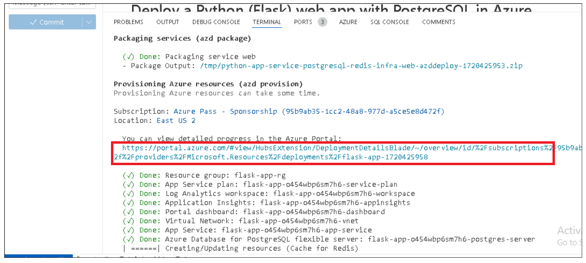
>
> 

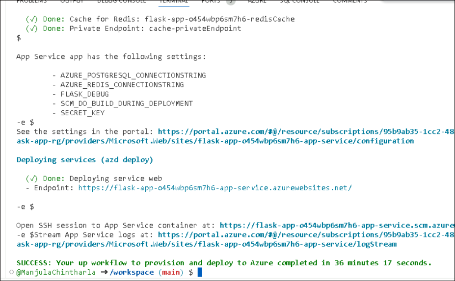

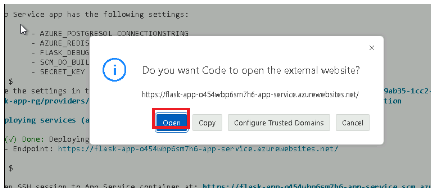

7.  When azd has finished deploying, you'll see an endpoint URI in the
    command output. Visit that URI, and you should see the front page of
    the restaurant review app! 🎉 If you see an error, open the Azure
    Portal from the URL in the command output, navigate to the App
    Service, select Logstream, and check the logs for any errors.

> 
>
> 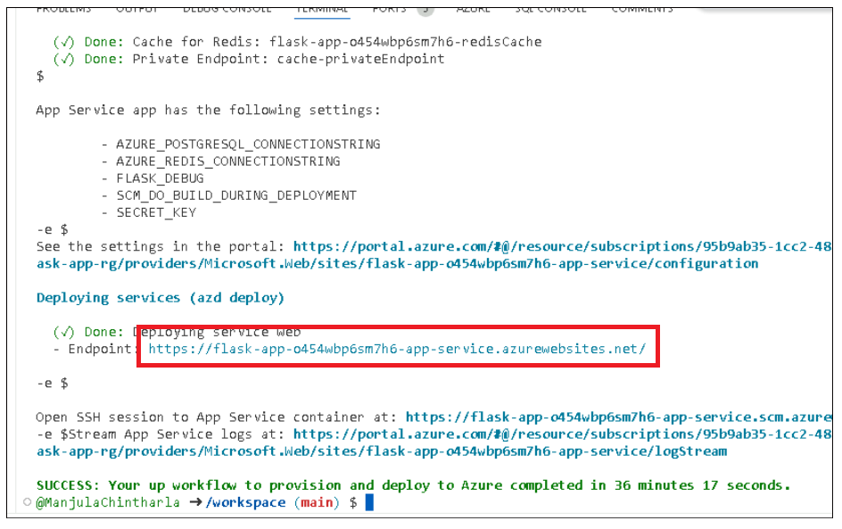

8.  When you've made any changes to the app code, you can just run:

> azd deploy

**Task 3. Verify deployed resources**

1.  Open +++**https:\\\portal.azure.com+++** in browser and sign in with
    your Azure subscription account.

2.  Click on Resource group tile from home page,

3.  Click on resource group name

 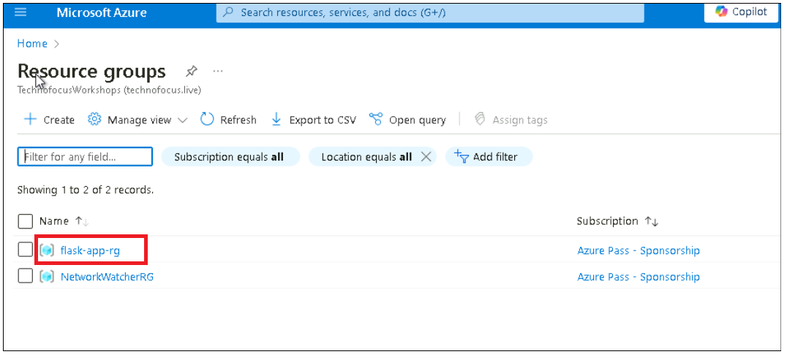

4.  Check deployed resources . click on each resource and explore them.

**Task 4 : Stream diagnostic logs**

Azure App Service captures all messages output to the console to help
you diagnose issues with your application. The app
includes print() statements to demonstrate this capability as shown
below.

@app.route('/', methods=\['GET'\])

def index():

print('Request for index page received')

restaurants = Restaurant.query.all()

return render_template('index.html', restaurants=restaurants)

1.  Click on App service resource

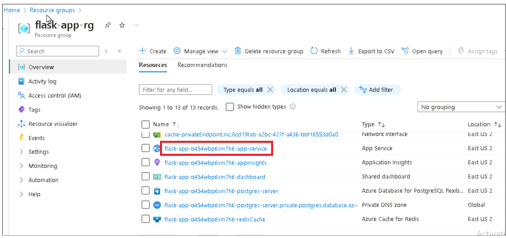

2.   In the App Service page:

3.  From the left menu, select **App Service logs**.

4.  Under **Application logging**, make sure **File System** selected.
    > Select it if required

5.  In the top menu, select **Save**.

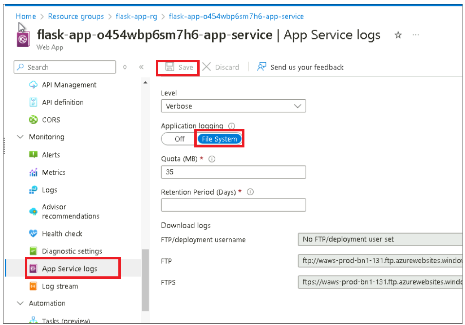

**2.**  From the left menu, select **Log stream**. You see the logs for
your app, including platform logs and logs from inside the container.

**Task 5 : Clean up resources**

When you're finished, you can delete all of the resources from your
Azure subscription by deleting the resource group.

1.  Click on resource group from top navigation menu as shown in below
    image.

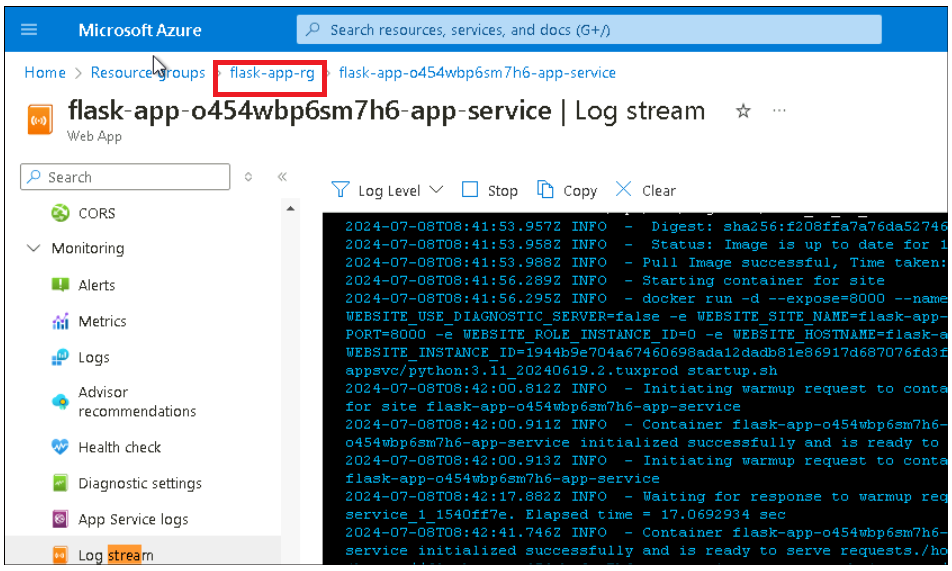

2.  Click on **Delete resource group** .Copy the resource group name,
    enter it into the text box and then click on **Delete** button.

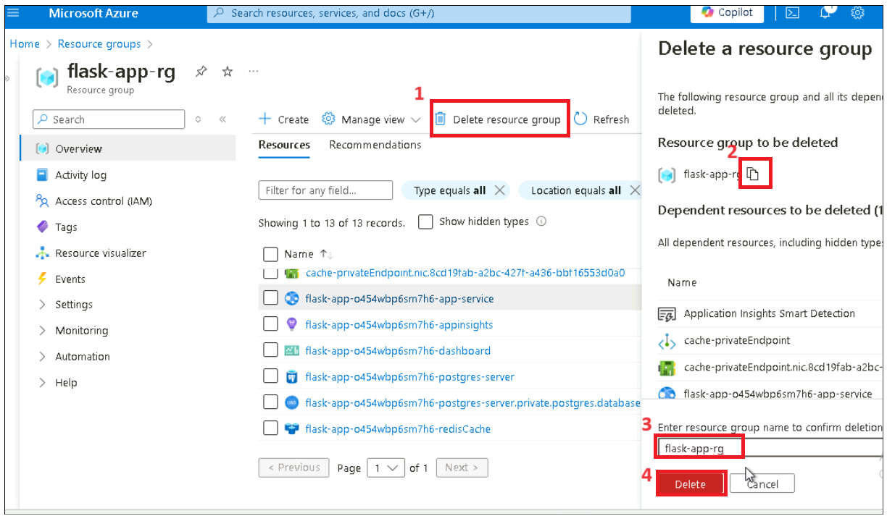

3.  On **Delete Confirmation** windows, click on **Delete**.

> 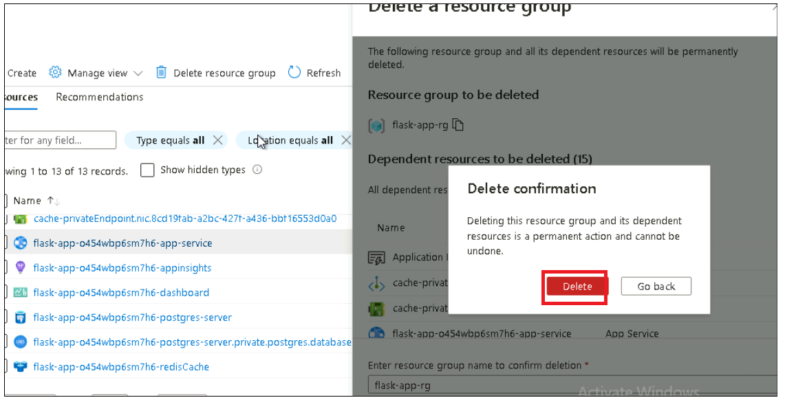

## **Summary.**

You have learnt deploying a Python web app using the Flask framework and
the Azure Database for PostgreSQL relational database service.

. Azure App Service supports Python in a Linux server environment.
