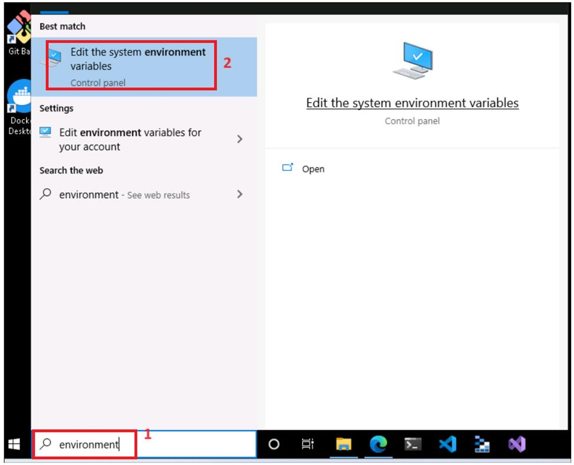
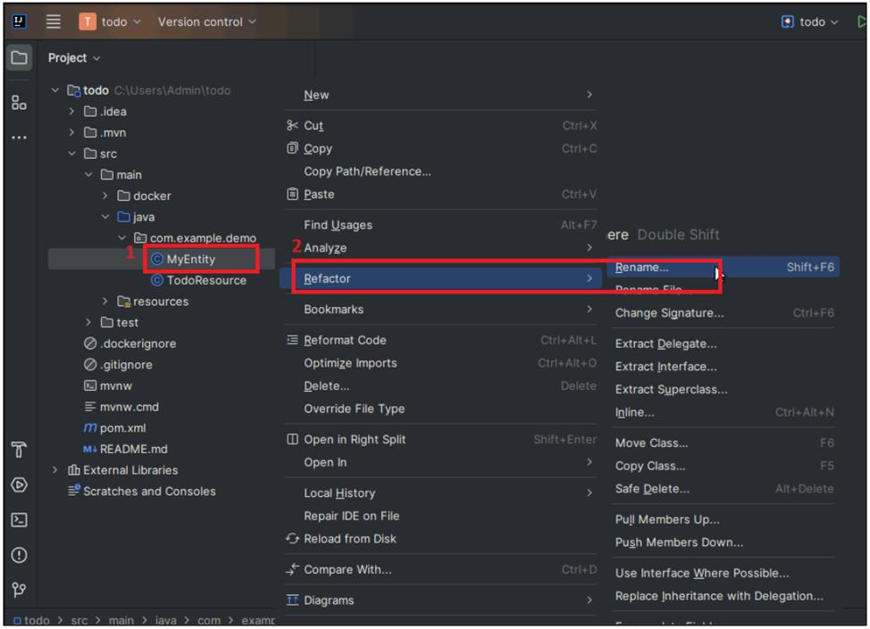
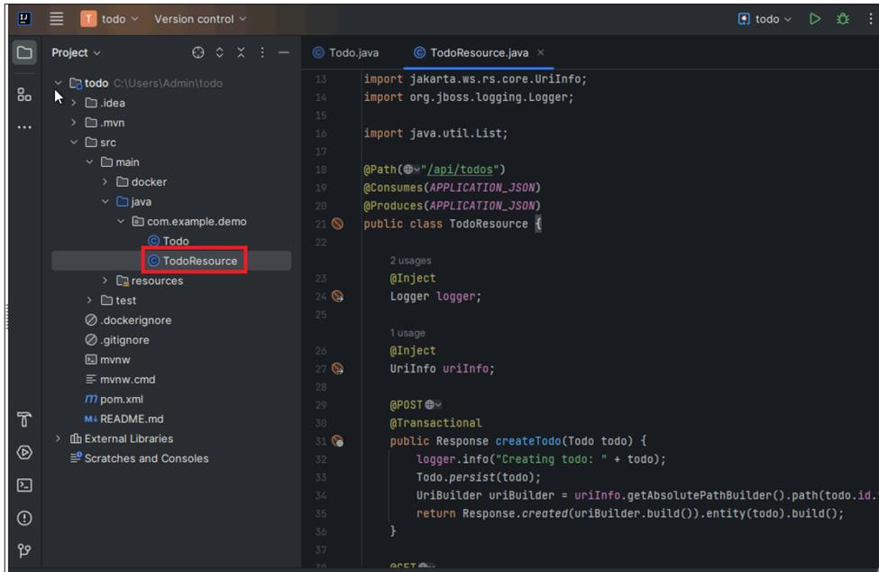
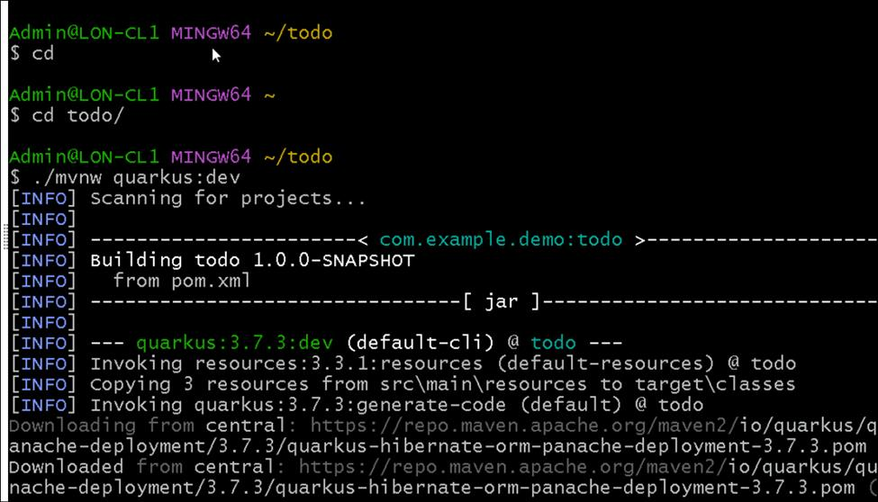
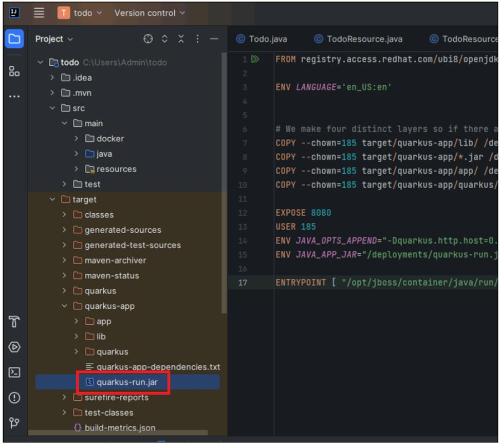
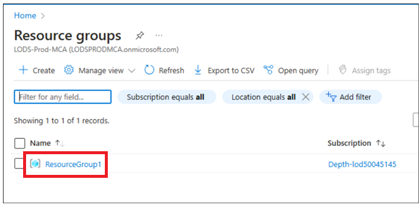
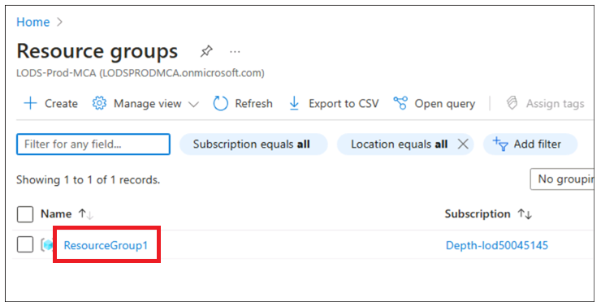
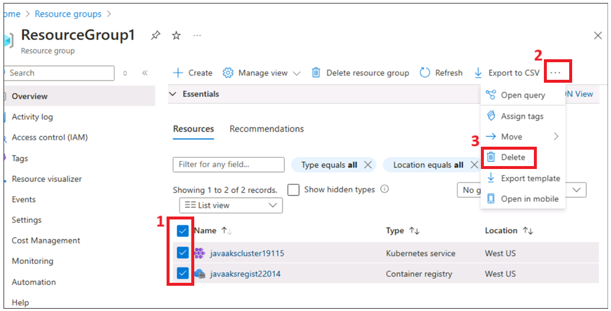
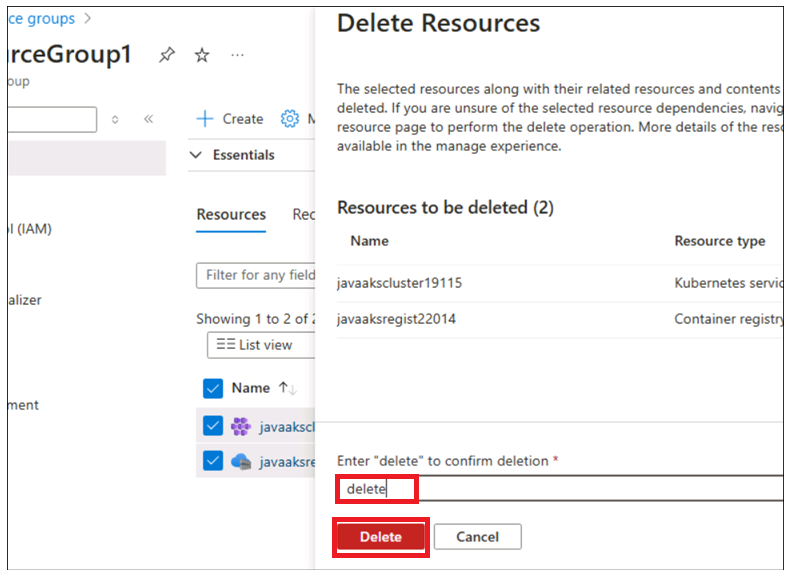

# Caso de uso 01 – Incorpore las aplicaciones Quarkus ToDo en Container Apps e intégrelo con un relational database.

**Objetivo:**

Este caso de uso muestra cómo desarrollar, configurar e implementar una
aplicación Quarkus To-do- segura en Container Apps que está conectada a
un Azure Database for PostgreSQL. Cuando termine, tendrá una aplicación
Quarkus funcionando en Azure App Service en Linux.

**Tecnologías clave** -- Java 17, Azure Database for PostgreSQL

**Duración estimada** -- 45 minutos

**Tipo del laboratorio:** dirigido por el instructor

### Tarea 0: Configure las variables del entorno

1.  Busque Environmental variable desde el Windows start menu y
    seleccione Edit the System Environment variables.

2.  Haga clic en el botón **Environment Variable**.

3.  Seleccione **JAVA_HOME** en **User variable for Admin** y haga clic
    en **Edit**.

4.  Introduzca el valor del variable como **C:\Program
    Files\Java\jdk-17** y haga clic en **Ok**.

5.  Navegue a la carpeta **C:\Software** y haga clic derecho en la
    carpeta **apache-maven-3.9.4-bin.zip** y seleccione **Extract All**.

6.  **Extraiga** en la misma carpeta.

7.  Cambie a la ventana Edit Environment variable,
    seleccione **MAVEN_HOME** y haga clic en **Edit**.

8.  Introduzca el valor del variable
    como \`C:\Software\apache-maven-3.9.4-bin\apache-maven-3.9.4\` y
    haga clic en **OK**.

9.  En la ventana **Environmental Variable**s, haga clic en **Ok** y de
    nuevo en **OK**.

10. Actualice **JAVA_HOME** según los requisitos del laboratorio antes
    de ejecutarlo.

## Ejericicio 1 : Genere la aplicación Quarkus mediante Maven

Hay muchas maneras de generar una estructura del proyecto de Quarkus.
Puede usar la interfaz web de Quarkus, un IDE plugin, o el Quarkus Maven
plugin. Usemos el Maven plugin para generar project structure.

Puede generar su aplicación con varias dependencias:

- El resteasy dependency para exponer un REST endpoint

- El jackson dependency para serializar y deserializar JSON

- El hibernate dependency para interactuar con el database

- El postgresql dependency para conectarse al PostgreSQL database

- El docker dependency para construir una imagen Docker

No necesita especificar las Azure dependencies porque primero se ejecuta
su aplicación de forma local y luego implementa su versión contenerizada
al Azure Container Apps.

### Tarea 1 : Genere la Quarkus application

1.  Abra **Git Bash** desde el menú de inicio y ejecute el siguiente
    command

> mvn -U io.quarkus:quarkus-maven-plugin:3.7.3:create \\
>
> -DplatformVersion=3.7.3 \\
>
> -DprojectGroupId=com.example.demo \\
>
> -DprojectArtifactId=todo \\
>
> -DclassName="com.example.demo.TodoResource" \\
>
> -Dpath="/api/todos" \\
>
> -DjavaVersion=17 \\

-Dextensions="resteasy-jackson, hibernate-orm-panache, jdbc-postgresql,
docker"

2.  Este command crea un nuevo proyecto de Quarkus. Genera una Maven
    directory structure (src/main/java para el código fuente y
    src/test/java para tests). Crea unos Java classes, unos tests, y
    luego unos Dockerfiles. También genera un archivo *pom.xml* con
    todas las dependencias necesarias (Hibernate, RESTEasy, Jackson,
    PostgreSQL, y Docker):

3.  Haga clic en Search y tecle \`\`IntelliJ IDE\`\` y
    seleccione **IntelliJ IDE**

4.  Seleccione la casilla de confirmación y haga clic en el
    botón **Continue**.

5.  Cierre la ventana de Data sharing.

6.  Seleccione el botón de alternancia de **Start trial** y luego haga
    clic en el botón **Start trial**.

7.  Haga clic en el botón **Allow access**.

8.  Cierre el navegador, cambie de nuevo a la ventana IntelliJ license y
    haga clic en el botón **Continue**.

9.  Haga clic en la carpeta **Open**.

10. Navegue a **C:\Users\Admin\todo** y seleccione la carpeta de
    proyecto **todo** y haga clic en **OK**.

11. Haga clic en el botón **Trust project**.

12. Abra **pom.xml** y verá el siguiente xml format.

> \<dependencies\>
>
> \<dependency\>
>
> \<groupId\>io.quarkus\</groupId\>
>
> \<artifactId\>quarkus-hibernate-orm-panache\</artifactId\>
>
> \</dependency\>
>
> \<dependency\>
>
> \<groupId\>io.quarkus\</groupId\>
>
> \<artifactId\>quarkus-resteasy-jackson\</artifactId\>
>
> \</dependency\>
>
> \<dependency\>
>
> \<groupId\>io.quarkus\</groupId\>
>
> \<artifactId\>quarkus-jdbc-postgresql\</artifactId\>
>
> \</dependency\>
>
> \<dependency\>
>
> \<groupId\>io.quarkus\</groupId\>
>
> \<artifactId\>quarkus-container-image-docker\</artifactId\>
>
> \</dependency\>
>
> \<dependency\>
>
> \<groupId\>io.quarkus\</groupId\>
>
> \<artifactId\>quarkus-arc\</artifactId\>
>
> \</dependency\>
>
> \<dependency\>
>
> \<groupId\>io.quarkus\</groupId\>
>
> \<artifactId\>quarkus-hibernate-orm\</artifactId\>
>
> \</dependency\>
>
> \<dependency\>
>
> \<groupId\>io.quarkus\</groupId\>
>
> \<artifactId\>quarkus-resteasy\</artifactId\>
>
> \</dependency\>
>
> \<dependency\>
>
> \<groupId\>io.quarkus\</groupId\>
>
> \<artifactId\>quarkus-junit5\</artifactId\>
>
> \<scope\>test\</scope\>
>
> \</dependency\>
>
> \<dependency\>
>
> \<groupId\>io.rest-assured\</groupId\>
>
> \<artifactId\>rest-assured\</artifactId\>
>
> \<scope\>test\</scope\>
>
> \</dependency\>

\</dependencies\>

**Ojo** Todas las dependencias en el archivo *pom.xml* se definen en el
Quarkus BOM (bill of materials) io.quarkus.platform:quarkus-bom.

### Tarea 2 : Codifique la aplicación

1.  Vaya a **src/main/java/com.example.demo** y haga clic derecho
    en **MyEntity.Java -\> Refactor -\> Rename**.

2.  Renombre la clase ***MyEntity.java*** generada
    como \`\`**Todo.java\`\`** (ubicada en la misma carpeta que el
    archivo *TodoResource.java*)

3.  Reemplace el código existente con el siguiente código Java. Usa Java
    Persistence API (jakarta.persistence.\* package) para almacenar y
    recuperar datos desde su servidor de PostgreSQL. También usa
    \[Hibernate ORM with Panache\]{.underline} (inheriting from
    io.quarkus.hibernate.orm.panache.PanacheEntity) para simplificar la
    persistence layer.

4.  Usted usa una entidad JPA (@Entity) para mapear el objeto de Java
    Todo directamente a la tabla PostgreSQL Todo. A continuación, el
    TodoResource REST endpoint crea un nuevo Todo entity class y lo
    persiste. Esta clase es un modelo de dominio mapeado en la tabla
    ToDo. La tabla se crea de forma automática por JPA.

5.  Extender el PanacheEntity le da muchos métodos genéricos de create,
    read, update, y delete (CRUD) para su type. Por eso, puede hacer
    cosas como guardar y eliminarobjetos de Todo en una sola línea de
    código de Java.

6.  Configure JDK en IntelliJ si todavía lo está.

7.  Reemplace el código existente con el siguiente código de Java a la
    entidad Todo:

package com.example.demo;

import io.quarkus.hibernate.orm.panache.PanacheEntity;

import jakarta.persistence.Entity;

import java.time.Instant;

@Entity

public class Todo extends PanacheEntity {

public String description;

public String details;

public boolean done;

public Instant createdAt = Instant.now();

@Override

public String toString() {

return "Todo{" +

"id=" + id + '\\' +

", description='" + description + '\\' +

", details='" + details + '\\' +

", done=" + done +

", createdAt=" + createdAt +

'}';

}

}

8.  Para gestionar esta clase, actualice el **TodoResource** para que
    pueda publicar las interfaces REST para almacenar y recuperar datos
    mediante HTTP. Abra la clase **TodoResource** y reemplace el código
    con lo siguiente:

package com.example.demo;

import jakarta.inject.Inject;

import jakarta.transaction.Transactional;

import jakarta.ws.rs.Consumes;

import jakarta.ws.rs.GET;

import jakarta.ws.rs.POST;

import jakarta.ws.rs.Path;

import jakarta.ws.rs.Produces;

import static jakarta.ws.rs.core.MediaType.APPLICATION_JSON;

import jakarta.ws.rs.core.Response;

import jakarta.ws.rs.core.UriBuilder;

import jakarta.ws.rs.core.UriInfo;

import org.jboss.logging.Logger;

import java.util.List;

@Path("/api/todos")

@Consumes(APPLICATION_JSON)

@Produces(APPLICATION_JSON)

public class TodoResource {

@Inject

Logger logger;

@Inject

UriInfo uriInfo;

@POST

@Transactional

public Response createTodo(Todo todo) {

logger.info("Creating todo: " + todo);

Todo.persist(todo);

UriBuilder uriBuilder =
uriInfo.getAbsolutePathBuilder().path(todo.id.toString());

return Response.created(uriBuilder.build()).entity(todo).build();

}

@GET

public List\<Todo\> getTodos() {

logger.info("Getting all todos");

return Todo.listAll();

}

}

### 

### **Tarea 3 : Ejecute la aplicación**

Cuando ejecuta la aplicación en el modo de desarrollador, Docker Desktop
tiene que estar funcionando. Eso porque el Quarkud detecta que usted
necesita un database de PostgreSQL (debido a la PostgreSQL dependency
quarkus-jdbc-postgresql declarado en el archivo *pom.xml*), descarga la
imagen de PostgreSQL Docker Desktop, e inicia un container con el
database. Así crea una tabla Todo de forma automática en el database.

1.  Haga doble clic en **Docker Desktop** y minimice la ventana.
    Asegúrese de que está ejecutando. (no hace falta iniciar sesión)

2.  Vuelva a Gitbash y ejecute la aplicación to-do mediante este
    command:

cd todo

./mvnw quarkus:dev

3.  La aplicación Quarkus debe iniciar y conectarse a su database. Debe
    ver el siguiente output:

4.  Haga clic en **Allow access**.

5.  Para probar la aplicación, puede usar cURL.

En una nueva instance diferente de Gitbash, cree un nuevo elemento to-do
en el database con el siguiente command. Debe ver el log en la consola
Quarkus:

curl --header "Content-Type: application/json" \\

--request POST \\

--data '{"description":"Take Quarkus MS Learn","details":"Take the MS
Learn on deploying Quarkus to Azure Container Apps","done": "true"}' \\

http://127.0.0.1:8080/api/todos

6.  Este command debe devolver el elemento creado (con un
    identificador):

7.  Cree el segundo to-do con el siguiente cURL command:

> curl --header "Content-Type: application/json" \\
>
> --request POST \\
>
> --data '{"description":"Take Azure Container Apps MS
> Learn","details":"Take the ACA Learn module","done": "false"}' \\

http://127.0.0.1:8080/api/todos

8.  A continuación, recupere los datos mediante una nueva solicitud de
    cURL:

curl http://127.0.0.1:8080/api/todos

Este command devuelve una lista de elementos to-do, incluidos los
elementos que creó:

### Tarea 4 : Pruebe la aplicación

Para probar la aplicación, puede usar la
clase **TodoResourceTest** existente. Tiene que probar el REST endpoint.
Para probar el endpoint, usa \[RESTAssured\]{.underline}.

1.  Cambie a Intellij y abra la clase
    **TodoResourceTest** desde **src/test/java/com.example.demo**.
    Reemplace el código en la clase **TodoResourceTest** con el
    siguiente código:

package com.example.demo;

import io.quarkus.test.junit.QuarkusTest;

import static io.restassured.RestAssured.given;

import static jakarta.ws.rs.core.HttpHeaders.CONTENT_TYPE;

import static jakarta.ws.rs.core.MediaType.APPLICATION_JSON;

import org.junit.jupiter.api.Test;

@QuarkusTest

class TodoResourceTest {

@Test

void shouldGetAllTodos() {

given()

.when().get("/api/todos")

.then()

.statusCode(200);

}

@Test

void shouldCreateATodo() {

Todo todo = new Todo();

todo.description = "Take Quarkus MS Learn";

todo.details = "Take the MS Learn on deploying Quarkus to Azure
Container Apps";

todo.done = true;

given().body(todo)

.header(CONTENT_TYPE, APPLICATION_JSON)

.when().post("/api/todos")

.then()

.statusCode(201);

}

}

2.  Cuando prueba la aplicación, Docker Desktop tiene que estar
    ejecutando porque Quarkus detecta que necesita el PostgreSQL
    database para probar.

3.  Cambie a **Gitbash** y haga Ctrl + C. ejecute los siguientes
    commands para probar la aplicación mediante este command:

./mvnw clean test

Debe ver el output parecido a este:

## Ejercicio 2 – Configure Azure Container Apps

En este ejercicio, creará un Azure resource group que contiene los
recursos para su aplicación. A continuación, configurará el PostgreSQL
database mediante el Azure CLI. Por fin, configurará la aplicación
Quarkus para acceder al PostgreSQL database remoto. Use un terminal de
su elección para ejecutar los commands.

## Tarea 1: Prepare el working environment

Necesita configurar unos variables del entorno. Aquí hay algunas notas
sobre las variables que va a crear:

[TABLE]

**Ojo:** Puede nombrar sus Azure resources en cualquier forma que desea.
Este elemento proporciona ejemplos de abreviaciones para muchos recursos
de Azure (por ejemplo, rg se usa para grupos de recursos y ca para las
apps container).

1.  Use los siguientes commands para establecer las variables. Asegúrese
    de modificar los valores como se describen en la tabla anterior.
    Estas environment variables se usan a lo largo de este módulo.

**Ojo:** Se admite PostgreSQL sólo en **Westus**. Pruebe en la ubicación
de westus primero y su surge algún problema puede probarlo en una
ubicación cerca de usted

export AZ_PROJECT_Quarkus="azure-deploy-quarkus-"$RANDOM

export AZ_CONTAINERAPP="ca${AZ_PROJECT_Quarkus}"

export AZ_CONTAINERAPP_ENV="cae${AZ_PROJECT_Quarkus}"

export AZ_POSTGRES_DB_NAME="postgres${AZ_PROJECT_Quarkus}"

export AZ_POSTGRES_USERNAME="azuser123"

export AZ_POSTGRES_PASSWORD="P@55w.rd12345"

export AZ_POSTGRES_SERVER_NAME="psql${AZ_PROJECT_Quarkus}"

2.  Cambie a Gitbash y ejecute el siguiente command para configurar el
    resource group variable. Copie el nombre de resource group.

> export AZ_RESOURCE_GROUP="Your existing resource group"
>
> export AZ_LOCATION="Location near to you"

3.  Ejecute \`\`az login\`\`. Abre el navegador predeterminado para
    iniciar sesión. Acceda con su cuenta Azure subscription.

### Tarea 2: Cree una instancia de Azure Database for PostgreSQL

1.  Ahora creará un managed PostgreSQL server. Ejecute el siguiente
    command para crear un small instance de Azure Database for
    PostgreSQL:

az postgres flexible-server create --resource-group "$AZ_RESOURCE_GROUP"
--location "$AZ_LOCATION" --name "$AZ_POSTGRES_SERVER_NAME"
--database-name "$AZ_POSTGRES_DB_NAME" --admin-user
"$AZ_POSTGRES_USERNAME" --admin-password "$AZ_POSTGRES_PASSWORD"
--public-access "All" --tier "Burstable" --sku-name "Standard_B1ms"
--storage-size 32 --version "16"

2.  Este command crea un servidor PostgreSQL de tamaña pequeño que
    utiliza las variables que configuró antes.

### Tarea 3: Configure Quarkus para acceder al PostgreSQL database

1.  Ahora conectará la aplicación Quarkus al PostgreSQL database. Para
    hacerlo, tiene que obtener el connection string para el database:

2.  Ejecute el siguiente command para obtener el connection string para
    el database.

3.  export POSTGRES_CONNECTION_STRING=$(

> az postgres flexible-server show-connection-string --server-name
> "$AZ_POSTGRES_SERVER_NAME" --database-name "$AZ_POSTGRES_DB_NAME"
> --admin-user "$AZ_POSTGRES_USERNAME" --admin-password
> "$AZ_POSTGRES_PASSWORD" --query "connectionStrings.jdbc" --output tsv

)

export
POSTGRES_CONNECTION_STRING_SSL="$POSTGRES_CONNECTION_STRING&ssl=true&sslmode=require"

echo "POSTGRES_CONNECTION_STRING_SSL=$POSTGRES_CONNECTION_STRING_SSL"

4.  Note el connection string que se ha devuelto.

### Tarea 4: Configure la aplicación Quarkus para conectar al PostgreSQL database

1.  Cambie a Intellij IDE. Actualice el archivo
    **application.properties** en la carpeta **src/main/resources** de
    su proyecto para configurar el connection string al PostgreSQL
    database.

2.  Establezca la propiedad **quarkus.datasource.jdbc.url** al valor de
    output anterior previously
    output **\\POSTGRES_CONNECTION_STRING_SSL**. La
    parte **&ssl=true&sslmode=require** del connection string le obliga
    al driver a usar SSL, un requisito para Azure Database for
    PostgreSQL.

quarkus.hibernate-orm.database.generation=update

quarkus.datasource.jdbc.url=\<the POSTGRES_CONNECTION_STRING_SSL value\>

### Tarea 5: Ejecute la aplicación Quarkus de forma local para probar la remote database connection

1.  Cambie a Gitbash y ejecute el siguiente command para ejecutar la
    aplicación de forma local:

./mvnw clean quarkus:dev

2.  Cuando se ejecuta Quarkus, cree unos few to-dos mediante los
    siguientes cURL commands en una ventana de terminal diferente:

> curl --header "Content-Type: application/json" \\
>
> --request POST \\
>
> --data '{"description":"Take Quarkus MS Learn","details":"Take the MS
> Learn on deploying Quarkus to Azure Container Apps","done": "true"}'
> \\

\`\`http://127.0.0.1:8080/api/todos\`\`

curl --header "Content-Type: application/json" \\

--request POST \\

--data '{"description":"Take Azure Container Apps MS
Learn","details":"Take the ACA Learn module","done": "false"}' \\

\`\` http://127.0.0.1:8080/api/todos\`\`

3.  A continuación, averigüe que los to-dos están en el database al
    acceder al GET endpoint que se define en la aplicación to-do:

\`\`curl http://127.0.0.1:8080/api/todos\`\`

Debe ver el siguiente output:

 If si ve esto, ha ejecutado de forma
exitosa la aplicación Quarkus y la ha conectado al PostgreSQL database
remoto.

## Ejercicio 3: Implemente una aplicación Quarkus al Azure Container Apps

En este ejercicio, creará el entorno Azure Container Apps al usar el
Azure CLI.

### Tarea 1: Configure el Dockerfile para Quarkus application

1.  Se usa Container Apps para implementar las aplicaciones
    contenerizadas. Así que primero necesita contenerizar la aplicación
    Quarkus en una imagen Docker. Este proceso es fácil porque el
    Quarkus Maven plugin ya ha generado unos Dockerfiles
    en **src/main/docker**.

2.  Cambie a Gitbash y presione Ctrl+C. ejecute el siguiente command
    para cambiar el nombre de uno de
    estos **Dockerfiles, *Dockerfile.jvm*,** a ***Dockerfile*** y
    múevalo a la carpeta raíz:

\`\`mv src/main/docker/Dockerfile.jvm ./Dockerfile\`\`

3.  Reemplace el contenido después del comentario largo
    en **Dockerfile** con lo siguiente, es decir, en la línea núm. 80

> FROM registry.access.redhat.com/ubi8/openjdk-17:1.18
>
> ENV LANGUAGE='en_US:en'
>
> \# We make four distinct layers so if there are application changes
> the library layers can be re-used
>
> COPY --chown=185 target/quarkus-app/lib/ /deployments/lib/
>
> COPY --chown=185 target/quarkus-app/\*.jar /deployments/
>
> COPY --chown=185 target/quarkus-app/app/ /deployments/app/
>
> COPY --chown=185 target/quarkus-app/quarkus/ /deployments/quarkus/
>
> EXPOSE 8080
>
> USER 185
>
> ENV JAVA_OPTS_APPEND="-Dquarkus.http.host=0.0.0.0
> -Djava.util.logging.manager=org.jboss.logmanager.LogManager"
>
> ENV JAVA_APP_JAR="/deployments/quarkus-run.jar"

ENTRYPOINT \[ "/opt/jboss/container/java/run/run-java.sh" \]

4.  Este Dockerfile espera que la aplicación Quarkus se empaqueta como
    un ***quarkus-run.jar* file**. Este nombre es el nombre
    predeterminado de la aplicación Quarkus cuando se empaqueta como un
    archivo JAR. Tiene que verificar si la aplicación Quarkus se
    empaqueta como un archivo JAR. Para hacer eso, ejecute el siguiente
    Maven command:

\`\`./mvnw package\`\`

5.  Este command empaqueta la aplicación Quarkus en un archivo JAR y
    genera un archivo ***quarkus-run.jar*** en la
    carpeta ***target/quarkus-app***.

### Tarea 2: Cree el entorno Container Apps y implemente el container

1.  Ahora que el Dockerfile está en la ubicación correcta, puede crear
    un entorno de Container Apps e implementar el container al usar un
    sólo single Azure CLI command. Ejecute el siguiente command en la
    raíz deat the root of the project:

az containerapp up --name "$AZ_CONTAINERAPP" --environment
"$AZ_CONTAINERAPP_ENV" --location "$AZ_LOCATION" --resource-group
"$AZ_RESOURCE_GROUP" --ingress external --target-port 8080 --source .

2.  Este command hace varias cosas:

    - Crea un entorno Container Apps si no existe

    - Crea un Azure registry si no existe

    - Crea un workspace de Log Analytics si no existe

    - Construye la imagen Docker y lo empuja al Azure registry

    - Implementa la imagen Docker al entorno de Container Apps

El az containerapp up command tarda un poco para ejecutar. Debe ver el
output parecido a esto:

### Tarea 3 : Valide la implementación

Puede validar que la implementación ha tenido éxito de muchas formas. La
manera más fácil es buscar su grupo de recursos en el Azure portal. Debe
ver los recursos parecidos a lo siguiente:

1.  Abra un navegador y vaya a \`\`https:\\portal.azure.com\`\` e inicie
    sesión con su cuenta de Azure subscription. Haga clic en Resource
    Group.

2.  Haga clic en el nombre del grupo de recursos.

3.  También puede verificar la implementación al ejecutar el siguiente
    command. Enumera todos recursos creados por el az containerapp up
    command.

az resource list --location "$AZ_LOCATION" --resource-group
"$AZ_RESOURCE_GROUP" --output table

debe ver el output parecido a esto:

### Tarea 4: Ejecute la aplicación Quarkus implementada

1.  Ahora puede ejecutar la aplicación Quarkus implementada. Primero,
    tiene que obtener el URL de la aplicación.

2.  Cambie a Gitbash y ejecute el siguiente command para obtener el URL
    de la aplicación.

> export AZ_APP_URL=$(
>
> az containerapp show \\
>
> --name "$AZ_CONTAINERAPP" \\
>
> --resource-group "$AZ_RESOURCE_GROUP" \\
>
> --query "properties.configuration.ingress.fqdn" \\
>
> --output tsv \\ )

\`\`echo "AZ_APP_URL=$AZ_APP_URL"\`\`

3.  Su aplicación está lista en
    https://\\app-name\>.azurecontainerapps.io/. Note el protócolo
    https. Se usa este protocol porque se implementa la aplicación con
    un certificado TLS. Para probar la aplicación, puede usar cURL:

> curl --header "Content-Type: application/json" \\
>
> --request POST \\
>
> --data '{"description":"Configuration","details":"Congratulations, you
> have set up your Quarkus application correctly!","done": "true"}' \\

\`\` https://$AZ_APP_URL/api/todos\`\`

4.  Recupere los datos mediante una solicitud nuevo de cURL:

\`\`curl https://$AZ_APP_URL/api/todos\`\`

5.  Este command devuelve la lista to-do de todos los elementos desde el
    database:

6.  Vuelva a Azure portal y haga clic el nombre de su aplicación
    container.

7.  Haga clic en el enlace url de la aplicación. Esto abre la aplicación
    en una pestaña del navegador.

8.  Ejecute este command, también puede transmitir los registros para su
    container cuando crea nuevos to-dos:

az containerapp logs show --name "$AZ_CONTAINERAPP" --resource-group
"$AZ_RESOURCE_GROUP" -–follow

9.  Ejecute más cURL commands. Debe ver los logs desplazando en el
    terminal.

\`\`curl https://$AZ_APP_URL/api/todos\`\`

## Ejercicio 4 : Elimine los recursos en el resource group

### Tarea 1 : Elimine los recursos.

1.  Cambie a Azure portal. Haga clic en **Resource groups**.

2.  Haga clic en el nombre de resource group.

3.  Seleccione todos los recursos y haga clic en **Delete** (NO ELIMINE
    – Resource group)

4.  Tecle \`\`delete\`\` y haga clic en **Delete**.

5.  Confirme la eliminación de los recursos.

**Resumen**

Ha aprendido cómo usar Maven para la inicialización de la aplicación y
un integrated development environment (IDE) para editar el código. Ha
aprendido cómo usar Docker para iniciar un PostgreSQL database local
para que pueda ejecutar y probar la aplicación de forma local. También
ha ejecutado la aplicación Quarkus y la ha conectado a un PostgreSQL
database remoto exitosamente.
