# Usecase 01 - Incorporate Quarkus Todo applications into Container Apps and integrate them with a relational database.

**Objective:**

This usecase shows how to develop, configure, and deploy a secure Quarkus To-d- application in Container Apps that's connected to a Azure
Database for PostgreSQL. When you're finished, you'll have a Quarkus app running on Azure App Service on Linux.

**Key technologies used** -- Java 17, Azure Database for PostgreSQL

**Estimated duration** -- 45 minutes

**Lab Type:** Instructor Led

### Task 0: Setup Environmental variables

1.  Search Environmental variable from the Windows start menu and select
    Edit System Environment variable.

    

2.  Click on **Environment Variable** button.

    

3.  Select **JAVA_HOME** under **User variable for Admin** and then
    click on **Edit**.

    

4.  Enter the variable value as +++C:\Program Files\Java\jdk-17+++ and
    then click on **Ok**.

    

5.  Navigate to the folder +++C:\Software+++ and right click
    on **apache-maven-3.9.4-bin.zip** folder and select **Extract All**.

    

6.  **Extract** in the same folder.

    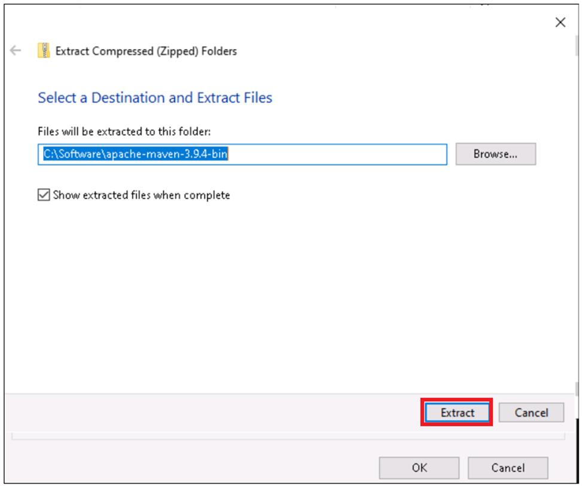

7.  Switch back to the Edit Environment variable window,
    select **MAVEN_HOME** and click on **Edit**.

    

8.  Enter the Variable value
    as +++C:\Software\apache-maven-3.9.4-bin\apache-maven-3.9.4+++ and
    then click on **OK**.

    

9.  On **Environmental Variable**s window, click on **Ok** and
    again **OK**.

    

    

10. Update **JAVA_HOME** as per lab requirements before you run the lab.

## Exercise 1: Generate the Quarkus application by using Maven

There are several ways to generate a Quarkus project structure. You can
use the Quarkus web interface, an IDE plugin, or the Quarkus Maven
plugin. Let's use the Maven plugin to generate the project structure.

You generate your application with several dependencies:

- The rest easy dependency to expose a REST endpoint

- The jackson dependency to serialize and deserialize JSON

- The hibernate dependency to interact with the database

- The Postgresql dependency to connect to the PostgreSQL database

- The Docker dependency to build a Docker image

You don't need to specify Azure dependencies because you run your
application locally first and then deploy a containerized version of it
to Azure Container Apps.

### Task 1 : Generate the Quarkus application

1.  Open **Git Bash** from the Windows start menu and runthe  below command


    +++mvn -U io.quarkus:quarkus-maven-plugin:3.7.3:create -DplatformVersion=3.7.3 -DprojectGroupId=com.example.demo -DprojectArtifactId=todo -DclassName="com.example.demo.TodoResource" -Dpath="/api/todos" -DjavaVersion=17 -Dextensions="resteasy-jackson, hibernate-orm-panache, jdbc-postgresql, docker"+++

    

2.  This command creates a new Quarkus project. It generates a Maven
    directory structure (src/main/java for source code and src/test/java
    for tests). It creates some Java classes, some tests, and some
    Dockerfiles. It also generates a *pom.xml* file with all the needed
    dependencies (Hibernate, RESTEasy, Jackson, PostgreSQL, and Docker):

3.  Click on Search and type `IntelliJ IDE` and then select **IntelliJ IDE**

    

4.  Select the confirmation check box and then click on **Continue** button.

    

5.  Close the Data sharing window.

    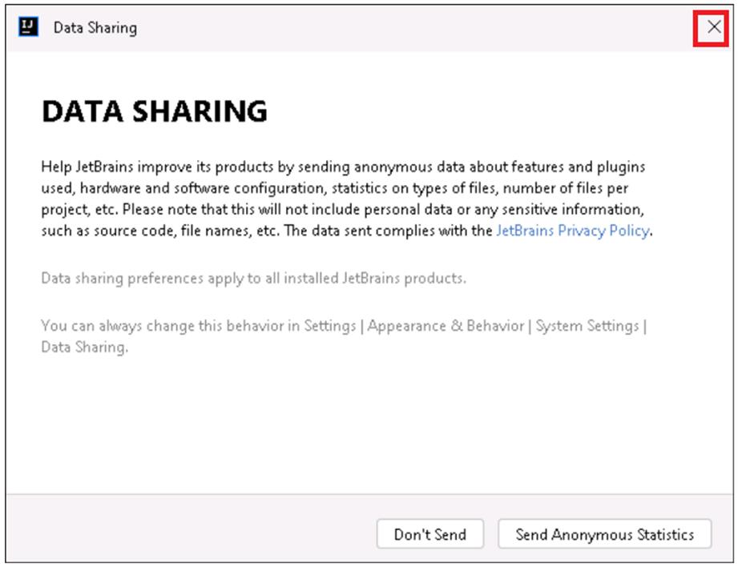

6.  Select the **Start trial** radio button and then click on
    the **Start trial** button.

    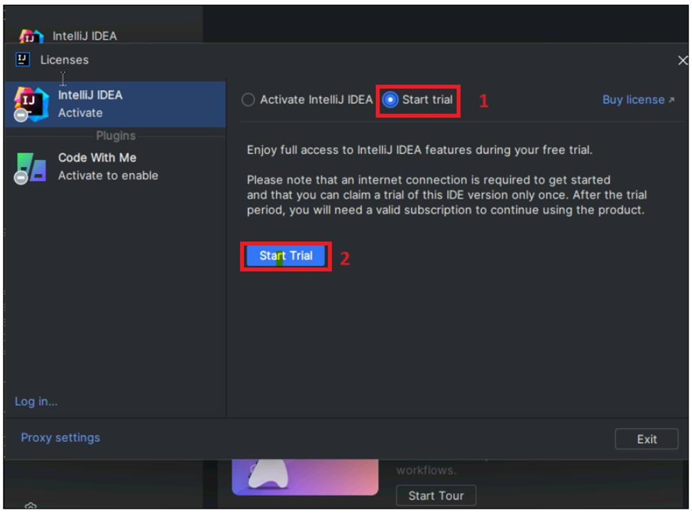

7.  Click on the **Allow access** button.

    

8.  Close the browser, switch back to IntelliJ license window and click
    on the **Continue** button.

    

9.  Click on **Open** folder.

    

10. Browse to **C:\Users\Admin\todo** and select **todo** project folder
    and then click on **OK**.

    

11. Click on the **Trust project** button.

    

12. Open **pom.xml** and you should see below xml format.

**Note** All the dependencies in the *pom.xml* file are defined in the Quarkus BOM (bill of materials) io.quarkus.platform:quarkus-bom.


### Task 2 : Code the application

1.  Go to **src/main/java/com.example.demo** and right-click on **MyEntity.Java -> Refactor -> Rename**.

    

2.  Rename the generated **MyEntity.java** class to `Todo` (located in the same folder as the *TodoResource.java* file)

    

3.  Replace the existing code with the following Java code. It uses Java Persistence API (jakarta.persistence.\* package) to store and
    retrieve data from your PostgreSQL server. It also uses [Hibernate ORM with Panache]{.underline} (inheriting from
    io.quarkus.hibernate.orm.panache.PanacheEntity) to simplify the persistence layer.

4.  You use a JPA entity (@Entity) to map the Java Todo object directly to the PostgreSQL Todo table. The TodoResource REST endpoint then
    creates and persists a new Todo entity class. This class is a domain model that\\'s mapped on the Todo table. JPA automatically creates 
    the table.

5.  Extending PanacheEntity gets you several generic create, read,update, and delete (CRUD) methods for your type. So you can do
    things like saving and deleting Todo objects in just one line of Java code.

6.  Set up JDK in IntelliJ if it was not already set.

    

7.  Replace the existing code with the following Java code to the Todo entity:

    ```
    package com.example.demo;
    
    import io.quarkus.hibernate.orm.panache.PanacheEntity;
    
    import jakarta.persistence.Entity;
    import java.time.Instant;
    
    @Entity
    public class Todo extends PanacheEntity {
    
        public String description;
    
        public String details;
    
        public boolean done;
    
        public Instant createdAt = Instant.now();
    
        @Override
        public String toString() {
            return "Todo{" +
                    "id=" + id + '\'' +
                    ", description='" + description + '\'' +
                    ", details='" + details + '\'' +
                    ", done=" + done +
                    ", createdAt=" + createdAt +
                    '}';
        }
    }
    ```

    

8.  To manage that class, update the **TodoResource** so that it can
    publish REST interfaces to store and retrieve data by using HTTP.
    Open the **TodoResource** class and replace the code with the
    following:

```
package com.example.demo;
import jakarta.inject.Inject;
import jakarta.transaction.Transactional;
import jakarta.ws.rs.Consumes;
import jakarta.ws.rs.GET;
import jakarta.ws.rs.POST;
import jakarta.ws.rs.Path;
import jakarta.ws.rs.Produces;
import static jakarta.ws.rs.core.MediaType.APPLICATION_JSON;
import jakarta.ws.rs.core.Response;
import jakarta.ws.rs.core.UriBuilder;
import jakarta.ws.rs.core.UriInfo;
import org.jboss.logging.Logger;
import java.util.List;
@Path("/api/todos")
@Consumes(APPLICATION_JSON)
@Produces(APPLICATION_JSON)
public class TodoResource {
    @Inject
    Logger logger;

    @Inject
    UriInfo uriInfo;
    @POST
    @Transactional
    public Response createTodo(Todo todo) {
        logger.info("Creating todo: " + todo);
        Todo.persist(todo);
        UriBuilder uriBuilder = uriInfo.getAbsolutePathBuilder().path(todo.id.toString());
        return Response.created(uriBuilder.build()).entity(todo).build();
    }
    @GET
    public List<Todo> getTodos() {
        logger.info("Getting all todos");
        return Todo.listAll();
    }
}
```
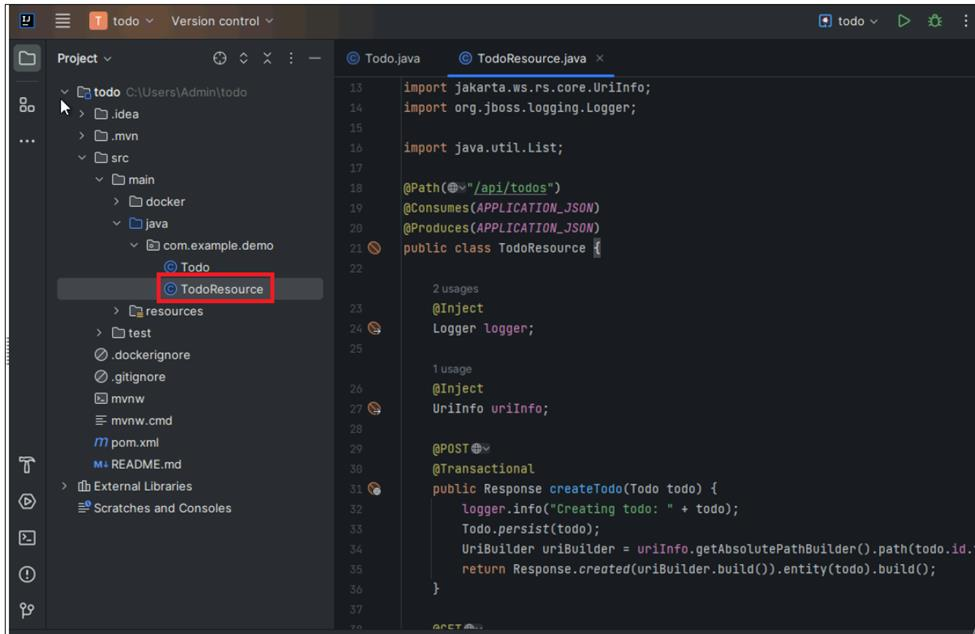

### **Task 3 : Run the application**

When you run the application in development mode, Docker Desktop needs
to be running. That's because Quarkus detects that you need a PostgreSQL
database (because of the PostgreSQL dependency quarkus-jdbc-postgresql
declared in the *pom.xml* file), downloads the PostgreSQL Docker Desktop
image, and starts a container with the database. It then automatically
creates the Todo table in the database.

1.  Double-click on **Docker Desktop** and minimize the window. Make sure it’s running. (no need to Sign in )

    

2. Open the Command prompt as Administrator and run +++netstat -ano | findstr :8080+++ to know the process running on port 8080.

3. if any process running on port 8080 then kill it by running the command +++taskkill /PID XXXX /F+++ (replace XXXX with your process ID+

4.  Go back to Gitbash and run the to-do application by using this command:

    +++cd todo+++

    +++./mvnw quarkus:dev+++
  
    

6.  The Quarkus application should start and connect to your database.
    You should see the following output:

    

    

    

    

7.  Click on **Allow access**.

    

8.  To test the application, you can use cURL.In a separate new instance of Gitbash , create a new to-do item in the
database with the following command. You should see the log in the Quarkus console:

    +++curl --header "Content-Type: application/json" --request POST  --data '{"description":"Take Quarkus MS Learn","details":"Take the MS Learn on deploying Quarkus to Azure Container Apps","done": "true"}'   http://127.0.0.1:8080/api/todos+++

    

7.  This command should return the created item (with an identifier):

    

8.  Create a second to-do by using the following cURL command:

    +++curl --header "Content-Type: application/json" --request POST --data '{"description":"Take Azure Container Apps MS Learn","details":"Take the ACA Learn module","done": "false"}' http://127.0.0.1:8080/api/todos+++

    

9.  Next, retrieve the data by using a new cURL request:

    +++curl http://127.0.0.1:8080/api/todos+++

This command returns the list of to-do items, including the items you created:


### Task 4 : Test the application

To test the application, you can use the
existing **TodoResourceTest** class. It needs to test the REST endpoint.
To test the endpoint, it uses \[RESTAssured\]{.underline}.

1.  Switch back to Intellij and open **TodoResourceTest** class
    from **src/test/java/com.example.demo**. Replace code in
    the **TodoResourceTest** class with the following code:

    ```
    package com.example.demo;
    
    import io.quarkus.test.junit.QuarkusTest;
    import static io.restassured.RestAssured.given;
    import static jakarta.ws.rs.core.HttpHeaders.CONTENT_TYPE;
    import static jakarta.ws.rs.core.MediaType.APPLICATION_JSON;
    import org.junit.jupiter.api.Test;
    @QuarkusTest
    class TodoResourceTest {
      @Test
        void shouldGetAllTodos() {
            given()
                    .when().get("/api/todos")
                    .then()
                    .statusCode(200);
        }
       @Test
        void shouldCreateATodo() {
            Todo todo = new Todo();
            todo.description = "Take Quarkus MS Learn";
            todo.details = "Take the MS Learn on deploying Quarkus to Azure Container Apps";
            todo.done = true;
    
            given().body(todo)
                    .header(CONTENT_TYPE, APPLICATION_JSON)
                    .when().post("/api/todos")
                    .then()
                    .statusCode(201);
        }
    }
    ```
    

2.  When you test the application, Docker Desktop needs to be running
    because Quarkus detects that it needs the PostgreSQL database for
    testing.

3.  Switch back to the 1st instance of **Gitbash** and Ctrl + C. Run the below commands to test the application by using this command:

    +++./mvnw clean test+++
    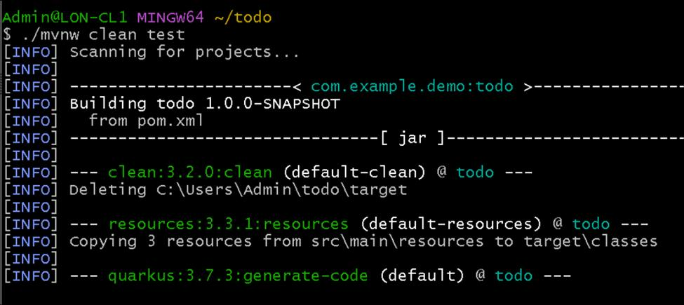

You should see output that looks similar to this:
    

## Exercise 2 - Set up Azure Container Apps

In this Exercise, you create an Azure resource group that contains the resources for the application. You then set up the PostgreSQL database
by using the Azure CLI. Finally, you configure the Quarkus application to access the remote PostgreSQL database. Use a terminal of your choice
to run the commands.

## Task 1 : Prepare the working environment

You need to set up some environment variables. Here are some notes about the variables you'll create:

|||
|--|--|
|Variable|Description|
|AZ_PROJECT|The name of the project. To keep this value unique, we recommend that you use AZ_PROJECT_.|
|AZ_RESOURCE_GROUP|The name of the resource group that holds the resources.|
|AZ_LOCATION|The Azure region. We recommend that you use a region that's close to where you live. To see the list of available regions, enter az account list-locations at a command prompt.|
|AZ_CONTAINERAPP|The name of the Azure Container Apps instance that holds the containers.|
|AZ_CONTAINERAPP_ENV|The name of the Azure Container Apps environment.|
|AZ_POSTGRES_SERVER_NAME|The name of your PostgreSQL server. Nonalphanumeric characters aren't allowed: -, _, !, $, #, %. The name should be unique across Azure. Be sure to use a unique identifier.|
|AZ_POSTGRES_DB_NAME|The PostgreSQL database name. The default name of the PostgreSQL database is postgres.|
|AZ_POSTGRES_USERNAME|The default admin user name for your PostgreSQL database server.|
|AZ_POSTGRES_PASSWORD|The default password for your PostgreSQL database server. Use a secure password.|

**Note:** You can name your Azure resources in any way that you want.This article provides example abbreviations for many Azure resources
(for example, rg for resource groups and ca for container apps).

1.  Use the following commands to set up the variables. Be sure to  modify the values as described in the preceding table. These
    environment variables are used throughout the rest of this module.

    **Note:** PostgreSQL is supported only in **Westus** . Try in westus location first and if you have any issues then try in a location 
     near to you

    +++export AZ_PROJECT_Quarkus="azure-deploy-quarkus-"$RANDOM+++
    
    +++export AZ_CONTAINERAPP="ca${AZ_PROJECT_Quarkus}"+++
    
    +++export AZ_CONTAINERAPP_ENV="cae${AZ_PROJECT_Quarkus}"+++
    
    +++export AZ_POSTGRES_DB_NAME="postgres${AZ_PROJECT_Quarkus}"+++
    
    +++export AZ_POSTGRES_USERNAME="azuser123"+++
    
    +++export AZ_POSTGRES_PASSWORD="P@55w.rd12345"+++
    
    +++export AZ_POSTGRES_SERVER_NAME="psql${AZ_PROJECT_Quarkus}"+++
    
    

2.  Switch back to Gitbash and run the below command to set the resource group variable. Update the location and run the command.
    
    +++export AZ_RESOURCE_GROUP=@lab.CloudResourceGroup(ResourceGroup1).Name+++

    +++export AZ_LOCATION="Location near to you"+++

    

    

3.  Run +++az login+++ It opens the default browser to sign in. Sign in with your Azure subscription account.

    

### Task 2 : Create an instance of Azure Database for PostgreSQL

1.  You'll now create a managed PostgreSQL server. Run the following command to create a small instance of Azure Database for PostgreSQL.This command takes 5-8 minutes to createthe  resource.Wait until the command runs successfully to move to the next step.

    +++az postgres flexible-server create --resource-group "$AZ_RESOURCE_GROUP" --location "$AZ_LOCATION" --name "$AZ_POSTGRES_SERVER_NAME" --database-name "$AZ_POSTGRES_DB_NAME" --admin-user "$AZ_POSTGRES_USERNAME" --admin-password "$AZ_POSTGRES_PASSWORD" --public-access "All" --tier "Burstable" --sku-name "Standard_B1ms" --storage-size 32 --version "16"+++

    

2.  This command creates a small PostgreSQL server that uses the variables that you set up earlier.

    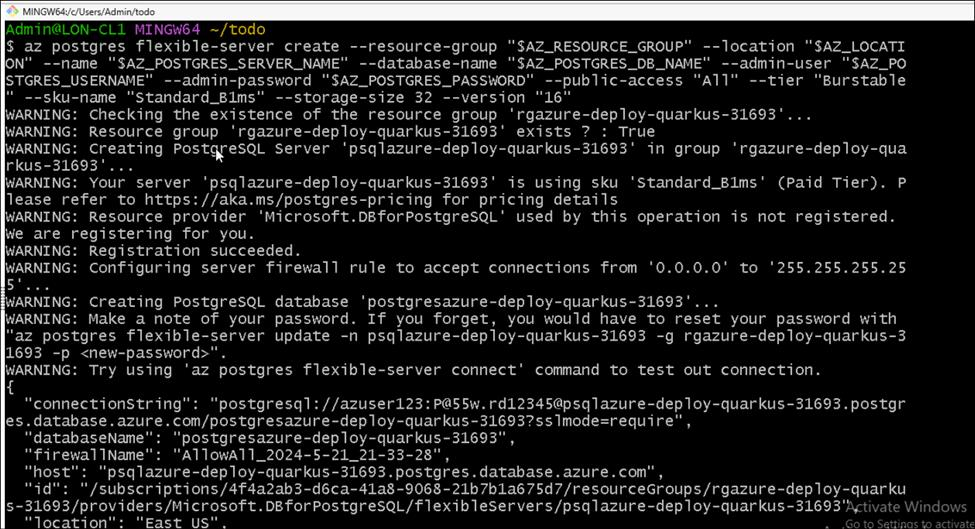

### Task 3 : Configure Quarkus to access the PostgreSQL database

1.  You'll now connect the Quarkus application to the PostgreSQL database. To do so, you first need to obtain the connection string
    for the database:

2.  Run the below command to obtain the connection string for the database.

   +++export POSTGRES_CONNECTION_STRING=$(az postgres flexible-server show-connection-string --server-name "$AZ_POSTGRES_SERVER_NAME" --database-name "$AZ_POSTGRES_DB_NAME" --admin-user "$AZ_POSTGRES_USERNAME" --admin-password "$AZ_POSTGRES_PASSWORD" --query "connectionStrings.jdbc" --output tsv)+++

    +++export POSTGRES_CONNECTION_STRING_SSL="$POSTGRES_CONNECTION_STRING&ssl=true&sslmode=require"+++

    +++echo "POSTGRES_CONNECTION_STRING_SSL=$POSTGRES_CONNECTION_STRING_SSL"+++

    
    
4.  Note the connection string that's returned.

    

### Task 4 :Configure the Quarkus application to connect to the PostgreSQL database

1.  Switch back to Intellij IDE. Update the **application.properties** file in the **src/main/resources** folder of the project to configure the connection string to the PostgreSQL database.

    

2.  Set the **quarkus.datasource.jdbc.url** property to the previously output **\\$POSTGRES_CONNECTION_STRING_SSL** value.
    The **&ssl=true&sslmode=require** part of the connection string forces the driver to use SSL, a requirement for Azure Database for
    PostgreSQL.

    ```
    quarkus.hibernate-orm.database.generation=update
    quarkus.datasource.jdbc.url=<the POSTGRES_CONNECTION_STRING_SSL value>
    ```
    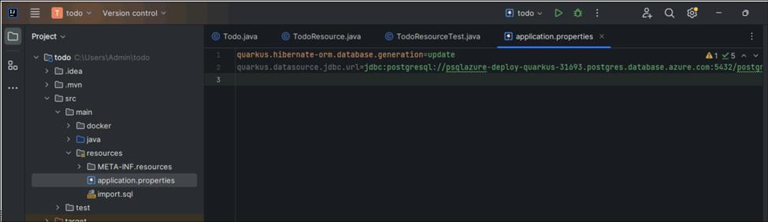

### Task 5 : Run the Quarkus application locally to test the remote database connection

1.  Switch back to Gitbash and run the below command to run the application locally:

    +++./mvnw clean quarkus:dev+++

    
    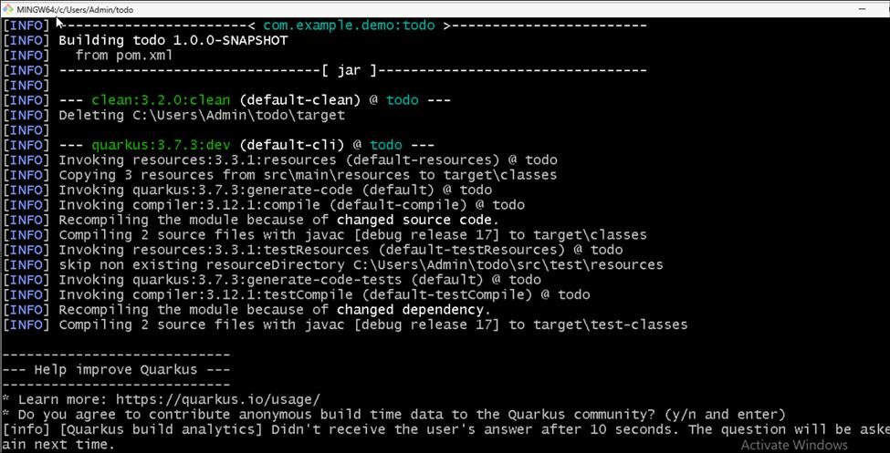
    

2.  When Quarkus is running, create a few to-dos by using the following cURL commands in a separate terminal window:

    +++curl --header "Content-Type: application/json" --request POST --data '{"description":"Take Quarkus MS Learn","details":"Take the MS Learn on deploying Quarkus to Azure Container Apps","done": "true"}' http://127.0.0.1:8080/api/todos+++

    

    +++curl --header "Content-Type: application/json" --request POST --data '{"description":"Take Azure Container Apps MS Learn","details":"Take the ACA Learn module","done": "false"}' http://127.0.0.1:8080/api/todos+++

3.  Next, check that the to-dos are in the database by accessing the GET endpoint that's defined in the to-do app:

    +++curl http://127.0.0.1:8080/api/todos+++

    You should see the following output:

    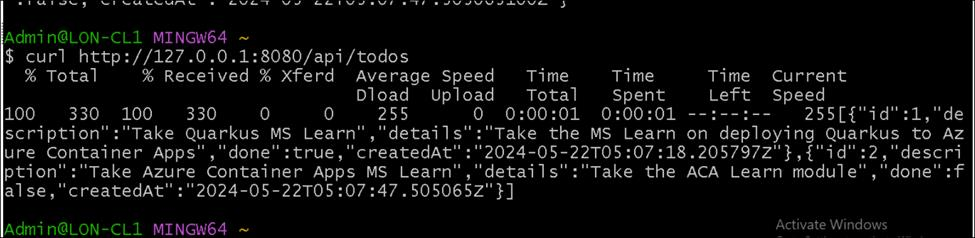 

If you see this output, you have successfully run the Quarkus application and connected to the remote PostgreSQL database.

## Exercise 3 : Deploy a Quarkus application to Azure Container Apps

In this exercise, you create the Azure Container Apps environment by using the Azure CLI.

### Task 1 : Set up the Dockerfile for the Quarkus application

1.  Container Apps is used to deploy containerized applications. So you first need to containerize the Quarkus application into a Docker
    image. This process is easy because the Quarkus Maven plugin has already generated some Dockerfiles under **src/main/docker**.

    

2.  Switch back to Gitbash and press Ctrl+C .Run the below command to rename one of   these **Dockerfiles, *Dockerfile.jvm*,** to ***Dockerfile*** and move it to the root folder:

    +++mv src/main/docker/Dockerfile.jvm ./Dockerfile+++

    

    

3.  Replace the content after the long comment in the **Dockerfile** with the following i.e at Line \# 80

    ```
    FROM registry.access.redhat.com/ubi8/openjdk-17:1.18
    
    ENV LANGUAGE='en_US:en'
    # We make four distinct layers so if there are application changes the library layers can be re-used
    COPY --chown=185 target/quarkus-app/lib/ /deployments/lib/
    COPY --chown=185 target/quarkus-app/*.jar /deployments/
    COPY --chown=185 target/quarkus-app/app/ /deployments/app/
    COPY --chown=185 target/quarkus-app/quarkus/ /deployments/quarkus/
    
    EXPOSE 8080
    USER 185
    ENV JAVA_OPTS_APPEND="-Dquarkus.http.host=0.0.0.0 -Djava.util.logging.manager=org.jboss.logmanager.LogManager"
    ENV JAVA_APP_JAR="/deployments/quarkus-run.jar"
    
    ENTRYPOINT [ "/opt/jboss/container/java/run/run-java.sh" ]
    ```
    

4.  This Dockerfile expects the Quarkus application to be packaged as a ***quarkus-run.jar* file**. This name is the default name for the
    Quarkus application when it\\'s packaged as a JAR file. You need to make sure that the Quarkus application is packaged as a JAR file. To
    do so, run the following Maven command:

    +++./mvnw package+++

    

    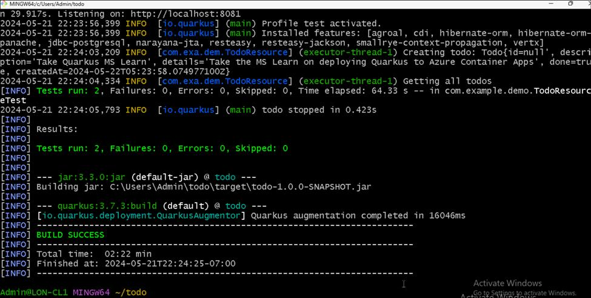

5.  This command packages the Quarkus application into a JAR file and generates a ***quarkus-run.jar*** file in
    the ***target/quarkus-app*** folder.

    

### Task 2 : Create the Container Apps environment and deploy the container

1.  Now that the Dockerfile is in the right location, you can create the Container Apps environment and deploy the container by using a
    single Azure CLI command. Run the following command at the root of the project:

    +++az containerapp up --name "$AZ_CONTAINERAPP" --environment "$AZ_CONTAINERAPP_ENV" --location "$AZ_LOCATION" --resource-group "$AZ_RESOURCE_GROUP" --ingress external --target-port 8080 --source .+++

    
    
    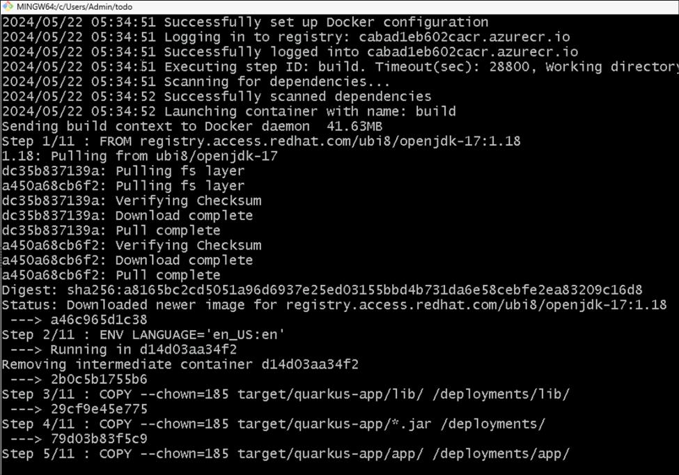
    

2.  This command does several things:

    - Creates a Container Apps environment if it doesn\\'t exist

    - Creates an Azure registry if it doesn\\'t exist

    - Creates a Log Analytics workspace if it doesn\\'t exist

    - Builds the Docker image and pushes it to the Azure registry

    - Deploy the Docker image to the Container Apps environment

    The az containerapp up command takes some time to run. You should see output that's similar to the following:

    

### Task 3: Validate the deployment

You can validate that the deployment has succeeded in several ways. The easiest way is to search for your resource group on the Azure portal.
You should see resources similar to the following:

1.  Open a browser go to ``https://portal.azure.com`` and sign in with your Azure subscription account. Click on the Resource Group
    tile.

    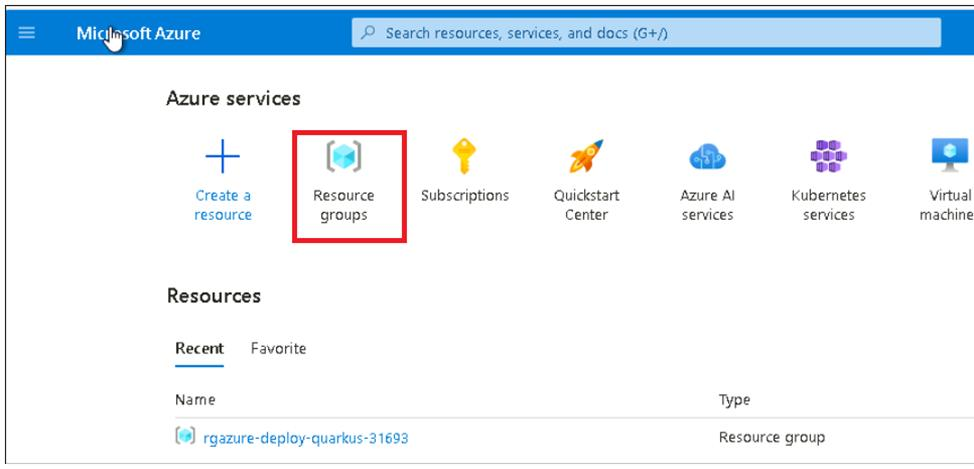

2.  Click on the resource group name.

    

    

3.  You can also check the deployment by running the following command.It lists all the resources created by the az container app up
    command.

    +++az resource list --location "$AZ_LOCATION" --resource-group "$AZ_RESOURCE_GROUP" --output table+++

    You should see output that's similar to this:

    

### Task 4: Run the deployed Quarkus application

1.  You can now run the deployed Quarkus application. First, you need to get the URL of the application.

2.  Switch back to Gitbash and run the below command to get the URL of the application.

    +++export AZ_APP_URL=$(az containerapp show  --name "$AZ_CONTAINERAPP" --resource-group "$AZ_RESOURCE_GROUP" --query "properties.configuration.ingress.fqdn"  --output tsv  )+++

    

3.  Your application is ready at https://\\\<app-name\>.azurecontainerapps.io/. Notice the https protocol. That protocol is used because the application is deployed with a TLS certificate. To test the application, you can use cURL:

    +++curl --header "Content-Type: application/json" --request POST --data '{"description":"Configuration","details":"Congratulations, you have set up your Quarkus application correctly!","done": "true"}' https://$AZ_APP_URL/api/todos+++

    

4.  Retrieve the data by using a new cURL request:

    +++curl https://$AZ_APP_URL/api/todos+++

5.  This command returns the list of all to-do items from the database:

    

6.  Switch back to the Azure portal and click on your container app name.

    

7.  Click on the application URL link. It opens the app in the browser tab.

    

    

8.  Run this command, you can stream the logs for your container when you create new to-dos:

    +++az containerapp logs show --name "$AZ_CONTAINERAPP" --resource-group "$AZ_RESOURCE_GROUP" --follow+++

    

9.  Run more cURL commands. You should see the logs scrolling in the terminal.

    +++curl https://$AZ_APP_URL/api/todos+++

    

## Exercise 4: Delete resources in the resource group

### Task 1: Delete resources.

1.  Switch back to the Azure portal. Click on **Resource groups**.

    

2.  Click on the resource group name.

    

3.  Select all resources and then click on **Delete** (Do NOT DELETE – Resource group)

    

4.  Enter ``delete`` and then click on **Delete**.

    

5.  Confirm deletion of resources.

    

**Summary**

You learned how to use Maven to bootstrap the application and an integrated development environment (IDE) to edit the code.. You learned
how to use Docker to start a local PostgreSQL database so you can run and test the application locally. You have successfully run the Quarkus
application and connected to the remote PostgreSQL database.
