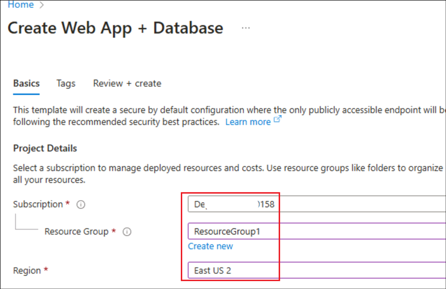

# 用例 02 - 在 Linux 和 PostgreSQL 上使用 Azure 应用服务构建水果列表 Quarkus Web 应用程序

**预计持续时间：**40 分钟

**实验类型：** 讲师指导

**目的：**

此用例演示如何在连接到 PostgreSQL 数据库的 Azure
应用服务中构建、配置和部署安全的 Quarkus 应用程序（使用 Azure Database
for PostgreSQL）。Azure 应用服务是一种高度可缩放的自修补 Web
托管服务，可以轻松地在 Windows 或 Linux 上部署应用。完成后，你将在 Linux
上的 Azure 应用服务上运行一个 Quarkus 应用。

**先决条件：**

**GitHub 帐户** -- 您应该拥有自己的 GitHub
登录凭证。如果您没有，请从此处创建一个
- +++<https://github.com/signup?user_email=&source=form-home-signup+++>

## 练习 0：了解 VM 和凭据

在此任务中，我们将识别并了解我们将在整个实验室中使用的凭证。

**1.Instructions**选项卡包含实验室指南，其中包含在整个实验室中要遵循的说明。

**2. Resources** 选项卡已获取执行实验室所需的凭证**。**

- **URL** – Azure portal的 URL

- **Subscription** – 这是分配给你的订阅的 ID

- **Username** – 登录 Azure 服务时需要使用的用户 ID。

- **Password** – Azure 登录名的密码。

让我们将此用户名和密码称为 Azure 登录凭据。我们将在提及 Azure
登录凭据的任何地方使用这些凭据。

- **Resource Group** – 分配给您的**Resource Group** 。

>[！Alert] **重要提示** 请确保在此资源组下创建所有资源

    

3.  **Help**选项卡包含 Support 信息。此处的 **ID** 值是
    将在实验室执行期间使用的实 **Lab instance** ID。

    

## 练习 1：运行示例

首先，您将设置一个示例数据驱动应用程序作为起点。我们在此处使用的示例存储库包括开发容器配置。开发容器包含开发应用程序所需的一切，包括数据库、缓存和示例应用程序所需的所有环境变量。开发容器可以在
GitHub codespace 中运行，这意味着您可以在任何具有 Web
浏览器的计算机上运行该示例。

1.  在浏览器中，登录到您的 GitHub
    帐户+++\*\*<https://github.com/login**+++> .

2.  从新选项卡打开此
    URL，+++\*\*<https://github.com/technofocus-pte/msdocs-quarkus-postgresql-sample-app**+++>.

3.  选择 **Fork -\> Create a new fork**。

    

4.  单击 Create a new fork 页面中的 **Create fork**。

    

5.  在存储库的分叉页中，选择 **Code** \> **Create codespace on main**。

    

    **注意** 如果未显示“在主 Create Codespace”选项上，请单击 “Codespaces”
旁边的 +symbol 。

    

**注意** codespace 创建大约需要 10 分钟才能完成设置。

    

6.  在终端中执行 +++mvn quarkus:dev+++。点击 **Allow ** 在弹出窗口中。

    

    

7.  当您看到通知 **Your application running on port 8080** is
    available时，请选择 **Open in
    Browser**。您应该会在新的浏览器选项卡中看到示例应用程序。

如果您看到 端口 **5005** 的**notification**，请**skip**它。

    

    

8.  要停止 Quarkus 开发服务器， 请在 Codespace 终端中键入 **Ctrl+C**。

    

## 练习 2：创建应用服务和 PostgreSQL

首先，创建 Azure
资源。本实验中使用的步骤创建一组默认安全资源，其中包括应用服务和 Azure
Database for PostgreSQL。

1.  在 +++[https://portal.azure.com/+++ 打开 Azure
    门户](https://portal.azure.com/+++%20%20打开%20%20Azure%20门户)，然后从
    VM 的**Resources**选项卡中使用 Azure **login** 凭据登录。

    

2.  选择 **Cancel** 或 Welcome 页面中的 close 按钮。

    

3.  在 Azure 门户顶部的搜索栏中输入 +++**web app database**+++。在
    **Marketplace** 标题下选择标记为 **Web App + Database** **的项目**。

    

4.  在**Create Web App +
    Database**中，填写以下详细信息，然后选择**Review + create** 

    | **财产**   |  **价值**  |
    |:-------|:-------|
    |  订阅  |  选择您的**assigned subscription** |
    | 资源组   |  选择您的**assigned Resource group**  |
    |  地区  |  选择  @lab.CloudResourceGroup(ResourceGroup1).Location  |
    | **Web App Details**   |    |
    | 名字   |  进入 +++quarkuwebapp@lab.LabInstance.Id+++  |
    | 运行时堆栈  |  **Java 17**  |
    |  **Database**  |    |
    |  Engine  |  选择 **PostgreSQL – Flexible Server**  |
    |  托管计划  |  选择 **Basic**  |

    

    

7.  验证通过后，单击 **Create**。

    

    **注意：**应用程序创建大约需要 15 分钟。

8.  部署完成后，单击 **Go to resource**。

    

9.  您将直接转到 **App ServicePage。** 点击 左上角的Home 。

    

10. 单击 Portal 菜单，然后从中选择 **Resource Groups**。

    

11. 选择分配给您的 Resource
    group（资源组），并查看以下资源是从我们刚刚执行的部署中创建的。

    - App Service plan
    
    - App Service
    
    - Virtual network
    
    - Azure Database for PostgreSQL flexible server
    
    - Private DNS zone

    

## 练习 3：验证连接设置

创建向导已为您生成连接变量作为应用程序设置。在此步骤中，您将了解在何处查找应用程序设置，以及如何创建自己的应用程序设置。

1.  从 **Resource group** 中的资源列表中单击 App Service。

2.  在“应用服务”页的左侧菜单中，选择Settings下的Environment variables 。

3.  在 **Environment variables**页面的 **App
    settings**选项卡中，验证是否存在**AZURE_POSTGRESQL_CONNECTIONSTRING**。它在运行时作为环境变量注入。

4.  选择 **+ Add**。

5.  将设置命名为 +++**PORT**+++，并将其值设置为 +++**8080**+++，这是
    Quarkus 应用程序的默认端口。选择 **Apply**。

6.  选择 **Apply**。

7.  选择 **Confirm**。

8.  您将收到一条通知，指出应用程序设置已更新。

## 练习 4：部署示例代码

在此步骤中，您将使用 GitHub Actions 配置 GitHub
部署。这只是部署到应用服务的众多方法之一，也是在部署过程中进行持续集成的好方法。默认情况下，每次
git 推送到 GitHub 存储库都会启动 build 和 deploy作。

1.  在 App Service 页面的左侧菜单中，选择 **Deployment** 下的
    **Deployment Center**。

2.  在 Source中，选择 **GitHub** 。默认情况下，GitHub Actions
    被选为构建提供商。

3.  单击 **Authorize** 并登录到您的 GitHub 帐户，然后按照提示授权
    Azure。

4.  按如下方式填写详细信息，将其余部分保留为默认值，然后单击 **Save** 。

[TABLE]

5.  

6.  单击**Save**后 ，应用服务会将工作流文件提交到所选 GitHub 存储库的
    .github/workflows 目录中。

7.  返回示例分叉的 GitHub codespace，运行 +++**git pull origin
    main**+++。这会将新提交的工作流程文件提取到您的代码空间中。

\[！注意\] **注意：**如果发现测试用例仍在终端中运行，可以按
Ctrl+C，然后执行上述命令。

7\. 在资源管理器中打开
**src/main/resources/application.properties**。Quarkus 使用此文件加载
Java 属性。

8\. 找到代码（第 10-11 行）。此代码将 生产变量
**%prod.quarkus.datasource.jdbc.url** 设置为您的创建向导的 app
设置。**quarkus.package.type** 被设置为构建一个 Uber-Jar，你需要在 App
Service 中运行它。

9.  在资源管理器中打开 **.github/workflows/main_quarkuwebapp\[lab
    instance id\].yml**。此文件由应用服务创建向导创建。

10. 在“使用 Maven 构建”步骤下，将 Maven 命令更改为 +++**mvn clean
    install -DskipTests**+++。

**-DskipTests** 跳过 Quarkus 项目中的测试，以避免 GitHub
工作流过早失败。

11. 选择 **Source Control** 扩展。

12. 在文本框中，键入提交消息，例如 +++**Configure DB and deployment
    workflow**+++。选择 **Commit**，然后单击 **Yes**进行确认。

13. 选择 **Sync changes 1**，然后单击 **OK**进行确认。

14. 返回到 Azure
    门户的“部署中心”页，选择**Logs**。新的部署运行已从您提交的更改开始。

15. 在部署运行的日志项中，选择 具有最新时间戳的 **Build/Deploy Logs**
    条目。

16. 您将转到 GitHub 存储库，并看到
    GitHub作正在运行。工作流程文件定义了两个单独的阶段：build 和
    deploy。等待 GitHub 运行显示 Complete状态。大约需要 5 分钟。

## 练习 5：浏览至应用程序

1.  在 Azure 门户
    （+++[https://portal.azure.com+++](https://portal.azure.com+++/)）
    中，打开资源组 **ResourceGroup1** 并选择**App Service**资源。

2.  从左侧菜单中，选择 **Overview** 并在 **Default domain**
    下选择应用程序的 URL。

3.  将复制的 URL 粘贴到新浏览器中以打开应用程序。

4.  在列表中添加一些水果。现在，你正在 Azure 应用服务中运行 Web
    应用，并与 Azure Database for PostgreSQL 建立安全连接。

## 练习 6：流式传输诊断日志

Azure
应用服务捕获输出到控制台的所有消息，以帮助你诊断应用程序的问题。示例应用程序包含标准
JBoss 日志记录语句来演示此功能，如下所示。

1.  在 Azure portal App
    Service页的左侧菜单中，选择** Monitoring**下的** App Service
    logs**。

2.  在 **Application logging**下，选择 **File
    System**。在顶部菜单中，选择 **Save**。

3.  从左侧菜单中，选择 **Log
    stream**。您可以看到应用程序的日志，包括平台日志和来自容器内部的日志。

## 练习 7：清理资源

1.  在 Azure 门户主页中，选择Resource groups。

2.  选择 **NetworkWatcherRG**，然后单击 **Delete resource group**。

3.  在文本框中键入 +++NetworkWatcherRG+++，然后单击 **Delete**。

4.  接下来，从 Resource group 页面中，选择您分配的 Resource group。

5.  选择所有 **resources**，然后选择 **Delete**。

6.  在文本框中输入 +++**delete**+++，然后单击 **Delete**。

7.  已删除资源上的成功通知确认删除。

8.  返回 GitHub 工作区，单击 **Code** 旁边的下拉菜单，选择 codespace
    名称旁边的三个点，然后单击 **Delete**。

**总结：**

我们已经学习了在 Azure 应用服务中部署安全的 Quarkus 应用程序，将其连接到
PostgreSQL 数据库，以从应用程序的 UI 添加水果名称。
