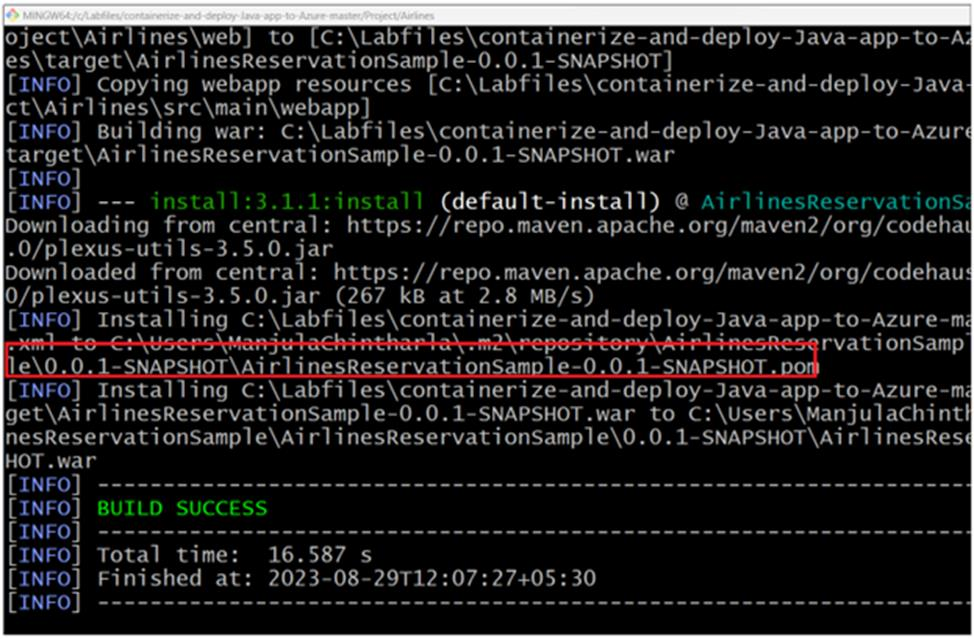
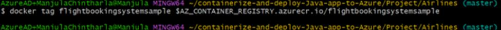
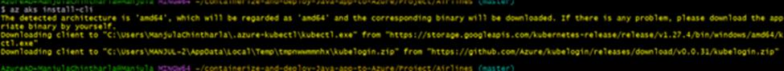
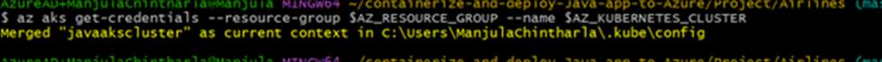

# Caso de uso 03 - **Containerização de um aplicativo de reserva de voos e implementação no Azure Kubernetes Service**

**Objetivo** :

Ao final deste módulo, você será capaz de:

- Containerizar um aplicativo Java.

- Criar uma imagem de contêiner para o aplicativo Java.

- Executar a imagem de contêiner localmente.

- Enviar a imagem de contêiner para o Azure Container Registry.

Implementar a imagem do contêiner no Azure Kubernetes Service

**Principais tecnologias utilizadas** -- Java 11, Docker, Maven

**Duração estimada** : 30 min

**Tipo de laboratório:** conduzido por instrutor

## Exercício 1: Configurar seu ambiente do Azure

Neste exercício, você usará a Azure CLI para criar os recursos do Azure
que serão necessários nas próximas unidades. Usando a Azure CLI, execute
as seguintes etapas:

### Tarefa 1: Autenticar com o Azure Resource Manager

1.  Abra o Gitbash no Desktop e execute o comando abaixo para fazer
    login no portal do Azure

**\`\` login az\`\`**

**Observação** : Se você visualizar um AVISO: A web browser has been
opened at
https://login.microsoftonline.com/organizations/oauth2/v2.0/authorize.
Please continue the login in the web browser. If no web browser is
available or if the web browser fails to open, use device code flow
with az login --use-device-code.

2.  Este comando levará você ao navegador padrão para efetuar login.
    Faça login com sua conta de assinatura do Azure.

3.  Uma vez autenticado, volte para o Gitbash

4.  Agora vamos habilitar nossa assinatura do Azure e executar o comando
    abaixo

\`\`az account set --subscription "\< YOUR_SUBSCRIPTION_ID \>"\`\`

\`\` az account list --output table\`\`

5.  Definir variáveis locais Para simplificar os comandos que serão
    executados mais adiante, configure as seguintes variáveis de
    ambiente

**Observação**: já criamos um grupo de recursos para mim na nuvem. Você
precisa implementar todos os recursos dentro do grupo de recursos
existente. Você pode fazer isso no seu portal do Azure ou encontrá-lo na
aba Resources da sua VM.

> exportar AZ_CONTAINER_REGISTRY=" javaaksregist "$RANDOM
>
> exportar AZ_KUBERNETES_CLUSTER=" javaakscluster "$RANDOM
>
> exportar AZ_LOCATION=" westus "

exportar AZ_KUBERNETES_CLUSTER_DNS_PREFIX=" javaakscontainer "

> export AZ_RESOURCE_GROUP= Your existing resource group name 

**Observação:** você deve substituir pela região de sua escolha, por
exemplo: eastus Você deve substituir por um valor exclusivo, pois ele é
usado para gerar um FQDN (fully qualified domain name) exclusivo para
seu Azure Container Registry quando ele for criado, por exemplo:
someuniquevaluejavacontainerregistry.

8.  O Azure Container Registry permite que você crie, armazene e
    gerencie imagens de contêiner, que é onde a imagem de contêiner do
    aplicativo Java será armazenada. Crie um Azure Container Registry
    com os seguintes comandos.

\`\` az acr create --resource-group $AZ_RESOURCE_GROUP --name
$AZ_CONTAINER_REGISTRY -- sku Básico | jq \`\`

9.  Configure o Azure CLI para usar este Azure Container Registry
    recém-criado

\`\` az configure --defaults acr =$AZ_CONTAINER_REGISTRY\`\`

10. Autenticar no Azure Container Registry recém-criado

\`\` az acr login -n $AZ_CONTAINER_REGISTRY\`\`

11. Crie um cluster do Azure Kubernetes. Você precisará de um cluster do
    Azure Kubernetes para implementar o aplicativo Java (imagem de
    contêiner).

az aks create --resource-group $AZ_RESOURCE_GROUP --name
$AZ_KUBERNETES_CLUSTER --attach-acr $AZ_CONTAINER_REGISTRY
--dns-name-prefix=$AZ_KUBERNETES_CLUSTER_DNS_PREFIX --generate-ssh-keys
| jq

**Observação:** a criação do cluster do Azure Kubernetes pode levar até
10 minutos. Depois de executar o comando acima, você pode,
opcionalmente, deixá-lo continuar na guia da Azure CLI e passar para a
próxima unidade.

### Tarefa 2: Executar o Docker

1.  No menu Iniciar, clique em **DockerDesktop**

2.  Certifique-se de que ele esteja funcionando.

## Exercício 2: Conteinerizar um aplicativo Java

Neste exercício, você irá containerizar uma aplicação Java.

### Tarefa 1: Criar aplicativo Java

Primeiro, você navegará até o repositório Flight Booking System for
Airline Reservations e usará o cd para acessar a pasta do projeto da
aplicação web Airlines.

Opcionalmente, se você tiver Java e Maven instalados, pode executar o(s)
seguinte(s) comando(s) na sua CLI para ter uma ideia da experiência de
construção do aplicativo sem o Docker. Se não tiver Java e Maven
instalados, pode pular com segurança para a próxima seção intitulada
"Construct a Docker file". Nessa seção, você usará o Docker para baixar
Java e Maven para executar as compilações em seu nome.

1.  Execute o seguinte comando na sua CLI para navegar até o projeto.

\`\`cd
"C:\Labfiles\containerize-and-deploy-Java-app-to-Azure-master\Project\Airlines"\`\`

2.  Execute o seguinte comando na sua CLI

\`\`mvn clean install\`\`

**Observação:** O comando mvn clean install foi usado para ilustrar os
desafios operacionais de não usar compilações multiestágio do Docker,
que abordaremos a seguir. Novamente , esta etapa é opcional; de qualquer
forma, você pode prosseguir com segurança sem executar o comando Maven.

3.  O Maven deve ter compilado com sucesso o artefato
    FlightBookingSystemSample-0.0.-SNAPSHOT.war do Arquivo de
    Aplicativos da Web do Flight Booking System for Airline
    Reservations, conforme visto na imagem a seguir.

## Tarefa 2: Criar um arquivo Docker

1.  Na raiz do seu projeto,
    containerize-and-deploy-Java-app-to-Azure/Project/Airlines, crie um
    arquivo chamado **Dockerfile .**

\`\`vi Dockerfile \`\`

Adicione o seguinte conteúdo ao Dockerfile, em seguida salve e saia

\#

\# Build stage

\#

FROM maven:3.6.0-jdk-11-slim AS build

WORKDIR /build

COPY pom.xml .

COPY src ./src

COPY web ./web

RUN mvn clean package

\#

\# Package stage

\#

FROM tomcat:8.5.72-jre11-openjdk-slim

COPY tomcat-users.xml /usr/local/tomcat/conf

COPY --from=build /build/target/\*.war
/usr/local/tomcat/webapps/FlightBookingSystemSample.war

EXPOSE 8080

CMD \["catalina.sh", "run"\]

**Observação:** Opcionalmente, o Dockerfile_Solution na raiz do seu
projeto contém o conteúdo necessário. Como você pode ver, este estágio
de construção do arquivo Docker tem seis instruções.

## Exercício 3: Criar e executar uma imagem de contêiner para o aplicativo Java

Nesta unidade, você criará e executará a imagem do contêiner. Como
mencionado anteriormente, uma instância em execução de uma imagem é um
contêiner.

### Tarefa 1: Criar uma imagem de contêiner

Agora que você criou com sucesso um Dockerfile, pode instruir o Docker a
criar uma imagem de container para você.

**Observação:** Certifique-se de que o seu Docker esteja configurado
para criar containers Linux. Isso é importante, pois o Dockerfile
utilizado faz referência a imagens de contêiner (JDK/JRE) para a
arquitetura Linux.

1.  **Docker build** é o comando usado para criar imagens de contêiner.
    O argumento **-t** será usado para especificar um rótulo de
    contêiner e o **.** indica o local para o Docker encontrar o
    Dockerfile. Execute o seguinte comando na sua CLI.

**IMPORTANTE** : Este laboratório requer o jdk 11. Defina o java_home
como jdk 11

\`\`docker build -t flightbookingsystemsample .\`\`

2.  Docker build é algo semelhante

**Observação:** como você viu anteriormente, o Docker executou as
instruções das linhas que você escreveu na unidade anterior. Cada
instrução é uma etapa em ordem sequencial. Execute novamente o comando
docker build e observe as diferenças nos passos: você verá mensagens
como ---\> Usando cache para as camadas que não foram alteradas. Se você
não estiver fazendo alterações no aplicativo (antes de executar
novamente o comando docker build), notará que todas as camadas estão em
cache, pois os binários permanecem intactos e podem ser obtidos do cache
do Docker. Este é um ponto importante ao otimizar suas imagens de
contêiner e os custos computacionais associados ao tempo gasto em sua
construção.

3.  O Docker também pode exibir as imagens disponíveis que estão
    presentes. Isso é útil para visualizar o que está disponível para
    execução. Execute o seguinte comando na sua CLI

docker image ls

Você verá algo semelhante:

### Tarefa 2: Executar uma imagem de contêiner

1.  Agora que você criou com sucesso uma imagem de contêiner, você pode
    executá-la.

2.  Docker run é o comando usado para executar uma imagem de contêiner.
    O comando -p

: \#### argumento será usado para encaminhar HTTP localhost (a primeira

porta antes dos dois pontos) para o contêiner em tempo de execução (a
segunda porta após os dois pontos). Lembre-se, pelo Dockerfile , que o
servidor de aplicativos Tomcat está escutando tráfego HTTP na porta
8080, portanto, essa é a porta do contêiner que precisa ser exposta. Por
fim, a tag de imagem flightbookingsystemsample é necessária para
instruir o Docker sobre qual imagem executar. Execute o seguinte comando
na sua CLI:

\`\`docker run -p 8080:8080 flightbookingsystemsample\`\`

Você verá algo semelhante:

**Observação:** se o comando "docker run -p 8080:8080
flightbookingsystemsample " apresentar um erro, use a porta mencionada
abaixo

\`\`docker run -p 8081:8080 flightbookingsystemsample \`\`

3.  Abra um navegador e visite a página inicial do Flight Booking System
    for Airline Reservations em
    http://localhost:8080/FlightBookingSystemSample

    - Você deverá ver o seguinte:

4.  Você pode, opcionalmente, fazer login com qualquer usuário definido
    no arquivo tomcat-users.xml, por exemplo

Nome de usuário : **\`\`someuser@azure.com\`\`**

Senha: \`\`password\`\`

5.  Deixe esta instância do git bash como está

## Exercício 4: Enviar a imagem do contêiner para o Azure Container Registry

### Tarefa 1: enviar uma imagem de contêiner para o Azure Container Registry

1.  Nesta tarefa, você enviará uma imagem de contêiner para o Azure
    Container Registry . O Azure Container Registry permite criar,
    armazenar e gerenciar imagens e artefatos de contêiner em um
    registro privado para todos os tipos de implantações de contêiner.
    Use os Registros de Contêineres do Azure com seus pipelines de
    desenvolvimento e implementação de contêineres existentes.

2.  Abra uma nova instância do Gitbash e execute o comando az para
    entrar no portal do Azure.

\`\`az login\`\`

3.  Execute o seguinte comando na sua CLI

\`\`C:\Labfiles\containerize-and-deploy-Java-app-to-Azure-master\Project\Airlines\`\`

4.  Usaremos a mesma autenticação com o Azure Resource Manager que
    criamos anteriormente no Exercício 1, Tarefa 1. defina as variáveis
    abaixo

[TABLE]

> **Observação:** se sua sessão tiver expirado, se você estiver
> executando esta etapa em outro momento e/ou de outra CLI, talvez seja
> necessário reinicializar suas variáveis de ambiente e autenticar
> novamente com os seguintes comandos da CLI.

### Tarefa 2: Enviar uma imagem de contêiner

Nesta tarefa, você pode enviar a imagem do contêiner recém-criada para o
Azure Container Registry. Ao fazer isso, a imagem do contêiner estará
próxima da rede para todos os seus recursos do Azure, como o seu Cluster
do Kubernetes do Azure. Por fim, você configurará o AKS para extrair a
imagem flightbookingsystemsample do Azure Container Registry.

1.  Para enviar a imagem do contêiner para o Azure Container Registry,
    execute os três comandos a seguir na sua CLI

2.  Entre no **Azure Container Registry** e execute o comando abaixo

\`\`az acr login -n $AZ_CONTAINER_REGISTRY\`\`

3.  Primeiro, marque a imagem do contêiner criada anteriormente com seu
    Azure Container Registry:

\`\`docker tag flightbookingsystemsample
$AZ_CONTAINER_REGISTRY.azurecr.io/flightbookingsystemsample\`\`

4.  Em segundo lugar, envie a imagem do contêiner para o Azure Container
    Registry

\`\`docker push
$AZ_CONTAINER_REGISTRY.azurecr.io/flightbookingsystemsample\`\`

5.  Agora visualize os metadados da imagem do Azure Container Registry
    da imagem recém-enviada. Execute o seguinte comando na sua CLI.

\`\`az acr repository show -n $AZ_CONTAINER_REGISTRY --image
flightbookingsystemsample:latest\`\`

Você verá algo semelhante:

6.  A imagem do container agora está armazenada no Azure Container
    Registry e pronta para ser implantada por serviços do Azure, como o
    Azure Kubernetes Service.

## Exercício 5: Implementar a imagem do contêiner no Azure Kubernetes Service

Neste exercício, você implementará uma imagem de contêiner no Azure
Kubernetes Service.

### Tarefa 1: Implementar uma imagem de contêiner

1.  Você implementará esta imagem de contêiner
    **flightbookingsystemsample** no seu cluster do Azure Kubernetes.

2.  Na raiz do seu projeto,
    **Flight-Booking-System-JavaServlets_App/Project/Airlines** , crie
    um arquivo chamado deployment.yml . Execute o seguinte comando na
    sua CLI:

\`\`vi deployment.yml \`\`

3.  Adicione o seguinte conteúdo ao deployment.yml e salve e saia:

**Observação:** você desejará atualizar com o valor da variável de
ambiente AZ_CONTAINER_REGISTRY que foi definido anteriormente, Exercício
1 Tarefa 1( AZ \_CONTAINER_REGISTRY= javaaksregist )

apiVersion: apps/v1

kind: Deployment

metadata:

name: flightbookingsystemsample

spec:

replicas: 1

selector:

matchLabels:

app: flightbookingsystemsample

template:

metadata:

labels:

app: flightbookingsystemsample

spec:

containers:

\- name: flightbookingsystemsample

image:
\<AZ_CONTAINER_REGISTRY\>.azurecr.io/flightbookingsystemsample:latest

resources:

requests:

cpu: "1"

memory: "1Gi"

limits:

cpu: "2"

memory: "2Gi"

ports:

\- containerPort: 8080

---

apiVersion: v1

kind: Service

metadata:

name: flightbookingsystemsample

spec:

type: LoadBalancer

ports:

\- port: 8080

targetPort: 8080

selector:

app: flightbookingsystemsample

4.  Pressione Esc e: e então digite \`\`
    [**wq**](urn:gd:lg%F0%9F%85%B0%EF%B8%8Fsend-vm-keys) **\`\`** e
    pressione enter para salvar o arquivo.

**Observação:** Opcionalmente, o deployment_solution.yml na raiz do seu
projeto contém o conteúdo necessário. Você pode achar mais fácil
renomear/atualizar o conteúdo desse arquivo.

5.  No deployment.yml acima você notará que ele contém tanto um
    Deployment quanto um Service. O Deployment é utilizado para
    gerenciar um conjunto de pods, enquanto o Service permite o acesso
    de rede aos pods. Você notará que os pods estão configurados para
    extrair uma única imagem, \<AZ_CONTAINER_REGISTRY\> .azurecr.io /
    flightbookingsystemsample:latest, do Azure Container Registry. Você
    também notará que o serviço está configurado para permitir tráfego
    de pod HTTP de entrada na porta 8080, de forma semelhante à forma
    como você executou a imagem do contêiner localmente com o argumento
    -p port.

6.  Agora a criação do seu cluster do Azure Kubernetes deve ter sido
    concluída com sucesso.

7.  Agora configure sua Azure CLI para acessar seu cluster do Azure
    Kubernetes por meio do comando kubectl . Instale o kubectl
    localmente usando o comando az aks install-cli. Execute o seguinte
    comando na sua CLI

\`\` az aks install-cli\`\`

8.  Configure o kubectl para se conectar ao seu cluster Kubernetes
    usando o comando az aks get-credentials. Execute o seguinte comando
    na sua CLI

\`\`az aks get-credentials --resource-group $AZ_RESOURCE_GROUP --name
$AZ_KUBERNETES_CLUSTER\`\`

- Você verá algo semelhante:

9.  Agora instrua o Azure Kubernetes Service a aplicar as alterações do
    deployment.yml ao seu cluster. Execute o seguinte comando na sua
    CLI.

\`\` kubectl apply -f deployment.yml \`\`

- Você verá algo semelhante:

10. Agora use o **kubectl** para monitorar o status da implementação.
    Execute o seguinte comando na sua CLI

\`\`kubectl get all\`\`

- Você verá algo semelhante:

**Observação:** você deve substituir o endereço IP a seguir,
20.81.13.151, pelo do seu IP EXTERNO e anotar o nome do POD, que
usaremos nas próximas etapas.

11. Se o status do seu **POD** for **Running**, o aplicativo deverá
    estar acessível.

12. Você também pode visualizar os logs do aplicativo em cada pod.
    Execute o seguinte comando na sua CLI

\`\` kubectl logs pod/ flightbookingsystemsample -\`\`

13. Agora use o **EXTERNAL-IP** exibido na saída do comando kubectl get
    services flightbookingsystemsample para acessar o aplicativo em
    execução no Azure Kubernetes Service.

**Observação:** você deve substituir o endereço IP a seguir,
20.81.13.151, pelo seu EXTERNAL-IP do comando executado anteriormente.

14. Abra um navegador e visite a página inicial do Flight Booking System
    Sample em **http://YOUR IPCON:8080/ FlightBookingSystemSample**
    (atualize com seu endereço IP externo)

    - Você verá algo semelhante:

**Observação:** Você pode, opcionalmente, fazer login com qualquer
usuário definido no arquivo tomcat-users.xml, por exemplo:
someuser@azure.com: senha

### Tarefa 2: Limpar recursos

1.  Retorne ao portal do Azure. Clique em **Resource groups.**

2.  Clique no nome do grupo de recursos.

3.  Selecione todos os recursos e clique em **Delete** (Não CLIQUE EM -
    DELETE -Resource group)

4.  Digite \`\`delete\`\` e clique em **Delete.**

5.  Confirmar exclusão de recursos.

**Resumo:** Parabéns! Nós containerizamos e implementamos um aplicativo
Java no Azure Kubernetes Service. Como parte do laboratório,
containerizamos um aplicativo Java, enviamos a imagem do contêiner para
o Azure Container Registry e, em seguida, implementamos no Azure
Kubernetes Service.
