# Caso de uso 05 - Implementação de um aplicativo Web Python Restaurant orientado por dados com o Azure Database for PostgreSQL

**Objetivo:**

Este caso de uso implanta um aplicativo web Python usando o framework
Flask e o serviço de banco de dados relacional Azure Database for
PostgreSQL. O aplicativo Flask é hospedado em um Azure App Service
totalmente gerenciado.  
Este aplicativo foi projetado para ser executado localmente e, em
seguida, implantado no Azure

Você implementará um aplicativo web Python orientado por dados
(**Django** ou **Flask**) no **Azure App Service** com o serviço de
banco de dados relacional **Azure Database for PostgreSQL.**

**Principais tecnologias utilizadas**-- Java 17, Azure Database for
PostgreSQL

**Duração estimada** - 45 minutos

**Tipo de laboratório:** Conduzido por instrutor

**Pré-requisitos:**

Conta do GitHub – Espera-se que você tenha suas próprias credenciais de
login do GitHub. Se você não tiver, crie uma aqui
- **https://github.com/signup?user_email=&source=form-home-signupobjectives**

O **requirements.txt** tem os pacotes a seguir, todos usados por um
aplicativo Flask orientado por dados típico:

[TABLE]

### Tarefa 1: Registrar o provedor de serviços

1.  Abra um navegador e acesse <https://portal.azure.com> e faça login
    com sua conta Cloud Slice, disponível na aba Resource da sua VM.

> 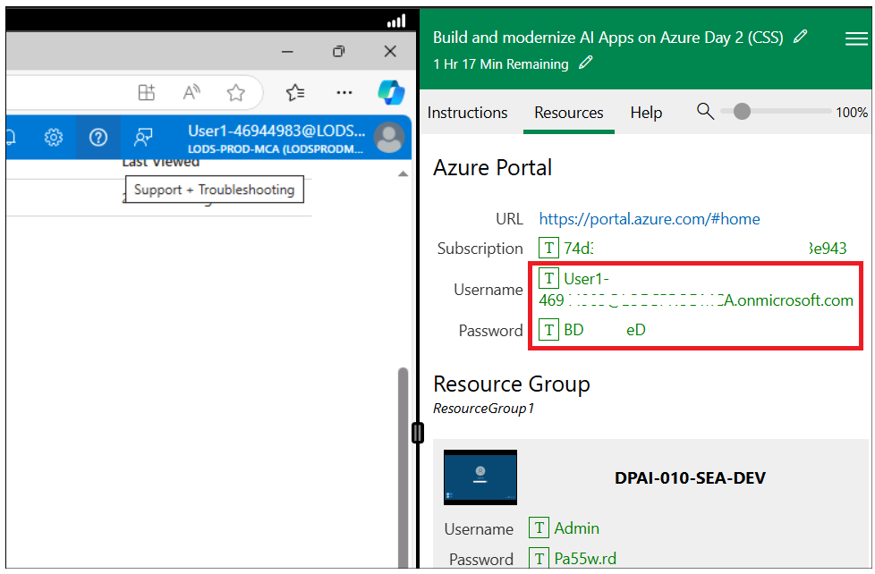

2.  Na página inicial do portal do Azure, clique no bloco **Resource
    groups**.

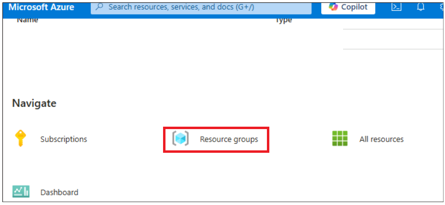

3.  Copie o nome do resource group e salve-o no bloco de notas para
    usá-lo na próxima tarefa, onde você implementará os recursos
    necessários nesse resource group.

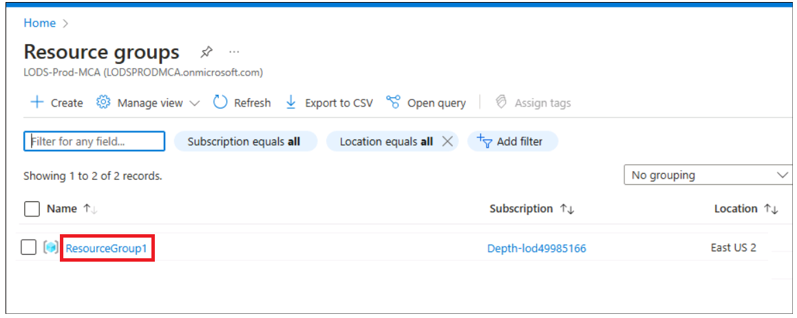

4.  Na navegação superior, clique em Home.

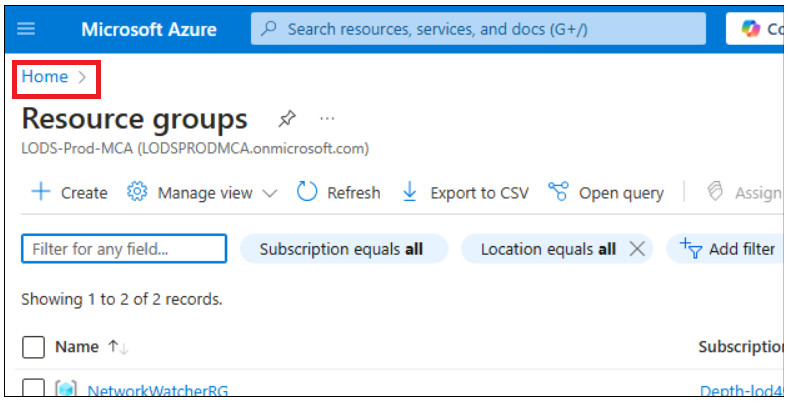

5.  Clique na caixa de diálogo **Subscriptions**.

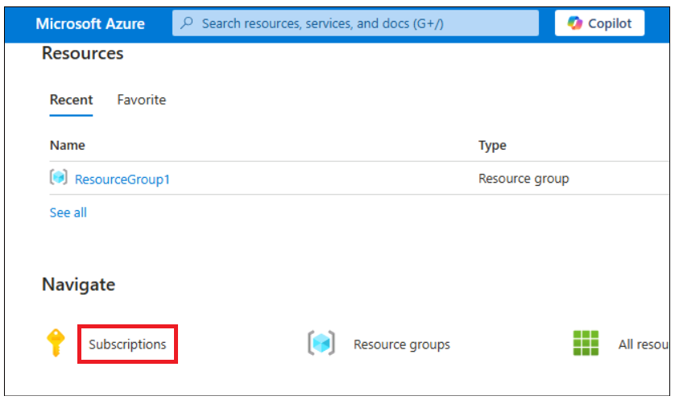

6.  Clique em subscription name.

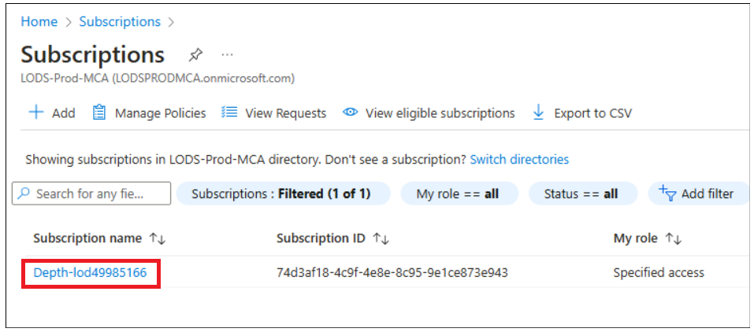

7.  Expanda Settings no menu de navegação esquerdo. Clique em **Resource
    providers**, digite Microsoft.AlertsManagement, selecione-o e clique
    em **Register**.

> 
>
> 

### Tarefa 2: Criar um Github Codespace para iniciar o modelo do Azure Developer CLI

Esse caso de uso tem uma configuração de contêiner dev, o que facilita o
desenvolvimento de aplicativos localmente, a implementação no Azure e o
monitoramento. Usamos modelos do Azure Developer CLI para implementar
aplicativos.

1.  Abra o navegador e acesse\`\`**https:\\github.com\`\`** e faça login
    com a sua conta do Github.

2.  Acesse este repositório
    https://github.com/technofocus-pte/msdocs-flask-postgresql-sample-app
    em sua conta clicando em **Fork**, conforme mostrado na imagem
    abaixo.

3.  Digite o nome exclusivo e clique em **Create repo**.

4.  Na raiz do repositório do seu fork, selecione
    **Code** \> **Codespaces** \> **+**.

5.  Aguarde a configuração do espaço de trabalho.

6.  No terminal do codespace, execute os seguintes comandos:

> \# Requisitos de instalação

\`\`python3 -m pip install -r requirements.txt\`\`

7.  Execute o comando abaixo para criar a variável de ambiente

> \# Criar um arquivo .env com variáveis de ambiente

\`\`cp .env.sample.devcontainer .env\`\`

8.  Execute o comando abaixo para migração de dados

> \# Executar migrações de banco de dados

\`\`python3 -m flask db upgrade\`\`

9.  Execute o comando abaixo para

> \# Iniciar o servidor de desenvolvimento

\`\`python3 -m flask run\`\`

10. Ao visualizar a mensagem Your application running on port is
    available, clique em **Open in Browser**.

11. Clique no botão **Add new restaurant**.

12. Digite os detalhes abaixo e clique no botão **Submit**.

Name : \`\`**Contoso Rica\`\`**

Street Adress - \`\`**3A ,8th cross, Ferns street , Singapore\`\`**

Description - \`\`**This is a medium to high priced restaurant in the
city shopping center\`\`**

13. Clique no botão **Add new review**.

14. Digite sua avaliação e clique no botão **Save changes**

**Your name : your name**

**Rating : your rating**

\`\`This is a medium to high priced restaurant in the city shopping
center. Service was a little bit confusing as we had at least 6 waiters
coming to ask us things. Food took some time to come. We had 2 menus:
one indian and one thai. The thai is 30% cheaper so we went for some
appetizers and thai red curry. Food took some time but it was worth it.
It was delicious and very well prepared. Overall, this is a good
eat.\`\` 

15. Adicionar mais algumas avaliações e um novo restaurante com
    comentários.

### Tarefa 3: provisionar o recurso necessário no Azure.

Esse projeto foi desenvolvido para funcionar bem com o Azure Developer
CLI, o que facilita o desenvolvimento de aplicativos localmente, sua
implementação no Azure e seu monitoramento.

1.  Volte para a guia Github code space, execute o comando abaixo para
    inicializar um novo ambiente azd:

\`\`azd init\`\`

2.  Será solicitado que você forneça um nome para o ambiente (como
    **flask-app**XXXX (onde XXXX pode ser um número único)), que será
    usado posteriormente no nome dos recursos implementados.

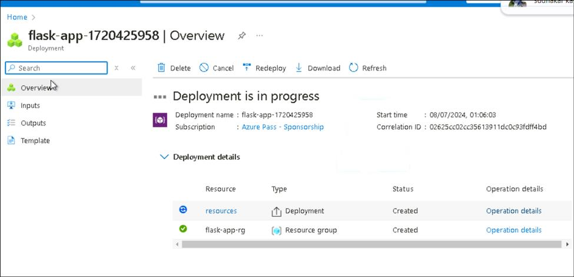

3.  Faça login, se necessário, com o comando\`\`**azd auth login\`\`** .
    Copie o código exibido e pressione Enter.

4.  Digite o código e, em seguida, entre com suas credenciais do Azure.

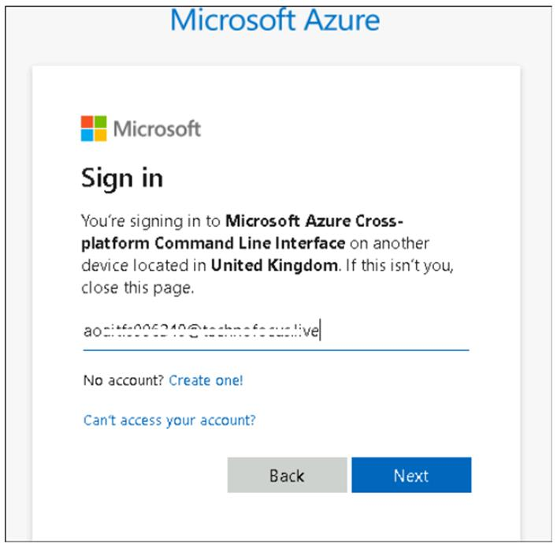

5.  Volte para a guia Gtihub codespace e execute o comando abaixo para
    provisionar e implementar todos os recursos. Ele solicitará que você
    selecione sua assinatura do Azure. Digite 1 para selecionar sua
    assinatura e pressione Enter.

**\`\`azd provision\`\`**

6.  Selecione a localização como **WestUS/eastus**. Em seguida os
    recursos serão provisionados em sua conta e o código mais recente
    será implementado. Se você receber um erro na implementação, alterar
    a localização (por exemplo, para “westus”) pode ajudar, pois pode
    haver restrições de disponibilidade para alguns dos recursos.

7.  Digite o nome do resource group do portal do Azure (copiado na
    tarefa anterior) e pressione Enter.

8.  A implementação dura cerca de **20 a 30 minutos**. Você também pode
    verificar o status da implementação no link gerado ou no **Azure
    portal-\> Resource group-\> Deployments**.

### Tarefa 4: Implementar o aplicativo a partir do Github

1.  Execute o comando abaixo para definir a variável de ambiente do
    resource group.

\`\`azd env set AZURE_RESOURCE_GROUP {Name of existing resource group}
\`\`

Observação: substitua {Name of existing resource group} pelo nome do seu
resource group disponível na seção Resources da sua VM.

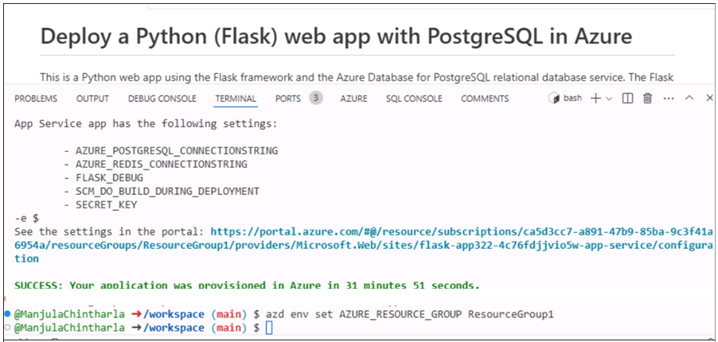

2.  Execute o comando abaixo para implementar todos os recursos e
    aguarde até que a implementação seja concluída com sucesso.

\`\`azd deploy\`\`

3.  Clique na URL do endpoint gerado

4.  Clique em **Open** para abrir o site externo.

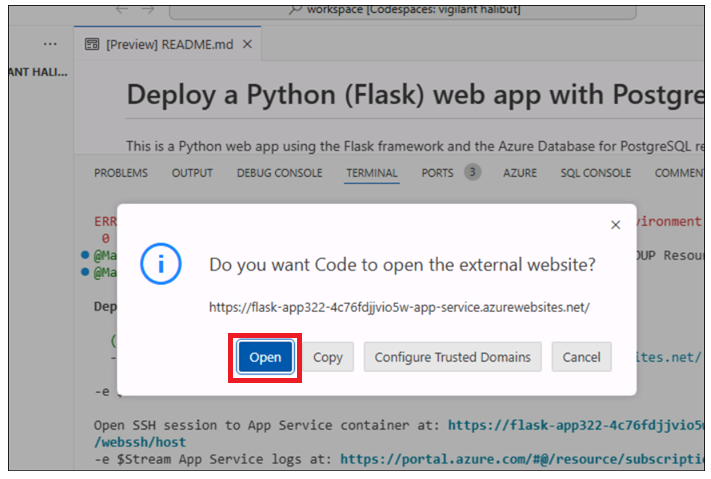

5.  O aplicativo abrirá em uma nova guia.

### Tarefa 5 : Transmitir logs de diagnóstico

O Azure App Service captura todas as mensagens enviadas ao console para
ajudá-lo a diagnosticar problemas com seu aplicativo. O aplicativo
inclui instruções print() para demonstrar esse recurso, conforme
mostrado abaixo.

@app.route('/', methods=\['GET'\])

def index():

print('Request for index page received')

restaurants = Restaurant.query.all()

return render_template('index.html', restaurants=restaurants)

1.  Volte para o **Azure portal- \> Resource group** e clique em **App
    service**.

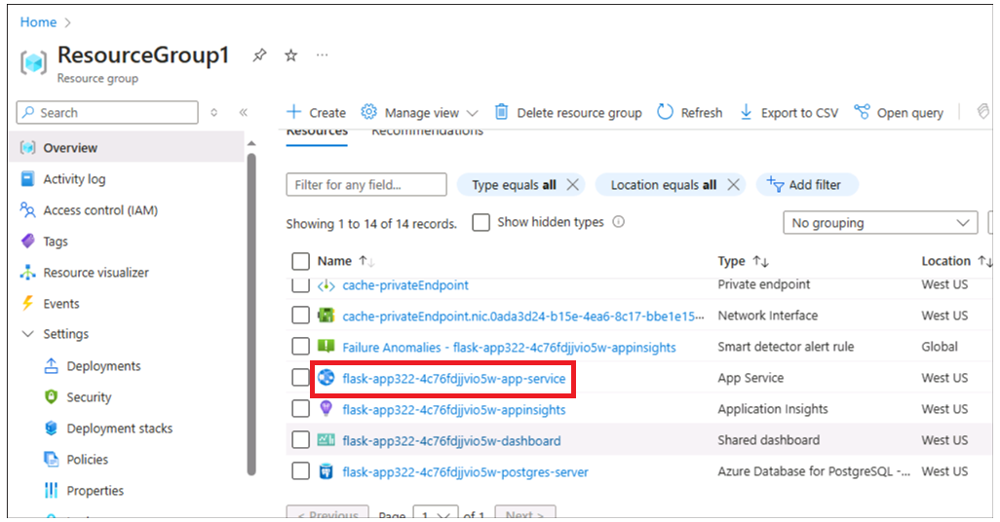

2.  Na página App Service. No menu à esquerda, selecione **Monitoring
    -\>** **App Service logs.**

3.  Em **Application logging**, verifique se o **File System** está
    selecionado. Selecione-o, se necessário. No menu superior,
    selecione **Save**.

4.  No menu à esquerda, selecione **Log stream**. Você verá os logs do
    seu aplicativo, incluindo os logs da plataforma e os logs de dentro
    do contêiner.

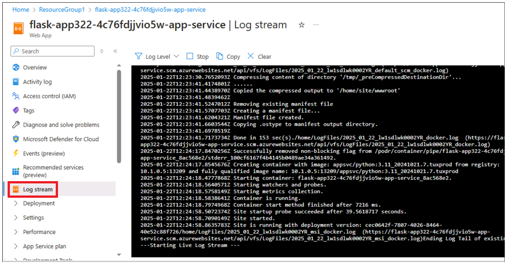

### Tarefa 6: Limpar recursos no Github.

1.  Volte para o Github, clique em **repo -\> Code -\> Codespaces.**
    Selecione o branch correto

2.  Selecione o branch e clique em **Delete**.

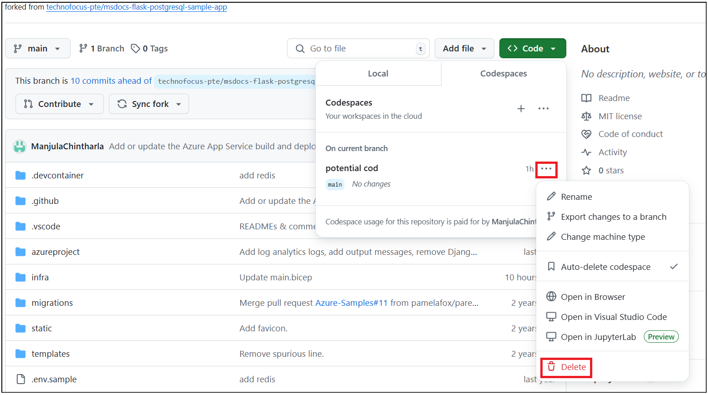

3.  Clique em **Delete**.

4.  Volte para **Azure portal -\> Resource group.**

5.  Selecione todos os recursos e, em seguida, clique em **Delete** (NÃO
    CLIQUE em delete resource group)

6.  Digite \`\`**Delete**\`\` e clique em **Delete**.

7.  Clique em **Delete** para confirmar a exclusão.

