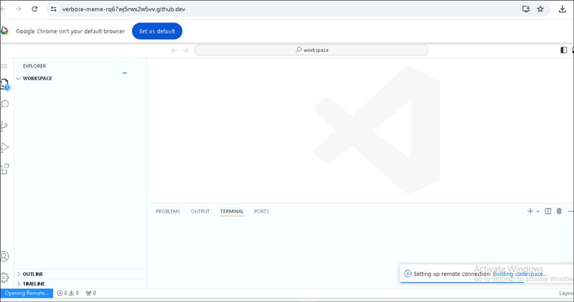
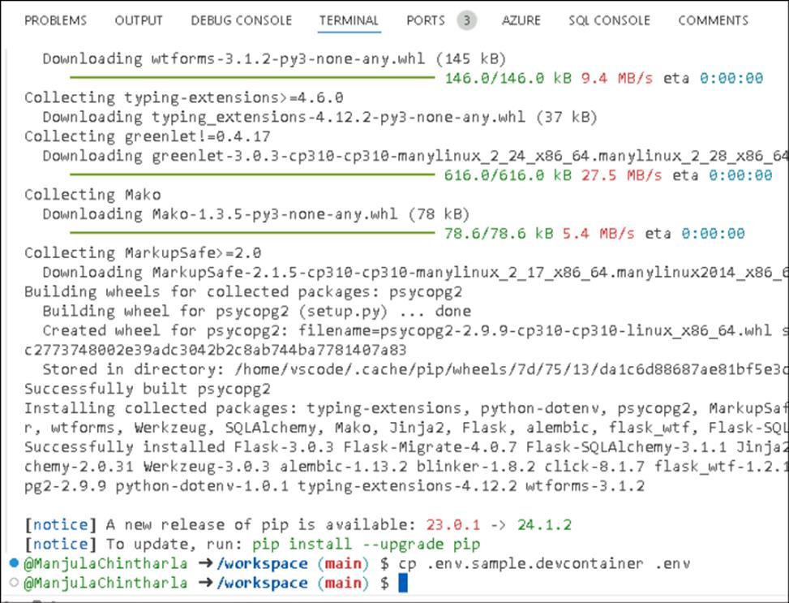
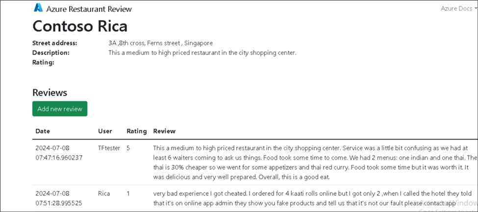
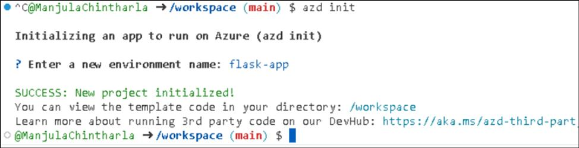
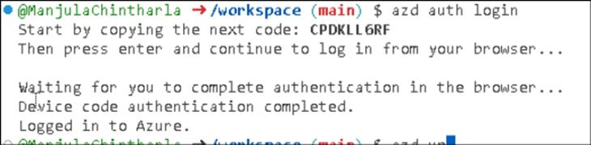

# Usecase 05- Deploying a data-driven Python Restaurant web app with the Azure Database for PostgreSQL

**Objective:**

This usecase deploy a Python web app using the Flask framework and the Azure Database for PostgreSQL relational database service. The Flask app is hosted in a fully managed Azure App Service. This app is designed to be run locally and then deployed to Azure

You 'll deploy a data-driven Python web app (**Django** or **Flask**) to **Azure App Service** with the **Azure Database for
PostgreSQL** relational database service. Azure App Service supports Python in a Linux server environment.

**Key technologies used** -- Java 17, Azure Database for PostgreSQL

**Estimated duration** -- 45 minutes

**Lab Type:** Instructor Led

**Pre-requisites:**

GitHub account -- You are expected to have your own GitHub login credentials. If you do not have, please create one from here
- **https://github.com/signup?user_email=&source=form-home-signupobjectives**

The **requirements.txt** has the following packages, all used by a typical data-driven Flask application:

### Task 1 : Register Service provider

1.  Open a browser and go to ``https://portal.azure.com`` and sign in with your cloud slice account is available in the Resource tab of your VM.

2.  On the Home page of the Azure portal, click on the **Resource groups** tile.

3.  Copy the resource group name and save it in Notepad to use next task to deploy required resources in this resource group.

4.  On the top navigation, click on Home.

5.  Click on **Subscriptions** tile.

6.  Click on the subscription name.

7.  Expand Settings from the left navigation menu. Click on **Resource providers** , enter `Microsoft.AlertsManagement` and select i,t and then click **Register**.

 

 

### Task 2 : Create GitHub Codespace to initiate the Azure Developer CLI template

This use case has a dev container configuration, which makes it easier to develop apps locally, deploy them to Azure, and monitor them. We use
Azure development CLI templates to deploy apps

1.  Open a browser go to ``https://github.com`` and sign in with your GitHub account.

2.  Fork this repository `https://github.com/technofocus-pte/flask-postgresql-CSTesting.git` to your account by clicking on **Fork** as shown in the below image.

3.  Enter a unique name and then click on **Create repo**.

4.  From the repository root of your fork, select **Code** > **Codespaces** > **+**.

5.  Wait for the workspace to set up.

6.  In the codespace terminal, run the following commands:

# Install requirements

+++python3 -m pip install -r requirements.txt+++

7.  Run the below command to create an environment variable

# Create .env with environment variables

+++cp .env.sample.devcontainer .env+++

8.  Run below command for data migration

 \# Run database migrations

+++python3 -m flask db upgrade+++

9.  Run the below command to

# Start the development server

+++python3 -m flask run+++

10. When you see the message Your application running on the port is available., click **Open in Browser**.

11. Click on **Add new restaurant** button.

12. Enter the details below and click on the **Submit** button.

Name : +++Contoso Rica+++

Street Adress - +++3A ,8th cross, Ferns street , Singapore+++

Description - +++This is a medium to high-priced restaurant in the city shopping center+++

13. Click on **Add new review** button.

14. Enter your review and then click on the button. **Save changes**

**Your name: your name**

**Rating: your rating**

``This is a medium to high priced restaurant in the city shopping center. Service was a little bit confusing as we had at least 6 waiters
coming to ask us things. Food took some time to come. We had 2 menus: one indian and one thai. The thai is 30% cheaper so we went for some
appetizers and thai red curry. Food took some time but it was worth it. It was delicious and very well prepared. Overall, this is a good
eat.``

15. Add some more reviews and new restaurants with comments.

### Task 3: Provision of required resources in Azure.

This project is designed to work well with the Azure Developer CLI which makes it easier to develop apps locally, deploy them to Azure, and
monitor them.

1.  Switch back to the GitHub code space tab, Run below command to Initialize a new azd environment:

+++azd init+++

2.  It will prompt you to provide an environment name (like ``flask-appXXXX`` (XXXX can be a unique number)), which will
    later be used in the name of the deployed resources.

3.  Login if required +++azd auth login+++ .copy the code and press enter.

4.  Enter the code and then sign in with your Azure credentials.

5.  Switch back Gtihub codespace tab and run below command to provision and deploy all the resources. It will prompt to select your Azure
    subscription. Enter **1** to select your subscription and press Enter.

+++azd provision+++

6.  Select location as **WestUS/eastus**. Then it will provision the resources in your account and deploy the latest code. If you get an
    error with deployment, changing the location (like to "westus") can help, as there may be availability constraints for some of the
    resources.

7.  Enter the below resource group name  and press enter.

   +++@lab.CloudResourceGroup(ResourceGroup1).Name+++

8.  Deployment takes **20 - 30 minutes**. You can also check the status of deployment at the generated link or **Azure portal-> Resource
    group-> Deployments**.

### Task 4 : Deploy the application from Github

1.  Run the below command to set the resource group environment variable.

+++azd env set AZURE_RESOURCE_GROUP {Name of existing resource group}+++

>Note : Replace {Name of existing resource group} with your resource group name available under the Resources section in your VM.

2.  Run below command to deploy all resources and wait for the deployment to complete successfully.

+++azd deploy+++

3.  Click on the generated Endpoint URL

4.  Click on **Open** to open the external website.

5.  The app opens in a new tab.

### Task 5 : Stream diagnostic logs

Azure App Service captures all messages output to the console to help you diagnose issues with your application. The app includes print()
statements to demonstrate this capability as shown below.

@app.route('/', methods=['GET'])

def index():

print('Request for index page received')

restaurants = Restaurant.query.all()

return render_template('index.html', restaurants=restaurants)

1.  Switch back to **Azure portal- > Resource group** and click on **App service**.

2.  In the App Service page. From the left menu, select **Monitoring ->** **App Service logs.**

3.  Under **Application logging**, make sure **File System** selected.Select it if required.I n the top menu, select **Save**.

4.  From the left menu, select **Log stream**. You see the logs for your app, including platform logs and logs from inside the container.

### Task 6 : Clean up resources in Github.

1.  Switch back to Github, click on **repo -> Code -> Codespaces.** Select the correct branch

2.  Select the branch and click on **Delete**.

3.  Click on **Delete**.

4.  Switch back to **Azure portal -> Resource group.**

5.  Select all the resources and then click on **Delete** ( DO NOT delete resource group)

6.  Enter ``Delete`` and then click on **Delete**.

7.  Click on **Delete** to confirm deletion.

