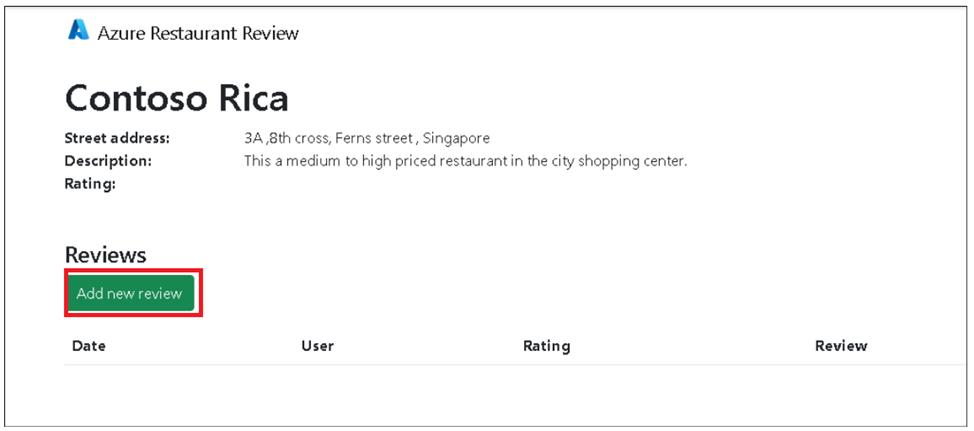

# Usecase 05- Deploying a data-driven Python Restaurant web app with the Azure Database for PostgreSQL

**Objective:**

This usecase deploy a Python web app using the Flask framework and the
Azure Database for PostgreSQL relational database service. The Flask app
is hosted in a fully managed Azure App Service. This app is designed to
be run locally and then deployed to Azure


You 'll deploy a data-driven Python web app (**Django** or **Flask**)
to **Azure App Service** with the **Azure Database for
PostgreSQL** relational database service. Azure App Service supports
Python in a Linux server environment.

**Key technologies used** -- Java 17, Azure Database for PostgreSQL

**Estimated duration** -- 45 minutes

**Lab Type:** Instructor Led

**Pre-requisites:**

GitHub account -- You are expected to have your own GitHub login
credentials. If you do not have, please create one from here
- `https://github.com/signup?user_email=&source=form-home-signupobjectives`

The **requirements.txt** has the following packages, all used by a
typical data-driven Flask application:

- **Flask** : Web application framework
- **SQLAlchemy**: Provides a database abstraction layer to communicate with PostgreSQL.
- **Flask-SQLAlchemy** : Adds SQLAlchemy support to Flask application by simplifying using SQLAlchemy. Requires SQLAlchemy.
- **Flask-Migrate** : SQLAlchemy database migrations for Flask applications using Alembic. Allows functionality parity with Django version of this sample app.
- **pyscopg2** : PostgreSQL database adapter for Python.
- **python-dotenv** : Read key-value pairs from .env file and set them as environment variables. In this sample app, those variables describe how to connect to the database locally. Flask's dotenv support sets environment variables automatically from an .env file.
- **flask_wtf**: Form rendering, validation, and CSRF protection for Flask with WTForms. Uses CSRFProtect extension.

### Task 1 : Run the sample

This usecase has a dev container configuration, which makes it easier to
develop apps locally, deploy them to Azure, and monitor them. The
easiest way to run this sample application is inside a GitHub codespace.
Follow these steps:

1.  Open a browser and go to `https://github.com` and sign in
    with your Github account.

2.  Fork this repository ` https://github.com/technofocus-pte/msdocs-flask-postgresql-sample-app` to
    your account by clicking on **Fork** as shown in below image.


3.  Enter unique name and then click on **Create fork**.


4.  From the repository root of your fork,
    select **Code** > **Codespaces** > **+**.


5.  Wait for the workspace to setup.


6.  In the codespace terminal, run the following commands:

7.  Install requirements

    +++python3 -m pip install -r requirements.txt+++


8.  Run below command to create environment varaible

9.  Create .env with environment variables

    +++cp .env.sample.devcontainer .env+++


10. Run below command for data migration. Run database migrations

    +++python3 -m flask db upgrade+++


11. Run below command to Start the development server

    +++python3 -m flask run+++


12. When you see the message Your application running on port is
    available., click **Open in Browser**.


13. Click on **Add new restaurant** button.


14. Enter the details below and click on **Submit** button.

Name : `Contoso Rica`

Street Adress - `3A ,8th cross, Ferns street , Singapore`

Description - `This is a medium to high priced restaurant in the city shopping center`


15. Click on **Add new review** button.


16. Enter your review and then click on button. **Save changes**

**Your name : your name**

**Rating : your rating**

```
This is a medium to high priced restaurant in the city shopping center. Service was a little bit confusing as we had at least 6 waiters
coming to ask us things. Food took some time to come. We had 2 menus:one indian and one thai. The thai is 30% cheaper so we went for some
appetizers and thai red curry. Food took some time but it was worth it.It was delicious and very well prepared. Overall, this is a good
eat.
```


17. Add some more reviews and new restaurant with comments.


### Task 2: Deploy the app to Azure.

This project is designed to work well with the Azure Developer CLI which
makes it easier to develop apps locally, deploy them to Azure, and
monitor them.

1.  Switch back to Github code space tab,Run below command to Initialize
    a new azd environment:

    +++azd init+++


2.  It will prompt you to provide a environment name
    (like flask-appXXXX (XXXX can be unique number)), which will later
    be used in the name of the deployed resources.


3.  Login if required `azd auth login` .copy the code and press enter.


4.  Enter the code and then sign in with your Azure subscription
    account.





5.  Switch back Gtihub codespace tab and run below command to provision
    and deploy all the resources:

    +++azd up+++

It will prompt you to login, pick a subscription, and provide a location
(like "eastus"). Then it will provision the resources in your account
and deploy the latest code. If you get an error with deployment,
changing the location (like to "centralus") can help, as there may be
availability constraints for some of the resources.


6.  Deployment takes **30 -40 minutes**.You can also check the status of
    deployment at the generated link.


7.  When azd has finished deploying, you\\'ll see an endpoint URI in the
    command output. Visit that URI, and you should see the front page of
    the restaurant review app! If you see an error, open the Azure
    Portal from the URL in the command output, navigate to the App
    Service, select Log stream, and check the logs for any errors.


8.  When you've made any changes to the app code, you can just run:

    +++azd deploy+++

### Task 3. Verify deployed resources

1.  Open +++https://portal.azure.com+++ in browser and sign in
    with your Azure subscription account.

2.  Click on Resource group tile from home page,


3.  Click on resource group name


4.  Check deployed resources . click on each resource and explore them.


### Task 4 : Stream diagnostic logs

Azure App Service captures all messages output to the console to help
you diagnose issues with your application. The app includes print()
statements to demonstrate this capability as shown below.

@app.route('/', methods=\['GET'\])

def index():

print('Request for index page received')

restaurants = Restaurant.query.all()

return render_template('index.html', restaurants=restaurants)

1.  Click on App service resource


2.  In the App Service page:

3.  From the left menu, select **App Service logs**.

4.  Under **Application logging**, make sure **File System** selected.
    Select it if required

5.  In the top menu, select **Save**.


6.  From the left menu, select **Log stream**. You see the logs for your
    app, including platform logs and logs from inside the container.


### Task 5 : Clean up resources

When you're finished, you can delete all of the resources from your
Azure subscription by deleting the resource group.

1.  Click on resource group from top navigation menu as shown in below
    image.


2.  Click on **Delete resource group** .Copy the resource group name,
    enter it into the text box and then click on **Delete** button.


3.  On **Delete Confirmation** windows, click on **Delete**.


4. Navigate back to your Github browser tab and delete the codespace used for this lab.

>**Summary**:You have learnt deploying a Python web app using the Flask framework and
the Azure Database for PostgreSQL relational database service. Azure App
Service supports Python in a Linux server environment.
