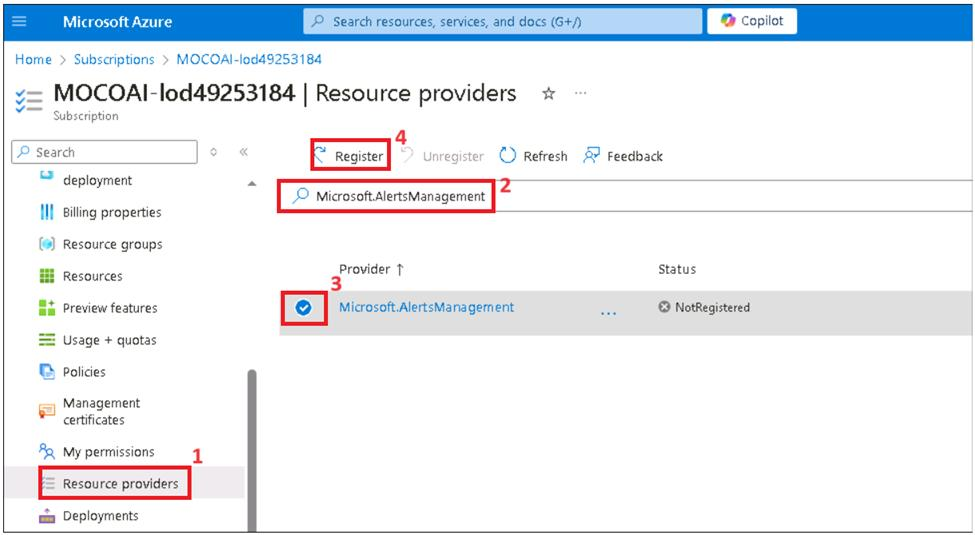
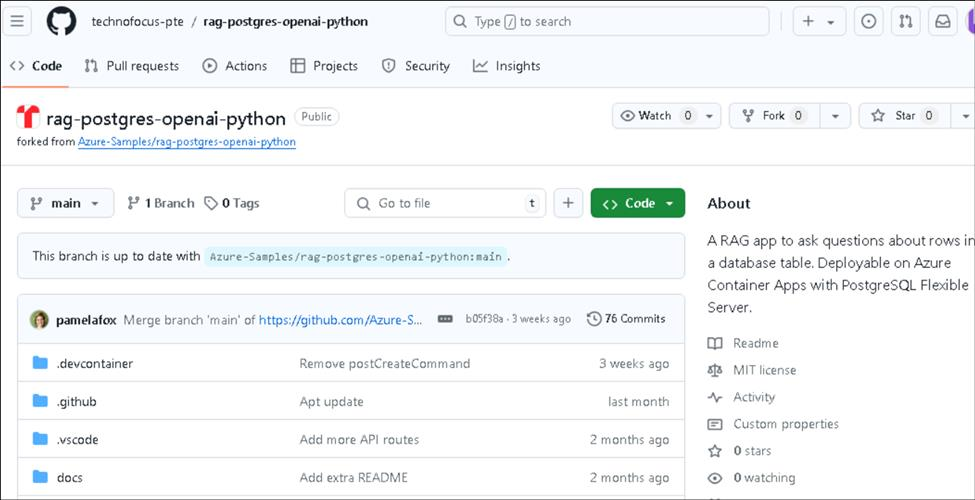

# Usecase 06 - Deploying chat app on Azure Container Apps with PostgreSQL Flexible Server

**Objective:**

- To configure the development environment on Windows by installing
  Azure CLI, Node.js, assigning Azure subscription roles, starting
  Docker Desktop, and enabling Visual Studio Code with Dev Containers
  extension.

- To deploy and test Custom Chat Application with PostgreSQL and OpenAI
  on Azure.

In this use case, you will set up a comprehensive development
environment, deploy a chat application integrated with PostgreSQL, and
verify its deployment on Azure. This involves installing essential tools
like Azure CLI, Docker, and Visual Studio Code ( we have already done it
for you on host env ), configuring user roles in Azure, deploying the
application using Azure Developer CLI, and interacting with the deployed
resources to ensure functionality.

**Key technologies used** -- Python, FastAPI, Azure OpenAI models, Azure
Database for PostgreSQL and azure-container-apps,ai-azd-templates.

**Estimated duration** -- 45 minutes

**Lab Type:** Instructor Led

**Pre-requisites:**

GitHub account -- You are expected to have your own GitHub login
credentials. If you do not have, please create one from here
- `https://github.com/signup?user_email=&source=form-home-signupobjectives`

## Exercise 1: Set up environment

### Task 1: Install Azure Cli and set the policy scope to Local machine

1.  In your windows search bar, search for `PowerShell`. Open
    as **Run as administrator**. If you see the dialog box - **Do you
    want to allow this app to make changes to your device?** then click
    on the **Yes** button.

2.  Run below commands to install stable version of winget.

`$progressPreference = 'silentlyContinue'`

`Write-Information "Downloading WinGet and its dependencies..."`

`Invoke-WebRequest -Uri https://aka.ms/getwinget -OutFile Microsoft.DesktopAppInstaller_8wekyb3d8bbwe.msixbundle`

`Invoke-WebRequest -Uri https://aka.ms/Microsoft.VCLibs.x64.14.00.Desktop.appx -OutFile Microsoft.VCLibs.x64.14.00.Desktop.appx`

`Invoke-WebRequest -Uri  https://github.com/microsoft/microsoft-ui-xaml/releases/download/v2.8.6/Microsoft.UI.Xaml.2.8.x64.appx -OutFile Microsoft.UI.Xaml.2.8.x64.appx`

`Add-AppxPackage Microsoft.UI.Xaml.2.8.x64.appx`

`Add-AppxPackage Microsoft.DesktopAppInstaller_8wekyb3d8bbwe.msixbundle`

3.  Run the following command to install Azure Cli on the PowerShell

    `winget install microsoft.azd`

4.  Run the below command to set the policy to **Unrestricted** and
    enter **A** when asked to change the execution policy.

    `Set-ExecutionPolicy Unrestricted\`

### Task 2: Assign a user as an owner of an Azure subscription

1.  Open your browser, open Azure
    portal `https://portal.azure.com`.  Sign in with your Azure
    subscription account.

2.  On Home page, click on **Subscriptions** tile.

3.  Click on your **subscription name**.

4.  From the left menu, click on the **Access control(IAM).Click o
    Add -> Add role assignment**

5.  In the Role tab, select the **Privileged administrator roles** and
    select **Owner** . Click **Next**

6.  Select Assign access to User group or service principal.
    Under **Members**, click **+Select members** and search for your
    Azure subscription account, select it and then click
    on **Select** button.

7.  Click on **Next**.

8.  Select **Allow user to assign all roles** radio button and then
    click on **Review +assign** .

### Task 3: Install Dev Containers extension

1.  In your Windows search box, type Visual Studio, then click
    on **Visual Studio Code**.You can also open it form **Desktop**.

2.  Click on **Extensions** , search for **Dev container**, select it
    and click on **Install**.

## Exercise 2: Deploy the application and test it from the browser

### Task 1 : Run the Docker

1.  On the Desktop, double click on **Docker Desktop**.

2.  Run the Docker Desktop.

### Task 2 : Register Service provider

1.  Open a browser and go to `https://portal.azure.com` and sign
    in with your Azure subscription account.

2.  Click on the **Subscription** tile.

3.  Click on subscription name.

4.  Click on Resource provider from left navigation menu,
    type `Microsoft.AlertsManagement` and press enter. Select it
    and then click on **Register**.

### Task 3: Open development environment

1.  Open your browser, navigate to the address bar, type or paste the
    following
    URL: `https://github.com/technofocus-pte/rag-postgres-openai-python.git` tab
    opens and ask you to open in Visual studio code. Select **Open
    Visual Studio Code.**

2.  Click on **fork** to fork the repo. Give unique name to the repo and
    click on **Create repo** button.

3.  Click on **Code -> Codespaces -> codespace+**

4.  Wait for the codespace environment to setup .It takes few minutes to
    setup completely

### Task 4: Deploy chat app to Azure

1.  Sign in to Azure with the Azure Developer CLI. Run the following
    command on the Terminal

`azd auth login`

2.  Default browser opens to sign in. Sign in with your Azure
    subscription account.

3.  To create an environment for Azure resources, run the following
    Azure Developer CLI command.It asks you to enter environment name
    .Enter any name of your choice and press enter (eg : `ragpgpy`)

**Note:** When creating an environment, ensure that the name consists of
lowercase letters.

`azd env new`

4.  Run the following Azure Developer CLI command to provision the Azure
    resources and deploy the code.

`azd up`

5.  When prompted, select a **subscription** to create the resources and
    select the region closest to your location; in this lab, we have
    chosen the **East US2** region.

6.  When prompted, **enter a value for the 'openAILocation'
    infrastructure parameter** select the region closest to your
    location; in this lab, we have chosen the **East US** region

7.  Deployment will take around 19-20 min. While the deployment is going
    on, You can go next Task 3 and verify deployed resources.

8.  Deployment completed and front end hosted successfully. Click on the
    generated URL

### Task 5: Verify deployed resources in the Azure portal

1.  On Home page of Azure portal, click on **Resource Groups**.

2.  Click on your resource group name

3.  Make sure the below resource got deployed successfully

    - Container App

    - Application Insights

    - Container Apps Environment

    - Log Analytics workspace

    - Azure OpenAI

    - Azure Database for PostgreSQL flexible server

    - Container registry

4.  Click on **Azure OpenAI** resource name.

5.  On **Overview** in the left navigation menu, right click **Go to
    Azure OpenAI Studio** and select to open a new tab.

6.  Click on **Deployments** from left navigation menu and make
    sure **gpt-35-turbo**, **text-embedding-ada-002** should be deployed
    successfully

### Task 6: Use chat app to get answers from files

1.  In the **RAG on database |OpenAI+PoastgreSQL** web app page, **click
    on Best shoe for hiking?** button and observe the output

2.  Click on the **clear chat.**

3.  In the **RAG on database |OpenAI+PoastgreSQL** web app page, click
    on **Climbing gear cheaper than \\$30** button and observe the
    output

4.  Click on the **clear chat.**

### Task 7: Clean up all the resources

To clean up all the resources created by this sample:

1.  Go back Visual Studio terminal and run `azd down –purge`

2.  When asked if you are sure you want to continue, enter y

3.  When asked if you want to permanently delete the resources,
    enter **y**

**Summary:**

This use case walks you through deploying a chat application with
PostgreSQL and OpenAI on Azure, focusing on cloud-based application
deployment and management. you’ve set up the development environment,
installed necessary tools like Azure CLI, configured Azure resources
using Azure Developer CLI, and deployed the application to Azure
Container Apps.
