# 사용 사례 06 - PostgreSQL Flexible Server를 사용하여 Azure Container App에 채팅 앱을 배포하기

**목표:**

- Azure CLI를 설치하고, Azure 구독 역할을 Node.js하고, Docker Desktop을
  시작하고, 개발 컨테이너 확장을 사용하여 Visual Studio Code를
  사용하도록 설정하여 Windows에서 개발 환경을 구성합니다.

- To Azure에서 PostgreSQL 및 OpenAI를 사용하여 사용자 지정 채팅
  애플리케이션을 배포하고 테스트합니다.

이 사용 사례에서는 포괄적인 개발 환경을 설정하고, PostgreSQL과 통합된
채팅 애플리케이션을 배포하고, Azure에서 배포를 확인할 것입니다. 여기에는
Azure CLI, Docker 및 Visual Studio Code와 같은 필수 도구를
설치하고(호스트 환경에서 이미 수행했습니다), Azure에서 사용자 역할을
구성하고, Azure Developer CLI를 사용하여 애플리케이션을 배포하고, 기능을
보장하기 위해 배포된 리소스와 상호 작용하는 작업이 포함됩니다.

**사용된 핵심 기술** -- Python, FastAPI, Azure OpenAI 모델, PostgreSQL용
Azure Database 및 azure-container-apps,ai-azd-templates.

**예상 소요 시간** -- 45분

**실습 유형:** 강사 진행

**사전 요구 사항:**

GitHub 계정 -- 고유한 GitHub 로그인 자격 증명이 있어야 합니다. 가지고
있지 않은 경우 여기에서 생성하세요
- **https://github.com/signup?user_email=&source=form-home-signupobjectives**

## 연습 1: 애플리케이션을 프로비전 및 배포하고 브라우저에서 테스트하기

### 작업 1: 기존 리소스 그룹 이름을 보사하기

1.  브라우저를 열고Azure 포털을 \`\`https:\\portal.azure.com\`\`를
    여세요. 호스트 환경의 지침/리소스 섹션에서 사용할 수 있는 Azure
    슬라이스 계정(Azure 자격 증명)으로 로그인하세요.

2.  홈페이지에서 **Resource groups** 타일을 클릭하세요.

3.  작업할 리소스 그룹이 이미 생성되어 있는지 확인하세요. 이 리소스
    그룹을 삭제하지 마세요. 대신, 리소스 그룹 내의 리소스는 삭제할 수
    있지만 리소스 그룹 자체는 삭제할 수 없습니다.

4.  Resource group 이름을 클릭하세요

5.  Resource group 이름을 복사하고 메모장에 저장하여 모든 리소스를 이
    리소스 그룹에 배포하는 데 사용하세요

### 작업 2: Docker를 실행하기

1.  Desktop에서**Docker Desktop**를 두 번 클릭하세요.

2.  Docker Desktop을 실행하세요.

### 작업 3: Service 공급자를 등록하기

1.  Azure portal 탭으로 다시 전환하고 **Subscription** 타일을
    클릭하세요.

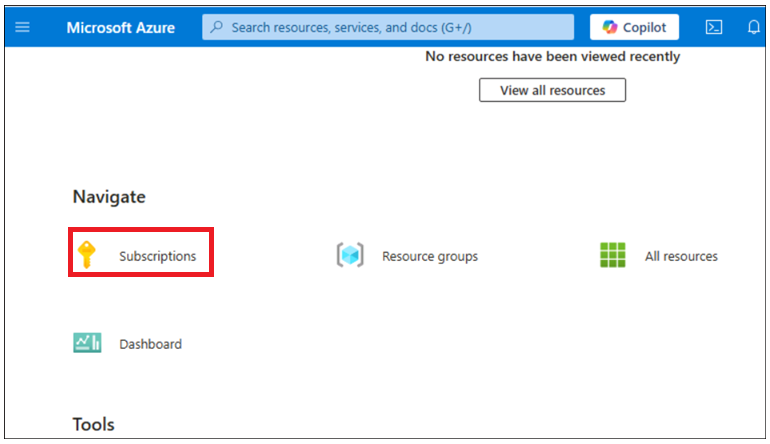

2.  Subscription 이름을 클릭하세요.

3.  왼쪽 탐색 메뉴에서 **Settings - \> Resource provider**를 클릭하세요.

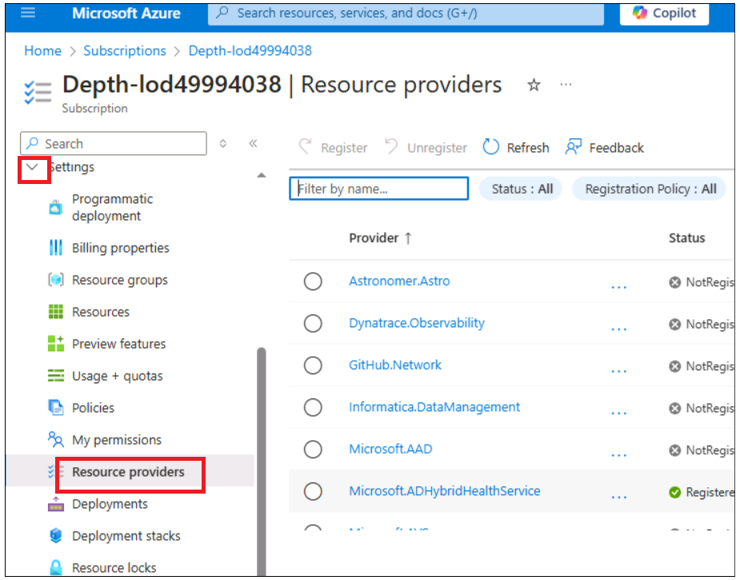

4.  \`\`**Microsoft.AlertsManagement**\`\`를 입력하고 enter를 누르세요.
    그 것을 선택하고 **Register**를 클릭하세요.

### 작업 4: 개발 환경을 열기

1.  브라우저를 열고 주소바로 이동하고 다음 URL을 입력이나
    복사하세요: \`\`https://github.com/technofocus-pte/rag-postgres-openai-python.git\`\` 탭이
    열리고 Visual studio code에서 열도록 요청합니다. **Open Visual
    Studio Code**를 선택하세요**.**

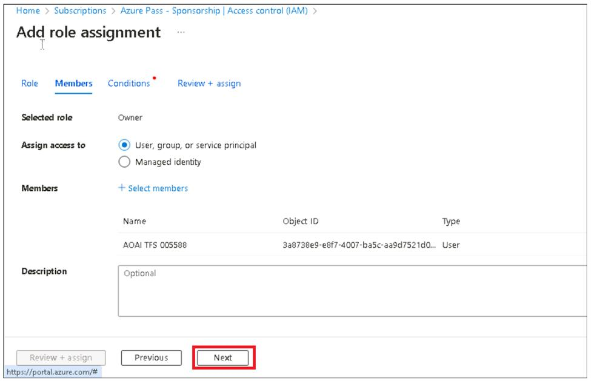

2.  **fork**를 클릭하여 repo를 fork하세요. repo에 고유 한 이름을
    지정하고 **Create repo** 버튼을 클릭하세요.

3.  **Code -\> Codespaces -\> Codespaces+**를 클릭하세요

4.  Codespaces 환경이 설정될 때까지 기다리세요. 완전히 설정하는 데 몇 분
    정도 걸립니다

### 작업 5: 서비스를 프로비전하고 Azure에 애플리케이션을 배포하기

1.  터미널에서 다음 명령을 실행하세요. Code to copy를 생성합니다. 코드를
    복사하고 Enter 키를 누르세요.

\`\`azd auth login\`\`

2.  기본 브라우저가 열리고 생성된 코드를 입력하여 확인합니다. 코드를
    입력하고 **Next**을 클릭하세요.

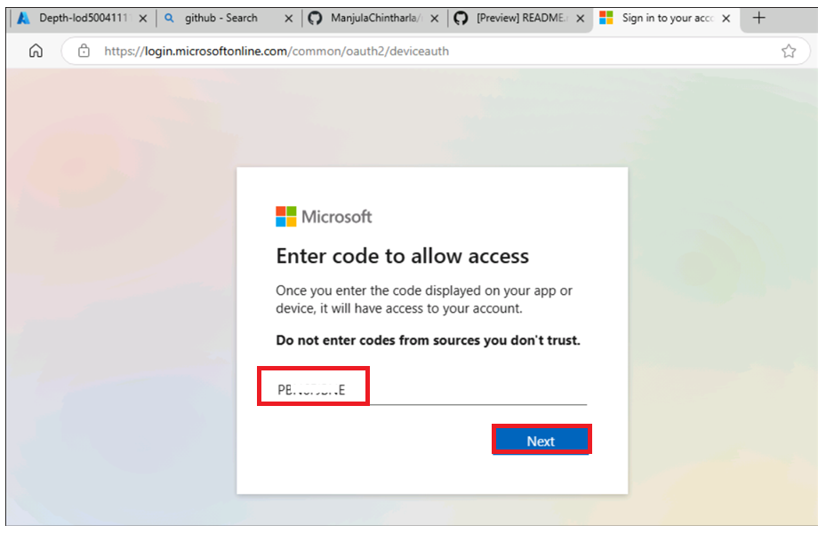

3.  Azure 자격 증명으로 로그인하세요.

4.  Azure 리소스에 대한 환경을 만들려면 다음 Azure Developer CLI 명령을
    실행하세요. 환경 이름을 입력하라는 메시지가 표시됩니다. 원하는
    이름을 입력하고 Enter 키를 누르세요 (예: :**ragpgpy**).

**참고:** 환경을 생생할 때 이름이 소문자로 구성되어 있는지 확인하세요.

\`\`azd env new\`\`

5.  다음 Azure Developer CLI 명령을 실행하여 Azure 리소스를
    프로비저닝하고 코드를 배포하세요.

\`\`azd provision \`\`

6.  메시지가 표시되면 **subscription**을 선택하여 리소스를 만들고
    위치에서 가장 가까운 지역을 선택하세요; 이 실습에서**East
    US2** 지역을 선택했습니다.

7.  “**Enter a value for the 'existingResourceGroupName' infrastructure
    parameter:**” 를 프롬프트하면 작업 1에서 복사된 리소스 그룹을
    입력하세요 (예: **ResourceGroup1 used for the development slice).**
    아래 이미지외 같이 **Resources** 섹션에서 리소스 그룹 이름을 복사할
    수 있습니다

> 

8.  **enter a value for the 'openAILocation' infrastructure
    parameter**를 프롬프트하면 가장 가까운 지역을 선택하세요; 이
    실습에서 **North Central US**  지역을 선택했습니다

9.  리소스 프로비저닝에는 약 5 - 10분이 소요됩니다. 프롬프트되면
    **Yes**를 클릭하세요.

10. 템플릿이 모든 리소스를 성공적으로 프로비저닝할 때까지 기다리세요.

11. 아래 명령을 실행하여 리소스 그룹을 설정하세요

\`\`azd env set AZURE_RESOURCE_GROUP {your resource group name}\`\`

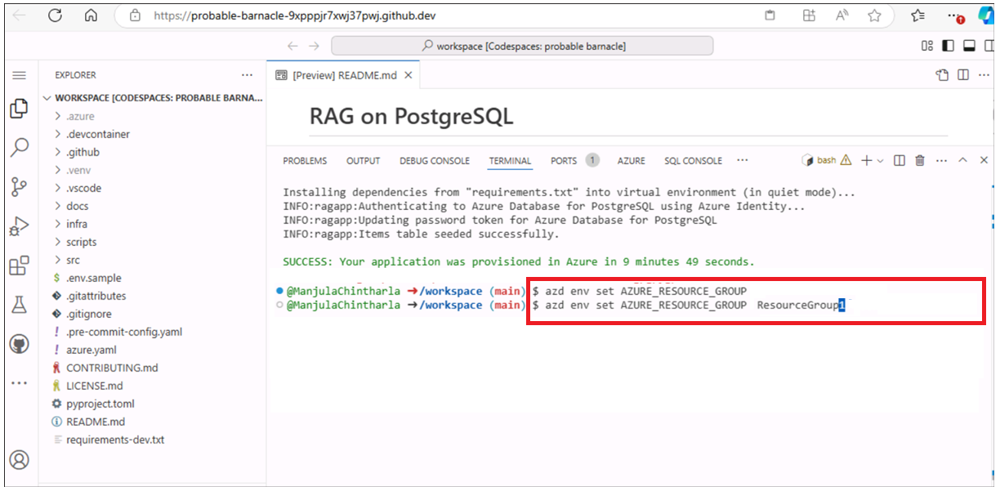

12. Azure에 앱을 배포하기 위해 다음 명령을 실행하세요.

\`\`azd deploy\`\`

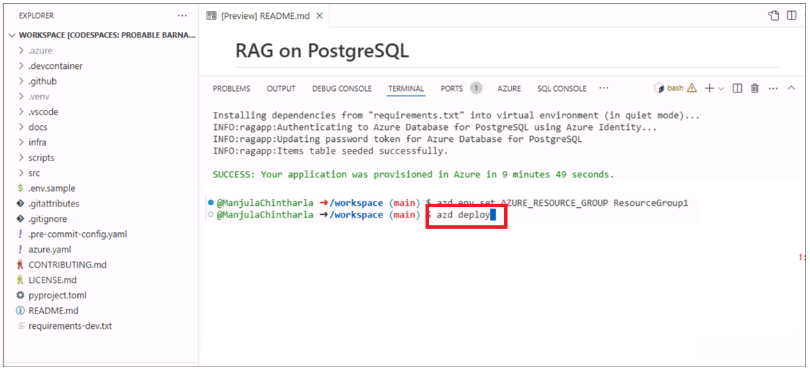

13. 배포가 완료될 때까지 기다리세요. 배포 소요 시간: \<5

14. 배포된 웹앱 엔드포인트 링크를 클릭하세요.

15. **Open**를 클릭하세요. 앱으로 새 탭이 열립니다

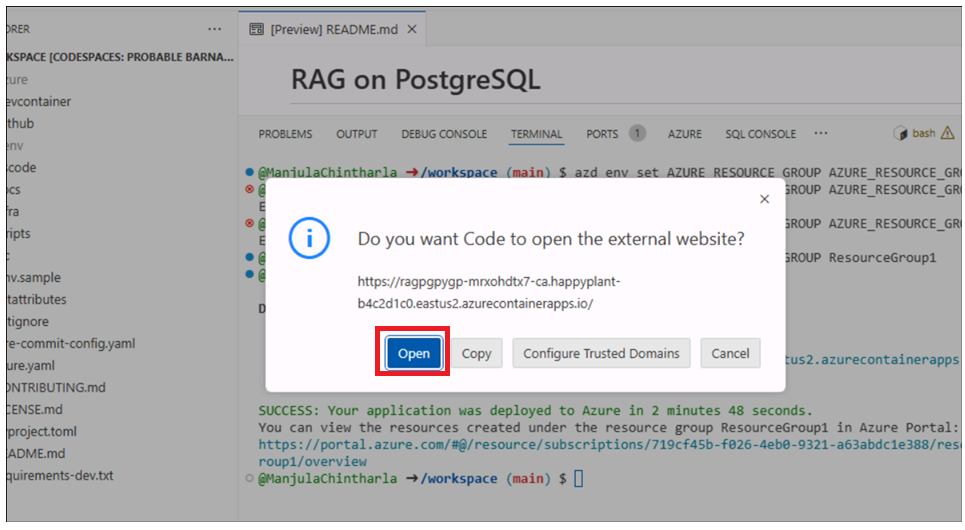

16. 앱이 열립니다.

### 작업 6: 답변을 받기 위해 채팅 앱을 사용하기

1.  **RAG on database |OpenAI+PoastgreSQL** 웹앱 페이지에서 **Best shoe
    for hiking?** 버튼을 클릭하고 출력을 관찰하세요

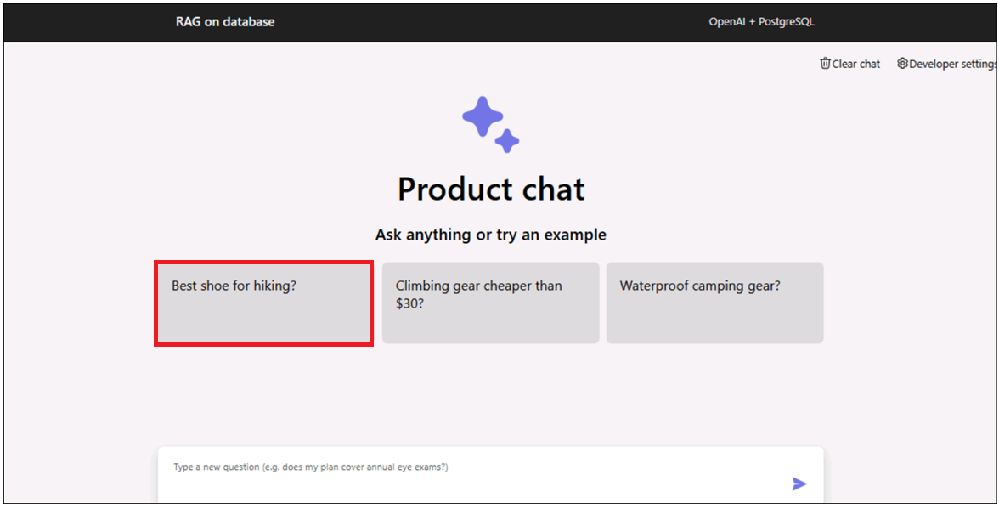

2.  **Clear chat**를 클릭하세요.

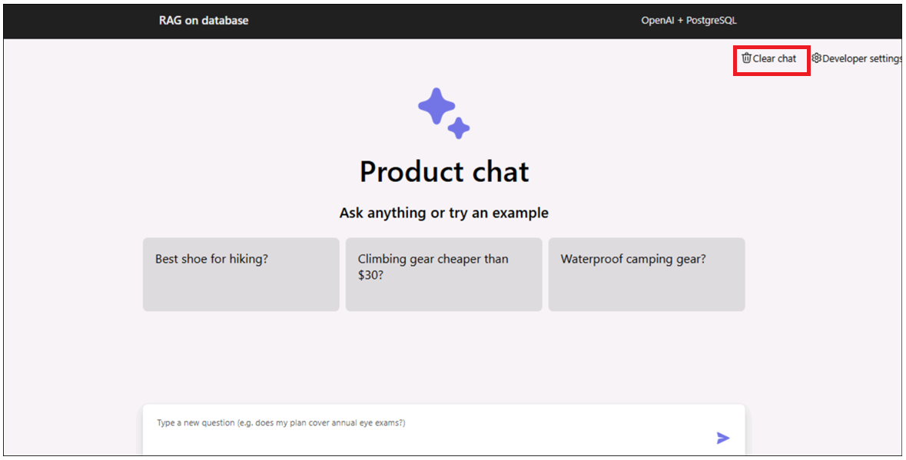

3.  **RAG on database |OpenAI+PoastgreSQL** 웹앱 페이지에서 **Climbing
    gear cheaper than \\30** 버튼을 클릭하고 출력을 관찰하세요

4.  **Clear chat**를 클릭하세요.

### 작업 7: Azure 포털에서 배포된 리소스를 확인하기

1.  Azure 포털의 홈페이지에서 **Resource Groups**를 클릭하세요.

2.  Resource group 이름을 클릭하세요

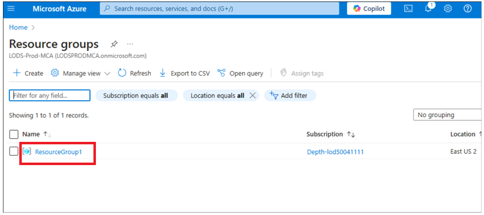

3.  다음 리소스가 성공적으로 배포되었는지 확인하세요

    - Container App

    - Application Insights

    - Container Apps Environment

    - Log Analytics workspace

    - Azure OpenAI

    - Azure Database for PostgreSQL flexible server

    - Container registry

4.  **Azure OpenAI** 리소스 이름을 클릭하세요.

5.  On왼쪽 탐색 메뉴의 **Overview**에서 **Go to Azure AI Foundry
    portal**를 클릭하고 새 탭을 열기 위해 선택하세요.

6.  왼쪽 탐색 메뉴에서 **Shared resources -\>** **Deployments**를
    클릭하고 **gpt-35-turbo**, **text-embedding-ada-002**가 성공적으로
    배포되는지 확인하세요

### 작업 8: 모든 리소스를 정리하기

이 샘플에서 생성한 모든 리소스를 정리하기:

1.  **Azure portal -\> Resource group- \> Resource group name**로 다시
    전환하세요.

2.  모든 리소스를 선택한 다음 아래 이미지와 같이 Delete를 클릭하세요.
    (**DO NOT DELETE** resource group)

3.  텍스트 상자에서 \`\`**delete**\`\` 를 입력하고 **Delete**를
    클릭하세요.

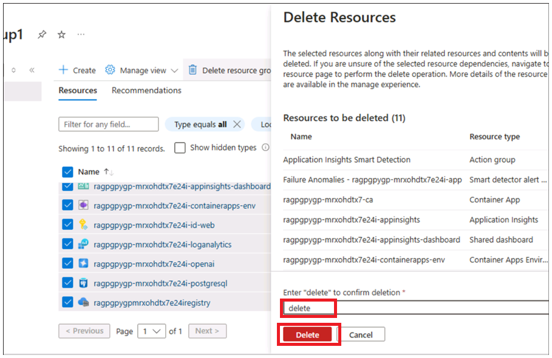

4.  Delete를 클릭하여 삭제를 확인하세요.

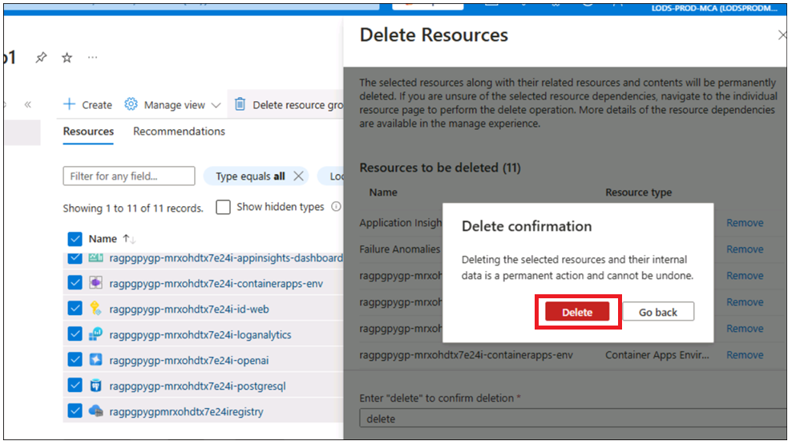

5.  Github 포털 탭으로 다시 전환하고 페이지를 새로 고치세요.

1.  Code를 클릭하고, 이 랩에 대해 생성된 분기를 선택하고, **Delete**를
    클릭하세요

2.  **Delete** 버튼을 클릭하여 브랜치 삭제를 확인하세요.

