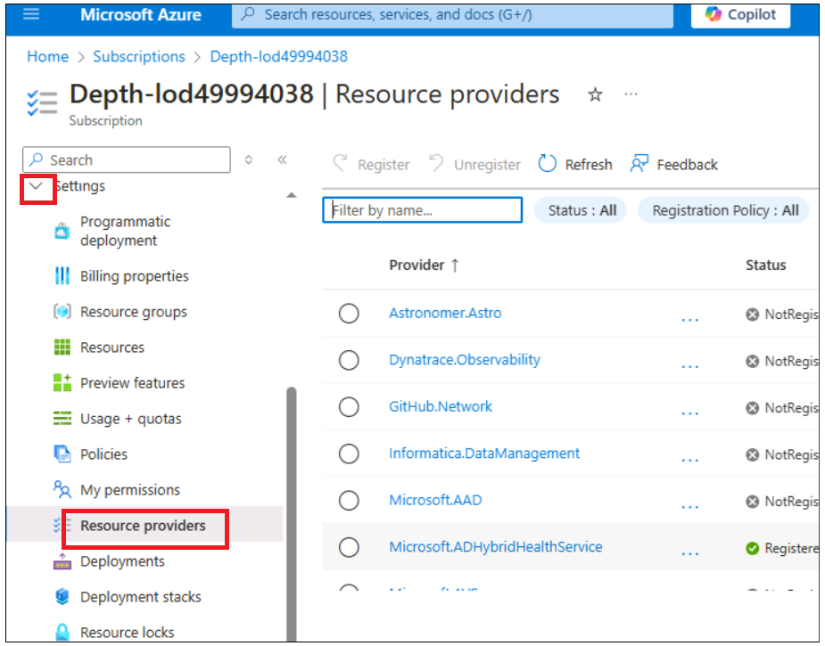
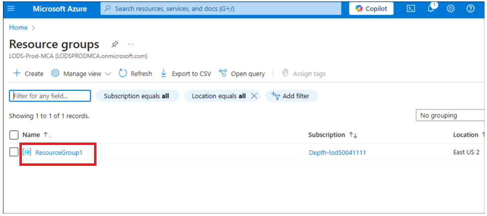

# Usecase 06 - Deploying chat app on Azure Container Apps with PostgreSQL Flexible Server

**Objective:**

- To configure the development environment on Windows by installing
  Azure CLI, Node.js, assigning Azure subscription roles, starting
  Docker Desktop, and enabling Visual Studio Code with Dev Containers
  extension.

- To deploy and test Custom Chat Application with PostgreSQL and OpenAI
  on Azure.

In this use case, you will set up a comprehensive development
environment, deploy a chat application integrated with PostgreSQL, and
verify its deployment on Azure. This involves installing essential tools
like Azure CLI, Docker, and Visual Studio Code ( we have already done it
for you on host env ), configuring user roles in Azure, deploying the
application using Azure Developer CLI, and interacting with the deployed
resources to ensure functionality.

**Key technologies used** -- Python, FastAPI, Azure OpenAI models, Azure
Database for PostgreSQL and azure-container-apps,ai-azd-templates.

**Estimated duration** -- 45 minutes

**Lab Type:** Instructor Led

**Pre-requisites:**

GitHub account -- You are expected to have your own GitHub login
credentials. If you do not have, please create one from here
- **https://github.com/signup?user_email=&source=form-home-signupobjectives**

## Exercise 1 : Provision , deploy the application and test it from the browser

### Task 1: Copy the existing resource group name

1.  Open your browser, open Azure
    portal \`\`https:\\\portal.azure.com\`\`.  Sign in with your Azure
    slice account(Azure Credentials***)*** available under
    instructions/Resources section of your host environment.

2.  On Home page, click on **Resource groups**  tile.

3.  Make sure you already have a resource group created for you to work.
    Never delete this resource group. Instead, you can delete resources
    within the resource group, but not the resource group itself.

4.  Click on resource group name

5.  Copy the resource group name and save it in Notepad to use for
    deploying all resources into this resource group

### Task 2 : Run the Docker

1.  On the Desktop, double click on **Docker Desktop**.

2.  Run the Docker Desktop.

### Task 3 : Register Service provider

1.  Switch back to Azure portal tab, click on **Subscription** tile.

2.  Click on subscription name.

3.  Click on **Settings - \> Resource provider** from left navigation
    menu.

4.  Type \`\`**Microsoft.AlertsManagement**\`\` and press enter. Select
    it and then click on **Register**.

### Task 4 : Open development environment

1.  Open your browser, navigate to the address bar, type or paste the
    following
    URL: \`\`https://github.com/technofocus-pte/rag-postgres-openai-python.git\`\` tab
    opens and ask you to open in Visual studio code. Select **Open
    Visual Studio Code.**

2.  Click on **fork** to fork the repo. Give unique name to the repo and
    click on **Create repo** button.

3.  Click on **Code -\> Codespaces -\> Codespaces+**

4.  Wait for the Codespaces environment to setup .It takes few minutes
    to setup completely

### Task 5: Provision Services and deploy application to Azure

1.  Run the following command on the Terminal. It generates the code to
    copy. Copy the code and press Enter.

\`\`azd auth login\`\`

2.  Default browser opens to enter the generated code to verify. Enter
    the code and click **Next**.

3.  Sign in with your Azure credentials.

4.  To create an environment for Azure resources, run the following
    Azure Developer CLI command.It asks you to enter environment name
    .Enter any name of your choice and press enter (eg :**ragpgpy**)

**Note:** When creating an environment, ensure that the name consists of
lowercase letters.

\`\`azd env new\`\`

5.  Run the following Azure Developer CLI command to provision the Azure
    resources and deploy the code.

\`\`azd provision \`\`

6.  When prompted, select a **subscription** to create the resources and
    select the region closest to your location; in this lab, we have
    chosen the **East US2** region.

7.  It will prompt you “**Enter a value for the
    'existingResourceGroupName' infrastructure parameter:**” enter the
    resource group copied in Task 1 (eg : **ResourceGroup1 used for the
    development slice) .**You can copy the resource group name from
    **Resources** section as shown in below image

> 

8.  When prompted, **enter a value for the 'openAILocation'
    infrastructure parameter** select the region closest to your
    location; in this lab, we have chosen the **North Central
    US** region

9.  Provisioning resource will take around 5 - 10 min. Click **Yes** if
    prompted.

10. Wait for the template to provision all resource successfully.

11. Run below command to set resource group

\`\`azd env set AZURE_RESOURCE_GROUP {your resource group name}\`\`

12. Run below command to deploy the app to Azure.

\`\`azd deploy\`\`

13. Wait for the deployment to complete. Deployment takes \<5

14. Click on the deployed web app endpoint link.

15. Click on **Open**. It opens new tab with app

16. The app opens.

### Task 6: Use chat app to get answers from files

1.  In the **RAG on database |OpenAI+PoastgreSQL** web app page, **click
    on Best shoe for hiking?** button and observe the output

2.  Click on the **clear chat.**

3.  In the **RAG on database |OpenAI+PoastgreSQL** web app page, click
    on **Climbing gear cheaper than \\$30** button and observe the
    output

4.  Click on the **clear chat.**

### Task 7: Verify deployed resources in the Azure portal

1.  On Home page of Azure portal, click on **Resource Groups**.

2.  Click on your resource group name

3.  Make sure the below resource got deployed successfully

    - Container App

    - Application Insights

    - Container Apps Environment

    - Log Analytics workspace

    - Azure OpenAI

    - Azure Database for PostgreSQL flexible server

    - Container registry

4.  Click on **Azure OpenAI** resource name.

5.  On **Overview** in the left navigation menu, click **Go to Azure AI
    Foundry portal** and select to open a new tab.

6.  Click on **Shared resources -\>** **Deployments** from left
    navigation menu and make
    sure **gpt-35-turbo**, **text-embedding-ada-002** should be deployed
    successfully

### Task 8 : Clean up all the resources

To clean up all the resources created by this sample:

1.  Switch back to **Azure portal -\> Resource group- \> Resource group
    name.**

2.  Select all the resource and then click on Delete as shown in below
    image. (**DO NOT DELETE** resource group)

3.  Type \`\`**delete**\`\` on the text box and then click on
    **Delete**.

4.  Confirm the deletion by clicking on **Delete**.

5.  Switch back to Github portal tab and refresh the page.

1.  Click on Code , select the branch created for this lab and click on
    **Delete**.

2.  Confirm the branch deletion by clicking on **Delete** button.

