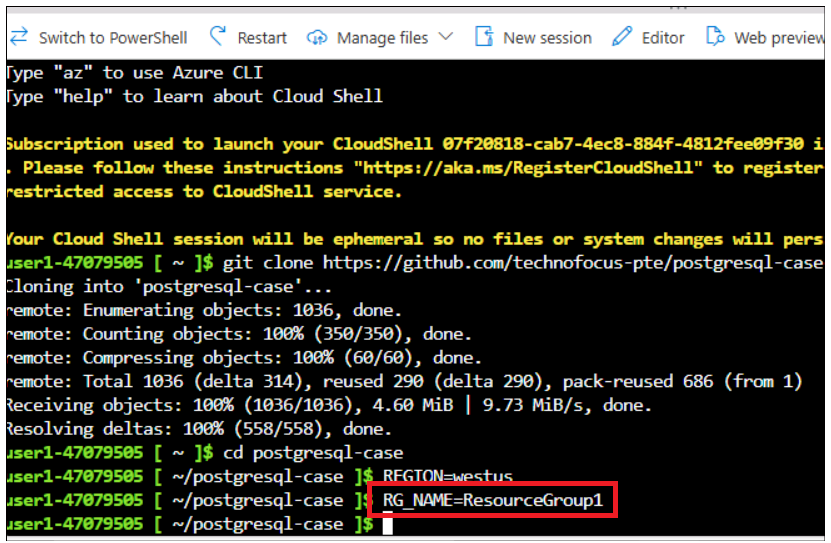
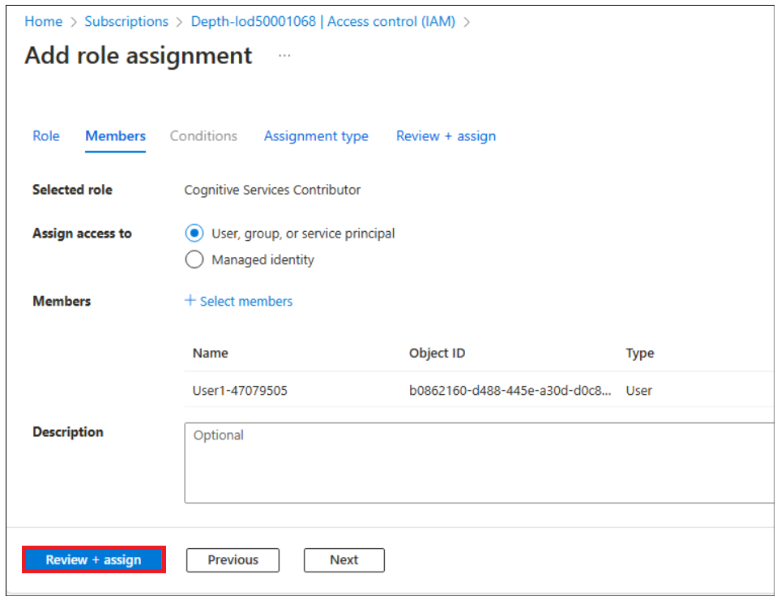
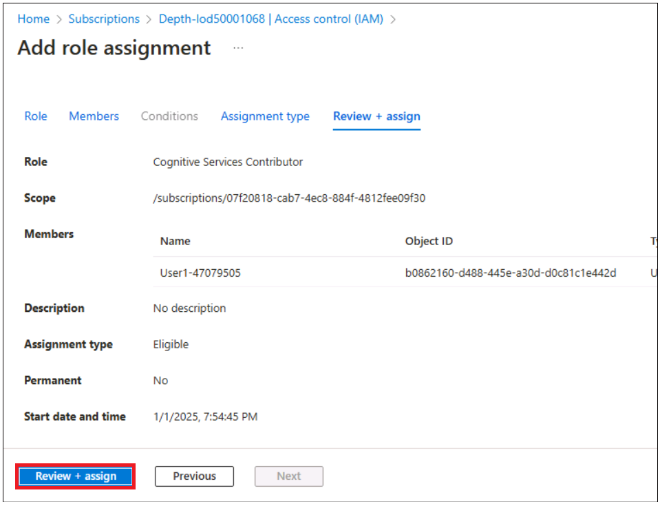
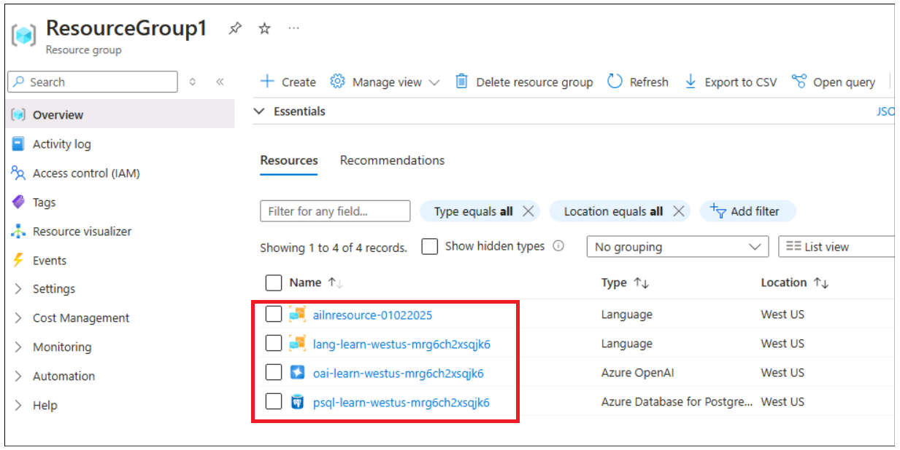
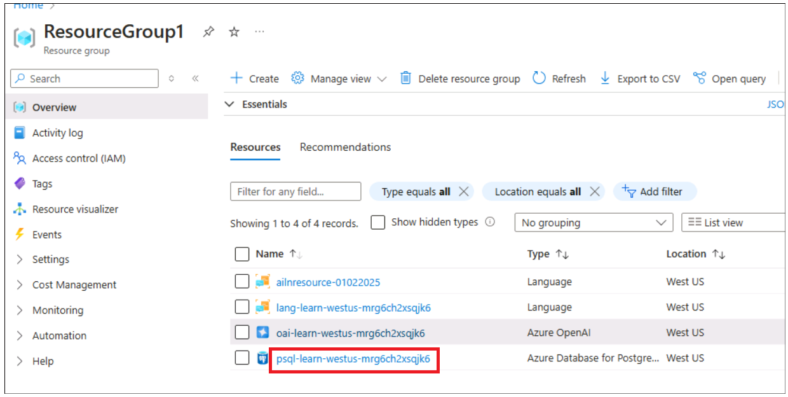
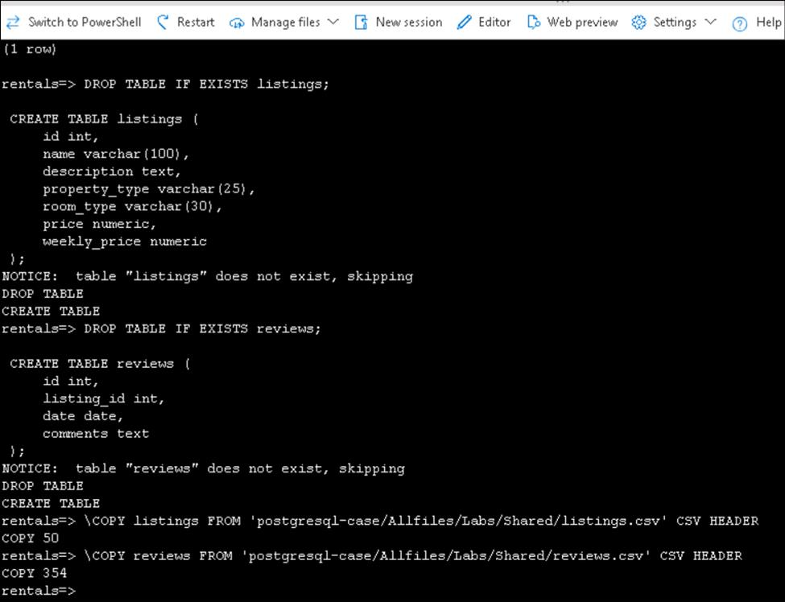
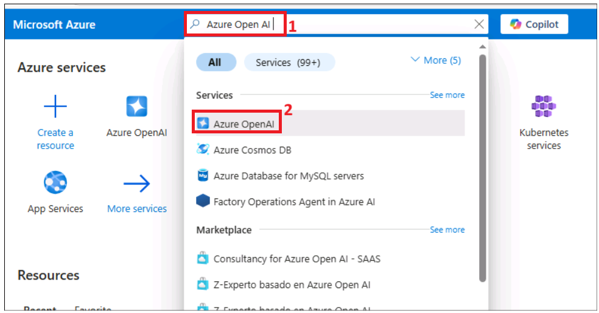
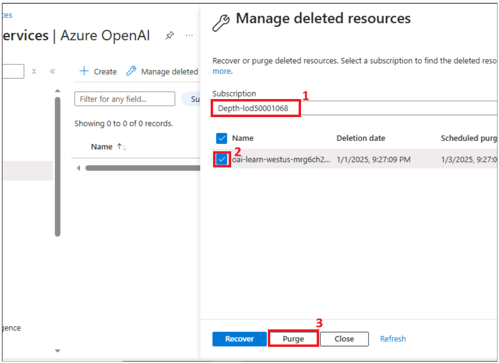
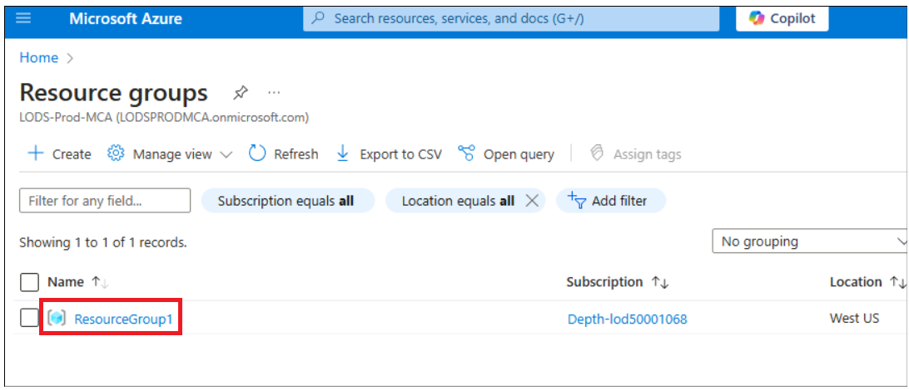

# 用例 07 - 在 Azure Database for PostgreSQL 靈活服務器中啟用 semantic 搜索，以使用 Azure OpenAI 生成向量嵌入。

**目標**:

在此用例中，你將實現語義搜索以生成和存儲嵌入，在 Azure Database for
PostgreSQL 靈活服務器中安裝向量和azure_ai擴展，然後應用擴展來存儲 Azure
OpenAI 生成的嵌入向量

**使用的關鍵技術**-- Azure OpenAI, Azure Database for PostgreSQL, Azure
AI extension

**預計持續時間**-- 45 minutes

**實驗室類型:** Instructor Led

## 練習 1 ：使用 Azure OpenAI 生成向量嵌入

要執行語義搜索，您必須首先從模型生成嵌入向量，將它們存儲在向量數據庫中，然後查詢嵌入向量。您將創建一個數據庫，使用示例數據填充該數據庫，然後針對這些列表運行語義搜索。

在本練習結束時，你將擁有一個啟用了矢量和azure_ai擴展的 Azure Database
for PostgreSQL 靈活服務器實例。您將為 Seattle Airbnb Open Data
數據集的房源表生成嵌入向量。您還將通過生成查詢的嵌入向量並執行向量余弦距離搜索來針對這些列表運行語義搜索。

1.  打開 Web 瀏覽器並導航到\`\`https:\\portal.azure.com/\`\`並使用您的
    Azure 憑據登錄。

2.  選擇 Azure 門戶工具欄中的 Cloud Shell 圖標，在瀏覽器窗口底部打開新的
    Cloud Shell 窗格。選擇 **Bash**。

3.  選擇**“無需存儲帳戶”**單選按鈕，選擇訂閱，然後單擊**“應用**”。

4.  在 Cloud Shell 提示符下，運行以下命令以克隆項目

\`\`git clone https://github.com/technofocus-pte/postgresql-case\`\`

5.  導航到項目文件夾。

**\`\`cd postgresql-case\`\`**

6.  接下來，運行三個命令來定義變量，以減少使用 Azure CLI 命令創建 Azure
    資源時的冗餘鍵入。這些變量表示要分配給資源組的名稱
    （RG_NAME）、將要將資源部署到的 Azure 區域 （REGION） 以及隨機生成的
    PostgreSQL 管理員登錄名密碼 （ADMIN_PASSWORD）。

7.  在第一個命令中，分配給相應變量的區域是 eastus 或 westus， **\[but
    you can replace it with a location of your
    preference.\]{.mark}** 但是，如果替換默認值，則必須選擇另一個
    \[支持抽象摘要的 Azure
    區域\]{.underline}，以確保可以完成此學習路徑中模塊中的所有任務。

\`\`REGION=westus\`\`

8.  以下命令分配要用於資源組的現有資源組名稱，該資源組將容納本練習中使用的所有資源。

> \`\`RG_NAME=Your existing resource group name\`\`

9.  最後一個命令會隨機生成 PostgreSQL 管理員登錄的密碼。
    **請確保將其複製到**安全的位置，以便以後用於連接到 PostgreSQL
    靈活服務器。

> a=()
>
> for i in {a..z} {A..Z} {0..9};
>
> do
>
> a\[$RANDOM\]=$i
>
> done
>
> ADMIN_PASSWORD=$(IFS=; echo "${a\[\*\]::18}")
>
> echo "Your randomly generated PostgreSQL admin user's password is:"

echo $ADMIN_PASSWORD

### 任務 1：分配認知服務參與者

1.  打開新標簽頁並轉到\`\`**https://portal.azure.com\`\`** .使用 Azure
    憑據登錄，然後單擊“**訂閱**”磁貼。

2.  單擊訂閱名稱 .

3.  單擊左側導航菜單中的 Access control （IAM）。單擊 **Add** 並選擇
    **Add role assignment。**

4.  尋找 \`\`Cognitive Services Contributor\`\` 並選擇它，然後單擊
    **下一頁** 按鈕。

5.  選擇 **User， group or service
    principal（用戶、組或服務主體**），然後單擊 **select member
    （選擇成員**） 鏈接。搜索 Azure 訂閱帳戶並選擇它。最後，點擊
    **Select** 按鈕。

6.  單擊 **Review + assign** 按鈕。

7.  再次單擊 **Review + assign** 按鈕。

> 

### 任務 2：運行 Bicep 部署腳本以預配 Azure 資源

1.  使用 Azure CLI 切換回 Azure 門戶的第 1 個選項卡，以執行 Bicep
    部署腳本以在資源組中預配 Azure 資源：部署需要 3 - 5 分鐘

\`\`cd\`\`

\`\`az deployment group create --resource-group $RG_NAME --template-file
"postgresql-case/Allfiles/Labs/Shared/deploy.bicep" --parameters
restore=false adminLogin=pgAdmin adminLoginPassword=$ADMIN_PASSWORD\`\`

2.  Bicep 部署腳本將完成此練習所需的 Azure
    服務預配到資源組中。部署的資源包括 Azure Database for PostgreSQL
    靈活服務器。您可以檢查資源組中的資源。

- **Azure OpenAI,**

- **Azure AI 語言服務.**

3.  單擊 Open AI resource

4.  單擊左側導航菜單中 **Resource Management** 下的 **Keys and
    Endpoint**。記下 Key 1 和 endpoint 以在任務 5 中使用它們

5.  Bicep 腳本還會執行一些配置步驟，例如將 azure_ai 和 vector 擴展添加到
    PostgreSQL 服務器的*允許列表*（通過 azure.extensions
    服務器參數），在服務器上創建名為 rentals 的數據庫，以及使用
    **text-embedding-ada-002** 模型將名為 embedding 的部署添加到 Azure
    OpenAI 服務。

6.  部署通常需要幾分鐘才能完成。您可以從 Cloud Shell
    監控它，也可以導航到您在上面創建的資源組的 **Deployments （部署）**
    頁面，然後觀察其中的部署進度。

7.  資源部署完成後，關閉 Cloud Shell 窗格。

### 任務 3：使用 Azure Cloud Shell 中的 psql 連接到數據庫

在此任務中，您將使用 Azure Cloud Shell 中的 psql 命令行實用程序連接到
Azure Database for PostgreSQL 服務器上的租賃數據庫。

1.  在 Azure 門戶 （https://portal.azure.com/） 中，導航到新創建的 Azure
    Database for PostgreSQL 靈活服務器。

2.  在側邊欄上，選擇 **Server Parameters** 。搜索 **azure.extensions**
    參數。

3.  選擇擴展 **Vector** 和 **AZURE_AI** 如果尚未選擇。

4.  在資源菜單中的 **Settings** 下，選擇 **Databases** 選擇 **Connect**
    作為 rentals 數據庫。

5.  在 Cloud Shell 的“Password for user pgAdmin”提示符下，輸入隨機生成的
    **pgAdmin** 登錄密碼。

登錄後，將顯示 rentals 數據庫的 psql 提示符。

6.  在本練習的其餘部分，您將繼續在 Cloud Shell
    中工作，因此通過選擇窗格右上角的 Maximize （最大化）
    按鈕來擴展瀏覽器窗口中的窗格可能會有所幫助 。

### 任務 4 ：配置擴展

若要存儲和查詢向量以及生成嵌入向量，需要為 Azure Database for PostgreSQL
靈活服務器設置允許列表並啟用兩個擴展：向量和azure_ai。

1.  使用 Azure cli 切換回 Azure 門戶選項卡，並運行以下 SQL
    命令以啟用矢量擴展。有關詳細說明

\`\`CREATE EXTENSION vector;\`\`

2.  要啟用 azure_ai 擴展， **請更新並運行** 以下 SQL 命令。需要 Azure
    OpenAI 資源的終結點和 API 密鑰。

> \`\`CREATE EXTENSION azure_ai;\`\`
>
> \`\`SELECT azure_ai.set_setting('azure_openai.endpoint',
> 'https://\<endpoint\>.openai.azure.com');\`\`

\`\`SELECT azure_ai.set_setting（'azure_openai.subscription_key', '\<API
Key\>');\`\`

### 任務 5 ：使用示例數據填充數據庫

在瀏覽 azure_ai 擴展之前，請向 rentals
數據庫添加幾個表，並使用示例數據填充它們，以便在查看擴展的功能時可以使用信息。

1.  運行以下命令以創建列表和評論表，用於存儲出租物業列表和客戶評論數據：

DROP TABLE IF EXISTS listings;

CREATE TABLE listings (

id int,

name varchar(100),

description text,

property_type varchar(25),

room_type varchar(30),

price numeric,

weekly_price numeric

);

DROP TABLE IF EXISTS reviews;

CREATE TABLE reviews (

id int,

listing_id int,

date date,

comments text

);

2.  接下來，使用 COPY 命令將 CSV
    文件中的數據加載到您上面創建的每個表中。首先，運行以下命令以填充
    listings 表：

\`\`\COPY listings FROM
'postgresql-case/Allfiles/Labs/Shared/listings.csv' CSV HEADER\`\`

命令輸出應為 COPY 50，表示已將 50 行從 CSV 文件寫入表中。

3.  最後，運行以下命令，將客戶評論加載到 reviews 表中：

\`\`\COPY reviews FROM
'postgresql-case/Allfiles/Labs/Shared/reviews.csv' CSV HEADER\`\`

命令輸出應為 COPY 354，表示已將 354 行從 CSV 文件寫入表中。

4.  要重置示例數據，您可以執行 DROP TABLE 列表，然後重複這些步驟。

### 任務 6：創建和存儲嵌入向量

現在我們已經有一些樣本數據，是時候生成和存儲嵌入向量了。azure_ai
擴展使調用 Azure OpenAI 嵌入 API 變得容易。

1.  添加 embedding vector 列。

text-embedding-ada-002 模型配置為返回 1,536
個維度，因此請將其用於向量列大小。

\`\`ALTER TABLE listings ADD COLUMN listing_vector vector(1536);\`\`

2.  通過create_embeddings用戶定義的函數調用 Azure
    OpenAI，為每個列表的描述生成嵌入向量，該函數由 azure_ai 擴展實現：

> UPDATE listings SET listing_vector =
> azure_openai.create_embeddings('embedding', description, max_attempts
> =\> 5, retry_delay_ms =\> 500) WHERE listing_vector IS NULL;

請注意，這可能需要幾分鐘時間，具體取決於可用配額。

### 任務 7 ：執行 Semantic 搜索查詢

現在，您已經使用嵌入向量擴充了列表數據，是時候運行語義搜索查詢了。為此，請獲取查詢字符串
embedding
vector，然後執行余弦搜索以查找其描述在語義上與查詢最相似的列表。

1.  在余弦搜索中使用嵌入（\\=\> 表示余弦距離運算），獲取與查詢最相似的前
    10 個列表。

SELECT id, name FROM listings ORDER BY listing_vector \<=\>
azure_openai.create_embeddings('embedding', 'bright natural
light')::vector LIMIT 10;

您將得到與此類似的結果。結果可能會有所不同，因為不能保證嵌入向量是確定性的：

2.  您還可以投影 description 列，以便能夠讀取其 description
    在語義上相似的匹配行的文本。例如，此查詢返回最佳匹配項：

SELECT id, description FROM listings ORDER BY listing_vector \<=\>
azure_openai.create_embeddings('embedding', 'bright natural
light')::vector LIMIT 1;

這將打印出如下內容：

要直觀地理解語義搜索，請注意描述實際上不包含術語 “bright” 或
“natural”。但它確實突出了 “夏天” 和 “陽光”、“窗戶” 和 “天花板窗戶”。

### 任務 8 ： 檢查您的工作

執行上述步驟後，房源表包含來自 Kaggle 上西雅圖 Airbnb Open Data
的示例數據。這些列表通過嵌入向量進行擴充，以執行語義搜索。

1.  確認商品表有四列：id、name、description 和 listing_vector。

\`\`\d listings\`\`

它應該打印類似:

2.  確認至少有一行具有填充的 listing_vector 列.

\`\`SELECT COUNT(\*) \> 0 FROM listings WHERE listing_vector IS NOT
NULL;\`\`

結果必須顯示 t，表示 true。指示至少有一行包含其相應 description
列的嵌入：

3.  確認嵌入向量有 1536 個維度：

\`'選擇 vector_dims(listing_vector) FROM listing_vector 不為 NULL 的商品
LIMIT 1;\`\`

Yielding:

4.  確認語義搜索返回結果。

在余弦搜索中使用 embedding，獲取與查詢最相似的前 10 個列表。

\`\`SELECT id, name FROM listings ORDER BY listing_vector \<=\>
azure_openai.create_embeddings('embedding', 'bright natural
light')::vector LIMIT 10;\`\`

5.  請返回同一頁面以繼續下一個任務。

## 練習 2 - 為推薦系統創建搜索函數

讓我們將向量嵌入邏輯和 API 調用包裝在一個函數中。在本練習中，你將在
Azure Database for PostgreSQL 靈活服務器中安裝 vector 和 azure_ai
擴展，並探索該擴展將 [Azure
OpenAI](https://learn.microsoft.com/en-us/azure/ai-services/openai/overview)
集成到 database.

### 任務 1 ：為推薦系統創建搜索函數

讓我們使用語義搜索構建一個推薦系統。系統將根據提供的示例列表推薦多個列表。該示例可能來自用戶正在查看的列表或其首選項。我們將利用
azure_openai 擴展將系統實現為 PostgreSQL 函數。

在本練習結束時，您將定義一個函數recommend_listing，該函數最多提供與提供的
sampleListingId 最相似的 numResults
列表。您可以使用這些數據來推動新的機會，例如將推薦商品與打折商品合併。

將資源部署到 Azure 訂閱中

此步驟將指導您使用 Azure Cloud Shell 中的 Azure CLI 命令創建資源組並運行
Bicep 腳本，以將完成此練習所需的 Azure 服務部署到 Azure 訂閱中。

**注意：**如果您在此學習路徑中學習多個模塊，則可以在它們之間共享 Azure
環境。在這種情況下，您只需完成此資源部署步驟一次。

### 任務 2 ：創建推薦函數

1.  推薦函數採用 sampleListingId 並返回 numResults
    最相似的其他列表。為此，它會創建示例列表的名稱和描述的嵌入，並針對列表嵌入運行該查詢向量的語義搜索。

> CREATE FUNCTION
>
> recommend_listing(sampleListingId int, numResults int)
>
> RETURNS TABLE(
>
> out_listingName text,
>
> out_listingDescription text,
>
> out_score real)
>
> AS $$
>
> DECLARE
>
> queryEmbedding vector(1536);
>
> sampleListingText text;
>
> BEGIN
>
> sampleListingText := (
>
> SELECT
>
> name || ' ' || description
>
> FROM
>
> listings WHERE id = sampleListingId
>
> );
>
> queryEmbedding := (
>
> azure_openai.create_embeddings('embedding', sampleListingText,
> max_attempts =\> 5, retry_delay_ms =\> 500)
>
> );
>
> RETURN QUERY
>
> SELECT
>
> name::text,
>
> description,
>
> -- cosine distance:
>
> (listings.listing_vector \<=\> queryEmbedding)::real AS score
>
> FROM
>
> listings
>
> ORDER BY score ASC LIMIT numResults;
>
> END $$
>
> LANGUAGE plpgsql;

### 任務 3 ：查詢推薦函數

1.  要查詢推薦函數，請向其傳遞列表 ID 和它應提出的推薦數量。

select out_listingName, out_score from recommend_listing( (SELECT id
from listings limit 1), 20); -- search for 20 listing recommendations
closest to a listing

結果將類似於:

2.  若要查看函數運行時，請確保 **在 Azure
    門戶的**“服務器參數**”部分中啟用了 track_functions（可以使用 PL 或
    ALL）：**

### 任務 4 ： 檢查您的工作

1.  確保該函數存在且簽名正確：

\`\`\df recommend_listing\`\`

You should see the following:

2.  確保您可以使用以下查詢來查詢它：

select out_listingName, out_score from recommend_listing( (SELECT id
from listings limit 1), 20); -- search for 20 listing recommendations
closest to a listing

### 任務 5 ： 清理

完成本練習後，請刪除您創建的 Azure
資源。您需要為配置的容量付費，而不是為數據庫的使用量付費。按照這些說明刪除您的資源組以及您為此實驗室創建的所有資源。

1.  在主頁上，搜索 **Azure Open AI** 並選擇它。

2.  選擇 Open AI 資源，然後單擊 **Delete** 。

3.  在文本框中**鍵入** delete **，然後單擊 \*\*Delete。** 確認刪除。

4.  單擊 **Manage deleted resources**，選擇資源，然後單擊 **Purge**
    按鈕，如下圖所示。

5.  單擊 Yes 確認清除。

6.  在主頁上，選擇“ **Azure 服務”下的**“資源組”。

7.  單擊 Resource group name。

8.  在 資源組的 Overview 頁面上，選擇**所有資源，**然後單擊 **Delete
    。請勿刪除 RESOURCE Group。**

> 

9.  鍵入 **Delete** 並單擊 Delete。單擊 Delete 按鈕確認刪除資源 。

**總結**

你瞭解了如何在 Azure Database for PostgreSQL
靈活服務器中使用語義搜索，以使用 Azure OpenAI
生成的嵌入進行查詢。您通過以下方式完成了此搜索：

- 啟用 vector 和 azure_ai 擴展。

- 創建向量列以存儲嵌入向量。

- 生成和存儲嵌入。

- 使用查詢向量查詢數據庫。
