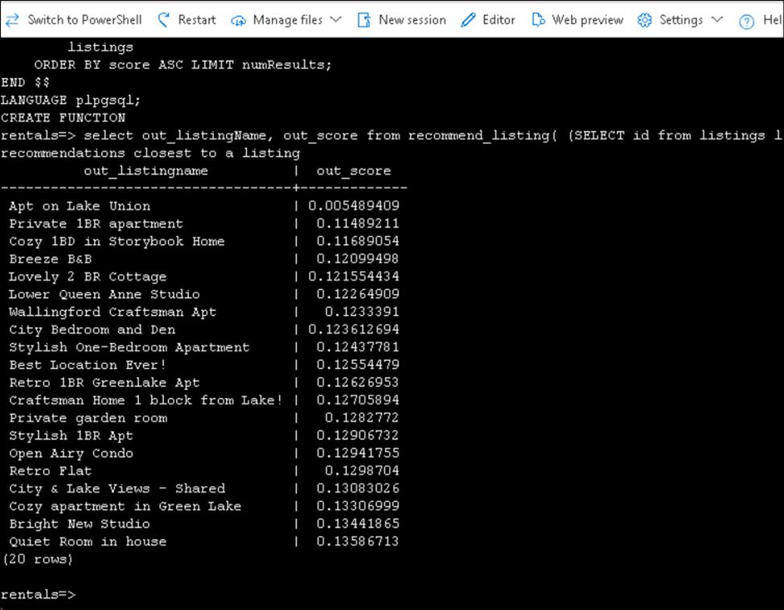

# Usecase 07 - Enabling semantic search in Azure Database for PostgreSQL flexible server to use Azure OpenAI to generate vector embeddings.

**Objective** :

In this use case, you implement semantic search to generate and store
embeddings, install the vector and azure_ai extensions in an Azure
Database for PostgreSQL flexible server, then apply the extensions to
store embedding vectors generated by Azure OpenAI

**Key technologies used** -- Azure OpenAI, Azure Database for
PostgreSQL, Azure AI extension

**Estimated duration** -- 45 minutes

**Lab Type:** Instructor Led

## Exercise 1 :Generate vector embeddings with Azure OpenAI

To perform semantic searches, you must first generate embedding vectors
from a model, store them in a vector database, and then query the
embeddings. You'll create a database, populate it with sample data, and
run semantic searches against those listings.

By the end of this exercise, you'll have an Azure Database for
PostgreSQL flexible server instance with the vector and azure_ai
extensions enabled. You'll generate embeddings for the Seattle Airbnb
Open Data dataset's listings table. You'll also run semantic searches
against these listings by generating a query's embedding vector and
performing a vector cosine distance search.

1.  Open a web browser and navigate to
    the `https://portal.azure.com`

2.  Select the **Cloud Shell** icon in the Azure portal toolbar to open
    a new Cloud Shell pane at the bottom of your browser window.
    Select **Bash**.


3.  Select **No storage account required** radio button, select your
    subscription and then click on **Apply**.


4.  At the Cloud Shell prompt, run below command to clone the project

    +++git clone https://github.com/technofocus-pte/postgresql-case+++


5.  Navigate to the project folder.

    +++cd postgresql-case+++


6.  Next, you run three commands to define variables to reduce redundant
    typing when using Azure CLI commands to create Azure resources. The
    variables represent the name to assign to your resource group
    (RG_NAME), the Azure region (REGION) into which resources will be
    deployed, and a randomly generated password for the PostgreSQL
    administrator login (ADMIN_PASSWORD).

7.  In the first command, the region assigned to the corresponding
    variable is eastus or westus, **\[but you can replace it with a
    location of your preference.\]{.mark}** However, if replacing the
    default, you must select another \[Azure region that supports
    abstractive summarization\]{.underline} to ensure you can complete
    all of the tasks in the modules in this learning path.

    +++REGION=westus+++

8.  The following command assigns the name to be used for the resource
    group that will house all the resources used in this exercise. The
    resource group name assigned to the corresponding variable is
    rg-learn-postgresql-ai-\\$REGION, where \\$REGION is the location
    you specified above. However, you can change it to any other
    resource group name that suits your preference.

    +++RG_NAME=rg-learn-postgresql-ai$RANDOM-rg+++


9.  The final command randomly generates a password for the PostgreSQL
    admin login. **Make sure you copy it** to a safe place to use later
    to connect to your PostgreSQL flexible server.

    ```
    a=()
    for i in {a..z} {A..Z} {0..9}; 
    do
    a[$RANDOM]=$i
    done
    ADMIN_PASSWORD=$(IFS=; echo "${a[*]::18}")
    echo "Your randomly generated PostgreSQL admin user's password is:"
    ```

    +++echo $ADMIN_PASSWORD+++


10. Run the following Azure CLI command to create your resource group:

    +++az group create --name $RG_NAME --location $REGION+++


### Task 1 : Assign Cognitive Services Contributor

1.  Open a browser and go to `https://portal.azure.com` and sign in with
    your Azure subscription and then click on **Subscription** tile.


2.  Click on subscription name .


3.  Click on Access control (IAM) from left navigation menu.
    Click **Add** and select **Add role assignment.**


4.  Search for `Cognitive Services Contributor` and select it and
    then click on **Next** button.


5.  Select **User, group or service principal** and click on
    the **select member** link. Search for your Azure subscription
    account and select it. Finally, click on **Select** button.


6.  Click on the **Review + assign** button.


### Task 2 : Set up an Azure Text Analytics resource

Use the following steps to create a Text Analytics resource in your
Azure subscription:

1.  In another browser tab, open the Azure portal
    at:  `https://portal.azure.com`

2.  In the search bar type `Azure AI services` And select it.


3.  In **Overview** section from left navigation menu, click on Create
    under **Language service.**


4.  Click on **Continue to create your resource** button without select
    any features.


5.  Select below values and then scroll down.

- Subscription: Select your Azure subscription

- Resource group -- select your resource group

- Region -- West US (Select the region near to you)

- Name - `ailnresource-XXX`( XXX can be unique number)

- Pricing tier -- **Free F0**


6.  Select "**By checking this box I certify that I have reviewed and
    acknowledge the terms in the Responsible AI Notice**." Check box and
    then click on the **Review + Create** button.


7.  Click on **Create** button now.


8.  Wait for the deployment to complete.


### Task 3 : Run Bicep deployment script to provision Azure resources

1.  Switch back to the 1st tab of Azure portal with Azure CLI to execute
    a Bicep deployment script to provision Azure resources in your
    resource group: Deployment takes 3 - 5min

    +++cd+++

+++az deployment group create --resource-group $RG_NAME --template-file "postgresql-case/Allfiles/Labs/Shared/deploy.bicep" --parameters restore=false adminLogin=pgAdmin adminLoginPassword=$ADMIN_PASSWORD+++


2.  The Bicep deployment script provisions the Azure services required
    to complete this exercise into your resource group. The resources
    deployed include an Azure Database for PostgreSQL - Flexible Server.
    You can check resources in your resource group.

- **Azure OpenAI,**

- **Azure AI Language service.**


3.  Click on Open Ai resource


4.  Click on **Keys and Endpoint** under **Resource Management** from
    left navigation menu. Make a note of Key 1 and endpoint to use them
    in Task 5


5.  The Bicep script also performs some configuration steps, such as
    adding the azure_ai and vector extensions to the PostgreSQL
    server's *allowlist* (via the azure.extensions server parameter),
    creating a database named rentals on the server, and adding a
    deployment named embedding using the **text-embedding-ada-002**
    model to your Azure OpenAI service.


6.  The deployment typically takes several minutes to complete. You can
    monitor it from the Cloud Shell or navigate to
    the **Deployments** page for the resource group you created above
    and observe the deployment progress there.

7.  Close the Cloud Shell pane once your resource deployment is
    complete.

### Task 4 : Connect to your database using psql in the Azure Cloud Shell

In this task, you connect to the rentals database on your Azure Database
for PostgreSQL server using the psql command-line utility from the Azure
Cloud Shell.

1.  In the Azure portal - `https://portal.azure.com/` , navigate to your
    newly created Azure Database for PostgreSQL - Flexible Server.


2.  In the resource menu, under **Settings**,
    select **Databases** select **Connect** for the rentals database.


3.  At the "Password for user pgAdmin" prompt in the Cloud Shell, enter
    the randomly generated password for the **pgAdmin** login.

Once logged in, the psql prompt for the rentals database is displayed.


4.  Throughout the remainder of this exercise, you continue working in
    the Cloud Shell, so it may be helpful to expand the pane within your
    browser window by selecting the **Maximize** button at the top right
    of the pane.


### Task 5 : Setup: Configure extensions

To store and query vectors, and to generate embeddings, you need to
allow-list and enable two extensions for Azure Database for PostgreSQL
Flexible Server: vector and azure_ai.

1.  To allow-list both extensions, add vector and azure_ai to the server
    parameter azure.extensions,

2.  Switch back Azure portal, select your Azure Database for PostgreSQL
    flexible server instance.


3.  On the sidebar, select **Server Parameters**.


4.  Search for the `azure.extensions` parameter.


5.  Select extensions **Vector** and **AZURE_AI**


6.  Switch back the Azure portal tab with Azure cli and run the
    following SQL command to enable the vector extension. For detailed
    instructions

    +++CREATE EXTENSION vector;+++


7.  To enable the azure_ai extension, **update and run** the following
    SQL command. You’ll need the endpoint and API key for the Azure
    OpenAI resource.

    +++CREATE EXTENSION azure_ai;+++

+++SELECT azure_ai.set_setting('azure_openai.endpoint', 'https://<endpoint>.openai.azure.com');+++
 

+++SELECT azure_ai.set_setting('azure_openai.subscription_key', '<API Key>');`+++


### Task 6 : Populate the database with sample data

Before you explore the azure_ai extension, add a couple of tables to the
rentals database and populate them with sample data so you have
information to work with as you review the extension's functionality.

1.  Run the following commands to create the listings and reviews tables
    for storing rental property listing and customer review data:

    ```
    DROP TABLE IF EXISTS listings;
    CREATE TABLE listings (
    id int,
    name varchar(100),
    description text,
    property_type varchar(25),
    room_type varchar(30),
    price numeric,
    weekly_price numeric
    );
    ```


+++DROP TABLE IF EXISTS reviews;+++


```
CREATE TABLE reviews (
id int,
listing_id int, 
date date,
comments text
);
```


2.  Next, use the COPY command to load data from CSV files into each
    table you created above. Start by running the following command to
    populate the listings table:

+++\COPY listings FROM 'postgresql-case/Allfiles/Labs/Shared/listings.csv' CSV HEADER+++

The command output should be COPY 50, indicating that 50 rows were
written into the table from the CSV file.


3.  Finally, run the command below to load customer reviews into the
    reviews table:

+++\COPY reviews FROM 'postgresql-case/Allfiles/Labs/Shared/reviews.csv' CSV HEADER+++

The command output should be COPY 354, indicating that 354 rows were
written into the table from the CSV file.



4.  To reset your sample data, you can execute DROP TABLE listings, and
    repeat these steps.

### Task 7 : Create and store embedding vectors

Now that we have some sample data, it's time to generate and store the
embedding vectors. The azure_ai extension makes calling the Azure OpenAI
embedding API easy.

1.  Add the embedding vector column.

The text-embedding-ada-002 model is configured to return 1,536
dimensions, so use that for the vector column size.

 +++ALTER TABLE listings ADD COLUMN listing_vector vector(1536);+++


2.  Generate an embedding vector for the description of each listing by
    calling Azure OpenAI through the create_embeddings user-defined
    function, which is implemented by the azure_ai extension:

```
UPDATE listings
SET listing_vector = azure_openai.create_embeddings('embedding', description, max_attempts => 5, retry_delay_ms => 500)
WHERE listing_vector IS NULL;
```

>Note that this may take several minutes, depending on the available
quota.


### Task 8 :Perform a semantic search query

Now that you have listing data augmented with embedding vectors, it's
time to run a semantic search query. To do so, get the query string
embedding vector, then perform a cosine search to find the listings
whose descriptions are most semantically similar to the query.

1.  Use the embedding in a cosine search (<=> represents cosine
    distance operation), fetching the top 10 most similar listings to
    the query.


+++SELECT id, name FROM listings ORDER BY listing_vector <=> azure_openai.create_embeddings('embedding', 'bright natural light')::vector LIMIT 10;+++
   

You’ll get a result similar to this. Results may vary, as embedding
vectors are not guaranteed to be deterministic:


2.  You may also project the description column to be able to read the
    text of the matching rows whose descriptions were semantically
    similar. For example, this query returns the best match:

++++SELECT id, description FROM listings ORDER BY listing_vector <=> azure_openai.create_embeddings('embedding', 'bright natural light')::vector LIMIT 1;+++
    

Which prints something like:


To intuitively understand semantic search, observe that the description
doesn't actually contain the terms "bright" or "natural." But it does
highlight "summer" and "sunlight," "windows," and a "ceiling window."

### Task 9 : Check your work

After performing the above steps, the listings table contains sample
data from [Seattle Airbnb Open
Data](https://www.kaggle.com/datasets/airbnb/seattle/data?select=listings.csv) on
Kaggle. The listings were augmented with embedding vectors to execute
semantic searches.

1.  Confirm the listings table has four columns: id, name, description,
    and listing_vector.

+++\d listings+++

It should print something like:


2.  Confirm that at least one row has a populated listing_vector column.

+++SELECT COUNT(*) > 0 FROM listings WHERE listing_vector IS NOT NULL;+++

The result must show a t, meaning true. An indication that there’s at
least one row with embeddings of its corresponding description column:


3.  Confirm the embedding vector has 1536 dimensions:

+++SELECT vector_dims(listing_vector) FROM listings WHERE listing_vector IS NOT NULL LIMIT 1;+++

Yielding:


4.  Confirm that semantic searches return results.

Use the embedding in a cosine search, fetching the top 10 most similar
listings to the query.

+++SELECT id, name FROM listings ORDER BY listing_vector <=> azure_openai.create_embeddings('embedding', 'bright natural light')::vector LIMIT 10;+++


5.  Open a browser and go to the Azure portal- https:\portal.azure.com
    and sign in with your Azure subscription account. On home page,
    select Resource groups tile under Azure services.


## Exercise 2 - Create a search function for a recommendation system

Let's wrap the vector embedding logic and API calls in a function. In
this exercise, you install the vector and azure_ai extensions in an
Azure Database for PostgreSQL flexible server and explore the
extension's capabilities for integrating [Azure
OpenAI](https://learn.microsoft.com/en-us/azure/ai-services/openai/overview) into
your database.

### Create a search function for a recommendation system

Let's build a recommendation system using semantic search. The system
will recommend several listings based on a provided sample listing. The
sample could be from the listing the user is viewing or their
preferences. We'll implement the system as a PostgreSQL function
leveraging the azure_openai extension.

By the end of this exercise, you'll have defined a function
recommend_listing that provides at most numResults listings most similar
to the supplied sampleListingId. You can use this data to drive new
opportunities, such as joining recommended listings against discounted
listings.

Deploy resources into your Azure subscription

This step guides you through using Azure CLI commands from the Azure
Cloud Shell to create a resource group and run a Bicep script to deploy
the Azure services necessary for completing this exercise into your
Azure subscription.

>**Note:** If you are doing multiple modules in this learning path, you
can share the Azure environment between them. In that case, you only
need to complete this resource deployment step once.

### Task 1 : Connect to your database using psql in the Azure Cloud Shell

In this task, you connect to the rentals database on your Azure Database
for PostgreSQL server using the psql command-line utility from the Azure
Cloud Shell.

1.  In the Azure portal, navigate to your newly created Azure Database
    for **PostgreSQL - Flexible Server.**

2.  In the resource menu, under **Settings**,
    select **Databases** select **Connect** for the rentals database.


3.  At the “Password for user pgAdmin” prompt in the Cloud Shell, enter
    the randomly generated password for the **pgAdmin** login.

Once logged in, the psql prompt for the rentals database is displayed.

4.  Throughout the remainder of this exercise, you continue working in
    the Cloud Shell, so it may be helpful to expand the pane within your
    browser window by selecting the **Maximize** button at the top right
    of the pane.


### Task 2 : Create the recommendation function

1.  The recommendation function takes a sampleListingId and returns the
    numResults most similar other listings. To do so, it creates an
    embedding of the sample listing's name and description and runs a
    semantic search of that query vector against the listing embeddings.

    ```
    CREATE FUNCTION
    recommend_listing(sampleListingId int, numResults int) 
    RETURNS TABLE(
       out_listingName text,
    out_listingDescription text,
    out_score real)
    AS $$ 
    DECLARE
    queryEmbedding vector(1536); 
    sampleListingText text; 
    BEGIN 
    sampleListingText := (
    SELECT
               name || ' ' || description
    FROM
    listings WHERE id = sampleListingId
    ); 

    queryEmbedding := (
    azure_openai.create_embeddings('embedding', sampleListingText, max_attempts => 5, retry_delay_ms => 500)
    );

    RETURN QUERY 
    SELECT
    name::text,
    description,
    -- cosine distance:
    (listings.listing_vector <=> queryEmbedding)::real AS score
    FROM
   listings 
    ORDER BY score ASC LIMIT numResults;
    END $$
    LANGUAGE plpgsql; 
    ```


### Task 3 : Query the recommendation function

1.  To query the recommendation function, pass it a listing ID and the
    number of recommendations it should make.

 +++select out_listingName, out_score from recommend_listing( (SELECT id from listings limit 1), 20); -- search for 20 listing recommendations closest to a listing+++


The result will be something like:


2.  To see the function runtime, make sure `track_functions` is
    enabled in the **Server Parameters** section on the Azure Portal
    (you can use PL or ALL):


### Task 4 : Check your work

1.  Make sure the function exists with the correct signature:

+++\df recommend_listing+++

You should see the following:


2.  Make sure you can query it using the following query:

select out_listingName, out_score from recommend_listing( (SELECT id
from listings limit 1), 20); -- search for 20 listing recommendations
closest to a listing


### Task 5 : Clean up

Once you have completed this exercise, delete the Azure resources you
created. You are charged for the configured capacity, not how much the
database is used. Follow these instructions to delete your resource
group and all resources you created for this lab.

1.  On Home page, Search for **Azure Open AI** and select it.


2.  Select the Open AI resource and then click on **Delete** .


3.  Type `delete` in the text box and then click on **Delete.** Confirm deletion.


4.  Click on **Manage deleted resources**, select the resource and then
    click on **Purge** button as shown in below image.


5.  Confirm purge by clicking on Yes.


6.  On the home page, select **Resource groups** under Azure services.


7.  On the **Overview** page of your resource group, select **Delete
    resource group**.


8.  Copy the resource group name, enter it in the text box and
    hit **Delete**.


9.  Confirmation deletion by clicking on **Delete** butto


>**Summary**:You learned about using semantic search in Azure Database for PostgreSQL Flexible Server to query using embeddings generated by Azure OpenAI. You accomplished this search by:

- Enabling the vector and azure_ai extensions.

- Creating vector columns to store embeddings.

- Generating and storing embeddings.

- Querying the database using a query vector.
