# Usecase 08 - Building and deploying Contoso Real Estate chat app to support customers.

**Objective**

This usecase demonstrates a few approaches for creating ChatGPT-like
experiences over your own data using the Retrieval Augmented Generation
pattern. It uses Azure OpenAI Service to access the ChatGPT model
(gpt-35-turbo), and Azure AI Search for data indexing and retrieval.

The usecase includes sample data so it's ready to try end to end. In
this sample application we use a fictitious company called Contoso Real
Estate, and the experience allows its customers to ask support questions
about the usage of its products. The sample data includes a set of
documents that describe its terms of service, privacy policy and a
support guide.

The application is made from multiple components, including:

- **Search service**: the backend service that provides the search and
  retrieval capabilities.

- **Indexer service**: the service that indexes the data and creates the
  search indexes.

- **Web app**: the frontend web application that provides the user
  interface and orchestrates the interaction between the user and the
  backend services.

- Chat and Q&A interfaces

- Explores various options to help users evaluate the trustworthiness of
  responses with citations, tracking of source content, etc.

- Shows possible approaches for data preparation, prompt construction,
  and orchestration of interaction between model (ChatGPT) and retriever
  (Azure AI Search)

- Settings directly in the UX to tweak the behavior and experiment with
  options

- Optional performance tracing and monitoring with Application Insights

**Key technologies used** -- Azure OpenAI Service, ChatGPT model
(gpt-35-turbo), and Azure AI Search

**Estimated duration --** 40 minutes

## Exercise 1 : Deploy the application and test it from the browser

### Task 1: Open development environment

1.  Open your browser, navigate to the address bar, type or paste the
    following
    URL: \`\`https://github.com/technofocus-pte/azure-search-openai-javascript\`\` and
    sign in with your Github account.

2.  Click on **Fork**.

3.  Enter the repository name and then click on **Create fork**.

4.  Click on **Code -\> Codespaces -\> +**

5.  Wait for the environment to setup. It takes 5-10 minutes.

### Task 2: Provision required services to build and deploy chat app to Azure

1.  Run the following command on the Terminal. Copy the code and press
    enter.

\`\`azd auth login\`\`

2.  Default browser opens to enter a code.Enter the copied code and
    click **Next**.

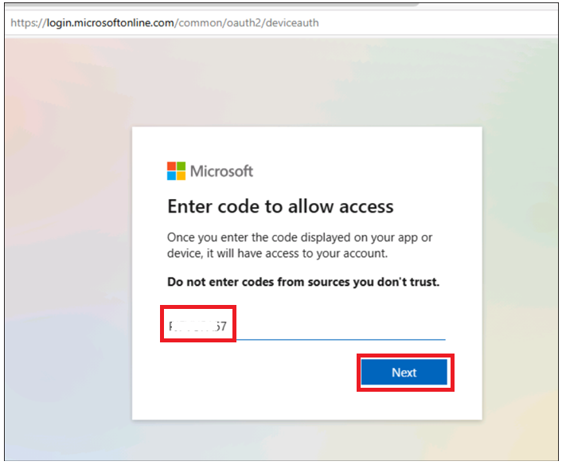

3.  Sign in with your Azure credentials.

6.  Switch back to Github Codespace tab. Run below command to Initialize
    the project environment in the current directory. Enter the
    Environment name as \`\`**ragpgpy \`\`** and press Enter.

Note : env name should be unique

\`\` azd env new\`\`

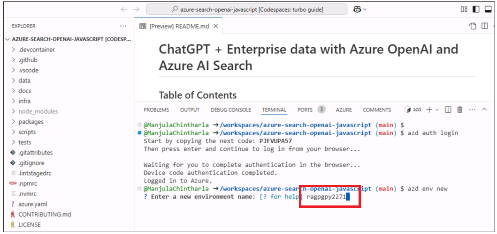

7.  Run below command to provision the services to Azure, build your
    container.

8.  Select below values.

> \`\`azd provision\`\`

- **Select an Azure Subscription to use** : select your subscription

- **Select an Azure location to use** : **East us2/west us2**
  (Sometimes, East US might not be available, choose location from the
  list mentioned below.)

- Select existing resource group : Your existing resource group (eg
  :**ResourceGroup1 )**

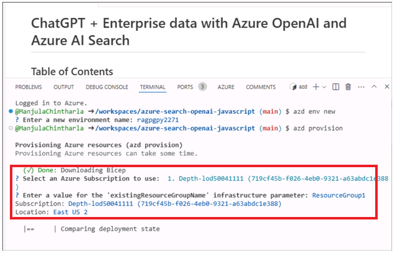

9.  Wait for the resource to provision completely. This process wil take
    5-10 min to create al the required resources.

> 

### Task 3 : Deploy the chat app and explore it

10. Run the below command to deploy the app.

\`\`azd deploy\`\`

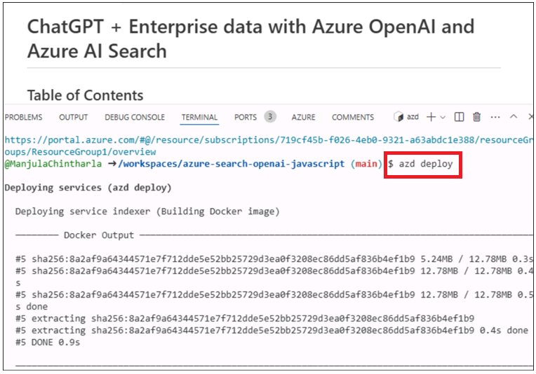

11. Wait for the deployment .It takes \< 5 minutes.

12. Click on the endpoint url generated.

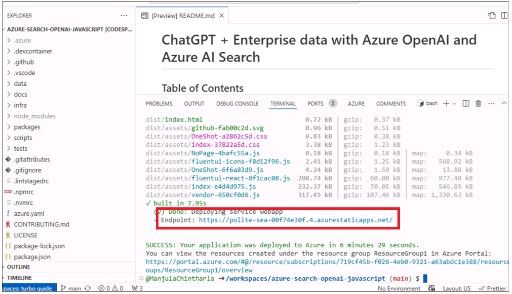

13. Click on **Open**.

14. It opens app in new tab.

15. Select **How to search and book rental?** Container and then click
    on enter button next to the text box.

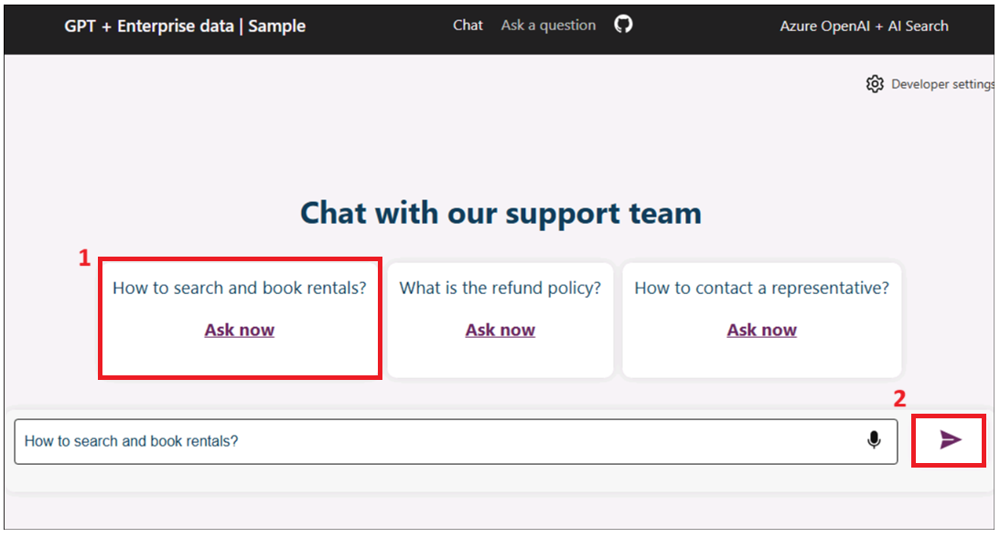

### Task 4 : Clean up all the resources

1.  Switch back to **Azure portal -\> Resource group- \> Resource group
    name.**

2.  Select all the resource and then click on Delete as shown in below
    image. (**DO NOT DELETE** resource group)

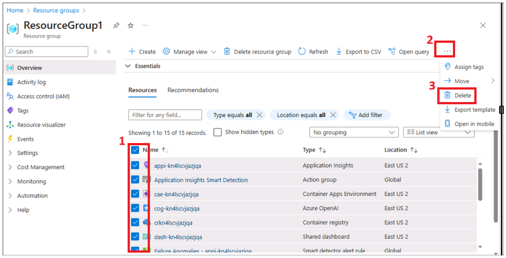

3.  Type \`\`**delete**\`\` on the text box and then click on
    **Delete**.

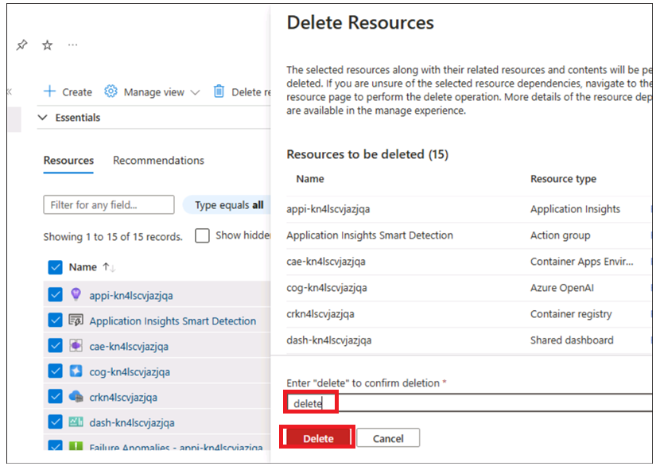

4.  Confirm the deletion by clicking on **Delete**.

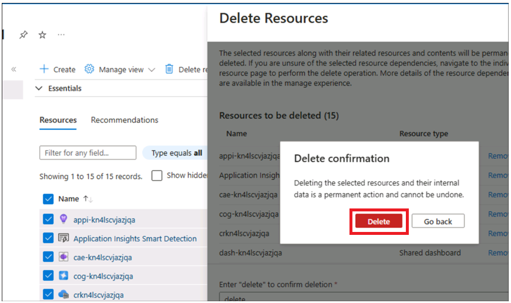

5.  Switch back to Github portal tab and refresh the page.

6.  Click on Code , select the branch created for this lab and click on
    **Delete**.

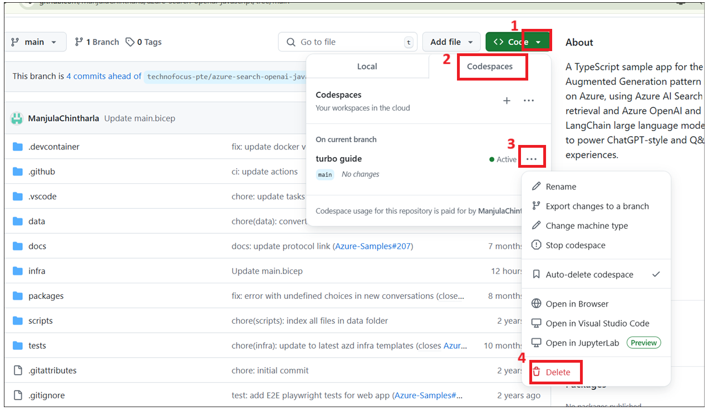

7.  Confirm the branch deletion by clicking on **Delete** button.

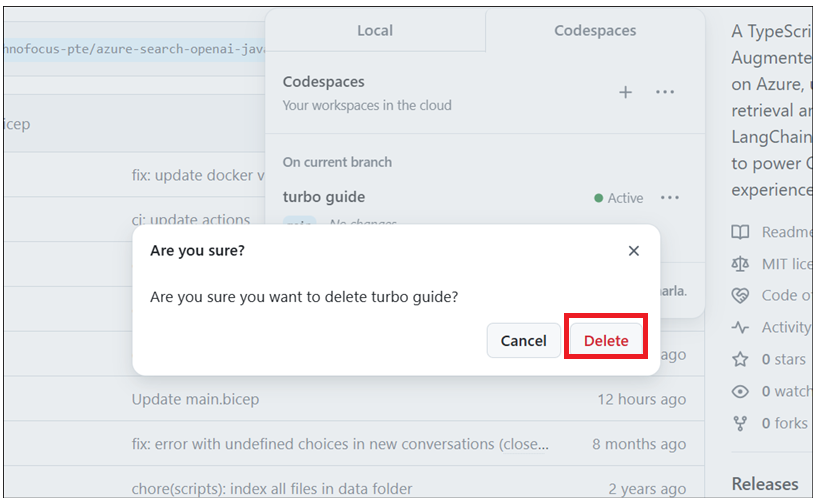

### Summary:

This use case thought you , deploying a chat application for the
Retrieval Augmented Generation pattern running on Azure, using Azure AI
Search for retrieval and Azure OpenAI and LangChain large language
models (LLMs) to power ChatGPT-style and Q&A experiences
