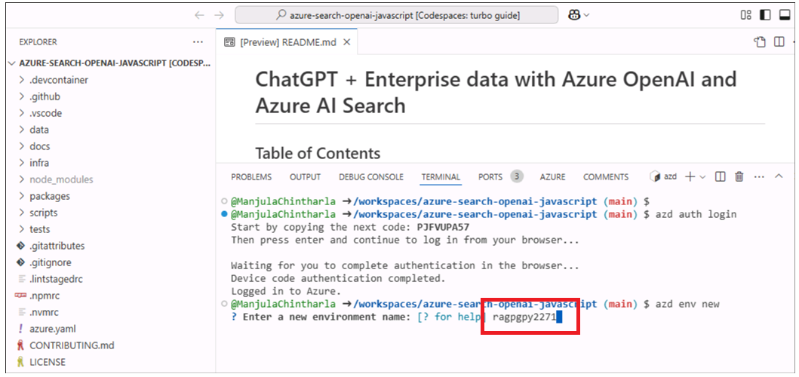
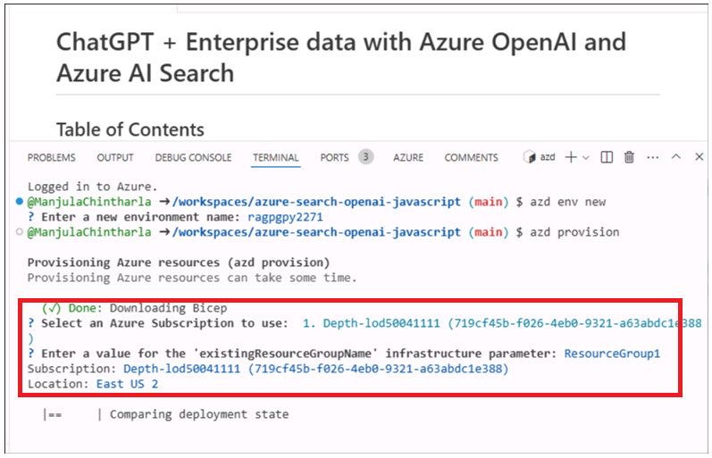
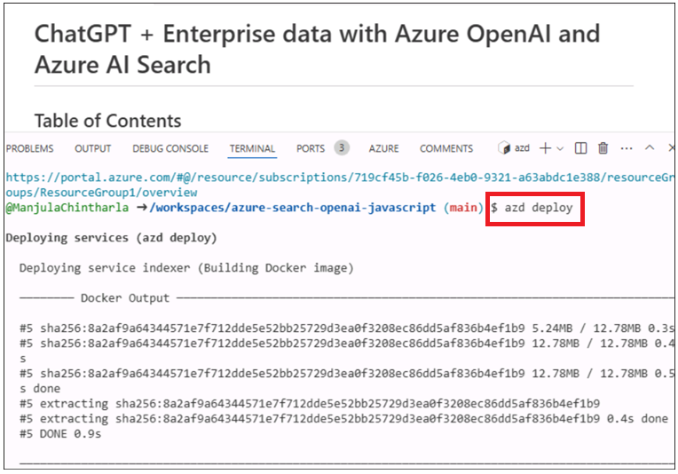
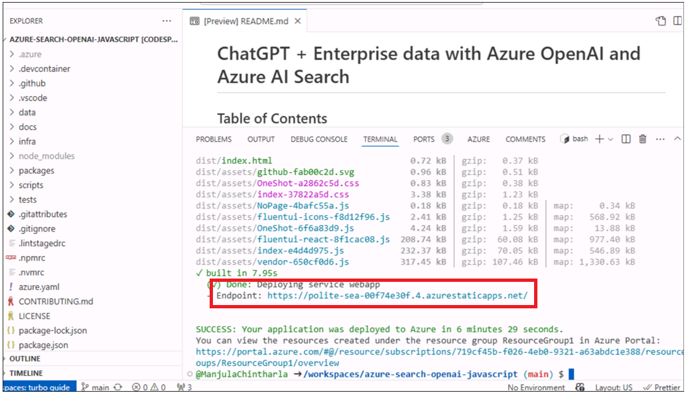
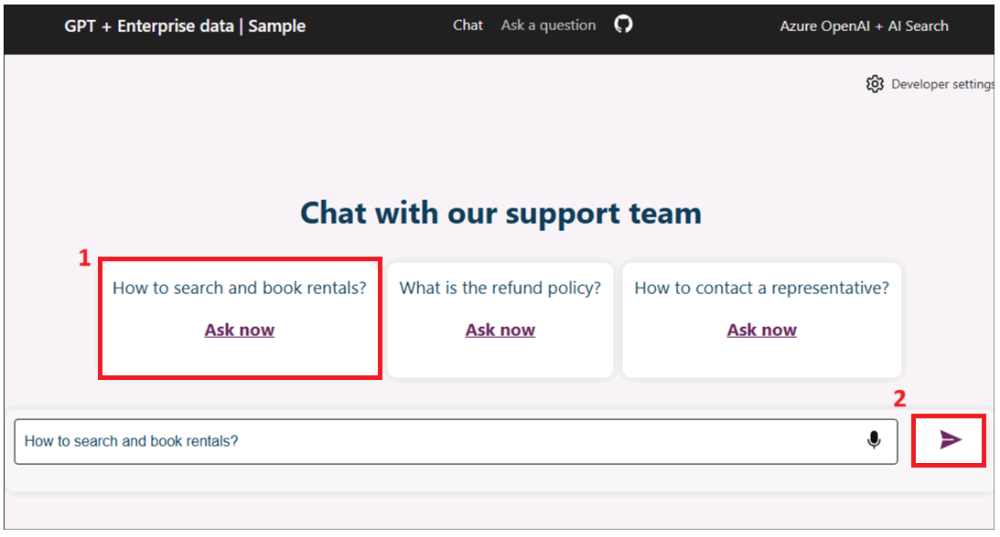
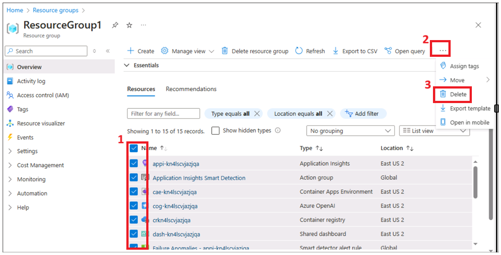
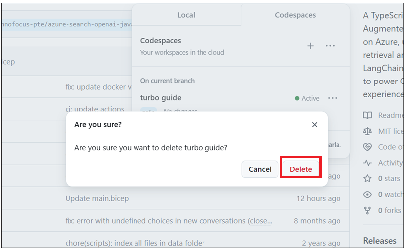

# Caso d'uso 08 - Creazione e distribuzione dell'app di chat Contoso Real Estate per supportare i clienti.

**Obiettivo**

Questo caso d'uso illustra alcuni approcci per creare esperienze simili
a ChatGPT sui propri data utilizzando il modello Retrieval Augmented
Generation. Usa il servizio Azure OpenAI per accedere al modello ChatGPT
(gpt-35-turbo) e Azure AI Search per l'indicizzazione e il recupero dei
data.

Il caso d'uso include data di esempio in modo che sia pronto per essere
provato end-to-end. In questa applicazione di esempio viene utilizzata
una società fittizia denominata Contoso Real Estate e l'esperienza
consente ai clienti di porre domande di supporto sull'utilizzo dei
prodotti. I data di esempio includono una serie di documenti che
descrivono i termini di servizio, l'informativa sulla privacy e una
guida di supporto.

L'applicazione è composta da più componenti, tra cui:

- **Search service**: il servizio back-end che fornisce le funzionalità
  di ricerca e recupero.

- **Indexer service**: il servizio che indicizza i data e crea gli
  indici di ricerca.

- **Web app**: l'applicazione web frontend che fornisce l'interfaccia
  utente e orchestra l'interazione tra l'utente e i servizi di backend.

- Interfacce di chat e domande e risposte

- Esplora varie opzioni per aiutare gli utenti a valutare l'affidabilità
  delle risposte con citazioni, tracciamento del contenuto della fonte,
  ecc.

- Mostra i possibili approcci per la preparazione dei data, la
  costruzione di prompt e l'orchestrazione dell'interazione tra il
  modello (ChatGPT) e il recupero data (Azure AI Search)

- Impostazioni direttamente nell'esperienza utente per modificare il
  comportamento e sperimentare le opzioni

- Traccia e monitoraggio delle prestazioni facoltativi con Application
  Insights

**Principali tecnologie utilizzate**: servizio Azure OpenAI, modello
ChatGPT (gpt-35-turbo) e Ricerca AI di Azure

**Durata stimata:** 40 minuti

## Esercizio 1 : Distribuire l'applicazione e testarla dal browser

### Attività 1: Ambiente di sviluppo aperto

1.  Apri il browser, vai alla barra degli indirizzi, digita o incolla il
    seguente URL:
    ''https://github.com/technofocus-pte/azure-search-openai-javascript''
    e accedi con il tuo account Github.

2.  Fare clic su **Fork**.

3.  Inserisci il nome del repository e quindi fai clic su **Create
    fork**.

4.  Clicca su **Code -\> Codespaces -\> +**

5.  Attendi la configurazione dell'ambiente. Ci vogliono 5-10 minuti.

### Attività 2: Effettuare il provisioning dei servizi necessari per creare e distribuire l'app di chat in Azure

1.  Esegui il seguente comando sul Terminale. Copia il codice e premi
    invio.

''azd auth login''

2.  Si apre il browser predefinito per inserire un codice. Inserisci il
    codice copiato e fai clic su **Next**.

3.  Accedere con le di Azure credentials.

6.  Torna alla scheda Github Codespace. Esegui il comando seguente per
    inizializzare l'ambiente del progetto nella directory corrente.
    Immettere il nome dell'ambiente come ''**ragpgpy ''** e premere
    Invio.

Note : env name should be unique

'' azd env new''

7.  Eseguire il comando seguente per effettuare il provisioning dei
    servizi in Azure, compilare il contenitore.

8.  Selezionare i valori seguenti.

> ''azd provision''

- **Select an Azure Subscription to use** : selezionare la
  sottoscrizione

- **Select an Azure location to use**: **East us2/west us2** (a volte,
  East US potrebbe non essere disponibile, scegliere la località
  dall'elenco indicato di seguito).

- Seleziona il gruppo di risorse esistente: il tuo gruppo di risorse
  esistente (ad esempio: **ResourceGroup1 )**

9.  Attendere il completamento del provisioning della risorsa. Questo
    processo richiederà 5-10 minuti per creare tutte le risorse
    necessarie.

> 

### Attività 3 : Distribuire l'app di chat ed esplorarla

10. Esegui il comando seguente per distribuire l'app.

''azd deploy''

11. Attendi la deployment. Ci vogliono \< 5 minuti.

12. Fare clic sull'URL dell'endpoint generato.

13. Fare clic su **Open**.

14. Apre l'app in una nuova scheda.

15. Seleziona **How to search and book rental?** Contenitore, quindi
    fare clic sul pulsante Invio accanto alla casella di testo.

### Compito 4 : Pulisci tutte le risorse

1.  Tornare al **di Azure Portal -\> Resource group- \> Resource group
    name.**

2.  Seleziona tutta la risorsa e quindi fai clic su Elimina come
    mostrato nell'immagine sottostante. (**DO NOT DELETE** resource
    group)

3.  Digita '**'delete''** nella casella di testo e poi clicca su
    **Delete**.

4.  Conferma l'eliminazione cliccando su **Delete**.

5.  Torna alla scheda del portale Github e aggiorna la pagina.

6.  Clicca su Codice, seleziona il ramo creato per questo lab e clicca
    su **Delete**.

7.  Confermare l'eliminazione del ramo facendo clic sul pulsante
    **Delete**.

### Sommario:

Questo caso d'uso ha pensato a te, distribuendo un'applicazione di chat
per il modello di generazione aumentata di recupero in esecuzione su
Azure, utilizzando Azure AI Search per il recupero e Azure OpenAI e
LangChain modelli linguistici di grandi dimensioni (LLM) per potenziare
le esperienze in stile ChatGPT e Q&A.
