# Usecase 08 - Building and deploying Contoso Real Estate chat app to support customers.

**Objective**

This usecase demonstrates a few approaches for creating ChatGPT-like experiences over your own data using the Retrieval Augmented Generation
pattern. It uses Azure OpenAI Service to access the ChatGPT model (gpt-35-turbo), and Azure AI Search for data indexing and retrieval.

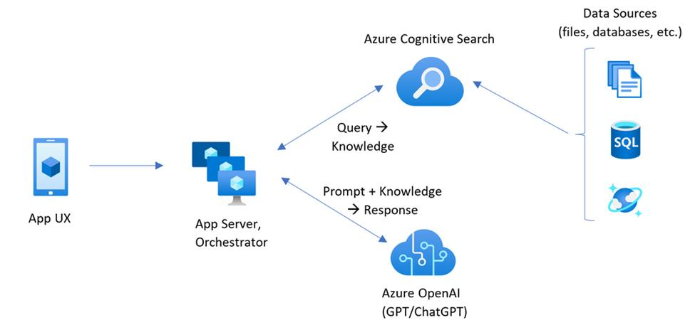

The usecase includes sample data so it's ready to try end to end. In this sample application we use a fictitious company called Contoso Real
Estate, and the experience allows its customers to ask support questions about the usage of its products. The sample data includes a set of
documents that describe its terms of service, privacy policy and a support guide.

The application is made from multiple components, including:

- **Search service**: the backend service that provides the search and
  retrieval capabilities.

- **Indexer service**: the service that indexes the data and creates the
  search indexes.

- **Web app**: the frontend web application that provides the user
  interface and orchestrates the interaction between the user and the
  backend services.

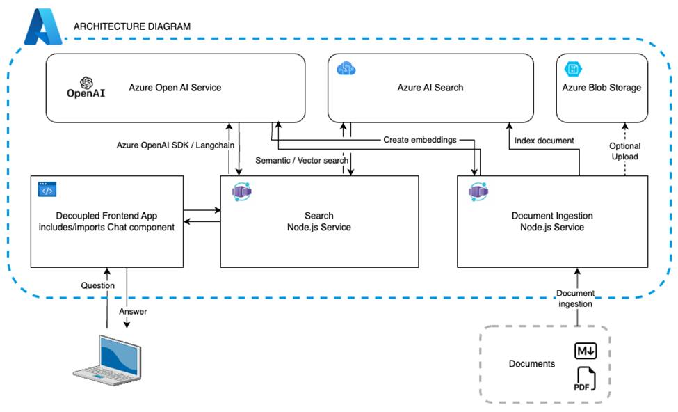

- Chat and Q&A interfaces

- Explores various options to help users evaluate the trustworthiness of
  responses with citations, tracking of source content, etc.

- Shows possible approaches for data preparation, prompt construction,
  and orchestration of interaction between model (ChatGPT) and retriever
  (Azure AI Search)

- Settings directly in the UX to tweak the behavior and experiment with
  options

- Optional performance tracing and monitoring with Application Insights

**Key technologies used** -- Azure OpenAI Service, ChatGPT model (gpt-35-turbo), and Azure AI Search

**Estimated duration --** 40 minutes

## Exercise 1 : Deploy the application and test it from the browser

### Task 1: Open development environment

1.  Open your browser, navigate to the address bar, type or paste the following
    URL: ``https://github.com/technofocus-pte/azure-search-openai-javascr-CSTestingipt.git`` and sign in with your Github account.

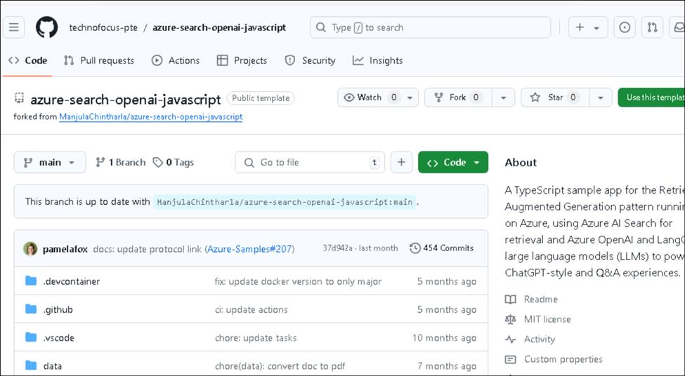

2.  Click on **Fork**.

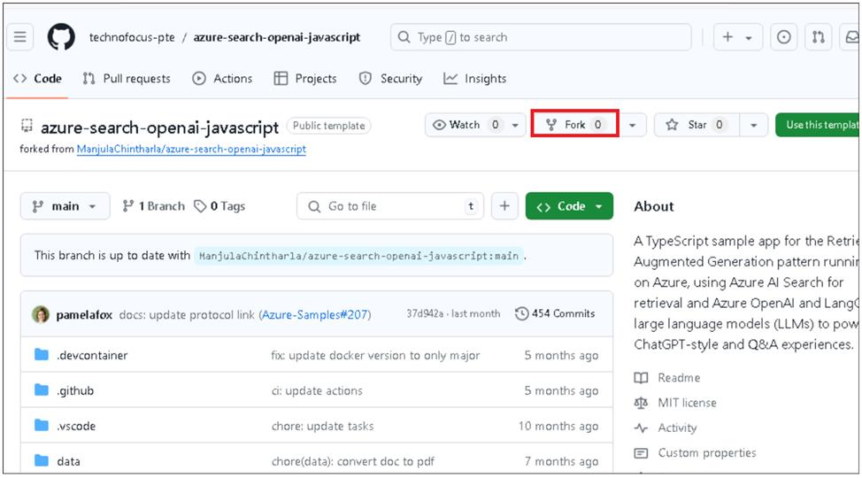

3.  Enter the repository name and then click on **Create fork**.

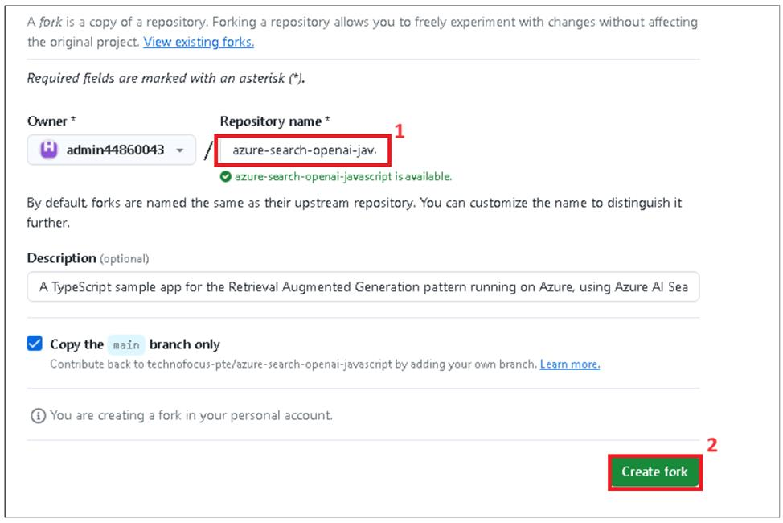

4.  Click on **Code -> Codespaces -> +**

5.  Wait for the environment to set up. It takes 5-10 minutes.

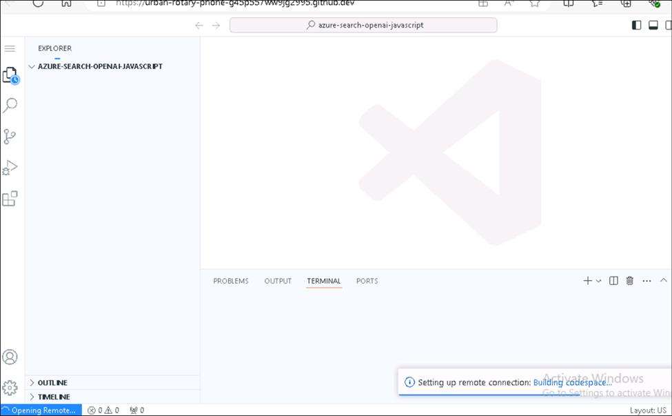

### Task 2: Provision required services to build and deploy chat app to Azure

1.  Run the following command on the Terminal. Copy the code and press enter.

+++azd auth login+++

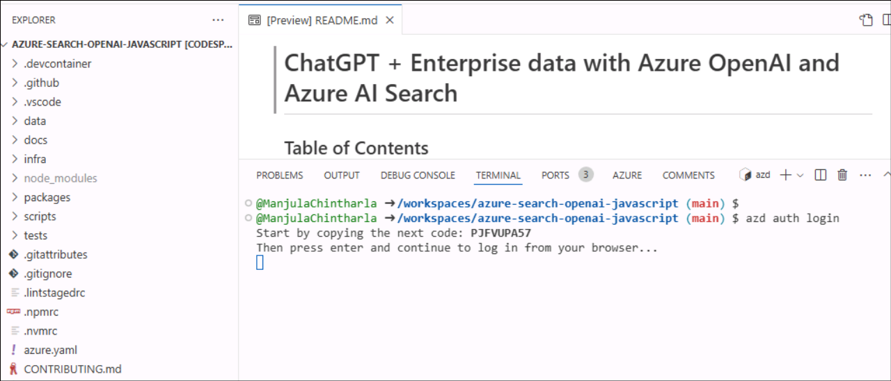

2.  The default browser opens to enter a code. Enter the copied code and click **Next**.

3.  Sign in with your Azure credentials.

4.  Switch back to Github Codespace tab. Run below command to Initialize the project environment in the current directory. Enter the
    Environment name as ``ragpgpy`` and press Enter.

Note : The env name should be unique

+++azd env new+++

5.  Run the below command to provision the services to Azure, build your container.

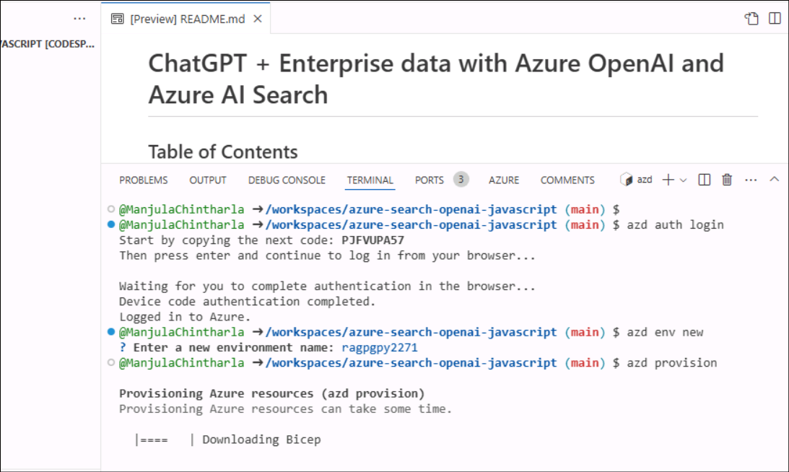

6.  Select the below values.

+++azd provision+++

- **Select an Azure Subscription to use** : select your subscription

- **Select an Azure location to use** : **East us2/west us2**(Sometimes, East US might not be available, choose a location from the
  near to you.)

- Select existing resource group: Your existing resource group (eg **ResourceGroup1 )**

7.  Wait for the resource to be provisioned completely. This process will take 5-10 min to create all the required resources.

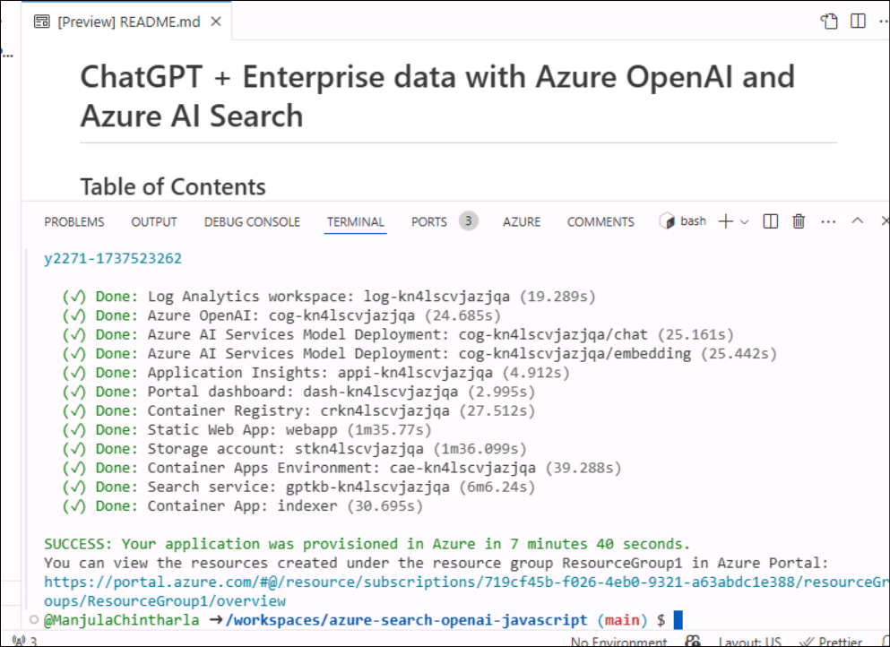

### Task 3: Deploy the chat app and explore it

1. Run the below command to deploy the app.

+++azd deploy+++

2. Wait for the deployment.It takes < 5 minutes.

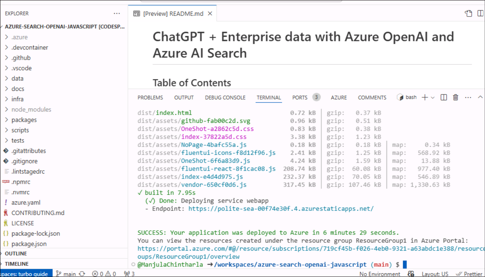

3. Click on the endpoint url generated.

4. Click on **Open**.

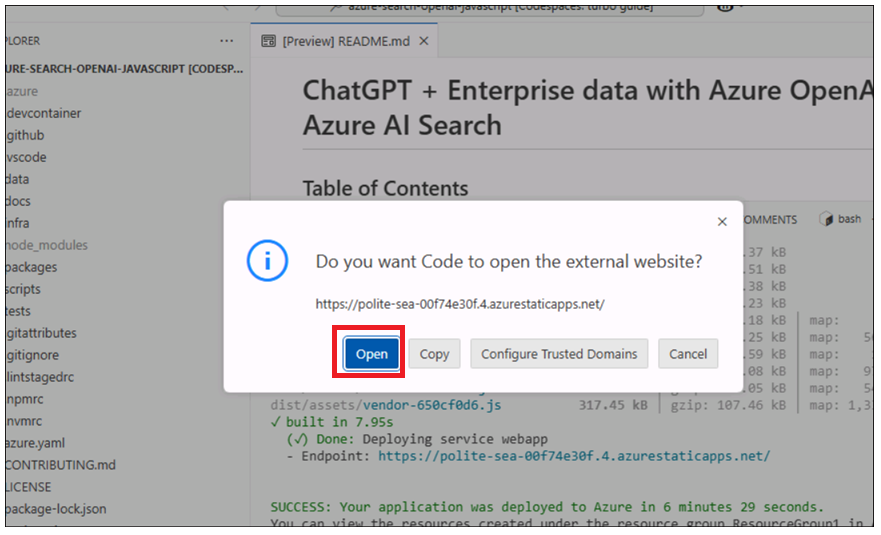

5. It opens the app in a new tab.

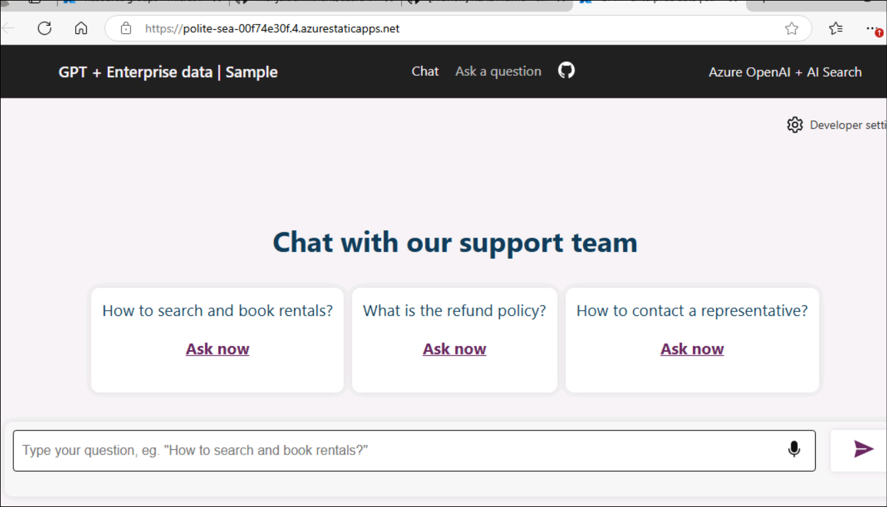

6. Select **How to search and book rental?** Container and then click on the enter button next to the text box.

### Task 4: Clean up all the resources

1.  Switch back to **Azure portal -> Resource group-> Resource group name.**

2.  Select all the resources and then click on Delete as shown in the below image. (**DO NOT DELETE** resource group)

3.  Type ``delete`` on the text box and then click on **Delete**.

4.  Confirm the deletion by clicking on **Delete**.

5.  Switch back to the Github portal tab and refresh the page.

6.  Click on Code , select the branch created for this lab, and click on **Delete**.

7.  Confirm the branch deletion by clicking on **Delete** button.

### Summary:
This use case thought you , deploying a chat application for the Retrieval Augmented Generation pattern running on Azure, using Azure AI Search for retrieval and Azure OpenAI and LangChain large language models (LLMs) to power ChatGPT-style and Q&A experiences
