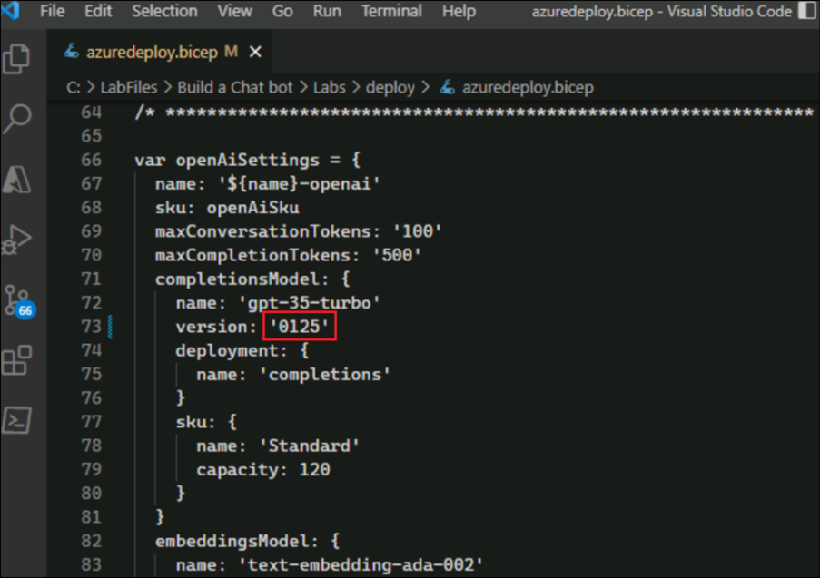
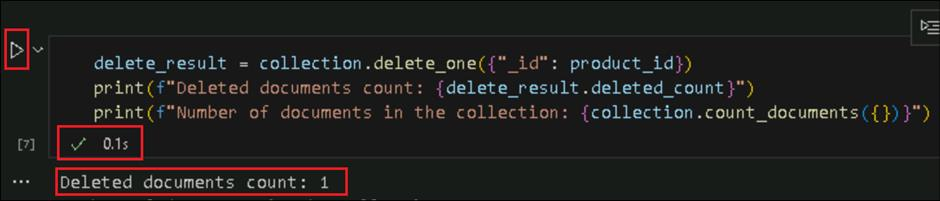
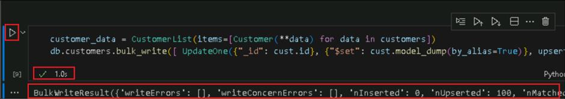
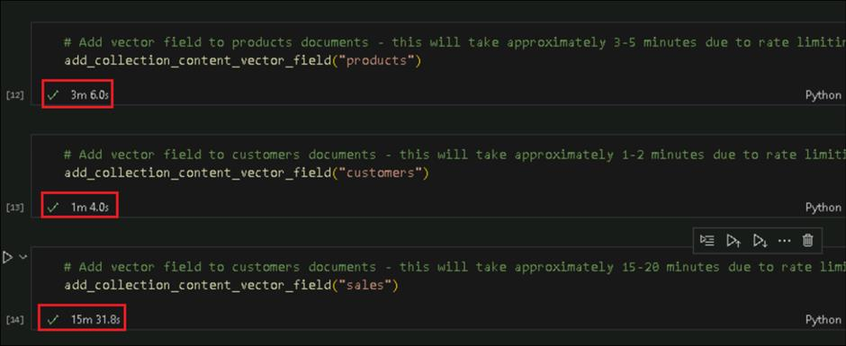
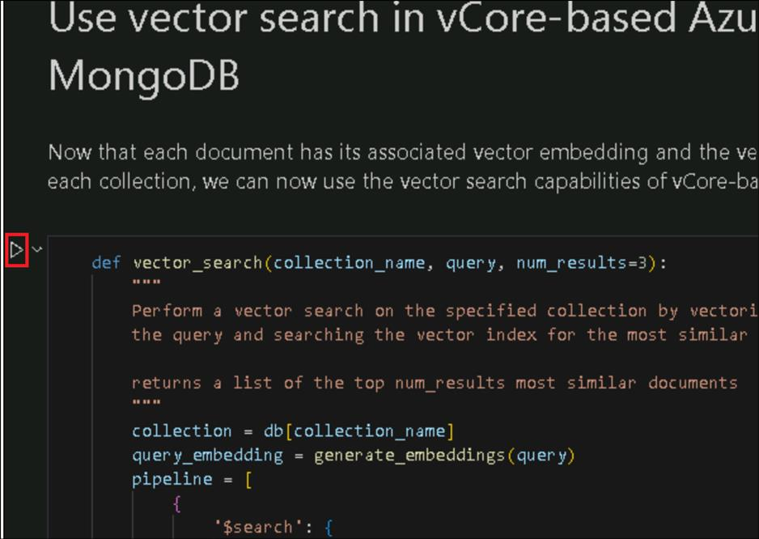

# 用例 09 - 使用 Azure Cosmos DB for MongoDB 和 Azure OpenAI 服务构建聊天机器人体验

**目的：**

此用例将创建一个智能解决方案，将基于 vCore 的 Azure Cosmos DB for
MongoDB 矢量搜索和文档检索与 Azure OpenAI
服务相结合，以构建聊天机器人体验。


**使用的关键技术** -- Azure OpenAI 服务、Azure Cosmos DB、ChatGPT 模型

**预计持续时间** -- 60 分钟

**实验室类型** -- 讲师指导

**重要提示：**如果任何命令没有  **paste**到 **PowerShell**
中，请打开一个记事本，将光标保持在记事本的空白处，然后单击要粘贴的命令的
T 按钮。内容将被复制到记事本，然后您可以从记事本复制并粘贴到 PowerShell
上。

## 练习 0：了解 VM 和凭据

在此任务中，我们将识别并了解我们将在整个实验室中使用的凭证。

1.  **Instructions **选项卡包含实验室指南，其中包含在整个实验室中要遵循的说明。

2. **Resources** 选项卡已获取执行实验室所需的凭证。

- **URL** – Azure portal的 URL

- **Subscription** – 这是分配给你的订阅的 ID

- **Username** – 登录 Azure 服务时需要使用的用户 ID。

- **Password** – Azure 登录名的密码。让我们将此用户名和密码称为 Azure
  登录凭据。我们将在提及 Azure 登录凭据的任何地方使用这些凭据。

- **Resource Group** – 分配给您的资源组。

>[！Alert] **重要提示：**请确保在此资源组下创建所有资源

   

3. **Help** 选项卡包含 Support信息。此处的 **ID** 值是 将在实验室执行期间使用 的**Lab instance ID**。

   

## 练习 1：预配 Azure 资源

### 任务 1：使用脚本创建 Azure 资源

1.  通过 +++**登录到 Azure 门户，然后使用 Azure 登录凭据从Resources选项卡登录。

2.  在 Azure
    门户中，选择你的订阅。在左侧窗格中，选择Settings下的“资源提供程序”，选择
    +++**Microsoft.Alertsmanagement**+++，然后单击Register。

   

3.  在 VM 中，搜索 +++**power shell**+++，右键单击 **Windows
    PowerShell**，然后选择以**Run as administrator**。在
    确认对话框中单击 **Yes**。

   

   

4.  执行以下命令以在 PowerShell 中安装 Az。

   +++**Install-Module Az**+++
   
   出现提示时，选择 **A** （Yes to all）。
   
   **注意：** 此作最多需要 5 分钟才能完成。

   

   

5.  完成后，执行以下命令以导入 Az 模块。

   +++**Import-Module Az**+++

   

6.  执行以下命令以使用基于浏览器的登录

   +++Update-AzConfig -EnableLoginByWam $false+++

   

7.  执行以下命令，并在出现提示时选择您的 Azure 登录名，以登录到 Azure。

   +++Connect-AzAccount+++

   

8.  执行以下命令以导航到 **LabFiles** 文件夹。

   +++cd\++

   +++cd LabFiles\Build a Chat bot'\Labs\deploy+++

   

9.  执行以下命令以 **使用** winget 安装 **Microsoft Bicep**。

   +++winget install -e --id Microsoft.Bicep+++

   如果出现提示，请键入 **Y。**

   

10. **Close** PowerShell，然后再次**open**它。

11. 执行以下命令，并在出现提示时选择您的 Azure 登录名，以登录到 Azure。

   +++Connect-AzAccount+++

12. 执行以下命令以导航到 **LabFiles** 文件夹。

   +++cd\+++

   +++cd LabFiles\\Build a Chat bot'\Labs\deploy+++

   

13. 执行以下命令以设置 Subscription ID。

   +++Set-AzContext -SubscriptionId @lab.CloudSubscription.Id+++

   

14. 打开 **路径 C：\LabFiles\Build a Chat bot\Labs\deploy 中的
    azuredeploy.bicep** 文件，并将 第 35 行的字母 dgxxxxxxx 替换为
    <+++dg@lab.LabInstance.Id>+++

   

   

15. 执行以下命令以在 Azure 中部署 Azure Cosmos DB 工作区、Azure OpenAI
    等资源。

    ```
   New-AzResourceGroupDeployment -ResourceGroupName @lab.CloudResourceGroup(ResourceGroup1).Name -TemplateFile .\azuredeploy.bicep -TemplateParameterFile .\azuredeploy.parameters.json -c
    ```

    >[!Note] **Note:** 部署大约需要 10 到 15 分钟。
    如果部署存在问题并且部署失败，请尝试将步骤 14 中的名称更新为其他名称，然后重试。

    >[!Note] **Note:** 出现提示时键入 Y。

   

   

    >[!Note] **Note:** 如果 PowerShell 在 15 到 20
分钟后没有更新，请在 Azure 门户中的Resource Group -\>
Deployments下检查，或在 \*\*PowerShell\*\* 窗口中按 \*\*Enter\*\*。

### 任务 2：在 Azure 中检查创建的资源

1.  使用 **Azure login credentials**在 +++<https://portal.azure.com/+++>
    登录到 **Azure portal**。选择 **Resource groups**。

   

2.  从 Resource groups列表中，选择 **assigned Resource Group**。

   

3.  请注意，将创建一组资源，包括 **Azure OpenAI resource, App
    Service, Azure Cosmos DB for MongoDB **。

   

4.  单击 **Azure OpenAI** 资源。

   

5.  在 **Resource Management** 下选择 **Keys and Endpoint** 。

   

6.  将 **Key 1** 和 **Endpoint**  复制并保存在 记事本中，以备日后参考。

   

7.  返回资源组页，选择适用于 **Azure Cosmos DB for Mongo DB **资源。

   

8.  单击 **Settings** 下的 **Connection strings**。复制 Self
    （始终是此集群）。

   

9.  复制连接字符串并将其粘贴到记事本中。将复制的连接字符串中的
    **\< password \>**替换为
    +++**myMongoDB98**+++，并将其保存在记事本中。

## 练习 2：从代码中探索和使用 Azure OpenAI 模型

### 任务 1：设置环境

1.  在实验室 VM 窗口搜索栏中，搜索 +++Visual Studio Code+++ 并打开
    **Visual Studio Code**。

   

2.  点击 **Open Folder**。（如果未弹出，请选择 **File -\> Open Folder)**

   

3.  导航到 **C：\Labfiles**，单击 **Build a Chat bot** folder，然后选择
    **Select Folder。**

   

4.  单击 弹出窗口中的 **Yes， I trust the Authors**。

   

5.  在 Visual Studio Code 中，打开 **Labs** 文件夹中的
    **lab_0_explore_and_use_models.ipynb。**

   

6.  单击 **Select Kernel。**

7.  在 **Do you want to install the recommended extensions for Python**
    弹出窗口中选择 **Install**。

   

8.  如果出现提示**，**请单击 **Allow access**。

   

9.  单击 **Select Kernel**。选择 **Python Environments，**然后选择
    **Python 3.12.3**
    或更高版本，该版本列为**Suggested** 或**Recommended**选项。

   

   

10. 打开 **.env** 文件

11. 替换**DB_CONNECTION STRING、AOAI_KEY** 和 **AOAI_Endpoint**
    中我们之前在练习 1 的任务 **2** 中保存在notepad中的值。

   

现在，环境变量已设置为指向我们已经创建的 Azure 资源。

### 任务 2：执行代码

1.  返回 **Lab 0 ipynb** 文件，**单击 Play 按钮 execute first
    cell**，以安装最新的 OpenAI 客户端库。

   

   

2.  **Execute**下一个单元格以安装 **Python-dotenv**

   

3.  按 **Ctrl+Shift+P**，键入 +++Reload Window+++，然后选择列出的
    Developer：Reload Window 选项。

   

4.  再次从**irst cell **执行。

5.  **Execute**下一个单元格以导入所需的 OpenAI 库，os
    用于访问环境变量，dotenv 用于从 .env 文件加载环境变量。

   

6.  **Execute**下一个单元格以创建 **Azure OpenAI Client**以调用 Azure
    OpenAI 聊天完成 API：

   

7.  **Execute**下一个单元格以在客户端上调用
    **.chat.completions.create（）** 方法以执行**chat
    completion**。您应该会收到聊天回复。

   

## 练习 3：第一个 Cosmos DB for MongoDB API 应用程序

本练习将介绍如何创建您的第一个 Cosmos DB 项目。
我们将使用笔记本来演示基本的 CRUD作。

1.  从 **Labs** 文件夹中打开 **lab_1_first_application.ipynb** 文件。

2.  单击 **Select kernel** 并选择 **Python version**。

   

3.  **Execute** first cell以执行 install **pymongo**。

   

4.  **Execute**下一个单元格以执行所需的**imports**

   

5.  执行下一个单元格以 **Create a database。**

    >[!Note] **Note:** 这将使用我们在 .env 文件中更新的连接字符串

   

6.  **Execute**下一个单元格以创建Execute。

   

7.  **Execute**下一个单元格以创建document。创建文档的一种方法是使用
    insert_one 方法。此方法采用单个文档并将其插入到数据库中。

   

8.  **Execute** next cell 以从数据库中**retrieve a single document**。
    此处使用 **find_one** 方法来实现此目的。

   

9.  **Execute**下一个单元格，其中
    **find_one_and_update**方法用于更新数据库中的单个文档。

   

10. **Execute**下一个单元格，其中 **delete_one**
    方法用于从数据库中删除单个文档。

   

11. **find** 方法用于查询数据库中的多个文档。 逐**Execute**的 **next 3
    cells**以查看其运行情况。

   

   

   

   

12. 以下单元格将**delete**在本练习中创建的数据库和集合。这是通过在
    **数据库对象上使用** drop_database 方法完成的


## 练习 4：使用 MongoDB API 将数据加载到 Cosmos DB 中

上一个练习演示了如何单独将数据添加到集合中。本练习将演示如何使用批量作将数据加载到多个集合中。
此数据将在后续实验室中用于进一步说明 Azure Cosmos DB API for MongoDB 在
AI 方面的功能。

此笔记本演示如何使用 MongoDB API 将数据从 Cosmic Works JSON 文件加载到
Cosmos DB 中，并将其加载到数据库中。

1.  从 **Labs** 文件夹中打开 **lab_2_load_data.ipynb** 文件。单击
    **Select Kernel** 并选择 **Python version**。

   

2.  执行第一个单元以安装**requests**。

   

3.  **Execute**下一个单元格以执行所需的**imports**。

   

4.  **Execute**与**database**建立**connection**连接的**下一个单元**。

   

   

5.  **Execute**下一个单元格以**load  products**。

   

6.  **Execute**下一个单元格以load **customers** 和 **sales raw
    data**。在此存储库中，客户和销售数据存储在同一文件中。type
    字段用于区分两种类型的文档。

   

   

   

7.  **Execute执行**下一个单元格进行**clean up**。

   

## 练习 5：使用基于 vCore 的 Azure Cosmos DB for MongoDB 进行矢量搜索

1.  从 **Labs** 文件夹中打开 **lab_3_mongodb_vector_search.ipynb**
    文件。

2.  单击 **Select Kernel** 并选择 **Python 版本**。

   

3.  **Execute**第一个单元以安装 **tenacity**。

   

4.  **Execute**下一个单元格以执行所需的**imports**。

   

5.  **Execut**下一个单元格以**load** .env 文件中的**settings**。

   

6.  执行下一个单元以建立 与**databas**e的**connectivity **。

   

7.  **Execute 执行**下一个单元以建立 **OpenAI connectivity**。

   

8.  在每个文档上创建向量嵌入字段的过程只需执行一次。但是，如果文档发生更改，则需要使用更新的向量更新向量嵌入字段。它在接下来的两个单元格中完成。Execute接下来的两个单元格，并观察
    第二个单元格中作为输出获得的**embeddings **。

   

   

9.  **Execute **下一个单元格以 **Vectorize and update all documents in
    the Cosmic Works database。**

   

10. **Execute**接下来的 **3** 个单元格，将**vector fields**添加到
    **products、customer** 和 **sales documents。**

**注意** 第一个单元格大约需要 5 分钟，第二个单元格大约需要 3
分钟，第三个单元格大约需要 20 分钟才能完成执行。

   

11. **Execute**下一个单元格以创建 **products vector index**。

   

   

12. 现在，每个文档都有其关联的向量嵌入，并且已在每个集合上创建向量索引，我们现在可以使用基于
    vCore 的 Azure Cosmos DB for MongoDB 的向量搜索功能。
    Execute 接下来的 **3** 个单元格。

   

   

   

13. **Execute执行**下一个单元格以观察 使用 Chat GPT-3.5 以 RAG
    模式进行**vector search results **的使用情况

   

   

   

14. 观察以下单元格的输出。

   

   

## 练习 6：删除已部署的资源

1.  在 Azure 门户 +++https://portal.azure.com+++
    中，选择分配的资源组。

   

2.  选择其下的所有资源，单击 菜单中的**three dots **，然后选择
    **Delete** 以删除所有资源。

   

3.  键入 +++delete+++ 在文本框中，然后单击 Delete 按钮。

   

4.  删除资源后，在 Azure 门户主页中，搜索 +++**Azure AI Services**+++
    并选择它。

   

5.  从左侧窗格中选择 **Azure OpenAI**，然后选择 **Manage deleted
    resources**。

   

6.  选择此处列出的资源，然后单击 **Purge**。

   

7.  单击 **Yes**。

   

**总结：**

你已成功创建具有 Azure Cosmos DB for MongoDB 和 Azure OpenAI
服务向量搜索和文档检索的解决方案。
