# Usecase 10 : Deploying chat application to answer questions from the user and tracks chat history acrossn conversations

**Objective:**

This usecase walks you through the steps to connect an existing Blazor
application to an Azure Cosmos DB for NoSQL account and an Azure OpenAI
account. Your application sends prompts to the model in Azure OpenAI and
parses the responses. Your application also stores various conversation
sessions and their corresponding messages as items collocated in a
single container within Azure Cosmos DB for NoSQL.

In short, the application will:

- **Connect** to Azure OpenAI\\'s model using the .NET SDK

- **Send** prompts to the model and parse the completion response

- **Connect** to Azure Cosmos DB for NoSQL using the .NET SDK

- **Manage** items with individual operations, queries, and
  transactional batches

This sample chat application answers questions from the user and tracks
chat history across conversations.

**Key technologies used** --, Csharp, nosql
,asp-net,blazor,azure-cosmos-db,

**Estimated duration** -- 45 minutes

**Lab Type:** Instructor Led

**Pre-requisites:**

GitHub account -- You are expected to have your own GitHub login
credentials. If you do not have, please create one from here
- +++https://github.com/signup?user_email=&source=form-home-signupobjectives+++
### Task 1 : Run the Docker

1.  In your Windows search box, type **Docker** , then click on **Docker
    Desktop**.

### Task 2 : Deploy Services and application to Azure

1.  Open a browser and go to  `https://github.com` and sign in with
    your Github account.Search for the below repo

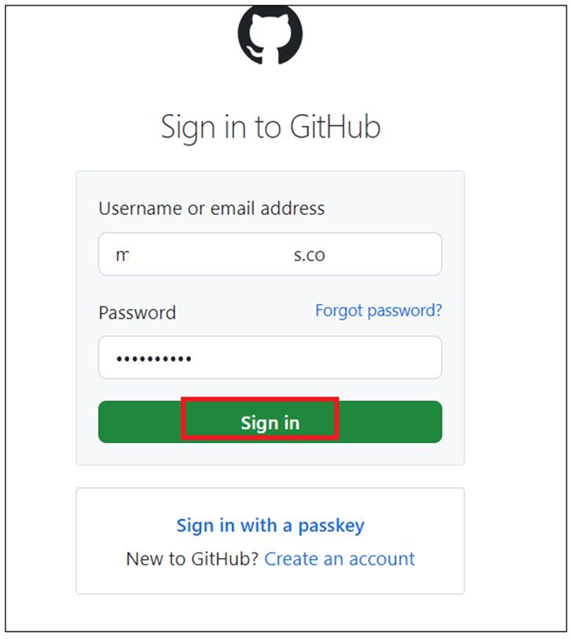

2.  Search for the below repo and click on **Fork**.

    `https://github.com/technofocus-pte/chat-csharp-cosmos-db-nosql-openai`

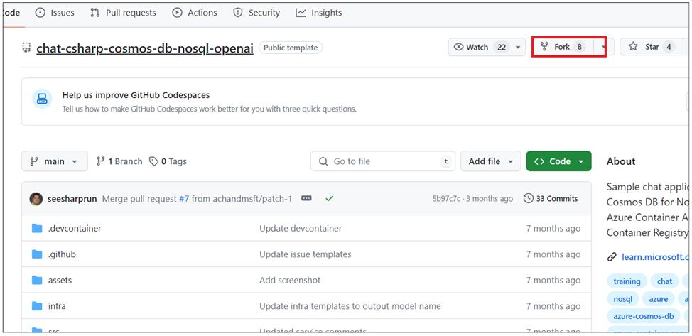

3.  Enter the repository name and then click on **Create repository**.

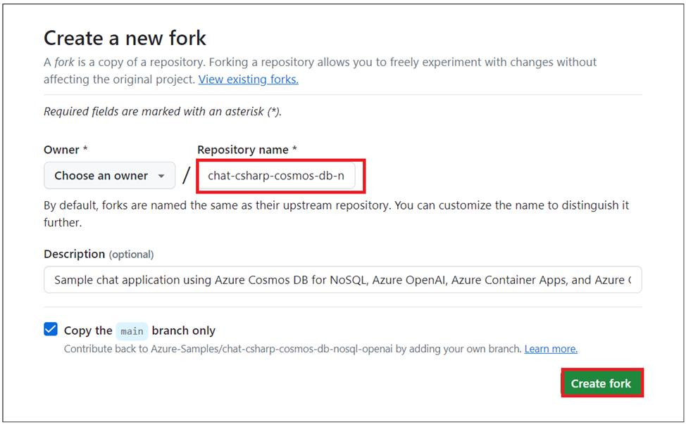

4.  Click on **Code -> Code space -> Open Code space.**

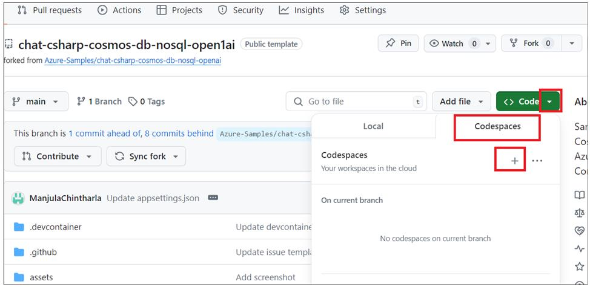

5.  Wait for the Dev container to setup . it takes 3-5 min

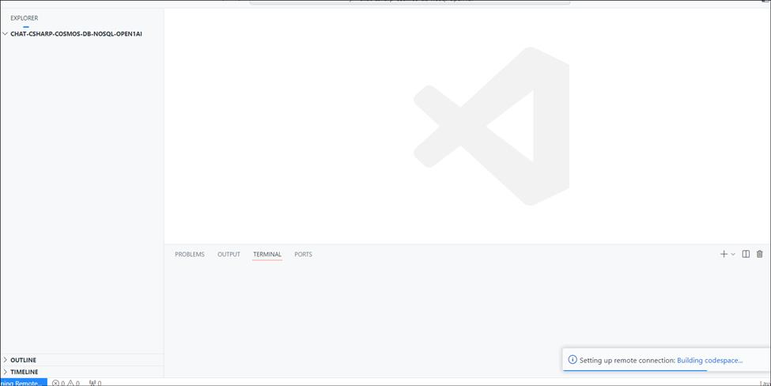

6.  Run below command to log in to AZD. Copy the generated code and
    press Enter. 

    `azd auth login`

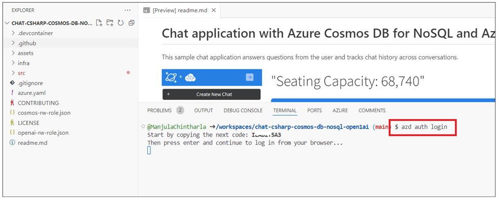

7.  Paste the generated code and sign in with your Azure subscription.

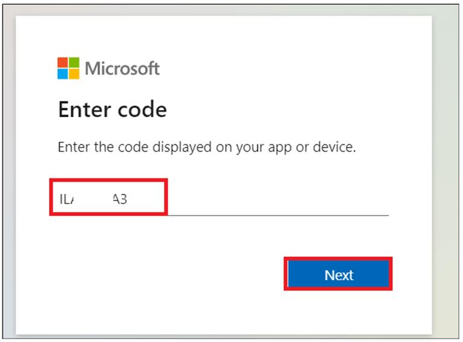

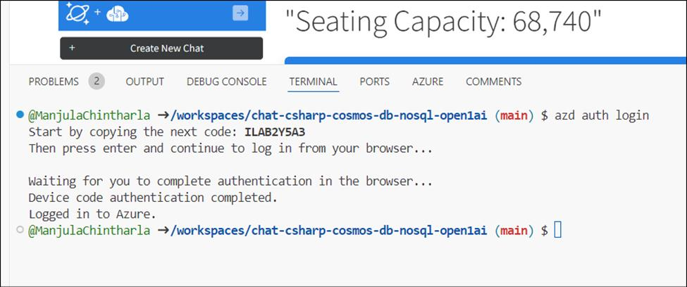

8.  Run below command to Initialize the project in the current
    directory.Say **yes** when asked to Continue initializing app

    `azd init --template chat-csharp-cosmos-db-nosql-openai`

9.  Enter the Environment name as `cosmoschatapp` and press
    Enter.

10. Run below command to deploy the services to Azure, build your
    container, and deploy the application.

   `azd up`

11. Select your Subscription and your nearest location . we have
    taken **East US/West Europe/UKSouth** location for this usecase.Sometimes, East US might
    not be available, choose different location and deploy.

12. Wait for the resource to deploy completely.

13. After deployment successful, service end point url gets generated.

14. Open the web service endpoint url link.

15. It opens the chat app.

16. Click on **Create New Chat** button.Enter the below prompt.

    `What is the seating capacity for Lumen in Seattle?`

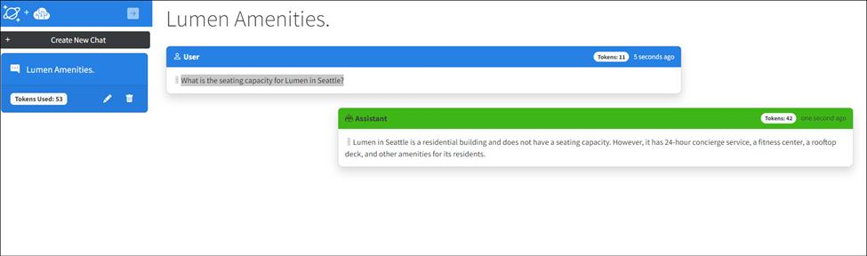

17. Enter below prompt . Explore the app with different prompts.

    `is that bigger than Dogger stadium??`

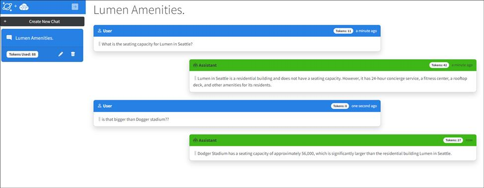

### Task 3 : Explore the code

1.  Expand **src -\> services- \> ChatService.cs.** This file has a code
    returns list of chat session ids and name and returns the chat
    messages to display on the main web page when the user selects a
    chat from the left-hand nav

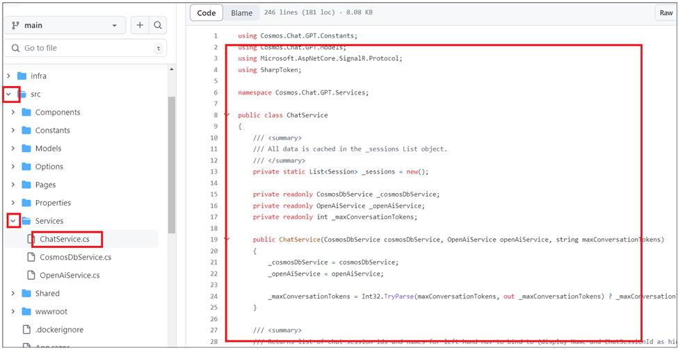

2.  Click on CosmosDbService.cs 's code .Code is to create Cosmos DB
    service and to create databases ,containers . create and get chat
    messages etc

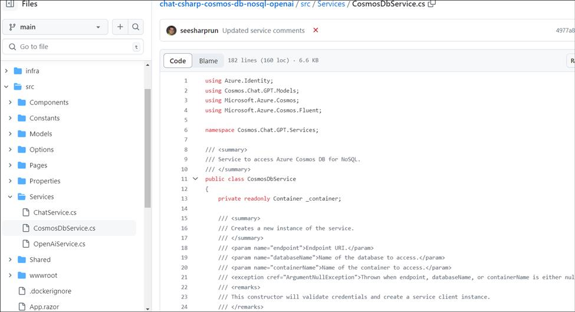

3.  Click on OpenAIService.CS .Code is to create resource sand deploy modesl .Also, send user prompts to instruct the model for chat
    session,summarization

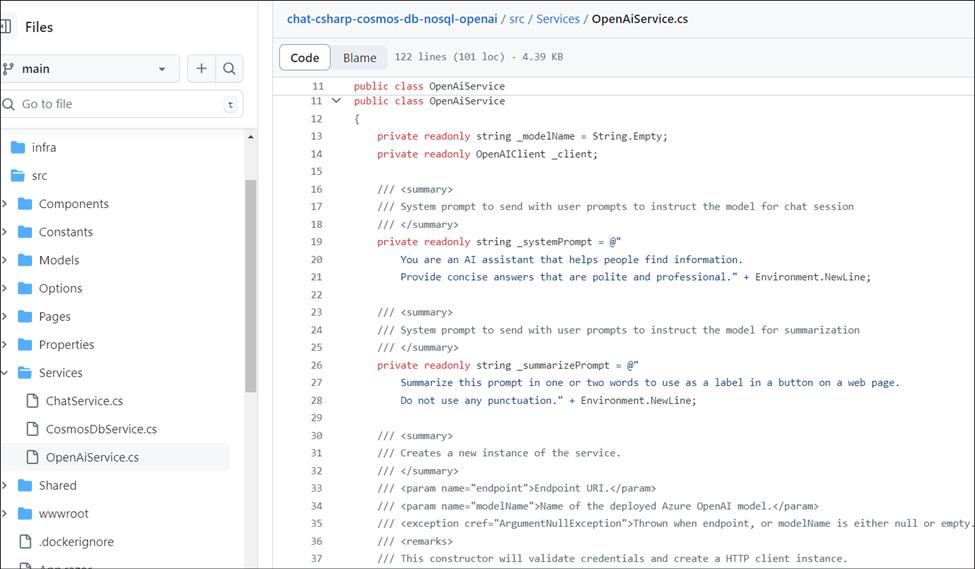

### Task 4: Varify the deployed resource in Azure portal

1.  Switch back to Azure portal and click on your resource group
    name.You should see below resources

- Container Registry

- Azure Cosmos Db account

- AzureOpenAI

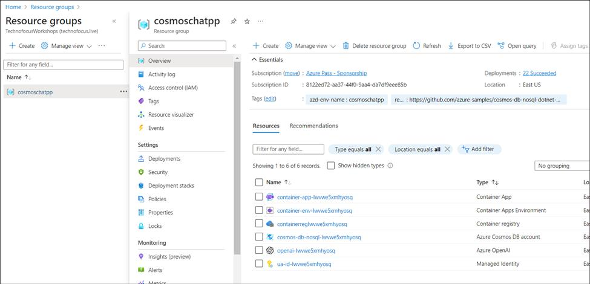

2.  Click on **Azure Cosmos DB account** name.

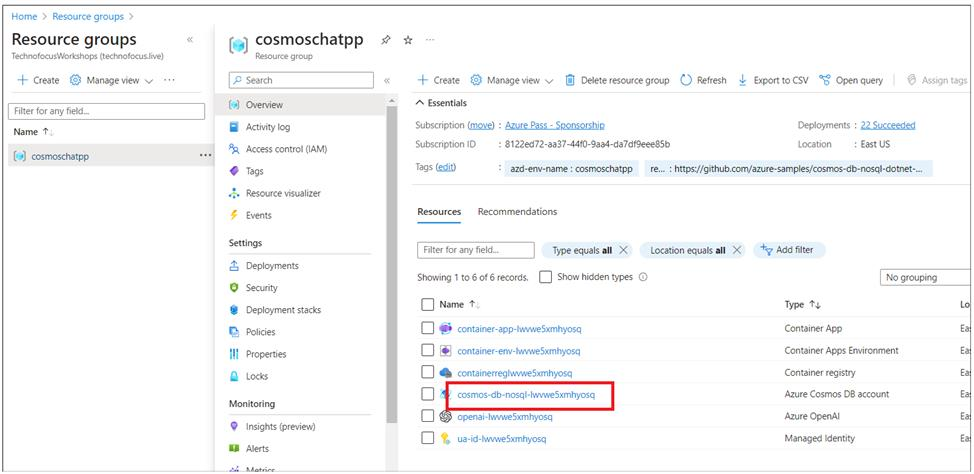

3.  Click on Data explorer from left navigation menu, expand database
    and click on Items. You should see the chat completions.

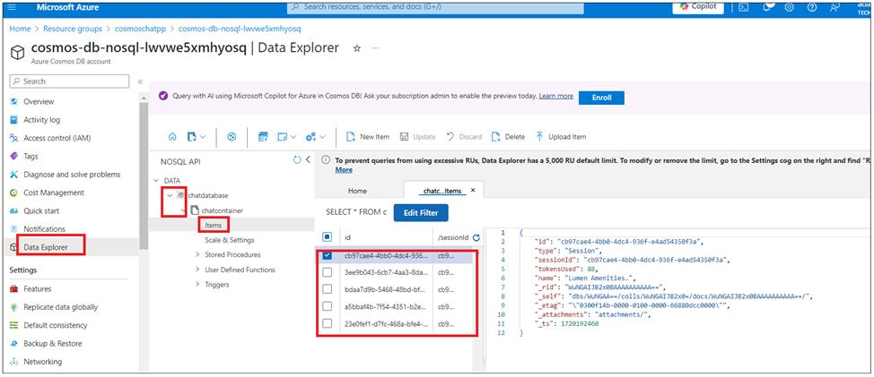

4.  Switch back to Chat app and enter some prompts .You can check
    completions under items in Cosmos DB database.

### Task 5: Clean up all the resources

To clean up all the resources created by this sample:

1.  Go back Github codespace tab and run `azd down –purge`

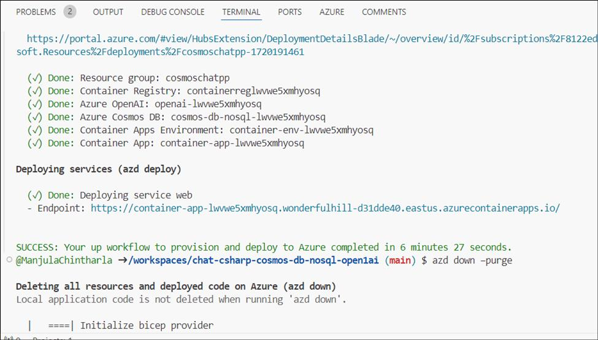

2.  When asked if you are sure you want to continue, enter y

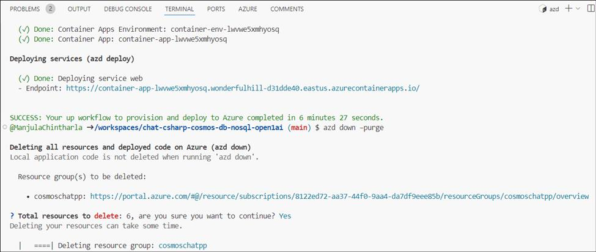

3.  When asked if you want to permanently delete the resources,
    enter **y**

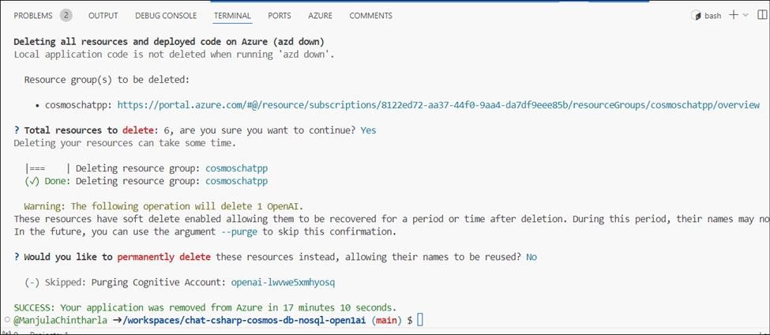

4. Navigate back to your Github browser tab and delete the codespace used for this lab.

>**Summary :**You have implemented service classes using the Microsoft.Azure.Cosmos and Azure.AI.OpenAI packages on NuGet. You sent prompts to the Azure OpenAI conversational interface along with contextual prefixes and
parsed the usage and body properties of the response. You also used
Azure Cosmos DB for NoSQL to store the conversation sessions and
messages within a single container.
