# 

# 用例 10 ：部署聊天應用程序以回答用戶的問題並跟蹤對話中的聊天歷史記錄

**目的:**

此用例將指導你完成將現有 Blazor 應用程序連接到 Azure Cosmos DB for NoSQL
帳戶和 Azure OpenAI 帳戶的步驟。應用程序向 Azure OpenAI
中的模型發送提示並分析響應。應用程序還將各種對話會話及其相應的消息存儲為項，並置在
Azure Cosmos DB for NoSQL 中的單個容器中。

簡而言之，該應用程序將：

- 使用 .NET SDK 連接到 Azure OpenAI 的模型

- **向模型發送**提示並解析完成響應

- 使用 .NET SDK 連接到 Azure Cosmos DB for NoSQL

- **使用單個作、查詢和事務批處理**管理項目

此示例聊天應用程序回答用戶的問題並跟蹤對話中的聊天歷史記錄。

**使用的關鍵技術**--, Csharp, nosql ,asp-net,blazor,azure-cosmos-db,

**預計持續時間** -- 45 分鐘

**實驗類型：** 講師指導

**先決條件：**

GitHub 帳戶 -- 您應該擁有自己的 GitHub
登錄憑證。如果您沒有，請從此處創建一個
-\`\` **https://github.com/signup?user_email=&source=form-home-signupobjectives\`\`**

### 任務 1：運行 Docker

1.  在 Windows 搜索框中，鍵入 **Docker** ，然後單擊 **Docker Desktop**。

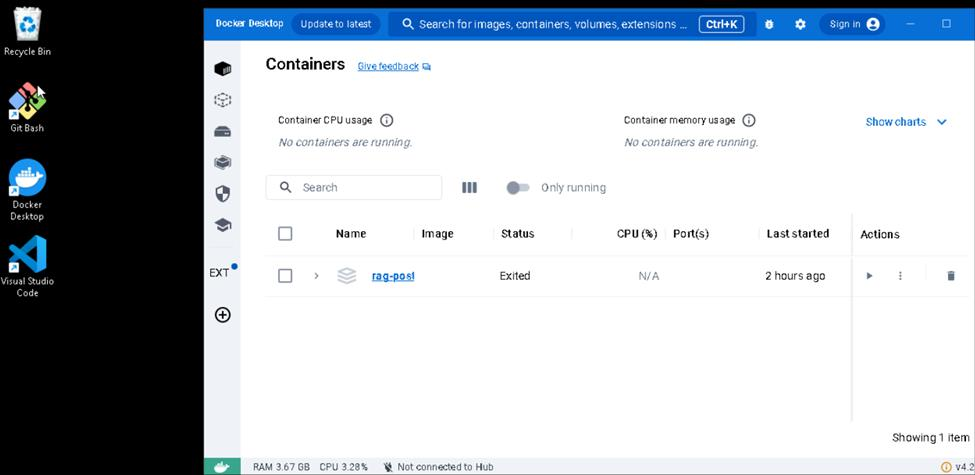

### 任務 2 ：註冊服務提供商

1.  打開瀏覽器並轉到 <https://portal.azure.com> 並使用 VM
    的“資源**”選項卡中**提供的 Azure 憑據登錄。

> 

2.  在 Azure 門戶的主頁上，單擊“ **資源組** ”磁貼。

3.  複製資源組名稱並將其保存在記事本中，以便使用下一個任務在此資源組中部署所需的資源。

4.  導航回 主頁 ，單擊 **訂閱** 拼貼。

5.  單擊訂閱名稱。

6.  單擊 **左側導航菜單中的** 設置 - \> 資源提供程序。

7.  輸入 \`\`**Microsoft.AlertsManagement**\`\` ，然後按 Enter
    鍵。選擇它，然後單擊**註冊**。

### 任務 3：將服務和應用程序預配到 Azure

1.  打開瀏覽器並轉到\`\`https:\\github.com\`\` 並使用您的 Github
    帳戶登錄。搜索以下存儲庫

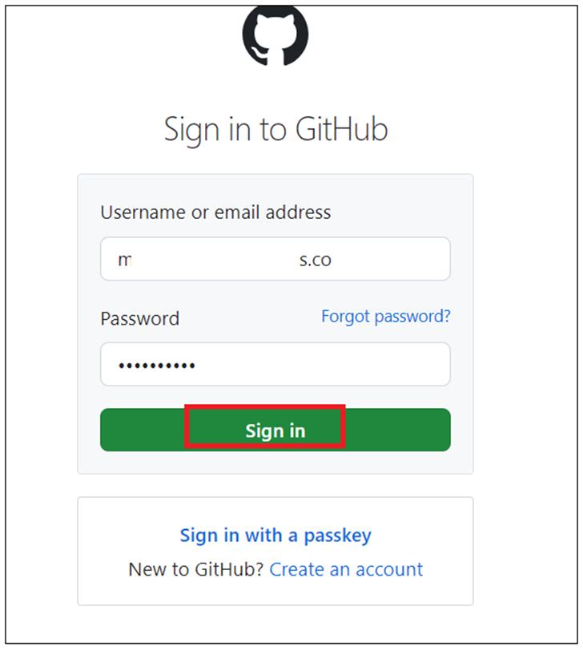

2.  搜索以下存儲庫，然後單擊 **Fork**。

> \`\`https://github.com/technofocus-pte/chat-csharp-cosmos-db-nosql-openai\`\`

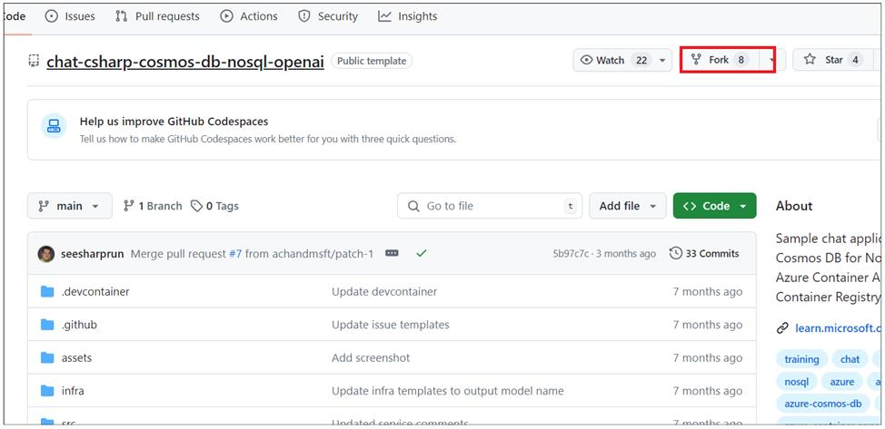

3.  輸入存儲庫名稱，然後單擊 **Create repository** .

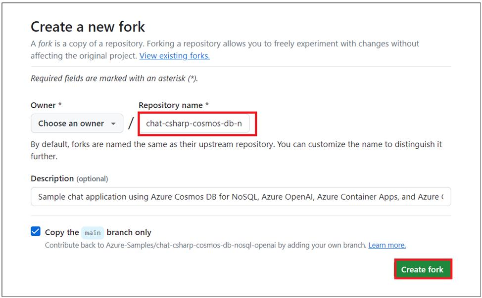

4.  單擊 **Code -\> Code space -\> Open Code space。**

5.  等待 Dev 容器設置 。需要 3-5 分鐘

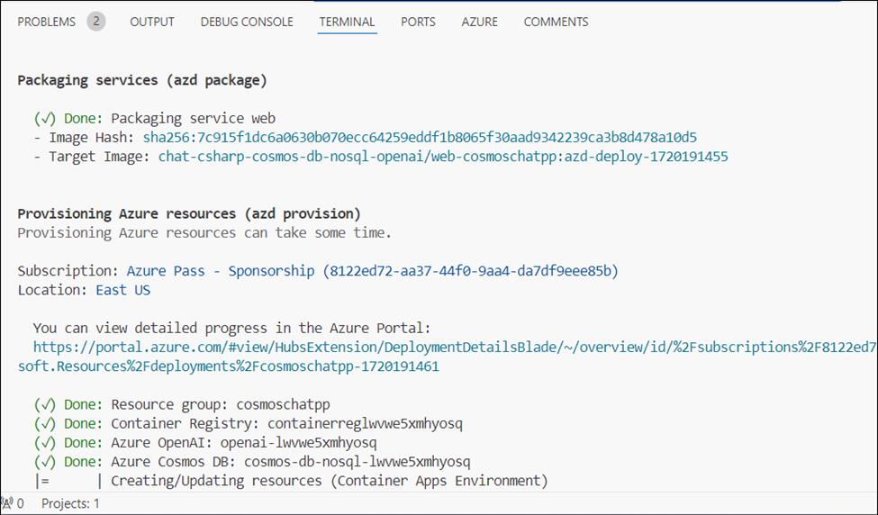

6.  運行以下命令以登錄到 AZD。複製生成的代碼，然後按 Enter 鍵. 

> \`\`**azd auth login\`\`**

7.  粘貼生成的代碼並使用您的 Azure 憑據登錄。

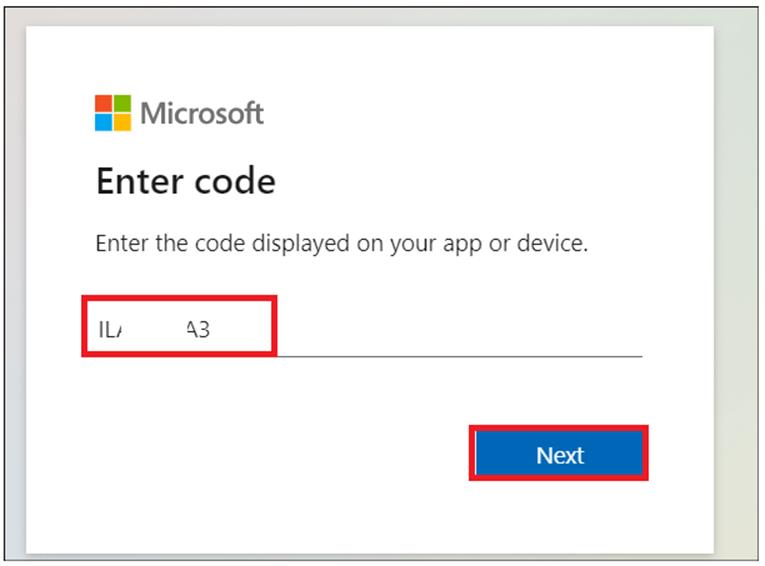

8.  運行以下命令以初始化當前目錄中的項目。將 Environment name
    （環境名稱） 輸入為\`\`**cosmoschatapp\`\`** ，然後按 Enter 鍵。

\`\`azd init \`\`

9.  運行以下命令將服務部署到 Azure，構建容器。選擇以下值。

> \`\`azd provision\`\`
>
> **選擇要使用的 Azure 訂閱** ：選擇您的訂閱
>
> **選擇要使用的 Azure 位置** ： **美國東部/美國西部**
> （有時，美國東部可能不可用，請選擇其他位置並進行部署。
>
> **為“existingResourceGroupName”基礎架構參數輸入一個值:**
> **ResourceGroup1**

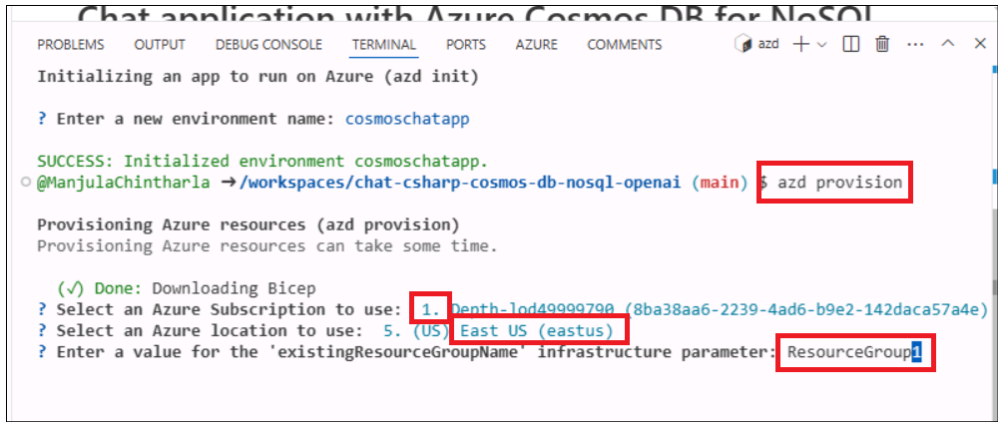

10. 等待資源完全預置。此過程需要 5-10 分鐘才能創建所有必需的資源。

### 任務 4：將應用程序部署到 Azure

1.  切換回 Azure 門戶，然後單擊主頁上的“資源組”磁貼。

2.  單擊 資源組名稱 。

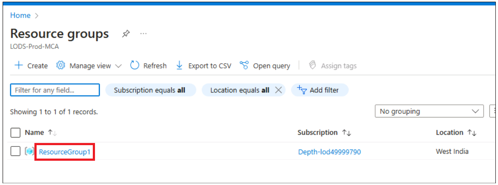

3.  您應該看到以下資源

- **容器**

- **容器註冊表**

- **Azure Cosmos Db 賬戶**

- **AureOpenAI**

4.  單擊 **Container registry name**。

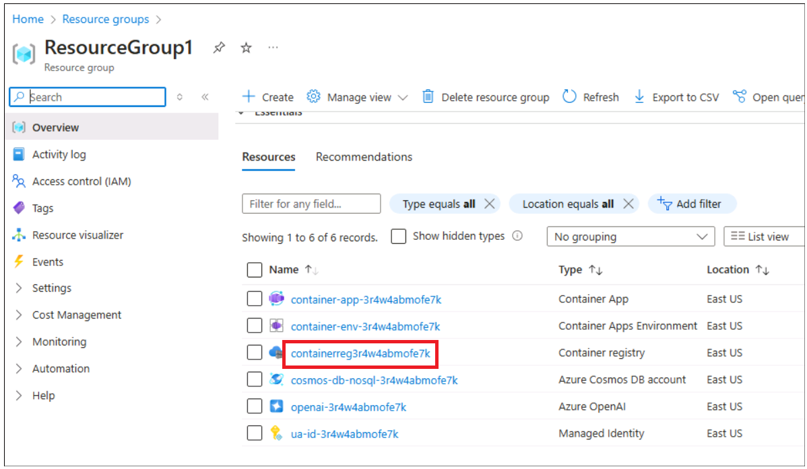

5.  從 左側導航菜單中展開 設置 ，單擊 **訪問鍵。** 選中 **Admin user
    複選框。** 將**登錄服務器**、**用戶名和密碼**
    複製到記事本，以使用它來部署應用程序。

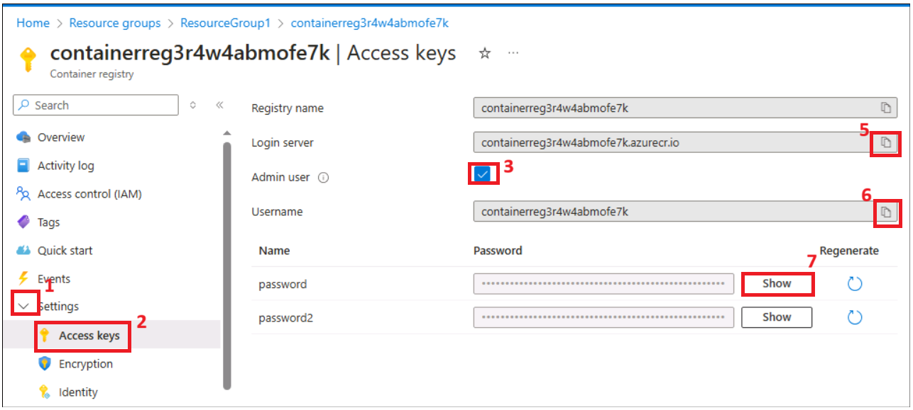

6.  複製選項卡以在新選項卡中打開 Azrue 門戶。

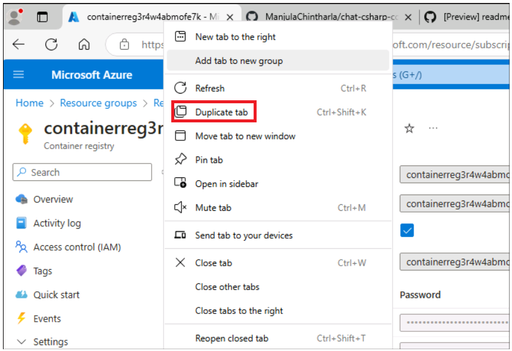

7.  單擊頂部導航菜單中的資源組名稱。

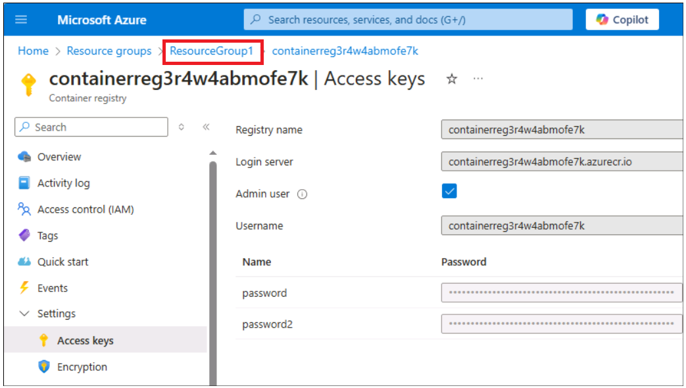

8.  單擊 Container App name 。

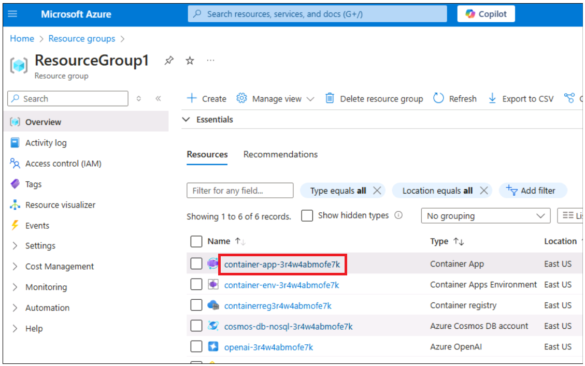

9.  單擊 Github-Sign in 下的 Authorize 按鈕，以使用您的 GitHub
    帳戶進行身份驗證。授權您的 Github 帳戶。

10. 選擇以下值

> **組織 : 您的 Github 組織**
>
> **存儲 庫:** chat-csharp-cosmos-db-nosql-openai
>
> **分支 ：** main

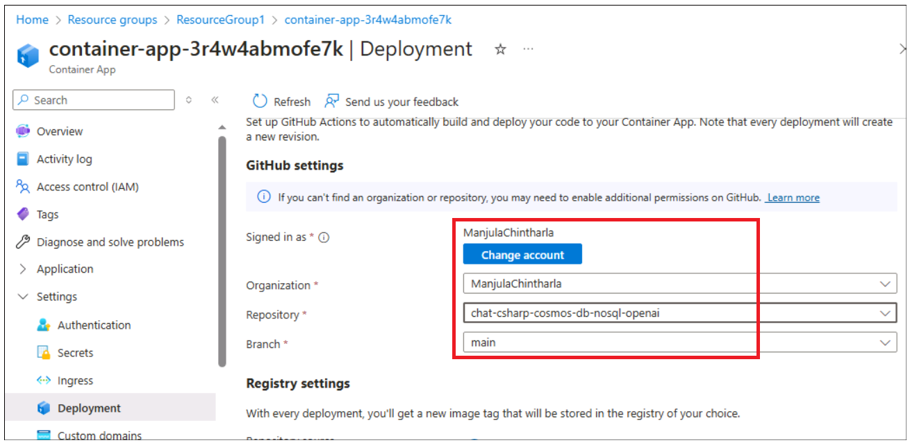

11. 向下滾動到 **Registry settings** 並輸入以下值，然後單擊 **Start
    continuous deployment** 按鈕。

- 存儲庫源 ： **Docker Hub 或其他註冊表。**

- 登錄服務器 URL：您的登錄服務器從 Container registry 複製（步驟 \#5）

- 用戶名 ：來自容器註冊表的密碼（步驟 \#5）

- 密碼 ：來自容器註冊表的密碼（步驟 \# 5）

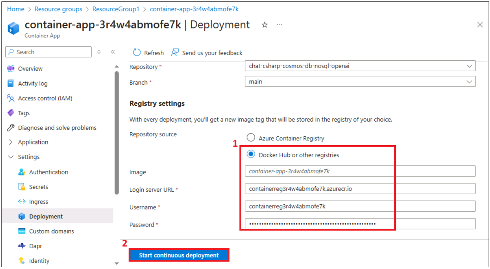

12. 單擊 Workflow file 鏈接。它會打開帶有 Github 的新標簽頁。

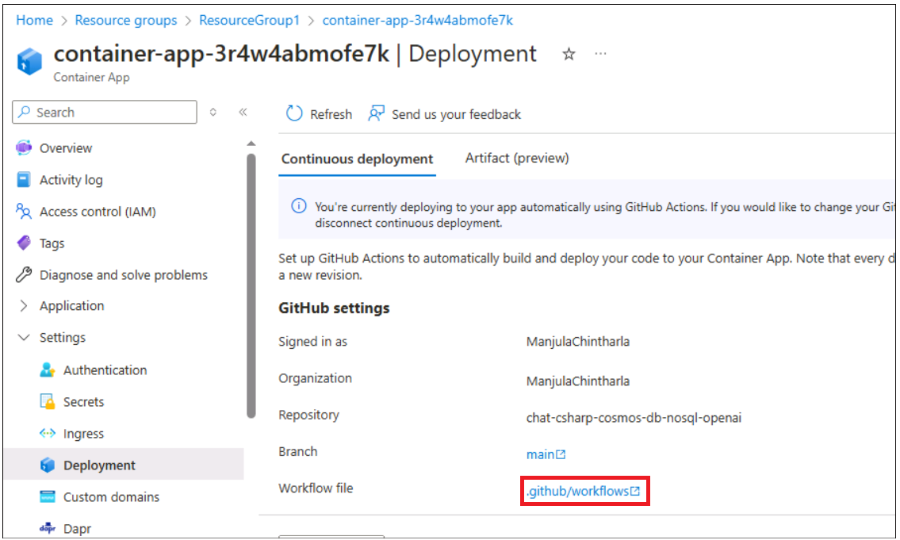

13. 單擊 **Actions** 選項卡。

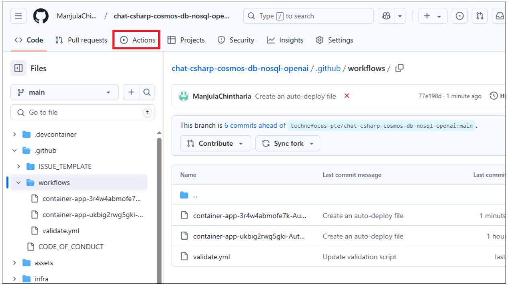

14. 等待部署完成。

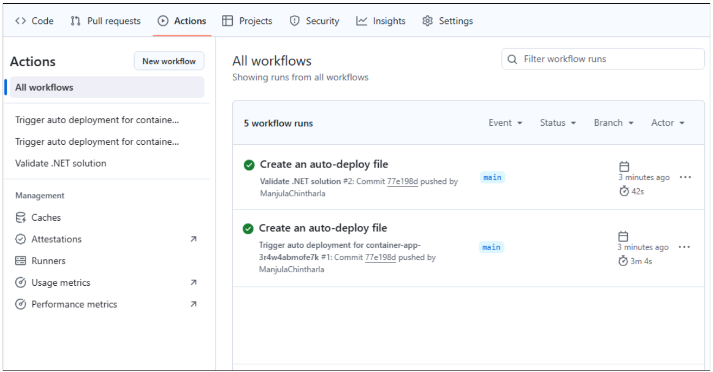

15. 不要關閉任何選項卡。

### 任務 5 ： 訪問聊天應用程序

1.  切換回 Azure 門戶，單擊
    左側導航欄中的“**概述**”，然後單擊**“**應用程序
    **URL**”。它會打開一個新的 to load 應用程序。

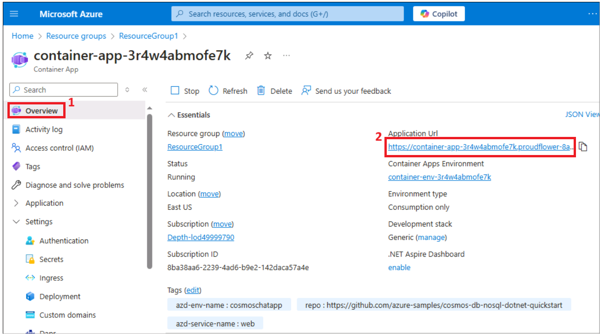

2.  點擊 **Create New Chat** 按鈕。

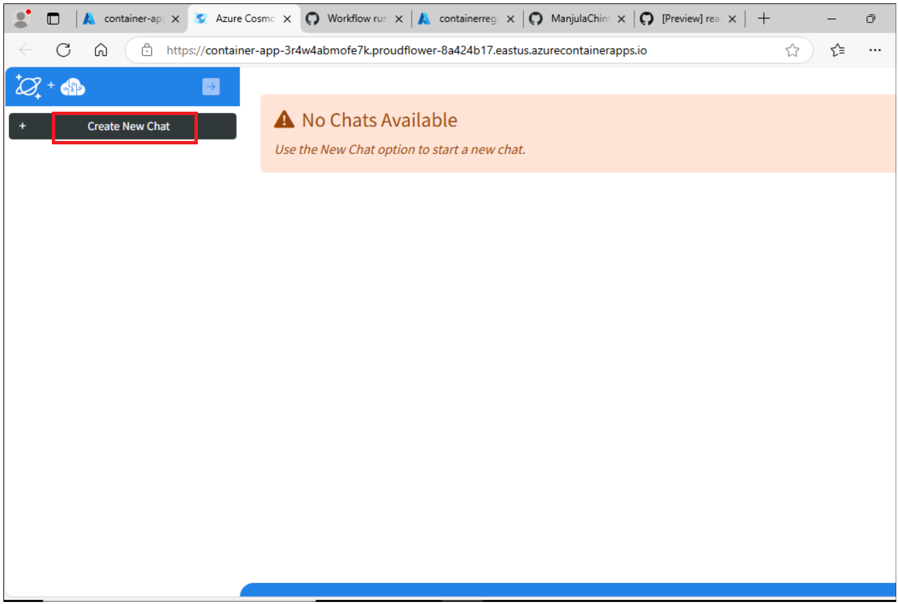

3.  輸入以下提示。

\`\`What is the seating capacity for Lumen in Seattle?\`\`

4.  輸入以下提示 。使用不同的提示瀏覽應用程序。

\`\`is that bigger than Dogger stadium??\`\`

### 任務 6 ： 清理所有資源

要清理此示例創建的所有資源，請執行以下作：

1.  切換回 Github 門戶選項卡並刷新頁面。

1.  單擊 Code ，選擇為此實驗室創建的分支，然後單擊 **Delete** 。

2.  單擊 Delete **按鈕**確認分支刪除。

3.  切換回 **Azure portal -\> Resource group- \> Resource group name.**

4.  選擇所有資源，然後單擊 Delete （刪除），如下圖所示。（**DO NOT
    DELETE** 資源組）

5.  在文本框上輸入\`\`**delete**\`\`，然後單擊 **Delete** 。

> 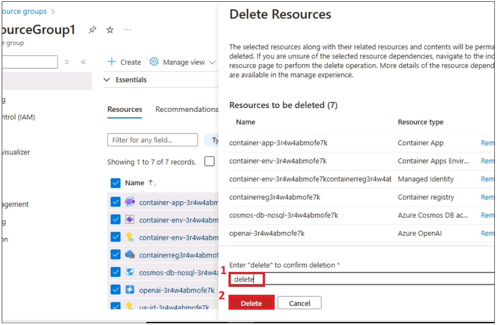

6.  單擊 Delete 確認刪除。

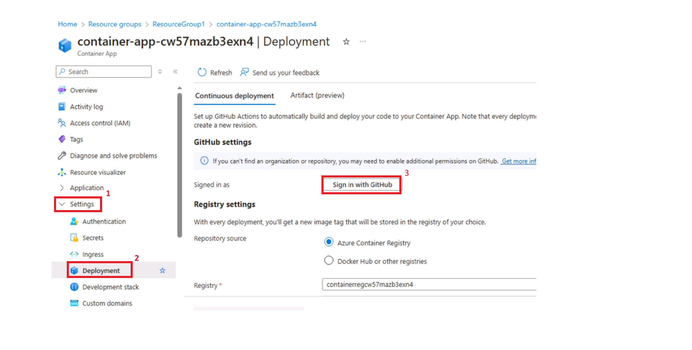

**總結:**

你已在 NuGet 上使用 Microsoft.Azure.Cosmos 和 Azure.AI.OpenAI
包實現了服務類。您向 Azure OpenAI
對話界面發送了提示以及上下文前綴，並分析了響應的用法和正文屬性。你還使用了
Azure Cosmos DB for NoSQL 將對話會話和消息存儲在單個容器中。
