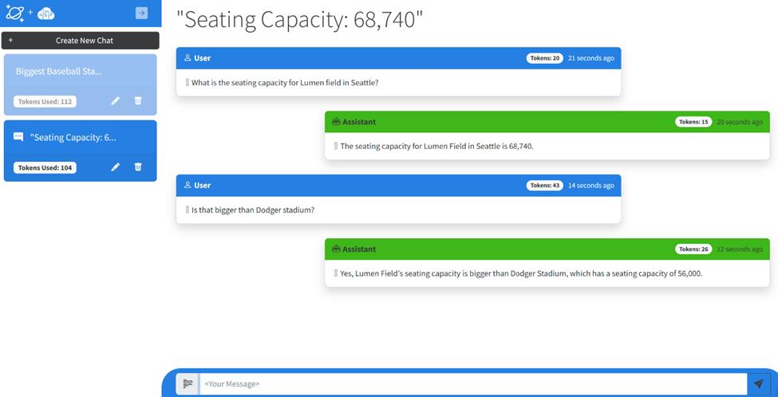
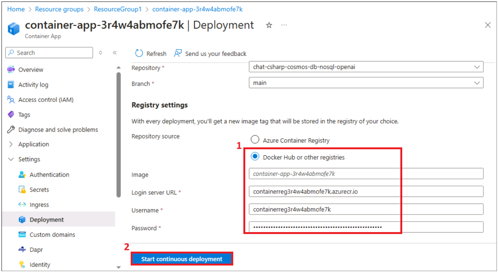

# Usecase 10 : Deploying chat application to answer questions from the user and tracks chat history across conversations

**Objective:**

This usecase walks you through the steps to connect an existing Blazor
application to an Azure Cosmos DB for NoSQL account and an Azure OpenAI
account. Your application sends prompts to the model in Azure OpenAI and
parses the responses. Your application also stores various conversation
sessions and their corresponding messages as items collocated in a
single container within Azure Cosmos DB for NoSQL.

In short, the application will:

- **Connect** to Azure OpenAI\\'s model using the .NET SDK

- **Send** prompts to the model and parse the completion response

- **Connect** to Azure Cosmos DB for NoSQL using the .NET SDK

- **Manage** items with individual operations, queries, and
  transactional batches

This sample chat application answers questions from the user and tracks
chat history across conversations.

**Key technologies used** --, Csharp, nosql
,asp-net,blazor,azure-cosmos-db,

**Estimated duration** -- 45 minutes

**Lab Type:** Instructor Led

**Pre-requisites:**

GitHub account -- You are expected to have your own GitHub login
credentials. If you do not have, please create one from here
-``https://github.com/signup?user_email=&source=form-home-signupobjectives``

### Task 1 : Run the Docker

1.  In your Windows search box, type **Docker** , then click on **Docker Desktop**.

### Task 2 : Register Service provider

1.  Open a browser and go to ``https://portal.azure.com`` and sign in with your Azure credentials.

   - Username: +++@lab.CloudPortalCredential(User1).Username+++
     
   - Password: +++@lab.CloudPortalCredential(User1).Password+++

2.  On the Home page, click on the **Subscription** tile.

  

3.  Click on the subscription name.

  

4.  Click on **Settings -> Resource provider** from left navigation
    menu.
    
  

6.  Type ``Microsoft.AlertsManagement`` and press enter. Select it and then click on **Register**.

  

  

### Task 3: Provision Services and application to Azure

1.  Open a browser and go to ``https://github.com`` and sign in with your Github account. Search for the below repo

  

2.  Search for the below repo and click on **Fork**.

  +++https://github.com/technofocus-pte/chat-csharp-cosmos-db-nosql-openai-CSTesting.git+++

  

3.  Enter the repository name and then click on **Create repository**.

  

4.  Click on **Code -> Code space ->Open Code space.**

  

5.  Wait for the Dev container to set up. it takes 3-5 min

  

6.  Run the below command to log in to AZD. Copy the generated code and press Enter. 

  +++azd auth login+++

  

7.  Paste the generated code and sign in with your Azure credentials.

  Username: +++@lab.CloudPortalCredential(User1).Username+++  

  Password: +++@lab.CloudPortalCredential(User1).Password+++

  

  

8.  Run the command below to initialize the project in the current    directory. Enter the Environment name as ``cosmoschatapp`` and press Enter.

  +++azd init+++

  

9.  Run the below command to deploy the services to Azure, and build your container. Select the below values.

  +++azd provision+++

  - Select an Azure location to use: East us/West US/France Central (Sometimes, East US might not be available, choose a different location and deploy. The ACP currently only allows whatever the Resource Group location is, France Central, East US or West US.) 

  - Enter a value for the existingResourceGroupName infrastructure parameter: +++@lab.CloudResourceGroup(ResourceGroup1).Name+++

  

  

10. Wait for the resource to be provisioned completely. Creating all the required resources will take 5-10 min.

  

### Task 4 : Deploy the application to Azure

1.  Switch back to the Azure portal and click on the Resource Groups tile on the Home page.

  

2.  Click on the resource group name.

  

3.  You should see below resources

  - **Container**

  - **Container Registry**

  - **Azure Cosmos Db account**

  - **AureOpenAI**

  

4.  Click on **Container registry** name.

  

5.  Expand **Setting** from left navigation menu, click on **Access keys.** Select **Admin user check box.** Copy the **Login server**,
    **user name** and **password** to a notepad to use to deploy the app.

  

6.  Duplicate the tab to open the Azure portal in a new tab.

  

7.  Click on the resource group name from the top navigation menu.

  

8.  Click on the Container App name.

  

9.  Click on the **Settings --> Deployment pane--> Authorize** button under Github-Sign in to authenticate with your GitHub account. Authorize your Github account.

10. Select below values

  **Organization: your Github organization**

  **Repository:** **chat-csharp-cosmos-db-nosql-openai-CSTesting**

  **Branch :** main

  

11. Scroll down to **Registry settings** enter the below values and then click on **Start continuous deployment** button.

  - Repository source: **Docker Hub or other registries.**

  - Login server URL : Your Login server is copied from the Container registry (step#5)

  - Username : your password from the container registry (step #5)

  - Password : Your password from the container registry (step # 5)

    

12. Click on the Workflow file link. It opens a new tab with Github.

  

13. Click on **Actions** tab.

  

14. Wait for the deployment to complete.

  

15. Do not close any tabs.

### Task 5: Access the chat app

1.  Switch back to the Azure portal and click on **Overview** from lthe eft navigation and then click on **Application Url**. It opens a new to-load app.

  

2.  Click on **Create New Chat** button.

  

3.  Enter the below prompt.

  ``What is the seating capacity for Lumen in Seattle?``

  

4.  Enter the below prompt. Explore the app with different prompts.

  ``is that bigger than Dogger stadium??``

  

### Task 6 : Clean up all the resources

To clean up all the resources created by this sample:

1.  Switch back to Github portal tab and refresh the page.

  

2.  Click on Code, select the branch created for this lab and click on **Delete**.

  

3.  Confirm the branch deletion by clicking on **Delete** button.

  

5.  Switch back to **Azure portal -> Resource group-> Resource group name.**

  

6.  Select all the resources and then click on Delete as shown in the  below image. (**DO NOT DELETE** resource group)

  

7.  Type ``delete`` on the text box and then click on **Delete**.

  

8.  Confirm the deletion by clicking on **Delete**.

  

**Summary :** You have implemented service classes using the Microsoft.Azure.Cosmos and Azure.AI.OpenAI packages on NuGet. You sent prompts to the Azure OpenAI conversational interface along with contextual prefixes and
parsed the usage and body properties of the response. You also used
Azure Cosmos DB for NoSQL to store the conversation sessions and
messages within a single container.
