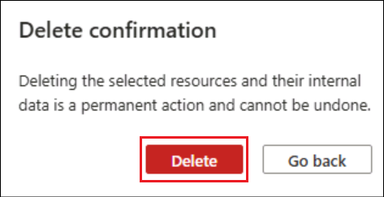

# Use case 11 - Building a Copilot using Azure OpenAI, Azure Cosmos DB for NoSQL

In this use case, you will connect a Blazor web application to Azure
Cosmos DB for NoSQL and Azure OpenAI using .NET software development
kits. Your code manages and queries items in an API for NoSQL container.
Your code also sends prompts to Azure OpenAI and parses the responses.

**Lab duration:** 45 minutes

**Lab Type**: Instructor led

**Objective**

- To set up the development environment for Blazor, PostgreSQL, and
  OpenAI.

- To create a Blazor project and design a responsive chat interface.

- To configure PostgreSQL database on Azure and connect it to the Blazor
  app.

- To integrate Azure OpenAI for enhanced chat functionalities.

- To deploy the Blazor application and PostgreSQL database on Azure.

- To test the application in order to ensure seamless interaction
  between components.

- To monitor and troubleshoot the deployed application on Azure.

**Key Technologies Used:** Azure Cosmos DB for NoSQL, Azure OpenAI

## Exercise 0: Understand the VM and the credentials

In this task, we will identify and understand the credentials that we will be using throughout the lab.

1.	**Instructions** tab hold the lab guide with the instructions to be followed throughout the lab.
   
2.	**Resources** tab has got the credentials that will be needed for executing the lab.
    -	**URL** – URL to the Azure portal
    -	**Subscription** – This is the ID of the subscription assigned to you
    -	**Username** – The user id with which you need to login to the Azure services.
    -	**Password** – Password to the Azure login.
Let us call this Username and password as Azure login credentials. We will use these creds wherever we mention Azure login credentials.
    
    -	**Resource Group** – The **Resource group** assigned to you. 

  	>[!Alert] **Important:** Make sure you create all your resources under this Resource group

    
  	
3.	**Help** tab holds the Support information. The **ID** value here is the **Lab instance ID** which will be used during the lab execution.
 
    


## Exercise 1: Deploy the infrastructure and complete the initial setup

To complete this project, you need an Azure Cosmos DB for NoSQL account
and an Azure OpenAI account. To streamline this process, deploy a Bicep
template to Azure with both of these accounts.

### Task 1: Deploy infrastructure from template

1.  Open a new browser and enter the following URL in the address
    bar: +++https://portal.azure.com/+++ to open the Azure Portal.

    

2.  In the Azure portal, click on the **\[\>\_\] (Cloud Shell)** button
    at the top of the page to the right of the search box. A Cloud Shell
    pane will open at the bottom of the portal. The first time you open
    the Cloud Shell, you may be prompted to choose the type of shell you
    want to use (**Bash** or **PowerShell**). Select **Bash**. If you
    don't see this option, then skip this step.

    
    
    

3.  In the **Getting Started** dialog, select **Mount storage account**, select your **subscription** and then click on **Apply**.

    

4.	In the **Mount storage account** dialog, select **we will create a storage account for you** and click on **Next**.

    
    
    

5.  Ensure the type of shell indicated on the top left of the Cloud
    Shell pane is switched to **Bash**. If it's **PowerShell**, switch
    to **Bash** by using the drop-down menu.

    

6.  Once the terminal starts, click on **Manage files -\> Upload**.

    

7.  Select **azuredeploy.JSON** file from the path **C:\Labfiles\Build
    and Test a custom chat application Using Azure Cosmos DB and
    AzureOpenAI** and select **Open**.

    

    You should get a success message for the file upload.

    

8.  Create a new shell variable named **resourceGroupName** with the
    name of the Azure resource group that you create
    (mslearn-cosmos-openai).

    +++resourceGroupName="ResourceGroup1"+++(Get the Resource Group name from the Resources tab)

    

9.  Deploy the **azuredeploy.json** template file to the resource group
    using az group deployment create. Then, execute the following
    command.

    +++az deployment group create --resource-group $resourceGroupName --name zero-touch-deployment --template-file azuredeploy.json+++
    
    **Note:** This deployment can take approximately 5-10 minutes.
    
    
    
    

### Task 2: Get Azure Cosmos DB for NoSQL and Azure OpenAI account credentials

The above deployment has deployed Azure Cosmos DB for NoSQL and Azure
OpenAI accounts and then stored their credentials in the Azure App
Service web app's configuration. Now, you have the choice of using the
Azure portal or Azure CLI to retrieve the credentials for each service.

1.  From the Azure portal Home page, click on **Resource groups.**

    

2.  Select your resource group.

    

3.  On the **Resource Groups** page, expand the **Essentials** panel and
    observe the **Deployments** header. The status for the deployment
    should be **Succeeded** at this point.

    

4.  Now, select the **Azure Cosmos DB** account to navigate to the
    resource's page.

    

5.  Select the **Keys** option in the **Settings** section of the
    resource navigation menu. Record the value of
    the **URI** and **PRIMARY KEY** fields. You use these values later.

    

6.  Return to the **Resource Groups** page. Select the **Azure
    OpenAI** account.

    

7.  In your **Azure Open AI** window, navigate to the **Resource
    Management** section, and click on **Keys and Endpoints**.

    

8.  In **Keys and Endpoints** page, copy **KEY1,** (*You can use either
    KEY1 or KEY2)* and **Endpoint** and then **Save** the notepad to use
    the information in the upcoming tasks.

    

### Task 3: Run the Docker

1.  In your Windows search box, type Docker , then click on **Docker
    Desktop**.

    

2.  Run the Docker Desktop.

    

## Exercise 2 - Setup and build the starter application

1.  From the VM searchbar, search for +++Visual Studio+++ and
    select **Visual Studio Code**.

2.  Click on **File** -\> **Open Folder**

    

3.  Select **cosmosdb-chatgpt** from **C:\LabFiles** and click
    on **Select Folder**.

    

4.  Click on **Yes, I trust the authors** option in the **Do you trust
    the authors dialog**.

    

5.  If there is an already open terminal, delete it.

    

6.  In the **Visual Studio Code** editor, click on **Terminal**, open
    a **New Terminal**.

    

7.  In a .NET application, it's common to use the configuration
    providers to inject new settings into your application. For this
    application, use the **appsettings.Development.json** file to
    provide the most current values for the Azure OpenAI endpoint and
    key.

8.  Open the **appsettings.Development.JSON** file. Replace the already
    existing values for uri and key values of **Azure Cosmos
    DB** and **Azure OpenAI** resources in the file with the values that
    we saved earlier.

    

9.  **Build** the .NET project by executing the below command.

    +++dotnet build+++

    

## Exercise 3: Understand the code

### Task 1: Add required members and a client instance

1.  Open the **Services/OpenAiService.cs** file. This file implements
    the class variables required to use the Azure OpenAI client. It
    implements a few static prompts and create a new instance of the
    OpenAIClient class.

2.  This code block creates a new string variable named
    \_systemPromptText with a static block of text to send to the AI
    assistant before each prompt.
    
    ```nocopy
    private readonly string _systemPrompt = @"
    You are an AI assistant that helps people find information.
    Provide concise answers that are polite and professional." + Environment.NewLine;
    ```

4.  This code block creates another new string variable named
    \_summarizePrompt with a static block of text to send to the AI
    assistant with instructions on how to summarize a conversation.

    ```nocopy
    private readonly string _summarizePrompt = @"
    Summarize this prompt in one or two words to use as a label in a button on a web page.
    Do not use any punctuation." + Environment.NewLine;
    ```
    
5.  This code block creates a new instance of the OpenAIClient class
    using the endpoint to build a Uri and the key to build an
    AzureKeyCredential.

    ```nocopy
      Uri uri = new(endpoint);
          AzureKeyCredential credential = new(key);
          _client = new(
              endpoint: uri,
              keyCredential: credential
          );
    ```


### Task 2: Ask the AI model a question

First, implement a question-answer conversation by sending a system
prompt, a question, and session ID so the AI model can provide an answer
in the context of the current conversation. Make sure you measure the
number of tokens it takes to parse the prompt and return a response (or
completion in this context).

1.  This code block creates a new variable named options of type
    ChatCompletionsOptions. Adds the two message variables to the
    Messages list and sets the value of User to the sessionId
    constructor parameter.

    ```nocopy
    ChatCompletionsOptions options = new()
        {
            DeploymentName = "chatmodel",
            Messages = {
                new ChatRequestSystemMessage(_systemPrompt),
                new ChatRequestUserMessage(userPrompt)
            },
            User = sessionId,
            MaxTokens = 4000,
            Temperature = 0.3f,
            NucleusSamplingFactor = 0.5f,
            FrequencyPenalty = 0,
            PresencePenalty = 0
        };
    ```
2.  The GetChatCompletionsAsync method of the Azure OpenAI client
    variable (\_client) is invoked Asynchronously. The result is stored
    in a variable named completions of type ChatCompletions.

    ```nocopy
    Response<ChatCompletions> completionsResponse = await_client.GetChatCompletionsAsync(options);
    ChatCompletions completions = completionsResponse.Value;
    ```
    
3.  Finally, the below block of code, returns a tuple as the result of
    the GetChatCompletionAsync method with the content of the completion
    as a string, the number of tokens associated with the prompt, and
    the number of tokens for the response.

    ```nocopy
    return (
            completionText: completions.Choices[0].Message.Content,
            completionTokens: completions.Usage.CompletionTokens
        );
    ```

### Task 3: Ask the AI model to summarize a conversation

Now, send the AI model a different system prompt, your current
conversation, and session ID so the AI model can summarize the
conversation in a couple of words.

2.  The below code creates a ChatCompletionsOptions variable named
    options with the two message variables in the Messages list, User
    set to the sessionId constructor parameter, MaxTokens set to 200,
    and the remaining properties.

    ```nocopy
    ChatCompletionsOptions options = new()
        {
             DeploymentName = "chatmodel",
            Messages = {
                 new ChatRequestSystemMessage(_systemPrompt),
                new ChatRequestUserMessage(conversationText)
            },
            User = sessionId,
            MaxTokens = 200,
            Temperature = 0.0f,
            NucleusSamplingFactor = 1.0f,
            FrequencyPenalty = 0,
            PresencePenalty = 0
        };
    ```

3.  The below code invokes the \_client.GetChatCompletionsAsync
    asynchronously with the model name (\_modelName) and the options
    variable as parameter and stores the result in a variable named
    completions of type ChatCompletions. It returns the content of the
    completion as a string as the result of the SummarizeAsync method.

    ```nocopy
    Response<ChatCompletions> completionsResponse = await _client.GetChatCompletionsAsync(options);
    ChatCompletions completions = completionsResponse.Value;
    string completionText = completions.Choices[0].Message.Content;
    return completionText;
    ```

    

### Task 4 - Connect to Azure Cosmos DB for NoSQL

The CosmosDbService class contains a stub implementation of a service
similar to the OpenAiService class you worked on previously in this
module. In contrast, this class uses the .NET SDK for Azure Cosmos DB,
which works slightly different.

This section exaplins the implementation of the class variables and
client required to access Azure Cosmos DB for NoSQL using the client.

1.  Open the **Services/CosmosDbService.cs** file.

    

2.  The below code creates a variable named options of type
    CosmosSerializationOptions and Set the PropertyNamingPolicy property
    of the variable to CosmosPropertyNamingPolicy.CamelCase.

    ```nocopy
    CosmosSerializationOptions options = new()
    {
        PropertyNamingPolicy = CosmosPropertyNamingPolicy.CamelCase
    };
    ```

    **Note:** Setting this property will ensure that the JSON produced by
the SDK is both serialized and deserialized in camel case regardless of
how it's corresponding property is cased in the .NET class.

3.  The below code creates a new instance of type CosmosClient named
    client using the CosmosClientBuilder class, endpoint, key, and
    serialization options you specified earlier.

    ```nocopy
    CosmosClient client = new CosmosClientBuilder(endpoint, key)
        .WithSerializerOptions(options)
        .Build();
    ```
    
4.  The below code create a new nullable variable of type Database named
    database by calling the GetDatabase method of the client variable.

    **Database? database = client?.GetDatabase(databaseName);**

5.  The below code assigns the constructor's container variable to the
    class' \_container variable only if it's not null. If it's null,
    throw an ArgumentException.

    ```nocopy
    _container = container ??
    throw new ArgumentException("Unable to connect to existing Azure Cosmos DB container or database.");
    ```
    
    

### Task 5 - Implement the Azure Cosmos DB for NoSQL service

The Azure Cosmos DB service (CosmosDbService) manages querying,
creating, deleting, and updating sessions and messages in your AI
assistant application. To manage all of these operations, the service is
required to implement multiple methods for each potential operation
using various features of the .NET SDK.

There are multiple key requirements to tackle in this exercise:

- Implement operations to create a session or message

- Implement queries to retrieve multiple sessions or messages

- Implement an operation to update a single session or batch update
  multiple messages

- Implement an operation to query and delete multiple related sessions
  and messages

Azure Cosmos DB for NoSQL stores data in JSON format allowing us to
store many types of data in a single container. This application stores
both a chat "session" with the AI assistant and the individual
"messages" within each session. With the API for NoSQL, the application
can store both types of data in the same container and then
differentiate between these types using a simple type field.

1.  Open the **Services/CosmosDbService.cs** file.

2.  The below code creates a new variable named partitionKey of type
    PartitionKey using the current session's SessionId property as the
    parameter.

    **PartitionKey partitionKey = new(session.SessionId);**

3.  The below code invokes the CreateItemAsync method of the container
    passing in the session parameter and partitionKey variable. Returns
    the response as the result of the InsertSessionAsync method.

    ```nocopy
    return await _container.CreateItemAsync<Session>(
        item: session,
        partitionKey: partitionKey
    );
    ```

4.  The below code creates a PartitionKey variable using
    session.SessionId as the value of the partition key.Creates a new
    message variable named newMessage with the Timestamp property
    updated to the current UTC timestamp. Invoke the CreateItemAsync
    passing in both the new message and partition key variables. Return
    the response as the result of InsertMessageAsync.

    ```nocopy
    PartitionKey partitionKey = new(message.SessionId);
    Message newMessage = message with { TimeStamp = DateTime.UtcNow };
    return await _container.CreateItemAsync<Message>(
        item: newMessage,
        partitionKey: partitionKey
    );
    ```
    
    

### Task 6: Retrieve multiple sessions or messages

There are two main use cases where the application needs to retrieve
multiple items from our container. First, the application retrieves all
sessions for the current user by filtering the items to ones where type
= Session. Second, the application retrieves all messages for a session
by performing a similar filter where type = Session & sessionId = . Both
queries are here implemented using the .NET SDK and a feed iterator.

1.  The below code creates a new variable named query of type
    QueryDefinition. It uses the fluent WithParameter method to assign
    the name of the Session class as the value for the parameter. Then
    invokes the generic GetItemQueryIterator\<\> method on the
    \_container variable passing in the generic type Session and the
    query variable as a parameter. Store the result in a variable of
    type FeedIterator named response.

    ```nocopy
    QueryDefinition query = new QueryDefinition("SELECT DISTINCT * FROM c WHERE c.type = @type")
    .WithParameter("@type", nameof(Session));
    FeedIterator<Session> response = _container.GetItemQueryIterator<Session>(query);
    ```
    
2.  The below code within the while loop, asynchronously get the next
    page of results by invoking ReadNextAsync on the response variable
    and then add those results to the list variable named output.
    Outside the while loop, the output variable is returned with a list
    of sessions as the result of the GetSessionsAsync method.
    
    ```nocopy
    FeedResponse<Session> results = await response.ReadNextAsync();
    output.AddRange(results);
    return output;
    ```

4.  The below code uses the fluent WithParameter method to assign the
    @sessionId parameter to the session identifier passed in as a
    parameter, and the @type parameter to the name of the Message class.

    ```nocopy
    QueryDefinition query = new QueryDefinition("SELECT * FROM c WHERE  c.sessionId = @sessionId AND c.type = @type")
        .WithParameter("@sessionId", sessionId)
        .WithParameter("@type", nameof(Message));
    ```
    
4.  Create a FeedIterator\< Message \> using the query variable and the
    GetItemQueryIterator\<\> method.

    FeedIterator<Message> response = _container.GetItemQueryIterator<Message>(query);

    

## Exercise 4: Execute the app

Now your application has a full implementation of Azure OpenAI and Azure
Cosmos DB. You can test the application end-to-end by debugging the
solution.

1.  From the **Visual Studio Code Terminal**, build the project using
    the below command.

    +++**dotnet build**+++

    

2.  Start the application with hot reloads enabled using dotnet watch.

    +++**dotnet watch run --non-interactive**+++
    
    

3.  Visual Studio Code launches the in-tool simple browser with the web
    application running. In the web application, create a new chat
    session by clicking on **+ Create New Chat** and ask the AI
    assistant a question. Then, close the running web application.

    

4.  Paste the following text in the text box and click on
    the **Send** icon.

    +++How many wins does it take to promote to the Premier League?+++
    
    
    
    

5.  Paste the following text in the text box and click on
    the **Send** icon.

    +++What is Azure OpenAI?+++
    
    
    
    

6.  Close the terminal.

## Exercise 5: Clean up resource group

1.	Open a new browser and enter the following URL in the address bar: +++https://portal.azure.com/+++ to open the Azure Portal.

2.	From the Resource group page, select you **assigned Resource group**.

     

3.	Select all the **resources**, and then select **Delete**.

     

     

4.	Type in +++**delete**+++ in the text box and click on **Delete**.
 
     

     
  	
6.	A success notification on the deleted resources confirms the deletion.

7.  Once the resources are deleted, from the Azure portal home page,
    search for **Azure AI Services** and select it.

    

8.  Select **Azure OpenAI** from the left pane and then select **Manage
    deleted resources**.

    

9.  Select the resource that gets listed there and then click
    on **Purge**.

    

10.  Click on **Yes**.

     

**Summary**

This lab provided a comprehensive guide to building, deploying, and
testing a custom chat application using Blazor, PostgreSQL, and Azure
OpenAI. In this lab, you've learned to set up the necessary development
environment, created and designed a Blazor-based chat interface,
configured and connected a PostgreSQL database on Azure, integrated
Azure OpenAI for enhanced functionalities, and finally deployed and
tested the application on Azure. This hands-on experience equipped you
with the skills to develop and manage modern web applications using
cutting-edge technologies and cloud services

