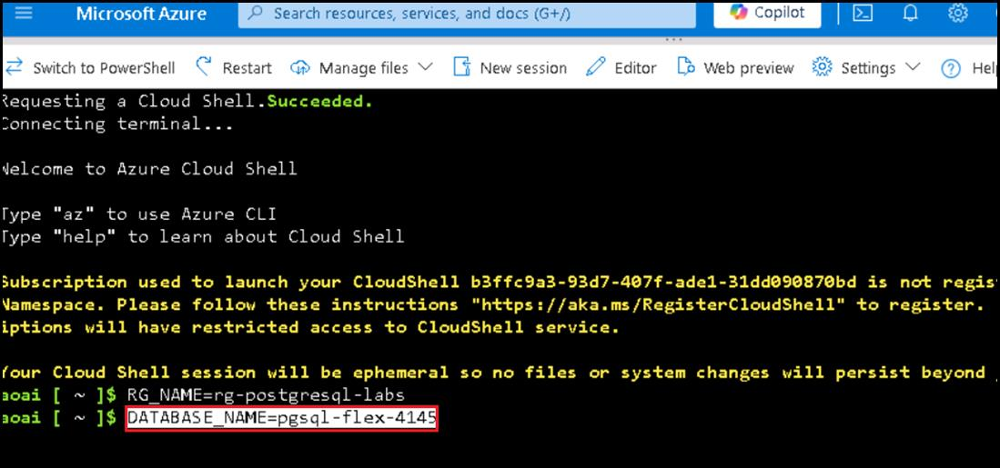
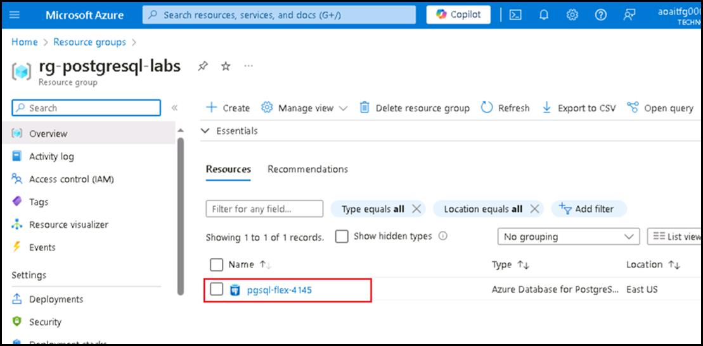
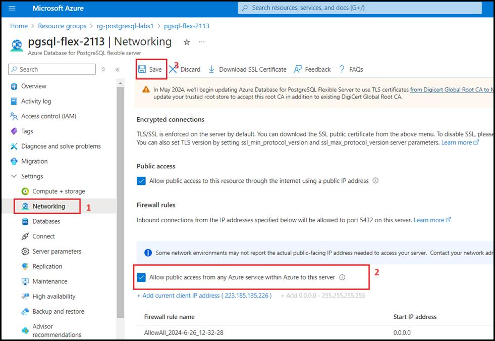
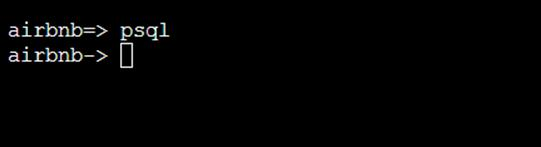
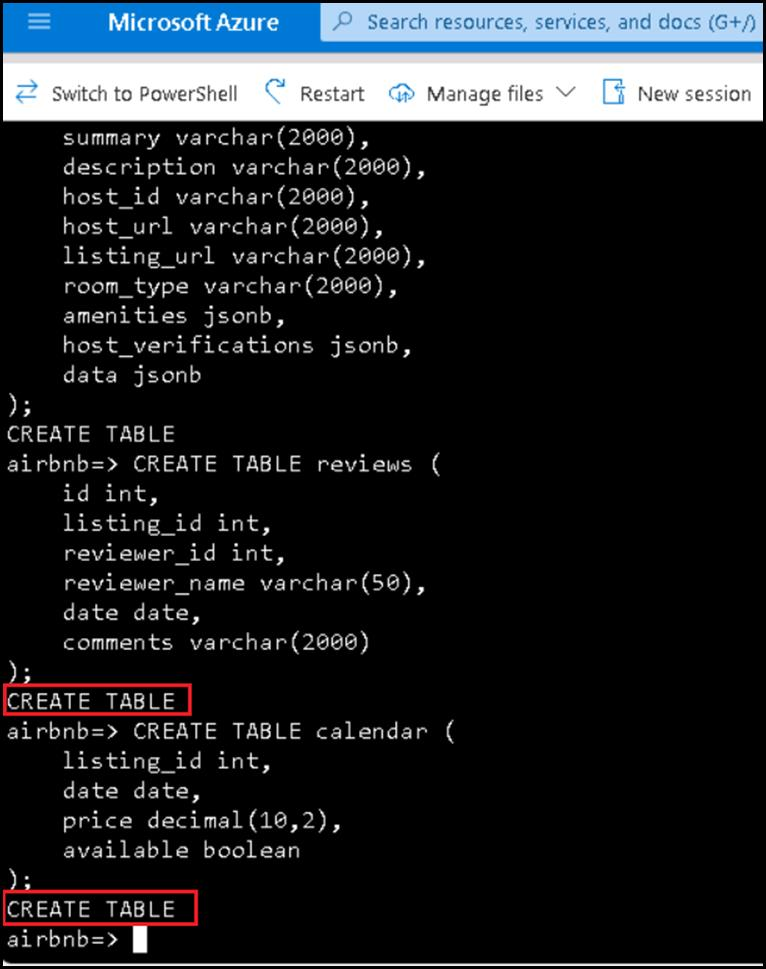
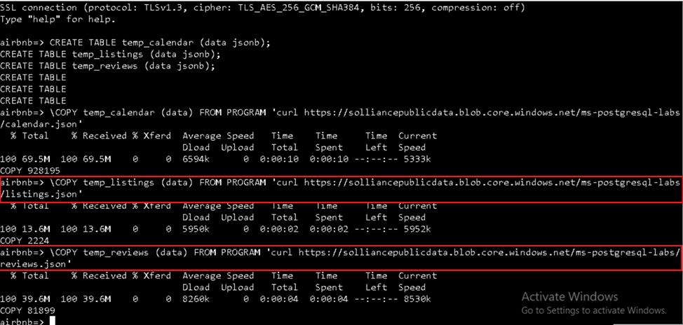
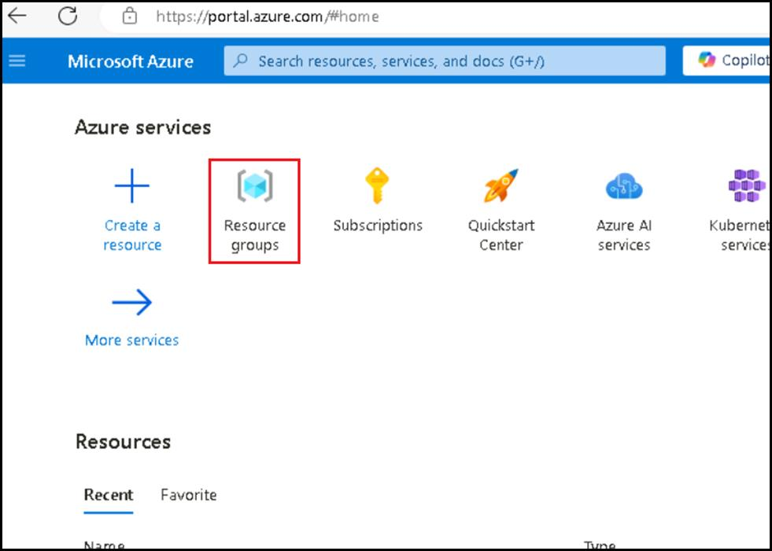
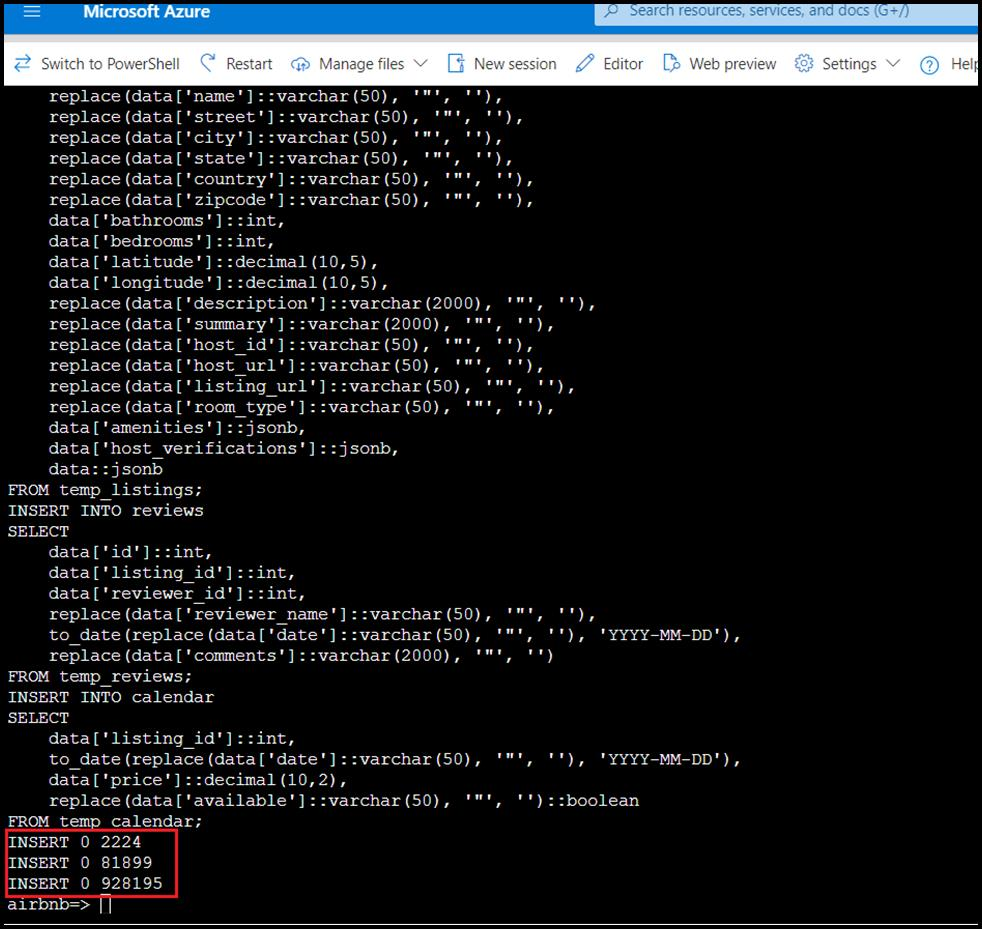
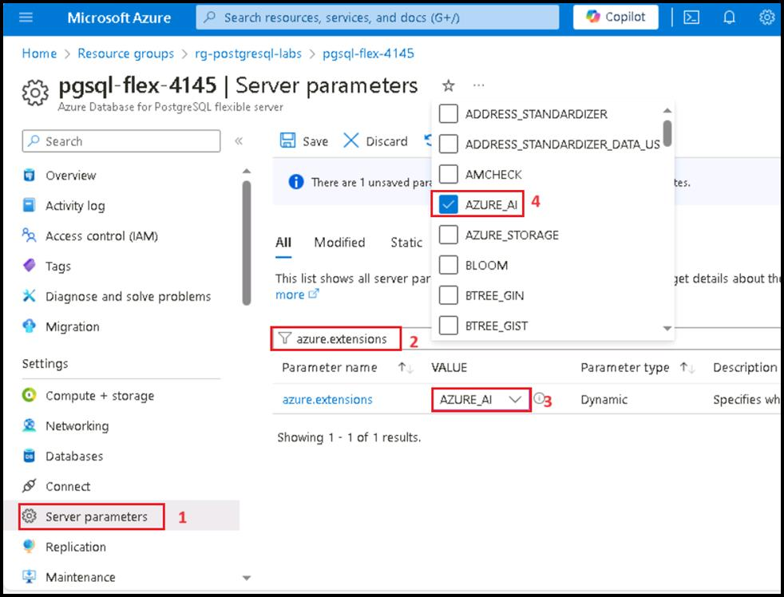
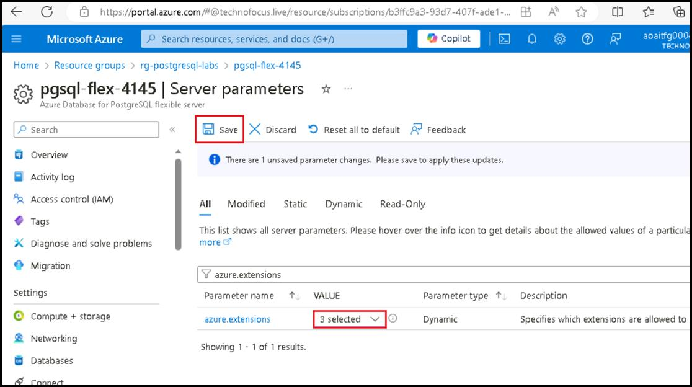

# Caso d'uso 12- Integrare le funzionalità di intelligenza artificiale generativa con il server flessibile di Database di Azure per PostgreSQL per valutare le recensioni di determinati elenchi di intelligenza artificiale

**Durata del laboratorio --** 40 minuti

**Tipo di laboratorio --** Guidato dall'istruttore

**Introduzione**

In questo lab imparerai come integrare i servizi di Azure AI con
PostgreSQL per migliorare il suo database con funzionalità avanzate di
AI. Sfruttando la potenza delle estensioni Azure OpenAI e PostgreSQL, ad
esempio pgvector e PostGIS, è possibile abilitare analisi del testo
sofisticate, ricerche di somiglianza vettoriale e query geospaziali
direttamente all'interno del database. Questo lab illustra il
provisioning delle risorse di Azure necessarie, la configurazione del
database e l'esecuzione di query complesse che combinano informazioni
dettagliate basate sull'intelligenza artificiale con data geospaziali.

**Obiettivi**

- Per effettuare il provisioning e configurare il server flessibile di
  Database di Azure per PostgreSQL.

- Per creare e gestire gli incorporamenti vettoriali usando il servizio
  Azure OpenAI.

- Per eseguire ricerche di somiglianza vettoriale al fine di trovare
  data di testo semanticamente simili.

- Per utilizzare l'estensione PostGIS per l'analisi dei data
  geospaziali.

- Per integrare i servizi di Azure AI Language per l'analisi del
  sentiment e altre funzioni cognitive.

- Per ottimizzare e analizzare le prestazioni delle query utilizzando
  gli strumenti di indicizzazione e pianificazione delle query.

**Importante:** Se uno qualsiasi dei comandi non viene **pasted** in
**CloudShell**, apri un notepad, tieni il cursore in uno spazio vuoto
del notepad e quindi fai clic sul pulsante T del comando da incollare.
Il contenuto verrà copiato nel blocco note e quindi sarà possibile
copiare e incollare dal notepad su CloudShell.

## Esercizio 0: Informazioni sulla macchina virtuale e sulle credenziali

In questa attività, identificheremo e comprenderemo le credenziali che
utilizzeremo in tutto il laboratorio.

1.  **Instructions tab** Tenere la guida del laboratorio con le
    istruzioni da seguire durante il laboratorio.

2.  **Resources tab** contiene le credenziali necessarie per
    l'esecuzione del lab.

    - **URL**: URL del portale di Azure

    - **Subscription**: questo è l'ID dell'abbonamento assegnato
      all'utente

    - **Username**: l'ID utente con cui è necessario accedere ai servizi
      di Azure.

    - **Password**: password per l'account di accesso di Azure.
      Chiamiamo questo nome utente e password come credenziali di
      accesso di Azure. Useremo questi crediti ogni volta che
      menzioniamo le credenziali di accesso di Azure.

    - **Resource Group**: il **Resource Group** assegnato all'utente.

\[! Vigile\] **Importante:** assicurarsi di creare tutte le risorse in
questo Resource Group

3.  **Help tab** contiene le informazioni di supporto. Il valore **ID**
    è l' **ID** **Lab instance** che verrà utilizzato durante
    l'esecuzione del lab.

## Esercizio 1: Effettuare il provisioning di un server flessibile di Database di Azure per PostgreSQL

### Attività 0: Registrare i provider di risorse

1.  Accedere al **Azure Portal** -
    +++[https://portal.azure.com+++](https://portal.azure.com+++/)
    usando le credenziali di accesso di Azure.

2.  Fare clic su **Subscriptions** e selezionare **Resource Providers**
    in **Settings** nel riquadro sinistro.

3.  Cercare +++**Microsoft.DBforPostgreSQL**+++ e fare clic su
    **Register** per registrare questo Resource Provider.

### Attività 1: Effettuare il provisioning di un server flessibile di Database di Azure per PostgreSQL

1.  Apri un browser web e vai a
    +++[https://portal.azure.com+++](https://portal.azure.com+++/)

2.  Selezionare l' icona **Cloud Shell** nella barra degli strumenti del
    Azure portal per aprire un nuovo riquadro di Cloud Shell nella parte
    superiore della finestra del browser.

3.  La prima volta che si apre Cloud Shell, potrebbe essere richiesto di
    scegliere il tipo di shell che si desidera utilizzare (**Bash** o
    **PowerShell**). Seleziona **Bash**.

4.  Nella finestra di dialogo **Getting started,** selezionare **Mount
    storage account** e selezionare la sottoscrizione di Azure. Fare
    clic sul pulsante **Apply**.

5.  Nella finestra di dialogo **Mount storage account**, selezionare
    **we will create a storage account for you** e fare clic sul
    pulsante **Next**.

6.  Al prompt di Cloud Shell eseguire i comandi seguenti per definire le
    variabili per la creazione di risorse. Le variabili rappresentano i
    nomi da assegnare al gruppo di risorse e al database e specificano
    l'area di Azure in cui devono essere distribuite le risorse.

7.  Sostituire il Resource group Name nel comando seguente con il gruppo
    di risorse assegnato ed eseguire il comando.

+++RG_NAME= \< Resource group Name\>+++

8.  Nel nome del database, sostituire il token {SUFFIX} con l' **Lab
    instance ID**, ad esempio le iniziali, per assicurarsi che il nome
    del server di database sia univoco a livello globale.

+++DATABASE_NAME=<pgsql-flex-@lab.LabInstance.Id>+++

9.  Eseguire il comando seguente per impostare il valore della regione.

+++REGION=@lab. CloudResourceGroup(ResourceGroup1).Location+++

10. Effettuare il provisioning di un'istanza del database di Database di
    Azure per PostgreSQL all'interno del gruppo di risorse assegnato
    eseguendo il comando dell'interfaccia della riga di comando di Azure
    seguente ( Il completamento di questo comando richiederà 10 minuti)

> \`\`\`
>
> az postgres flexible-server create --name $DATABASE_NAME --location
> $REGION --resource-group $RG_NAME \\
>
> --admin-user s2admin --admin-password Seattle123Seattle123
> –database-name airbnb \\
>
> --public-access 0.0.0.0-255.255.255.255 --version 16 \\
>
> --sku-name Standard_D2s_v3 –storage-size-32 --yes
>
> \`\`\`

### Attività 2: Connettersi al database usando psql in Azure Cloud Shell

In questa attività si usa l'utilità della riga di comando psql di Azure
Cloud Shell per connettersi al database.

1.  Aprire un browser, passare a
    +++[https://portal.azure.com+++](https://portal.azure.com+++/) e
    accedere con l'account della sottoscrizione di Azure.

2.  Nella **Home** page fare clic su **Resource Groups**.

3.  Fare clic sul nome del **your assigned resource.**

4.  Nel gruppo di risorse, selezionare risorsa **PostgreSQL Flexible
    Server.**

5.  Nel menu di navigazione a sinistra, seleziona **Connect** in
    **Settings**.

6.  Dalla pagina del database **Connect** nel di Azure Portal
    selezionare **airbnb** per il del **Database name**, quindi copiare
    il blocco **Connection details** e incollarlo nel notepad per usare
    le informazioni nelle attività future.

7.  Nella home page di Database di Azure per PostgresSQL fare clic su
    **Overview** nel menu di spostamento a sinistra e copiare il nome
    del server e incollarlo nel blocco note, quindi **Save** il notepad
    per usare le informazioni nel lab successivo.

8.  Nella home page di Database di Azure per PostgreSQL selezionare
    **Networking** in Impostazioni e selezionare **Allow public access
    from any Azure service within Azure to this server**. Fare clic sul
    pulsante **Save**.

9.  Selezionare l' icona **Cloud Shell** nella barra degli strumenti del
    Azure portal per aprire un nuovo riquadro di Cloud Shell nella parte
    superiore della finestra del browser.

10. Incollare i **Connection details** in Cloud Shell.

11. Al prompt di Cloud Shell, sostituire il token **{your_password}**
    con la password assegnata all' utente **s2admin** durante la
    creazione del database, la password deve essere
    +++**Seattle123Seattle123**+++.

12. Connettersi al database utilizzando l'utilità della riga di comando
    psql immettendo quanto segue al prompt:

+++psql+++

Per la connessione al database da Cloud Shell è necessario che la
casella Consenti l'accesso pubblico da qualsiasi servizio Azure
all'interno di Azure al server sia selezionata nella pagina
**Networking** del database. Se ricevi un messaggio che ti informa che
non riesci a connetterti, verifica che questa opzione sia selezionata e
riprova.

### Attività 3: Aggiungere data al database

Utilizzando il prompt dei comandi psql, si creeranno tabelle e le si
popolerà con i data da utilizzare in laboratorio.

1.  Eseguire i comandi seguenti per creare tabelle temporanee per
    l'importazione di data JSON da un account di archiviazione BLOB
    pubblico.

> CREATE TABLE temp_calendar (data jsonb);
>
> CREATE TABLE temp_listings (data jsonb);
>
> CREATE TABLE temp_reviews (data jsonb);

2.  Usando il comando COPY, popolare ogni tabella temporanea con i data
    dei file JSON in un account di archiviazione pubblico.

+++\COPY temp_calendar (data) FROM PROGRAM
'curl <https://solliancepublicdata.blob.core.windows.net/ms-postgresql-labs/calendar.json'+++>

+++\COPY temp_listings (data) FROM PROGRAM
'curl <https://solliancepublicdata.blob.core.windows.net/ms-postgresql-labs/listings.json'+++> 

+++\COPY temp_reviews (data) FROM PROGRAM
'curl <https://solliancepublicdata.blob.core.windows.net/ms-postgresql-labs/reviews.json'+++> 

3.  Eseguire il comando seguente per creare le tabelle per
    l'archiviazione dei data nella forma usata da questo lab:

> CREATE TABLE listings (
>
> listing_id int,
>
> name varchar(50),
>
> street varchar(50),
>
> city varchar(50),
>
> state varchar(50),
>
> country varchar(50),
>
> zipcode varchar(50),
>
> bathrooms int,
>
> bedrooms int,
>
> latitude decimal(10,5),
>
> longitude decimal(10,5),
>
> summary varchar (2000),
>
> description varchar(2000),
>
> host_id Varchar (2000),
>
> host_url Varchar (2000),
>
> listing_url Varchar (2000),
>
> room_type Varchar (2000),
>
> amenities JSONB,
>
> host_verifications jsonb,
>
> Data JSONB
>
> );

> CREATE TABLE reviews (
>
> id int,
>
> listing_id int,
>
> reviewer_id int,
>
> reviewer_name varchar(50),
>
> date date,
>
> Comments Varchar(2000)
>
> );
>
> CREATE TABLE calendar (
>
> listing_id int,
>
> date date,
>
> price decimal(10,2),
>
> available boolean
>
> );

4.  Infine, eseguire le istruzioni **INSERT INTO** seguenti per caricare
    i data dalle tabelle temporanee alle tabelle principali, estraendo i
    data dal campo data JSON in singole colonne:

> INSERT INTO listings
>
> SELECT
>
> data\['id'\]::int,
>
> replace(data\['name'\]::varchar(50), '"', ''),
>
> replace(data\['street'\]::varchar(50), '"', ''),
>
> replace(data\['city'\]::varchar(50), '"', ''),
>
> replace(data\['state'\]::varchar(50), '"', ''),
>
> replace(data\['country'\]::varchar(50), '"', ''),
>
> replace(data\['zipcode'\]::varchar(50), '"', ''),
>
> data\['bathrooms'\]::int,
>
> data\['bedrooms'\]::int,
>
> data\['latitude’\]::d ecimal(10,5),
>
> data\['longitude'\]::d ecimal(10,5),
>
> replace(data\['description'\]::varchar(2000), '"', ''),
>
> replace(data\['summary'\]::varchar(2000), '"', ''),
>
> replace(data\['host_id'\]::varchar(50), '"', ''),
>
> replace(data\['host_url'\]::varchar(50), '"', ''),
>
> replace(data\['listing_url'\]::varchar(50), '"', ''),
>
> replace(data\['room_type'\]::varchar(50), '"', ''),
>
> data\['amenities'\]::jsonb,
>
> data\['host_verifications'\]::jsonb,
>
> Data::JSONB
>
> FROM temp_listings;
>
> INSERT INTO reviews
>
> SELECT
>
> data\['id'\]::int,
>
> data\['listing_id'\]::int,
>
> data\['reviewer_id'\]::int,
>
> replace(data\['reviewer_name'\]::varchar(50), '"', ''),
>
> to_date(replace(data\['date'\]::varchar(50), '"', ''), 'YYYY-MM-DD'),
>
> replace(data\['comments'\]::varchar(2000), '"', '')
>
> FROM temp_reviews;
>
> INSERT INTO calendar
>
> SELECT
>
> data\['listing_id'\]::int,
>
> to_date(replace(data\['date'\]::varchar(50), '"', ''), 'YYYY-MM-DD'),
>
> datA\['price'\]::decimal(10,2),
>
> replace(data\['available'\]::varchar(50), '"', '')::boolean
>
> FROM temp_calendar;

## Esercizio 2: Aggiungere le estensioni di Azure AI e Vector all'elenco Consentiti

Durante questo laboratorio, si usano le estensioni azure_ai e pgvector
per aggiungere funzionalità di AI generativa al database PostgreSQL. In
questo esercizio, aggiungi queste estensioni all'elenco Consentiti del
suo server, come descritto in come utilizzare le estensioni PostgreSQL.

1.  Nella Home page, fare clic su **Resource Groups**.

2.  Fare clic sul nome del resource group name.

3.  Nel resource group, selezionare risorsa **PostgreSQL Flexible
    Server.**

4.  Dal menu di spostamento a sinistra del database selezionare **Server
    parameters** in **Settings**, quindi immettere
    +++**azure.extensions**+++ nella casella di ricerca. Espandi l'
    elenco a discesa **VALUE**, quindi individua e seleziona la casella
    accanto a ciascuna delle seguenti estensioni:

    - AZURE_AI

    - POSTGIS

    - VETTORE

5.  Selezionare **Save** sulla barra degli strumenti, che attiverà una
    deployment nel database.

## Esercizio 3: Creare una risorsa Azure OpenAI

L'estensione azure_ai richiede un servizio Azure OpenAI sottostante per
creare incorporamenti vettoriali. In questo esercizio si effettuerà il
provisioning di una risorsa Azure OpenAI nel portale di Azure e si
distribuirà un modello di incorporamento in tale servizio.

### Attività 1: Effettuare il provisioning di un servizio Azure OpenAI

In questa attività viene creato un nuovo servizio Azure OpenAI.

1.  Nella home page del portale di Azure fare clic sul **Azure portal
    menu** rappresentato da tre barre orizzontali sul lato sinistro
    della barra dei comandi di Microsoft Azure, come illustrato
    nell'immagine seguente.

2.  Naviga e fai clic su **+ Create a resource**.

3.  Nella pagina **Create a resource**, nella barra di ricerca dei
    **Search services an d marketplace**, digitare +++**Azure
    OpenAI**+++, quindi premere il pulsante **Enter**.

4.  Nella pagina **Marketplace** passare alla sezione **Azure OpenAI**,
    fare clic sull'elenco a discesa del pulsante Crea, quindi
    selezionare **Azure OpenAI** come illustrato nell'immagine. (Nel
    caso in cui tu abbia già cliccato sul pulsante **Azure OpenAI**,
    quindi fare clic sul pulsante **Create** nella pagina **Azure
    OpenAI**).

5.  Nella scheda Crea Azure OpenAI **Basics** immettere le informazioni
    seguenti e fare clic sul pulsante **Next**.

[TABLE]

6.  

7.  Nella **Network tab**, lasciare tutti i pulsanti di opzione nello
    stato predefinito e fare clic sul pulsante **Next**.

8.  Nella scheda **Tags** , lascia tutti i campi nello stato predefinito
    e fai clic sul pulsante **Next**.

9.  Nella scheda **Review+submit**, una volta superata la convalida,
    fare clic sul pulsante **Create**.

10. Attendere il completamento della distribuzione. La deployment
    richiederà circa 2-3 minuti.

\[! Nota\] **Nota:** Se viene visualizzato un messaggio che indica che
il servizio Azure OpenAI è attualmente disponibile per i clienti tramite
un modulo di richiesta. La sottoscrizione selezionata non è stata
abilitata per il servizio e non dispone di una quota per i piani
tariffari. Sarà necessario fare clic sul collegamento per richiedere
l'accesso al servizio Azure OpenAI e compilare il modulo di richiesta.

### Attività 2: Recuperare la chiave e l'endpoint del servizio Azure OpenAI

1.  Nella pagina **Overview** della risorsa, selezionare il pulsante
    **Go to resource**. Se richiesto, selezionare le credenziali del
    lab:

2.  Nella finestra **Azure OpenAI** **home,** passare alla sezione
    **Resource Management** e fare clic su **Keys and Endpoints**.

3.  Nella pagina **Keys and Endpoints,** copiare i valori **KEY1, KEY
    2** ed **Endpoint** e incollarli in un blocco note come illustrato
    nell'immagine seguente, quindi **save** il notepad per usare le
    informazioni nelle attività future.

**Nota:** È possibile utilizzare KEY1 o KEY2. Avere sempre due chiavi
consente di ruotare e rigenerare le chiavi in modo sicuro senza causare
un'interruzione del servizio.

### Attività 3: Distribuire un modello di incorporamento

L'estensione azure_ai consente la creazione di incorporamenti vettoriali
dal testo. Per creare questi incorporamenti è necessario un modello
text-embedding-ada-002 (versione 2) distribuito all'interno del servizio
Azure OpenAI. In questa attività si userà Azure OpenAI Studio per creare
una distribuzione del modello che è possibile usare.

1.  Nella pagina **Azure OpenAI** fare clic su Overview nel menu di
    navigazione a sinistra, scorrere verso il basso e fare clic sul
    pulsante **Go to Azure OpenAI Studio** come illustrato nell'immagine
    seguente.

2.  In **Azure** **AI Foundry | Home page di Azure Open AI Service**,
    passare alla sezione **Components** e fare clic su **Deployments**.

3.  Nella finestra **Deployments,** visualizzare il modello **+Deploy**
    e selezionare **Deploy base model.**

4.  Nella finestra di dialogo **Select a model**, naviga e seleziona
    attentamente **text-embedding-ada-002** , quindi fai clic sul
    pulsante **Confirm**.

5.  Nella finestra di dialogo **Deploy model** , impostare quanto segue
    e selezionare **Create** per distribuire il modello.

    - **Select a model** : scegli **text-embedding-ada-002**
      dall'elenco.

    - **Model Version**: assicurarsi che sia selezionato **2
      (predefinito**).

    - **Deployment name**: Enter +++**embeddings**+++

6.  Nella finestra **Deployment**, copiare il **Deployment name** e
    incollarlo in un blocco note (come mostrato nell'immagine), quindi
    **save** il blocco note per utilizzare le informazioni nell'attività
    successiva.

## Esercizio 4: Installare e configurare l'estensione azure_ai

In questo esercizio si installa l'estensione azure_ai nel database e la
si configura per la connessione al servizio Azure OpenAI.

### Attività 1: Connettersi al database usando psql in Azure Cloud Shell

In questa attività si usa l'utilità della riga di comando psql di Azure
Cloud Shell per connettersi al database.

1.  Selezionare l' icona **Cloud Shell** nella barra degli strumenti del
    di Azure portal per aprire un nuovo riquadro di Cloud Shell nella
    parte superiore della finestra del browser.

2.  Incollare i **Connection details** in Cloud Shell.

3.  Al prompt di Cloud Shell, sostituire il token **{your_password}**
    con la password assegnata all' utente **s2admin** durante la
    creazione del database, la password deve essere
    **Seattle123Seattle123.**

4.  Connettersi al database utilizzando l'utilità della riga di comando
    psql immettendo quanto segue al prompt:

+++**psql**+++

### Attività 2: Installare l'estensione azure_ai

L'estensione azure_ai consente di integrare Azure OpenAI e Azure
Cognitive Services nel database. Per abilitare l'estensione nel suo
database, procedi nel seguente modo:

1.  Verificare che l'estensione sia stata aggiunta correttamente
    all'elenco Consentiti eseguendo quanto segue dal prompt dei comandi
    psql:

+++SHOW azure.extensions;+++

2.  Installare l'estensione azure_ai utilizzando il comando CREATE
    EXTENSION.

+++CREATE EXTENSION IF NOT EXISTS azure_ai;+++

### Attività 3: Esaminare gli oggetti contenuti nell'estensione azure_ai

La revisione degli oggetti all'interno dell'estensione azure_ai può
fornire una migliore comprensione delle sue funzionalità. In questa
attività vengono esaminati i vari schemi, le funzioni definite
dall'utente e i tipi compositi aggiunti al database dall'estensione.

1.  È possibile utilizzare il meta-comando \dx dal prompt dei comandi
    **psql** per elencare gli oggetti contenuti all'interno
    dell'estensione.

\[! Note\] **Note:** fare clic su un tasto qualsiasi per continuare
quando viene visualizzata la shell cloud con **Altro...**

+++\dx+ azure_ai+++

L'output del meta-comando mostra che l'estensione azure_ai crea tre
schemi, più funzioni definite dall'utente (UDFs) e diversi tipi
compositi nel database. Nella tabella seguente sono elencati gli schemi
aggiunti dall'estensione e vengono descritti ciascuno di essi.

[TABLE]

2.  Le funzioni e i tipi sono tutti associati a uno degli schemi. Per
    rivedere le funzioni definite nello schema azure_ai, utilizzare il
    meta-comando \df, specificando lo schema le cui funzioni devono
    essere visualizzate. Il comando \x auto che precede \df consente di
    applicare automaticamente la visualizzazione espansa quando
    necessario per semplificare la visualizzazione dell'output del
    comando in Azure Cloud Shell.

+++\x auto+++ +++\df+ azure_ai.\*+++

La funzione azure_ai.set_setting() consente di impostare i valori
dell'endpoint e della chiave per i servizi di intelligenza artificiale
di Azure. Accetta una **key** e il **value** da assegnare. La funzione
azure_ai.get_setting() fornisce un modo per recuperare i valori
impostati con la funzione set_setting(). Accetta la **key**
dell'impostazione che si desidera visualizzare. Per entrambi i metodi,
la chiave deve essere una delle seguenti:

### Attività 4: Impostare l'endpoint e la chiave di Azure OpenAI

Prima di usare le funzioni azure_openai, configurare l'estensione per
l'endpoint e la chiave del servizio Azure OpenAI.

1.  Nel comando seguente sostituire i token **{endpoint}** e
    **{api-key}** con i valori recuperati dal portale di Azure, quindi
    eseguire i comandi dal prompt dei comandi psql nel riquadro Cloud
    Shell per aggiungere i valori alla tabella di configurazione.

2.  SELEZIONA
    azure_ai.set_setting('azure_openai.endpoint','{endpoint}');

3.  SELEZIONA azure_ai.set_setting('azure_openai.subscription_key',
    '{api-key}');

4.  Verificare le impostazioni scritte nella tabella di configurazione
    utilizzando le query seguenti:

5.  SELEZIONA azure_ai.get_setting('azure_openai.endpoint');

6.  SELEZIONA azure_ai.get_setting('azure_openai.subscription_key');

L'estensione azure_ai è ora connessa all'account Azure OpenAI ed è
pronta per generare incorporamenti vettoriali.

## Esercizio 5: Generare incorporamenti vettoriali con Azure OpenAI

Lo schema di azure_openai dell'estensione azure_ai consente ad Azure
OpenAI di creare incorporamenti vettoriali per i valori di testo. Usando
questo schema, è possibile generare incorporamenti con Azure OpenAI
direttamente dal database per creare rappresentazioni vettoriali del
testo di input, che possono quindi essere usate nelle ricerche di
somiglianza vettoriale, nonché utilizzate dai modelli di Machine
Learning.

Gli incorporamenti sono un concetto dell'apprendimento automatico e
dell'elaborazione del linguaggio naturale (NLP) che prevede la
rappresentazione di oggetti, come parole, documenti o entità, come
vettori in uno spazio multidimensionale. Gli incorporamenti consentono
ai modelli di apprendimento automatico di valutare la stretta
correlazione delle informazioni. Questa tecnica identifica in modo
efficiente le relazioni e le somiglianze tra i data, consentendo agli
algoritmi di identificare modelli e fare previsioni accurate.

### Attività 1: Abilitare il supporto vettoriale con l'estensione pgvector

L'estensione azure_ai consente di generare incorporamenti per il testo
di input. Per consentire l'archiviazione dei vettori generati insieme al
resto dei data nel database, è necessario installare l'estensione
pgvector seguendo le indicazioni riportate nella documentazione relativa
al supporto del vettore di abilitazione.

1.  Installare l'estensione pgvector utilizzando il comando CREATE
    EXTENSION.

+++CREATE EXTENSION IF NOT EXISTS vector; +++

2.  Con il vettore supportato aggiunto al database, aggiungi una nuova
    colonna alla tabella degli elenchi utilizzando il tipo di data
    vettoriale per memorizzare gli incorporamenti all'interno della
    tabella. Il modello text-embedding-ada-002 produce vettori con
    dimensioni 1536, quindi è necessario specificare 1536 come
    dimensione del vettore.

3.  Elenchi ALTER TABLE

4.  AGGIUNGI COLONNA description_vector vector(1536);

### Attività 2: Generare e memorizzare gli embedding vettoriali

La tabella delle inserzioni è ora pronta per memorizzare gli
incorporamenti. Utilizzando la funzione
azure_openai.create_embeddings(), si creano vettori per il campo
description e li si inserisce nella colonna description_vector appena
creata nella tabella degli elenchi.

1.  Prima di utilizzare la funzione create_embeddings(), eseguire il
    comando seguente per esaminarla ed esaminare gli argomenti
    richiesti:

+++\df+ azure_openai. \* +++

La proprietà Tipi di data Argomento nell'output del comando \df+
azure_openai.\* rivela l'elenco di argomenti previsti dalla funzione.

[TABLE]

2.  Utilizzando il nome della distribuzione, esegui la seguente query
    per aggiornare ogni record nella tabella degli elenchi, inserendo
    gli incorporamenti vettoriali generati per il campo description
    nella colonna description_vector utilizzando la funzione
    azure_openai.create_embeddings(). Sostituire {your-deployment-name}
    con il valore del **Deployment name** copiato dalla pagina
    **Deployment** di Azure OpenAI Studio . Si noti che il completamento
    di questa query richiede circa cinque minuti.

> DO $$
>
> DECLARE counter integer := (SELECT COUNT(\*) FROM listings WHERE
> description \<\> '' AND description_vector IS NULL);
>
> DECLARE r record;
>
> BEGIN
>
> RAISE NOTICE 'Total descriptions to embed: %', counter;
>
> WHILE counter \> 0 LOOP
>
> BEGIN
>
> FOR r IN
>
> SELECT listing_id FROM listings WHERE description \<\> '' AND
> description_vector IS NULL
>
> LOOP
>
> BEGIN
>
> UPDATE listings
>
> SET description_vector =
> azure_openai.create_embeddings('{your-deployment-name}', description)
>
> WHERE listing_id = r.listing_id;
>
> EXCEPTION
>
> WHEN OTHERS THEN
>
> RAISE NOTICE 'Waiting 1 second before trying again...';
>
> PERFORM pg_sleep(1);
>
> END;
>
> counter := (SELECT COUNT(\*) FROM listings WHERE description \<\>' AND
> description_vector IS NULL);
>
> IF counter % 25 = 0 THEN
>
> RAISE NOTICE 'Remaining descriptions to embed: %', counter;
>
> END IF;
>
> END LOOP;
>
> END;
>
> END LOOP;
>
> END;
>
> $$;

La query precedente utilizza un ciclo WHILE per recuperare i record
dalla tabella degli elenchi in cui il campo description_vector è null e
il campo della descrizione non è una stringa vuota. La query tenta
quindi di aggiornare la colonna description_vector con una
rappresentazione vettoriale della colonna di descrizione usando la
funzione azure_openai.create_embeddings. Il ciclo viene usato durante
l'esecuzione di questo aggiornamento per evitare che le chiamate per
creare la funzione di incorporamento superino il limite di frequenza
delle chiamate del servizio Azure OpenAI. Se il limite di velocità delle
chiamate viene superato, nell'output verranno visualizzati avvisi simili
ai seguenti:

\[! NOTA\] **NOTA**: Attendere 1 secondo prima di riprovare...

3.  È possibile verificare che la colonna description_vector sia stata
    compilata per tutti i record di inserzioni eseguendo la query
    seguente:

+++SELECT COUNT(\*) FROM listings WHERE description_vector IS NULL AND
description\<\> '';+++

Il risultato della query dovrebbe essere un conteggio pari a 0.

### Attività 3: Eseguire una ricerca di somiglianza vettoriale

La somiglianza vettoriale è un metodo utilizzato per misurare la
somiglianza di due elementi rappresentandoli come vettori, una serie di
numeri. I vettori sono spesso utilizzati per eseguire ricerche
utilizzando gli LLM. La somiglianza vettoriale è comunemente calcolata
utilizzando metriche di distanza, come la distanza euclidea o la
somiglianza del coseno. La distanza euclidea misura la distanza in linea
retta tra due vettori nello spazio n-dimensionale, mentre la somiglianza
del coseno misura il coseno dell'angolo tra due vettori. Ogni
incorporamento è un vettore di numeri in virgola mobile, quindi la
distanza tra due incorporamenti nello spazio vettoriale è correlata alla
somiglianza semantica tra due input nel formato originale.

1.  Prima di eseguire una ricerca di somiglianza vettoriale, eseguire la
    query seguente utilizzando la clausola ILIKE per osservare i
    risultati della ricerca di record utilizzando una query in
    linguaggio naturale senza utilizzare la somiglianza vettoriale:

+++SELECT listing_id, name, description FROM listings WHERE description
ILIKE '%Properties with a private room near Discovery Park%';+++

La query restituisce zero risultati perché sta tentando di far
corrispondere il testo nel campo della descrizione con la query in
linguaggio naturale fornita.

2.  A questo punto, eseguire una query di ricerca di somiglianza del
    coseno sulla tabella degli elenchi per eseguire una ricerca di
    somiglianza vettoriale sulle descrizioni degli elenchi. Gli
    incorporamenti vengono generati per una domanda di input e quindi
    inseriti in un array vettoriale (::vector), che consente di
    confrontarlo con i vettori memorizzati nella tabella degli elenchi.
    Sostituire {your-deployment-name} con il valore del **Deployment
    name** copiato dalla pagina **Deployments** di Azure OpenAI Studio .

+++SELECT listing_id, name, description FROM listings ORDER BY
description_vector \<=\>
azure_openai.create_embeddings('{your-deployment-name}', 'Properties
with a private room near Discovery Park')::vector LIMIT 3;+++

La query utilizza la *vector operator* \<=\>, che rappresenta
l'operatore \cosene distance\\ utilizzato per calcolare la distanza tra
due vettori in uno spazio multidimensionale.

3.  Eseguire nuovamente la stessa query utilizzando la clausola EXPLAIN
    ANALYZE per visualizzare i tempi di pianificazione ed esecuzione
    delle query. Sostituire **{your-deployment-name}** con il valore del
    **Deployment name** copiato dalla pagina **Deployments** di Azure
    OpenAI Studio .

> EXPLAIN ANALYZE 
>
> SELECT listing_id, name, description FROM listings 
>
> ORDER BY description_vector \<=\>
> azure_openai.create_embeddings('{your-deployment-name}', 'Properties
> with a private room near Discovery Park')::vector 
>
> LIMIT 3; 

Nell'output si noti il piano di query, che inizierà con qualcosa di
simile a:

Limit (cost=1098.54..1098.55 rows=3 width=261) (actual
time=10.505..10.507 rows=3 loops=1) -\> Sort (cost=1098.54..1104.10
rows=2224 width=261) (actual time=10.504..10.505 rows=3 loops=1) 

…

Metodo di ordinamento: top-N heapsort Memory: 27kB -\> Seq Scan on
listings (cost=0.00..1069.80 rows=2224 width=261) (actual
time=0.005..9.997 rows=2224 loops=1) La query utilizza un ordinamento a
scansione sequenziale per eseguire la ricerca. I tempi di pianificazione
ed esecuzione saranno elencati alla fine dei risultati e dovrebbero
essere simili ai seguenti: Planning Time: 62.020 ms Tempo di esecuzione:
10.530 ms

4.  Per consentire una ricerca più efficiente sul campo vettoriale,
    creare un indice sulle inserzioni utilizzando la distanza del coseno
    e [HNSW](https://github.com/pgvector/pgvector#hnsw), che è
    l'abbreviazione di Hierarchical Navigable Small World. HNSW consente
    a pgvector di utilizzare i più recenti algoritmi basati su grafici
    per approssimare le query più vicine.

+++CREATE INDEX ON listings USING hnsw (description_vector
vector_cosine_ops);+++

5.  Per osservare l'impatto dell'indice hnsw sulla tabella, eseguire
    nuovamente la query con la clausola EXPLAIN ANALYZE per confrontare
    i tempi di pianificazione ed esecuzione della query. Sostituire
    **{your-deployment-name}** con il valore **Deployment name** copiato
    dalla pagina **Deployments** di Azure OpenAI Studio .

> EXPLAIN ANALYZE 
>
> SELECT listing_id, name, description FROM listings 
>
> ORDER BY description_vector \<=\>
> azure_openai.create_embeddings('{your-deployment-name}', 'Properties
> with a private room near Discovery Park')::vector 
>
> LIMIT 3; 

Nell'output si noti che il piano di query include ora un'analisi
dell'indice più efficiente:

Limit (cost=116.48..119.33 rows=3 width=261) (actual time=1.112..1.130
rows=3 loops=1) -\> Index Scan using listings_description_vector_idx on
listings (cost=116.48..2228.28 rows=2224 width=261) (actual
time=1.111..1.128 rows=3 loops=1)

I tempi di esecuzione della query devono riflettere una riduzione
significativa del tempo necessario per pianificare ed eseguire la query:

Tempo di pianificazione: 56.802 ms

Tempo di esecuzione: 1.167 ms

## Esercizio 6: Integrare i servizi di AI di Azure

Le integrazioni dei servizi di AI di Azure incluse nello schema di
azure_cognitive dell'estensione azure_ai offrono un set completo di
funzionalità del linguaggio di AI accessibili direttamente dal database.
Le funzionalità includono l'analisi del sentiment, il rilevamento della
lingua, l'estrazione di frasi chiave, il riconoscimento di entità e il
riassunto del testo. Queste funzionalità sono abilitate tramite il
servizio Azure AI Language.

Per esaminare l'elenco completo delle funzionalità di AI di Azure
accessibili tramite l'estensione, visualizzare la documentazione
Integrare il server flessibile di Database di Azure per PostgreSQL con
Servizi cognitivi di Azure.

### Attività 1: Effettuare il provisioning di un servizio di linguaggio di AI di Azure

È necessario un Azure AI Languageservice per sfruttare le funzioni
cognitive delle estensioni azure_ai. In questo esercizio verrà creato un
servizio di linguaggio di AI di Azure.

1.  Nella home page del portale di Azure fare clic sul **Azure portal
    menu** rappresentato da tre barre orizzontali sul lato sinistro
    della barra dei comandi di Microsoft Azure, come illustrato
    nell'immagine seguente.

2.  Nella pagina **Create a resource,** selezionare **AI + Machine
    Learning** dal menu a sinistra, quindi selezionare **Language
    service**.

3.  Nella finestra di dialogo **Select additional features,**
    selezionare **Continue to create your resource.**

4.  Nella scheda Crea nozioni **Basics** sulla lingua, immettere quanto
    segue:

[TABLE]

5.  

6.  

7.  Le impostazioni predefinite verranno usate per le schede rimanenti
    della configurazione del servizio di linguaggio, quindi selezionare
    il pulsante **Review + create**.

8.  Selezionare il pulsante **Create** nella scheda **Review + create**
    per effettuare il provisioning del servizio di linguaggio.

9.  Al termine della distribuzione della distribuzione, selezionare **Go
    to resource group** nella pagina di deployment.

### Attività 2: Impostare l'endpoint e la chiave del servizio di linguaggio di Azure per intelligenza artificiale

Come per le funzioni azure_openai, per effettuare correttamente chiamate
contro i servizi di intelligenza artificiale di Azure usando
l'estensione azure_ai, è necessario fornire l'endpoint e una chiave per
il servizio di linguaggio di AI di Azure.

1.  Nella home page Lingua selezionare la voce **Keys and Endpoint** in
    **Resource Management** dal menu di spostamento a sinistra.

2.  Nella pagina **Keys and Endpoint** copiare i valori **KEY1, KEY 2**
    ed **Endpoint** e incollarli in un blocco note come illustrato
    nell'immagine seguente, quindi **Save** il blocco note per usare le
    informazioni nelle attività future.

3.  Copiare i valori dell'endpoint e della chiave di accesso, quindi nel
    comando seguente sostituire i token {endpoint} e {api-key} con i
    valori recuperati dal portale di Azure. Eseguire i comandi dal
    prompt dei comandi psql in Cloud Shell per aggiungere i valori alla
    tabella di configurazione.

\[! Nota\] **Nota:** Connettersi al prompt dei comandi psql prima di
eseguire i comandi seguenti.

SELEZIONA azure_ai.set_setting('azure_cognitive.endpoint','{endpoint}');

SELEZIONA azure_ai.set_setting('azure_cognitive.subscription_key',
'{api-key}');

### Attività 3: Analizzare il sentiment delle recensioni

In questa attività, utilizzerai la funzione
azure_cognitive.analyze_sentiment per valutare le recensioni degli
annunci Airbnb.

1.  Per eseguire l'analisi del sentiment utilizzando lo schema
    azure_cognitive nell'estensione azure_ai, utilizzare la funzione
    analyze_sentiment. Esegui il comando seguente per rivedere quella
    funzione:

+++\df azure_cognitive.analyze_sentiment+++

L'output mostra lo schema della funzione, il nome, il tipo di data dei
risultati e i tipi di data degli argomenti. Queste informazioni aiutano
a comprendere come utilizzare la funzione.

2.  È inoltre essenziale comprendere la struttura del tipo di data dei
    risultati emessi dalla funzione in modo da poter gestire
    correttamente il valore restituito. Eseguire il comando seguente per
    esaminare il tipo di sentiment_analysis_result:

+++\dT+ azure_cognitive.sentiment_analysis_result+++

3.  L'output del comando precedente rivela che il tipo
    sentiment_analysis_result è una tupla. Per comprendere la struttura
    di tale tupla, eseguire il comando seguente per esaminare le colonne
    contenute all'interno del tipo composito sentiment_analysis_result:

+++\d+ azure_cognitive.sentiment_analysis_result +++

L'output di tale comando dovrebbe essere simile al seguente: Tipo
composito "azure_cognitive.sentiment_analysis_result"

Column | Type | Collation | Nullable | Default | Storage | Description
----------------+------------------+-----------+----------+---------+----------+-------------

sentiment | Text | | | | extended |

positive_score | double precision | | | | plain | 

neutral_score | double precision | | | | plain | 

negative_score | double precision | | | | plain | 

la azure_cognitive.sentiment_analysis_result è un tipo composito
contenente le previsioni del sentiment del testo di input. Include il
sentiment, che può essere positivo, negativo, neutro o misto, e i
punteggi per gli aspetti positivi, neutri e negativi presenti nel testo.
I punteggi sono rappresentati come numeri reali compresi tra 0 e 1. Ad
esempio, in (neutro,0,26,0,64,0,09), il sentiment è neutro con un
punteggio positivo di 0.26, neutro di 0.64 e negativo a 0.09.

## Esercizio 7: Esecuzione di una query finale per collegare il tutto

In questo esercizio, ci si connette al database in **pgAdmin** e si
esegue una query finale che collega il lavoro con le estensioni
azure_ai, postgis e pgvector nei lab 3 e 4.

### Attività 1: Installare pgAdmin

1.  Apri un browser Web e vai al
    <https://www.pgadmin.org/download/pgadmin-4-windows/>

2.  Clicca sull'ultima versione di **pgAdmin**

3.  Seleziona **pgadmin4-8.9-x64.exe**

4.  Esegui e installa il file scaricato

5.  Nella scheda Seleziona modalità di installazione dell'installazione,
    selezionare **Install for me only(recommended) **

6.  Fare clic sul pulsante Next

7.  Seleziona la **I accept the agreement** e clicca sul pulsante Next

8.  Seleziona il percorso e fai clic sul pulsante Next

9.  Nella finestra **Setup-pgAdmin 4**, fare clic sul pulsante Next

10. Fare clic sul pulsante Install

11. Nella finestra **Setup-pgAdmin 4**, fare clic sul pulsante Finish

### Attività 2: Connettersi al database utilizzando pgAdmin

In questa attività, aprirai pgAdmin e ti connetterai al suo database.

1.  Nella casella di ricerca di Windows, digita +++**pgAdmin**+++,
    quindi fai clic su **pgAdmin**

2.  Registrare il server facendo clic con il pulsante destro del mouse
    su **Servers** in Esplora oggetti e scegliendo **Register \>
    server**.

3.  Nella finestra di dialogo **Register - Server** incollare il nome
    del server del server flessibile di Database di Azure per PostgreSQL
    (salvato nell'Esercizio 1\> Attività 1) nel campo **Name** della
    scheda **General**.

4.  Quindi, seleziona la scheda **Connection** e incolla il nome del suo
    server nel campo **Hostname/address**. Inserisci +++**s2admin**+++
    nel campo **Username**, inserisci +++**Seattle123Seattle123**+++
    nella casella **Password** e, facoltativamente, seleziona **Save
    password**.

5.  Infine, seleziona la scheda **Parameters** e imposta la **SSL mode**
    su **require**. Seleziona **Save** per registrare il server.

6.  Una volta connesso al suo server, espandi il nodo **Databases** e
    seleziona il database di **airbnb**. Fai clic con il pulsante destro
    del mouse sul database di **airbnb** e seleziona **Query Tool** dal
    menu contestuale.

### Task 3: Verificare che l'estensione PostGIS sia installata nel database

Per installare l'estensione postgis nel suo database, utilizzerai il
comando CREATE EXTENSION.

1.  Nella finestra di query che hai aperto sopra, esegui il comando
    CREATE EXTENSION con la clausola IF NOT EXISTS per installare
    l'estensione postgis nel suo database.

+++CREATE EXTENSION IF NOT EXISTS postgis;+++

Con l'estensione PostGIS ora caricata, sei pronto per iniziare a
lavorare con i data geospaziali nel database. La tabella degli annunci
creata e compilata in precedenza contiene la latitudine e la longitudine
di tutte le proprietà elencate. Per utilizzare questi data per l'analisi
geospaziale, è necessario modificare la tabella degli elenchi per
aggiungere una colonna geometrica che accetti il tipo di data punto.
Questi nuovi tipi di data sono inclusi nell'estensione postgis.

2.  Per contenere i data punto, aggiungere una nuova colonna geometry
    alla tabella che accetta i data punto. Copia e incolla la seguente
    query nella finestra di query pgAdmin aperta:

3.  Elenchi ALTER TABLE

+++ ADD COLUMN listing_location geometry(point, 4326); +++

4.  Successivamente, aggiornare la tabella con i data geospaziali
    associati a ciascun elenco aggiungendo i valori di longitudine e
    latitudine nella colonna della geometria.

5.  UPDATE gli annunci

+++SET listing_location = ST_SetSRID(ST_Point(longitude, latitude),
4326);+++

### Attività 4: Esecuzione di una query e visualizzazione dei risultati su una mappa

1.  Copiare e incollare la query seguente nell'editor di query aperto,
    quindi eseguirla per visualizzare i data archiviati nella colonna
    **listing_location**.

+++ SELECT listing_id, name, listing_location FROM listings LIMIT 50;+++

Nel pannello Output data, selezionare il pulsante **View all
geometries** in questa colonna visualizzato nella **listing_location
column** dei risultati della query.

2.  A questo punto, eseguire la query seguente per eseguire una
    **geospatial proximity query**, restituendo le proprietà disponibili
    per la settimana del 13 gennaio 2016, che costano meno di $ 75,00 a
    notte e che si trovano a breve distanza dal Discovery Park di
    Seattle. La query utilizza la funzione ST_DWithin fornita
    dall'estensione PostGIS per identificare gli annunci entro una
    determinata distanza dal parco, che ha una longitude di -122.410347
    e una latitude di 47.655598.

> SELECT name, listing_location, summary 
>
> FROM listings l 
>
> INNER JOIN calendar c ON l.listing_id = c.listing_id 
>
> WHERE ST_DWithin( 
>
>    listing_location, 
>
>     ST_GeomFromText('POINT(-122.410347 47.655598)', 4326), 
>
> 0.025
>
> )

AND c.date = '2016-01-13' 

AND c.available = 't' 

AND c.price \<= 75.00;

**Sommario**

In questo lab sono stati integrati correttamente i servizi di AI di
Azure con PostgreSQL per creare un potente ambiente di database
abilitato per l'intelligenza artificiale. Si è iniziato effettuando il
provisioning delle risorse di Azure e configurando il database
PostgreSQL con le estensioni necessarie. Sono stati quindi generati
incorporamenti vettoriali per i data testuali ed eseguite ricerche di
somiglianza vettoriale per trovare record semanticamente simili.
Inoltre, è stata usata l'estensione PostGIS per l'analisi dei data
geospaziali e il servizio Azure AI Language per l'analisi del sentiment.
Infine, hai ottimizzato le tue query utilizzando l'indicizzazione e
analizzato le loro prestazioni, dimostrando l'efficienza e la capacità
di questa soluzione integrata per l'analisi avanzata dei data.

 
