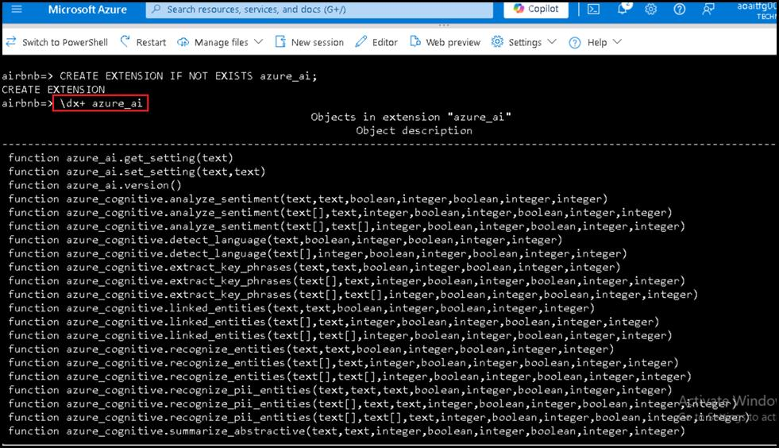

# Caso de uso 12- Integre las capacidades generative AI con Azure Database for PostgreSQL Flexible Server para evaluar reseñas de listados de IA proporcionados

**Duración del laboratorio --** 40 minutos

**Tipo del laboratorio –** dirigido por el instructor

**Introducción**

En este laboratorio, aprenderá cómo integrar Azure AI services con
PostgreSQL para mejorar su database con funcionalidades de IA avanzadas.
Al aprovechar el poder de las extensiones Azure OpenAI y PostgreSQL como
pgvector y PostGIS, habilitará un análisis de texto sofisticado,
búsquedas de similitud vectorial, y geospatial queries directamente en
su database. Este laboratorio le guiará en aprovisionar los recursos
Azure necesarios, configurando su database y ejecutando queries
complejas que combinan insights basadas en la IA con datos
geoespaciales.

**Objectives**

- Aprovisionar y configurar Azure Database for PostgreSQL Flexible
  Server.

- Crear y gestionar vector embeddings mediante Azure OpenAI service.

- Realizar vector similarity searches para encontrar datos de texto con
  similitud semántica.

- Utilizar la extensión PostGIS para el análisis de datos geoespaciales.

- Integrar Azure AI Language services para sentiment analysis y otras
  funcionalidades cognitivas.

- Optimizar y analizar query performance mediante las herramientas de
  indexing y query planning.

**Importante:** Si no se **pega** cualquier de los commands en
**CloudShell**, por favor abra un notepad, mantenga el cursor en un
espacio blanco del notepad y haga clic en el botón T del command para
que se pegue. El contenido se copiará al notepad desde donde se puede
copiar y pegar en CloudShell.

## Ejercicio 0: Comprensión de la VM y las credenciales

En esta tarea, identifiquemos y entendamos las credenciales que vamos a
usar a lo largo del laboratorio.

1.  La pestaña **Instructions** tiene la guía del laboratorio con las
    instrucciones que seguir a lo largo del laboratorio.

2.  La pestaña **Resources** tiene las credenciales que se necesita para
    la ejecución del laboratorio.

    - **URL** – el URL que nos lleva a Azure portal

    - **Subscription** – Esta es la ID de la suscripción que le
      asignaron

    - **Username** – El user id con el que debe iniciar sesión a Azure
      services.

    - **Password** – La contraseña para iniciar sesión en Azure.
      Llamemos el username y password como las credenciales de login de
      Azure. Vamos a usar estas credenciales siempre y cuando
      mencionamos Azure login credentials.

    - **Resource Group** – El grupo de recursos que le asignaron.

\[!Atención\] **Importante:** Asegúrese de crear todos los recursos en
este Resource group

3.  La pestaña **Help** tiene toda la información de Support. El valor
    de **ID** aquí es el **Lab instance ID** que se usará durante la
    ejecución del laboratorio.

## Ejercicio 1: Aprovisionar un Azure Database for PostgreSQL Flexible Server

### Tarea 0: Registre los Resource Providers

1.  Inicie sesión en **Azure portal** -
    +++[https://portal.azure.com+++](https://portal.azure.com+++/) mediante
    sus Azure login credentials.

2.  Haga clic en **Subscriptions** seleccione **Resource
    Providers** en **Settings** desde el panel izquierdo.

3.  Busque +++**Microsoft.DBforPostgreSQL**+++ y haga clic
    en **Register** para registrar este Resource Provider.

### Tarea 1: Aprovisionar un Azure Database for PostgreSQL Flexible Server

1.  Abra un navegador web y navegue a
    +++[https://portal.azure.com+++](https://portal.azure.com+++/)

2.  Seleccione el ícono **Cloud Shell** en el Azure portal toolbar para
    abrir un nuevo panel de Cloud Shell en la parte superior de su
    navegador.

3.  La primera vez que abra el Cloud Shell, puede que le pida elegir el
    tipo de shell para usar (**Bash** o **PowerShell**).
    Seleccione **Bash**.

4.  En el cuadro de diálogo **Getting started**, seleccione **Mount
    storage account** y seleccione su azure subscription. Haga clic en
    el botón **Apply**.

5.  En el cuadro de diálogo **Mount storage account**, seleccione **we
    will create a storage account for you** y haga clic en **Next**.

6.  En el cloud shell prompt, ejecute los siguientes commands para
    definir las variables para crear recursos. Las variables representan
    los nombres para asignar a su resource group y database y
    especifican la región del Azure en la cual se implementan los
    recursos.

7.  Reemplace el Resource group Name en el siguiente command con el
    Resource group asignado y ejecute el command.

+++RG_NAME= \< Resource group Name \>+++

8.  En database name, reemplace el token {SUFFIX} con su **Lab instance
    ID**, como sus iniciales, para que el nombre del servidor sea
    globalmente único.

+++DATABASE_NAME=<pgsql-flex-@lab.LabInstance.Id>+++

9.  Ejecute el siguiente command para establecer un Region value.

+++REGION=@lab.CloudResourceGroup(ResourceGroup1).Location+++

10. Aprovisione un Azure Database for PostgreSQL database instance
    dentro del grupo de recursos asignado al ejecutar el siguiente Azure
    CLI command (Este command llevará 10 minutos para completar)

> \`\`\`
>
> az postgres flexible-server create --name $DATABASE_NAME --location
> $REGION --resource-group $RG_NAME \\
>
> --admin-user s2admin --admin-password Seattle123Seattle123
> --database-name airbnb \\
>
> --public-access 0.0.0.0-255.255.255.255 --version 16 \\
>
> --sku-name Standard_D2s_v3 --storage-size 32 --yes
>
> \`\`\`

### Tarea 2: Conecte a su database mediante psql en el Azure Cloud Shell

En esta tarea, usará el psql command-line utility desde el Azure Cloud
Shell para conectar a sus datos.

1.  Abra un navegador y vaya a
    +++[https://portal.azure.com+++](https://portal.azure.com+++/) e
    inicie sesión con su cuenta de Azure subscription.

2.  En la página **Home**, haga clic en **Resource Groups**.

3.  Haga clic en **su resource group asignado**

4.  En el resource group, seleccione el recurso **PostgreSQL Flexible
    Server** 

5.  En el menú de navegación izquierdo,
    seleccione **Connect** en **Settings**.

6.  Desde la página de **Connect** de su database en Azure portal,
    seleccione **airbnb** para el **Database name**, y copie
    el **Connection details** block y péguelo en notepad para usarlo más
    tarde en las siguientes tareas.

7.  En la página de inicio de Azure Database for PostgresSQL, haga clic
    en **Overview** en el menú de navegación izquierdo y copie el Server
    name y péguelo en el notepad, y **Guarde** el notepad para usar esta
    información más tarde en el próximo laboratorio.

8.  En la página de inicio de Azure Database for PostgreSQL,
    seleccione **Networking** en settings y seleccione **Allow public
    access from any Azure service within Azure to this server**. Haga
    clic en el botón **Save**.

9.  Seleccione el ícono **Cloud Shell** en el Azure portal toolbar para
    abrir un nuevo panel de Cloud Shell en la parte superior de su
    pantalla del navegador.

10. Pegue los **Connection details** en Cloud Shell.

11. En el Cloud Shell prompt, reemplace el token **{your_password}** con
    la contraseña que asignó usted al usuario **s2admin** a la hora de
    crear su database, la contraseña debe ser
    +++**Seattle123Seattle123**+++.

12. Conecte a su database mediante el psql command-line utility al
    introducir lo siguiente en el prompt:

+++psql+++

La conexión a la base de datos desde Cloud Shell requiere que la casilla
Allow public access desde cualquier servicio de Azure dentro de Azure al
servidor esté activada en la **página Networking** de la base de datos.
Si recibe un mensaje que indica que no puede conectarse, compruebe que
esta opción esté marcada y vuelva a intentarlo.

### Tarea 3: Agregue datos a su database

Mediante el psql command prompt, creará tablas y lo llenará con datos
para usarlos en el laboratorio.

1.  Ejecute los siguientes commands para crear tablas temporales para
    importar los datos JSON desde una cuenta public blob storage.

> CREATE TABLE temp_calendar (data jsonb);
>
> CREATE TABLE temp_listings (data jsonb);
>
> CREATE TABLE temp_reviews (data jsonb);

2.  Mediante el COPY command, llene cada temporary table con datos de
    JSON files en un public storage account.

+++\COPY temp_calendar (data) FROM PROGRAM
'curl <https://solliancepublicdata.blob.core.windows.net/ms-postgresql-labs/calendar.json'+++>

+++\COPY temp_listings (data) FROM PROGRAM
'curl <https://solliancepublicdata.blob.core.windows.net/ms-postgresql-labs/listings.json'+++>

+++\COPY temp_reviews (data) FROM PROGRAM
'curl <https://solliancepublicdata.blob.core.windows.net/ms-postgresql-labs/reviews.json'+++>

3.  Ejecute el siguiente comando para crear las tablas para almacenar
    datos en la forma utilizada por este laboratorio:

> CREATE TABLE listings (
>
> listing_id int,
>
> name varchar(50),
>
> street varchar(50),
>
> city varchar(50),
>
> state varchar(50),
>
> country varchar(50),
>
> zipcode varchar(50),
>
> bathrooms int,
>
> bedrooms int,
>
> latitude decimal(10,5),
>
> longitude decimal(10,5),
>
> summary varchar(2000),
>
> description varchar(2000),
>
> host_id varchar(2000),
>
> host_url varchar(2000),
>
> listing_url varchar(2000),
>
> room_type varchar(2000),
>
> amenities jsonb,
>
> host_verifications jsonb,
>
> data jsonb
>
> );

> CREATE TABLE reviews (
>
> id int,
>
> listing_id int,
>
> reviewer_id int,
>
> reviewer_name varchar(50),
>
> date date,
>
> comments varchar(2000)
>
> );
>
> CREATE TABLE calendar (
>
> listing_id int,
>
> date date,
>
> price decimal(10,2),
>
> available boolean
>
> );

4.  Por fin, ejecute los siguientes **INSERT INTO** statements para
    cargar datos desde los temporary tables a los main tables, al
    extraer datos del campo de datos JSON en columnas individuales:

> INSERT INTO listings
>
> SELECT
>
> data\['id'\]::int,
>
> replace(data\['name'\]::varchar(50), '"', ''),
>
> replace(data\['street'\]::varchar(50), '"', ''),
>
> replace(data\['city'\]::varchar(50), '"', ''),
>
> replace(data\['state'\]::varchar(50), '"', ''),
>
> replace(data\['country'\]::varchar(50), '"', ''),
>
> replace(data\['zipcode'\]::varchar(50), '"', ''),
>
> data\['bathrooms'\]::int,
>
> data\['bedrooms'\]::int,
>
> data\['latitude'\]::decimal(10,5),
>
> data\['longitude'\]::decimal(10,5),
>
> replace(data\['description'\]::varchar(2000), '"', ''),
>
> replace(data\['summary'\]::varchar(2000), '"', ''),
>
> replace(data\['host_id'\]::varchar(50), '"', ''),
>
> replace(data\['host_url'\]::varchar(50), '"', ''),
>
> replace(data\['listing_url'\]::varchar(50), '"', ''),
>
> replace(data\['room_type'\]::varchar(50), '"', ''),
>
> data\['amenities'\]::jsonb,
>
> data\['host_verifications'\]::jsonb,
>
> data::jsonb
>
> FROM temp_listings;
>
> INSERT INTO reviews
>
> SELECT
>
> data\['id'\]::int,
>
> data\['listing_id'\]::int,
>
> data\['reviewer_id'\]::int,
>
> replace(data\['reviewer_name'\]::varchar(50), '"', ''),
>
> to_date(replace(data\['date'\]::varchar(50), '"', ''), 'YYYY-MM-DD'),
>
> replace(data\['comments'\]::varchar(2000), '"', '')
>
> FROM temp_reviews;
>
> INSERT INTO calendar
>
> SELECT
>
> data\['listing_id'\]::int,
>
> to_date(replace(data\['date'\]::varchar(50), '"', ''), 'YYYY-MM-DD'),
>
> data\['price'\]::decimal(10,2),
>
> replace(data\['available'\]::varchar(50), '"', '')::boolean
>
> FROM temp_calendar;

## Ejercicio 2: Agregue Azure AI y Vector extensions al allowlist

A lo largo de este laboratorio, utilizará las extensiones azure_ai y
pgvector para agregar capacidades de IA generativa a su base de datos
PostgreSQL. En este ejercicio, agregará estas extensiones al *allowlist*
del servidor, como se describe en cómo usar extensiones de PostgreSQL.

1.  En la página de inicio, haga clic en **Resource Groups**.

2.  Haga clic en su resource group name

3.  En el resource group, seleccione el recurso **PostgreSQL Flexible
    Server**

4.  Desde el menú de navegación izquierdo del database,
    seleccione **Server parameters** en **Settings**, e introduzca
    +++**azure.extensions**+++ en el cuadro de búsqueda. Expanda la
    lista despegable de **VALUE**, y localice y marque la casilla junto
    a cada una de estas extensiones:

    - AZURE_AI

    - POSTGIS

    - VECTOR

5.  Seleccione **Save** en el toolbar, lo que activará una
    implementación en el database.

## Ejercicio 3: Cree un recurso Azure OpenAI 

La extensión azure_ai requiere un servicio Azure OpenAI correspondiente
para crear vector embeddings. En este ejercicio, aprovisionará un
recurso de Azure OpenAI en Azure Portal e implementará un modelo de
embedding en ese servicio.

### Tarea 1: Arovisionar un Azure OpenAI service

En esta tarea, se crea un nuevo archivo Azure OpenAI service.

1.  Desde la página de inicio de Azure portal, haga clic en **Azure
    portal menu** representado por tres barras horizontales en la parte
    izquierda del Microsoft Azure command bar como se ve en esta imagen.

2.  Navegue y haga clic en **+ Create a resource**.

3.  En la página **Create a resource**, en la barra de búsqueda
    de **Search services and marketplace**, tecle +++**Azure
    OpenAI**+++, y pulse el botón **Enter**.

4.  En la página **Marketplace**, navegue a la sección **Azure OpenAI**,
    haga clic en el menú despegable del Create, y seleccione **Azure
    OpenAI** como se ve en la imagen. (si ya ha hecho clic
    en **Azure** **OpenAI**, haga clic en **Create** en la página de
    **Azure OpenAI**).

5.  En Create Azure OpenAI **Basics** tab, ingrese la siguiente
    información y haga clic en **Next**.

[TABLE]

> 

6.  En la pestaña **Network**, deje todos los botones de alternancia en
    sus estados predeterminados, y haga clic en **Next**.

7.  En **Tags**, deje todos los campos en sus estados predeterminados y
    haga clic en **Next**.

8.  En la pestaña **Review+submit**, una vez que el Validation sea
    Passed, haga clic en **Create**.

9.  Espere a que se complete la implementación. Esto llevarña unos 3
    minutos.

\[!Nota\] **Ojo:** Si ve un mensaje que indica que el servicio Azure
OpenAI está disponible para los clientes a través de un formulario de
solicitud. La suscripción seleccionada no se ha habilitado para el
servicio y no tiene una cuota para ningún plan de tarifa; deberá hacer
clic en el vínculo para solicitar acceso al servicio Azure OpenAI y
rellenar el formulario de solicitud.

### Tarea 2: Recupere el key y endpoint del Azure OpenAI service

1.  En la página **Overview** del recurso, seleccione **Go to
    resource**. Si le pide, seleccione las credenciales del lab:

2.  En **Azure OpenAI home**, navegue a la sección **Resource
    Management**, y haga clic en **Keys and Endpoints**.

3.  En **Keys and Endpoints**, copie los valores de **KEY1, KEY
    2,** y **Endpoint** y péguelos en notepad como se muestra en la
    imagen, y **guarde** el notepad para usarlos más tarde en las
    próximas tareas.

**Ojo:** puede usar o KEY1 o KEY2. Tener dos claves siempre le permite
alternar y regenerar keys sin causar ninguna disrupción del servicio.

### Tarea 3: Implementar un embedding model

El azure_ai extension le permite crear vector embeddings desde text.
Crear estos embeddings requiere un modelo implementado de
text-embedding-ada-002 (versión 2) dentro de su Azure OpenAI service. En
esta tarea, usará Azure OpenAI Studio para crear una implementación del
modelo que puede poner a práctica.

1.  En la página **Azure OpenAI**, haga clic en **Overview** en el menú
    de navegación izquierdo, baje y haga clic en **Go to Azure OpenAI
    Studio** como se ve en la imagen.

2.  En la página de inicio de **Azure AI Foundry | Azure Open AI
    Service**, navegue a **Components** y haga clic en **Deployments**.

3.  En la pantalla de **Deployments**, maximice el **+Deploy model** y
    seleccione **Deploy base model**

4.  En el cuadro de diálogo **Select a model**, navegue hasta y
    seleccione con cuidado **text-embedding-ada-002**, y haga clic
    en **Confirm**.

5.  En el diálogo **Deploy model**, establezca lo siguiente y seleccione
    **Create** para implementar el modelo.

    - **Select a model**: elija **text-embedding-ada-002** desde la
      lista.

    - **Model version**: asegure que **2 (Default)** está seleccionado.

    - **Deployment name**: introduzca +++**embeddings**+++

6.  En la pantalla **Deployments**, copie **Deployment name** y péguelo
    en un notepad (como se ve aquí), y gúardelo para usar la información
    en la próxima tarea.

## Ejercicio 4: Instale y configure el azure_ai extension

En este ejercicio, instala el azure_ai extension en su database y
configúrelo para conectar con su Azure OpenAI service.

### Tarea 1: Conecte al database mediante psql en Azure Cloud Shell

En esta tarea, use el psql command-line utility desde el Azure Cloud
Shell para conectar a su database.

1.  Seleccione el ícono **Cloud Shell** en Azure portal toolbar para
    abrir un nuevo panel Cloud Shell en la parte superior de la pantalla
    de navegador.

2.  Pegue **Connection details** en Cloud Shell.

3.  En Cloud Shell prompt, reemplace el token **{your_password}** con la
    contraseña que asignó usted al usuario **s2admin** al crear su
    database, la contraseña debe ser **Seattle123Seattle123**.

4.  Conecte a su database mediante el psql command-line utility al
    introducir lo siguiente en el prompt:

+++**psql**+++

### Tarea 2: Instale el azure_ai extension

El azure_ai extension le permite integrar Azure OpenAI y Azure Cognitive
Services en su database. Para habilitar la extensión en su database,
siga los siguientes pasos:

1.  Verifique que la extensión esté añadido con éxito al allowlist al
    ejecutar lo siguiente desde psql command prompt:

+++SHOW azure.extensions;+++

2.  Instale el azure_ai extension mediante CREATE EXTENSION command.

+++CREATE EXTENSION IF NOT EXISTS azure_ai;+++

### Tarea 3: Revise los objetos contenidos dentro de azure_ai extension

Revisar los objetos dentro de azure_ai extension puede proporcionar una
mejor comprensión de las capacidades. En esta tarea, usted revisa varios
esquemas, user-defined functions (UDFs), y composite types añadidos a su
database por la extensión.

1.  Puede usar \dx meta-command desde el **psql** command prompt para
    enumerar los objetos contenidos dentro de extensión.

\[!Nota\] **Ojo:** Haga clic en cualquier tecla para continuar cuando
cloud shell indica con **More…**

+++\dx+ azure_ai+++

El output meta-command muestra azure_ai extension crea tres esquemas,
multiple user-defined functions (UDFs), y varios composite types en el
database. La tabla muestra enumera los esquemas añadidos por la
extensión y describe cada uno.

[TABLE]

2.  Todas las funciones y los tipos están asociados a uno de los
    esquemas. Para revisar las funciones definidas en el esquema
    azure_ai, utilice el metacomando \df, especificando el esquema cuyas
    funciones deben mostrarse. La instrucción \x auto que precede a \df
    permite que la pantalla expandida se aplique automáticamente cuando
    sea necesario para que la salida del comando sea más fácil de ver en
    el Azure Cloud Shell.

+++\x auto+++ +++\df+ azure_ai.\*+++

La función azure_ai.set_setting() permite establecer el endpoint y los
valores de clave para los servicios de Azure AI. Acepta una **clave** y
el **valor** para asignarla. La función azure_ai.get_setting()
proporciona una forma de recuperar los valores que estableció con la
función set_setting(). Acepta la **clave** de la configuración que desea
ver. Para ambos métodos, la clave debe ser una de las siguientes:

### Tarea 4: Establece Azure OpenAI endpoint y key

Antes de usar las funciones de azure_openai, configure la extensión a su
Azure OpenAI service endpoint y key.

1.  En el siguiente command, reemplace los tokens
    de **{endpoint}** y **{api-key}** con los valores que recuperó desde
    Azure portal, y luego ejecute los commands desde psql command prompt
    en el panel Cloud Shell para añadir sus valores a su configuration
    table.

2.  SELECT azure_ai.set_setting('azure_openai.endpoint','{endpoint}');

3.  SELECT azure_ai.set_setting('azure_openai.subscription_key',
    '{api-key}');

4.  Verifique las configuraciones escritos en configuration table
    mediante los siguientes queries:

5.  SELECT azure_ai.get_setting('azure_openai.endpoint');

6.  SELECT azure_ai.get_setting('azure_openai.subscription_key');

El azure_ai extension ahora está conectado a su cuenta Azure OpenAI y
listo para generar vector embeddings.

## Ejercicio 5: Genere vector embeddings con Azure OpenAI

El esquema azure_ai extension's azure_openai permite al Azure OpenAI
crear vector embeddings para text values. Con este esquema, puede
generar embeddings con Azure OpenAI directamente desde la base de datos
para crear representaciones vectoriales del texto de entrada, que luego
se pueden usar en búsquedas de similitud vectorial, así como consumir en
modelos de aprendizaje automático.

Embeddings son un concepto del aprendizaje automático y el procesamiento
del lenguaje natural (NLP) que consiste en representar objetos, como
palabras, documentos o entidades, como vectores en un espacio
multidimensional. Las incrustaciones permiten que los modelos de
aprendizaje automático evalúen el grado de relación entre la
información. Esta técnica identifica de manera eficiente las relaciones
y similitudes entre los datos, lo que permite a los algoritmos
identificar patrones y hacer predicciones precisas.

### Tarea 1: Habilite el soporte de vector con pgvector extension

El azure_ai extension le permite generar embeddings para el texto de
entrada. Para permitar almacenar los generated vectors junto con el
resto de sus datos en el database, tiene que instalar pgvector extension
siguiendo la guía en el enable vector support en la documentación de su
database.

1.  Instale el pgvector extension mediante CREATE EXTENSION command.

+++CREATE EXTENSION IF NOT EXISTS vector; +++

2.  Con vector supported añadido a su database, agregue una nueva
    columna a listings table mediante vector data type para almacenar
    embeddings dentro de la tabla. El modelo text-embedding-ada-002
    produce vectores con 1536 dimensiones, por lo tanto, debe
    especificar 1536 como tamaño del vector.

3.  ALTER TABLE listings

4.  ADD COLUMN description_vector vector(1536);

### Tarea 2: Genere y almacene vector embeddings

La tabla de listados ya está lista para almacenar embeddings. Con la
función azure_openai.create_embeddings(), se crean vectores para el
campo de descripción y se insertan en la columna description_vector
recién creada en la tabla de listados.

1.  Antes de usar la función create_embeddings(), ejecute el siguiente
    command para inspeccionarla y revisar los argumentos necesarios:

+++\df+ azure_openai.\* +++

El Argument data types property En la salida del command \df+
azure_openai.\* revela la lista de argumentos que espera la función.

[TABLE]

2.  Con el nombre de la implementación, ejecute la siguiente consulta
    para actualizar cada registro de la tabla de listados, insertando
    las incrustaciones vectoriales generadas para el campo de
    descripción en la columna description_vector mediante la función
    azure_openai.create_embeddings(). Reemplace {your-deployment-name}
    por el valor **Deployment Name** que copió de la página
    **Deployments** de Azure OpenAI Studio. Tenga en cuenta que esta
    consulta tarda aproximadamente cinco minutos en completarse.

> DO $$
>
> DECLARE counter integer := (SELECT COUNT(\*) FROM listings WHERE
> description \<\> '' AND description_vector IS NULL);
>
> DECLARE r record;
>
> BEGIN
>
> RAISE NOTICE 'Total descriptions to embed: %', counter;
>
> WHILE counter \> 0 LOOP
>
> BEGIN
>
> FOR r IN
>
> SELECT listing_id FROM listings WHERE description \<\> '' AND
> description_vector IS NULL
>
> LOOP
>
> BEGIN
>
> UPDATE listings
>
> SET description_vector =
> azure_openai.create_embeddings('{your-deployment-name}', description)
>
> WHERE listing_id = r.listing_id;
>
> EXCEPTION
>
> WHEN OTHERS THEN
>
> RAISE NOTICE 'Waiting 1 second before trying again...';
>
> PERFORM pg_sleep(1);
>
> END;
>
> counter := (SELECT COUNT(\*) FROM listings WHERE description \<\> ''
> AND description_vector IS NULL);
>
> IF counter % 25 = 0 THEN
>
> RAISE NOTICE 'Remaining descriptions to embed: %', counter;
>
> END IF;
>
> END LOOP;
>
> END;
>
> END LOOP;
>
> END;
>
> $$;

El query anterior utiliza un WHILE loop para recuperar registros de la
tabla de listados en los que el campo description_vector es nulo y el
campo de descripción no es una cadena vacía. A continuación, el query
intenta actualizar la columna description_vector con una representación
vectorial de la columna de descripción mediante la función
azure_openai.create_embeddings. El loop se usa al realizar esta
actualización para evitar que las llamadas a la función de creación de
incrustaciones superen el límite de velocidad de llamadas del servicio
Azure OpenAI. Si se excede el límite de velocidad de llamadas, verá
advertencias similares a las siguientes en la salida:

\[!Nota\] **OJO**: Esperar 1 segundo antes de volver a intentarlo...

3.  Puede comprobar que la columna description_vector se ha rellenado
    para todos los registros de listings ejecutando el siguiente query:

+++SELECT COUNT(\*) FROM listings WHERE description_vector IS NULL AND
description \<\> '';+++

El resultado de el query debe ser un recuento de 0.

### Tarea 3: Realice un vector similarity search

Vector similarity es un método utilizado para medir la similitud de dos
elementos representándolos como vectores, una serie de números. Los
vectores se utilizan a menudo para realizar búsquedas mediante LLM.
Vector similarity se calcula comúnmente utilizando métricas de
distancia, como la distancia euclidiana o la similitud del coseno. La
distancia euclidiana mide la distancia en línea recta entre dos vectores
en el espacio n-dimensional, mientras que la similitud del coseno mide
el coseno del ángulo entre dos vectores. Cada embedding es un vector de
números de coma flotante, por lo que la distancia entre dos
incrustaciones en el espacio vectorial se correlaciona con la similitud
semántica entre dos entradas en el formato original.

1.  Antes de ejecutar un vector similarity search, ejecute la siguiente
    consulta utilizando la cláusula ILIKE para observar los resultados
    de la búsqueda de registros mediante un query de lenguaje natural
    sin usar vector similarity:

+++SELECT listing_id, name, description FROM listings WHERE description
ILIKE '%Properties with a private room near Discovery Park%';+++

El query devuelve cero resultados porque está intentando hacer coincidir
el texto del campo de descripción con el query de lenguaje natural
proporcionada.

2.  Ahora, ejecute un query de búsqueda de similitud de coseno en la
    tabla de listados para realizar una búsqueda de similitud vectorial
    en las descripciones de los listados. Los embeddings se generan para
    una pregunta de entrada y, a continuación, se convierten en un
    vector array (::vector), lo que permite compararlo con los vectores
    almacenados en la tabla de listados. Reemplace
    {your-deployment-name} con el valor **Deployment name** que ha
    copiado de la página Azure OpenAI Studio **Deployments**.

+++SELECT listing_id, name, description FROM listings ORDER BY
description_vector \<=\>
azure_openai.create_embeddings('{your-deployment-name}', 'Properties
with a private room near Discovery Park')::vector LIMIT 3;+++

El query usa \<=\> [vector
operator](https://github.com/pgvector/pgvector#vector-operators), que
representa el operador \cosine distance\\ utilizado para calcular la
distancia entre dos vectores en un espacio multidimensional.

3.  Vuelva a ejecutar la misma consulta mediante el EXPLAIN ANALYZE
    clause para ver los tiempos de planificación y ejecución de
    consultas. Reemplace **{your-deployment-name}** con el
    valor **Deployment name** que ha copiado de la página Azure OpenAI
    Studio **Deployments** page.

> EXPLAIN ANALYZE
>
> SELECT listing_id, name, description FROM listings
>
> ORDER BY description_vector \<=\>
> azure_openai.create_embeddings('{your-deployment-name}', 'Properties
> with a private room near Discovery Park')::vector
>
> LIMIT 3;

En la salida, observe el plan de consulta, que comenzará con algo
similar a:

Limit (cost=1098.54..1098.55 rows=3 width=261) (actual
time=10.505..10.507 rows=3 loops=1) -\> Sort (cost=1098.54..1104.10
rows=2224 width=261) (actual time=10.504..10.505 rows=3 loops=1)

…

Sort Method: top-N heapsort Memory: 27kB -\> Seq Scan on listings
(cost=0.00..1069.80 rows=2224 width=261) (actual time=0.005..9.997
rows=2224 loops=1) El query utiliza una ordenación de examen secuencial
para realizar la búsqueda. Los tiempos de planificación y ejecución se
enumerarán al final de los resultados y deben ser similares a los
siguientes: Planning Time: 62.020 ms Execution Time: 10.530 ms

4.  Para permitir una búsqueda más eficiente en el campo vectorial, cree
    un índice en los listados utilizando la distancia de coseno y
    [HNSW,](https://github.com/pgvector/pgvector#hnsw) que es la
    abreviatura de Hierarchical Navigable Small World. HNSW permite a
    pgvector utilizar los últimos algoritmos basados en grafos para
    aproximar nearest-neighbor queries.

+++CREATE INDEX ON listings USING hnsw (description_vector
vector_cosine_ops);+++

5.  Para observar el impacto del índice hnsw en la tabla, vuelva a
    ejecutar el query con el EXPLAIN ANALYZE clause Para comparar los
    tiempos de planeación y ejecución de queries.
    Reemplace **{your-deployment-name}** con el valor **Deployment
    name** que ha copiado de la página Azure OpenAI
    Studio **Deployments**.

> EXPLAIN ANALYZE
>
> SELECT listing_id, name, description FROM listings
>
> ORDER BY description_vector \<=\>
> azure_openai.create_embeddings('{your-deployment-name}', 'Properties
> with a private room near Discovery Park')::vector
>
> LIMIT 3;

En la salida, observe que el plan de consulta ahora incluye un examen de
índice más eficaz:

Limit (cost=116.48..119.33 rows=3 width=261) (actual time=1.112..1.130
rows=3 loops=1) -\> Index Scan using listings_description_vector_idx on
listings (cost=116.48..2228.28 rows=2224 width=261) (actual
time=1.111..1.128 rows=3 loops=1)

Los tiempos de ejecución del query deben reflejar una reducción
significativa en el tiempo que se tardó en planear y ejecutar el query:

Planning Time: 56.802 ms

Execution Time: 1.167 ms

## Ejercicio 6: Integre Azure AI Services

Las integraciones de servicios de IA de Azure incluidas en el esquema de
azure_cognitive de la extensión azure_ai proporcionan un amplio conjunto
de características del lenguaje de IA a las que se puede acceder
directamente desde la base de datos. Las funcionalidades incluyen
sentiment analysis, language detection, key phrase extraction, entity
recognition, y text summarization. Estas funcionalidades se habilitan a
través del servicio Azure AI Language.

Para revisar la lista completa de funcionalidades de Azure AI a las que
se puede acceder a través de la extensión, consulte la documentación
Integrate Azure Database for PostgreSQL Flexible Server with Azure
Cognitive Services.

### Tarea 1: Aprovisione un Azure AI Language service

Un Azure AI Languageservice se requiere para aprovechar las azure_ai las
funciones cognitivas de las extensiones. En este ejercicio, creará un
servicio de lenguaje de Azure AI.

1.  Desde la página de inicio Azure portal, haga clic en **Azure portal
    menu** representado por tres barras horizontales en el izquierdo de
    Microsoft Azure command bar como se ve en la imagen de abajo.

2.  En la página **Create a resource**, seleccione **AI + Machine
    Learning** en el menú de la izquierda y, a continuación,
    seleccione **Language service**.

3.  En el diálogo **Select additional features**, seleccione **Continue
    to create your resource**.

4.  En la pestaña Create Language **Basics**, introduzca lo siguiente:

[TABLE]

> 
>
> 

5.  La configuración predeterminada se utilizará para las pestañas
    restantes de la configuración del servicio de lenguaje, por lo que
    debe seleccionar **Review + create**.

6.  Seleccione el botón **Create** en la pestaña **Review +
    create** para aprovisionar los Language service.

7.  Seleccione **Go to resource group** en la página de deployment
    cuando se complete la implementación del servicio de lenguaje.

### Tarea 2: Establezca Azure AI Language service endpoint y key

Al igual que con las funciones azure_openai, para realizar correctamente
llamadas a los servicios de Azure AI mediante la extensión azure_ai,
debe proporcionar el endpoint y un key para el servicio de lenguaje de
Azure AI.

1.  En la página de inicio de Language, seleccione el artículo **Keys
    and Endpoint** en **Resource Management** desde el menú de
    navegación izquierdo.

2.  En la página **Keys and Endpoints**, copie los valores de **KEY1,
    KEY 2,** y **Endpoint** y péguelos en un notepad como se ve en la
    imagen, luego **Guarde** el notepad para usar la información en las
    próximas tareas.

3.  Copie sus valores de endpoint y access key, luego, en el comando,
    reemplace los tokens {endpoint} y {api-key} con valores que recuperó
    desde Azure portal. Ejecute los commands desde psql command prompt
    en Cloud Shell para agregar los valores a la tabla de configuración.

\[!Nota\] **Ojo:** Conéctese a psql command prompt antes de ejecutar los
siguiente commands.

SELECT azure_ai.set_setting('azure_cognitive.endpoint','{endpoint}');

SELECT azure_ai.set_setting('azure_cognitive.subscription_key',
'{api-key}');

### Tarea 3: Analiza el sentiment de las reseñas

En esta tarea, utilizará el azure_cognitive.analyze_sentiment function
para evaluar las reseñas de los anuncios de Airbnb.

1.  Para realizar sentiment analysis mediante azure_cognitive schema en
    azure_ai extension, use analyze_sentiment function. Ejecute el
    siguiente command para revisar esa función:

+++\df azure_cognitive.analyze_sentiment+++

La salida muestra el esquema de la función, el nombre, el tipo de datos
de resultado y los tipos de datos de argumentos. Esta información ayuda
a comprender cómo usar la función.

2.  También es esencial comprender la estructura del tipo de datos de
    resultado que genera la función para poder manejar correctamente su
    valor devuelto. Ejecute el siguiente comando para inspeccionar el
    tipo de sentiment_analysis_result:

+++\dT+ azure_cognitive.sentiment_analysis_result+++

3.  El resultado del comando anterior revela que el tipo
    sentiment_analysis_result es una tupla. Para comprender la
    estructura del tuple, ejecute el siguiente comando para examinar las
    columnas contenidas en el tipo compuesto sentiment_analysis_result:

+++\d+ azure_cognitive.sentiment_analysis_result+++

El resultado de ese command debe ser similar al siguiente: Composite
type "azure_cognitive.sentiment_analysis_result"

Column | Type | Collation | Nullable | Default | Storage | Description
----------------+------------------+-----------+----------+---------+----------+-------------

sentiment | text | | | | extended |

positive_score | double precision | | | | plain |

neutral_score | double precision | | | | plain |

negative_score | double precision | | | | plain |

El azure_cognitive.sentiment_analysis_result es un tipo compuesto que
contiene las predicciones de opinión del texto de entrada. Incluye el
sentimiento, que puede ser positivo, negativo, neutro o mixto, y las
puntuaciones de los aspectos positivos, neutros y negativos que se
encuentran en el texto. Las puntuaciones se representan como números
reales entre 0 y 1. Por ejemplo, en (neutral,0,26,0,64,0,09), el
sentimiento es neutro con una puntuación positiva de 0,26, neutro de
0,64 y negativo de 0,09.

## Ejercicio 7: Ejecute un query final para juntarlo todo

En este ejercicio, se conectará a la base de datos en **pgAdmin** y
ejecutará un query final que vincule el trabajo con las extensiones
azure_ai, postgis y pgvector en los laboratorios 3 y 4.

### Tarea 1: Instale pgAdmin

1.  Abra un navegador web y navegue a
    el <https://www.pgadmin.org/download/pgadmin-4-windows/>

2.  Haga clic en la última versión de **pgAdmin**

3.  Seleccione **pgadmin4-8.9-x64.exe**

4.  Ejecute e instale el archivo descargado

5.  En la pestaña Select Setup Install Mode, seleccione **Install for me
    only(recommended)**

6.  Haga clic en **Next** 

7.  Seleccione **I accept the agreement** y haga clic en **Next** 

8.  Seleccione el path y haga clic en **Next** 

9.  En la pantalla **Setup-pgAdmin 4**, haga clic en **Next** 

10. Haga clic en **Install** 

11. En la pantalla **Setup-pgAdmin 4** , haga clic en **Finish** 

### Tarea 2: Conecte al database mediante pgAdmin

En esta tarea, abrirá pgAdmin y se conectará a su database.

1.  En el cuadro de búsqueda Windows, tecle +++**pgAdmin**+++, y, a
    continuación, haga clic en **pgAdmin**

2.  Registre su servidor haciendo clic derecho **Servers** en Object
    Explorer y seleccionando **Register \> Server**.

3.  En el diálogo **Register - Server**, pegue su nombre de Azure
    Database for PostgreSQL Flexible Server ( que ha guardado en el
    Ejercicio 1\> Tarea 1) en el campo **Name** en la
    pestaña **General**.

4.  A continuación, seleccione la pestaña **Connection** y pegue su
    nombre del servidor en el campo **Hostname/address**. Introduzca
    +++**s2admin**+++ en el campo **Username**, introduzca
    +++**Seattle123Seattle123**+++ en el cuadro **Password**, y
    opcionalmente, seleccione **Save password**.

5.  Por último, seleccione la opción **Parameters** y establezca **SSL
    mode** a **require**. Seleccione **Save** para registrar su
    servidor.

6.  Una vez conectado a su servidor, expanda el node **Databases** y
    seleccione el **airbnb** database. Haga clic derecho
    en **airbnb** database y seleccione **Query Tool** desde el context
    menu.

### Tarea 3: Verifique que PostGIS extension esté instalado en su database

Para instalar la extensión postgis en su base de datos, usará el CREATE
EXTENSION command.

1.  En el query window que ha abierto antes, ejecute el CREATE EXTENSION
    command con IF NOT EXISTS clause Para instalar la extensión Postgis
    en su database.

+++CREATE EXTENSION IF NOT EXISTS postgis;+++

Con la extensión PostGIS ahora cargada, está listo para comenzar a
trabajar con datos geoespaciales en la base de datos. La tabla de
listados que ha creado y rellenado anteriormente contiene la latitud y
longitud de todas las propiedades enumeradas. Para utilizar estos datos
para el análisis geoespacial, debe modificar la tabla de listados para
agregar una columna de geometría que acepte el tipo de datos de punto.
Estos nuevos tipos de datos se incluyen en la extensión postgis.

2.  Para acomodar point data, agregue una nueva columna de geometría a
    la tabla que acepte point data. Copie y pegue la siguiente consulta
    en la ventana de consulta pgAdmin abierta:

3.  ALTER TABLE listings

+++ADD COLUMN listing_location geometry(point, 4326); +++

4.  A continuación, actualice la tabla con los datos geoespaciales
    asociados a cada listado agregando los valores de longitud y latitud
    en la columna de geometría.

5.  UPDATE listings

+++SET listing_location = ST_SetSRID(ST_Point(longitude, latitude),
4326);+++

### Tarea 4: Ejecute un query y vea los resultados en un mapa

1.  Copie y pegue la siguiente consulta en el editor de consultas
    abierto y, a continuación, ejecútela para ver los datos almacenados
    en la columna **listing_location**.

+++SELECT listing_id, name, listing_location FROM listings LIMIT 50;+++

En el panel Data Output, seleccione el **View all geometries** en esta
columna que se muestra en el **listing_location column** de los
resultados de query.

2.  Ahora, ejecute la siguiente consulta para realizar un **geospatial
    proximity query**, devolviendo Las propiedades que están disponibles
    para la semana del 13 de enero de 2016 cuestan menos de $75.00 por
    noche, y se encuentran a poca distancia de Discovery Park en
    Seattle. La consulta utiliza la función ST_DWithin proporcionada por
    la extensión PostGIS para identificar los listados dentro de una
    distancia determinada del parque, que tiene una longitud de
    -122,410347 y una latitud de 47,655598.

> SELECT name, listing_location, summary
>
> FROM listings l
>
> INNER JOIN calendar c ON l.listing_id = c.listing_id
>
> WHERE ST_DWithin(
>
> listing_location,
>
> ST_GeomFromText('POINT(-122.410347 47.655598)', 4326),
>
> 0.025
>
> )
>
> AND c.date = '2016-01-13'
>
> AND c.available = 't'
>
> AND c.price \<= 75.00;

**Resumen**

En este laboratorio, ha integrado correctamente los servicios de IA de
Azure con PostgreSQL para crear un entorno de base de datos eficaz
habilitado para IA. Ha empezado por aprovisionar recursos de Azure y
configurar la base de datos PostgreSQL con las extensiones necesarias. A
continuación, generó incrustaciones vectoriales para datos textuales y
realizó búsquedas de similitud vectorial para encontrar registros
semánticamente similares. Además, utilizó la extensión PostGIS para el
análisis de datos geoespaciales y el servicio Azure AI Language para el
análisis de opiniones. Por último, ha optimizado sus consultas mediante
la indexación y ha analizado su rendimiento, lo que demuestra la
eficiencia y la capacidad de esta solución integrada para el análisis
avanzado de datos.

 
