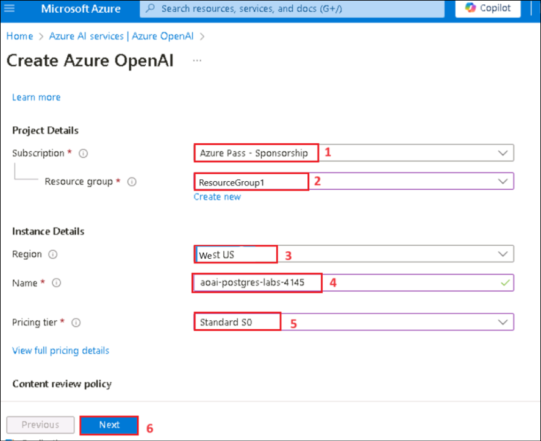
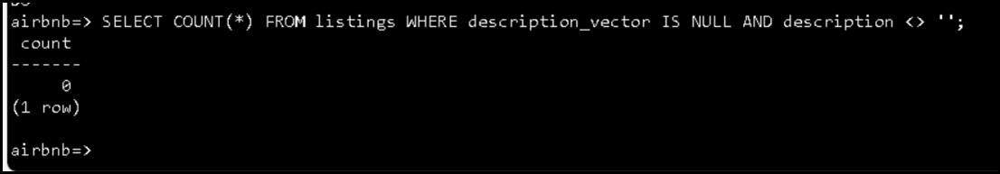
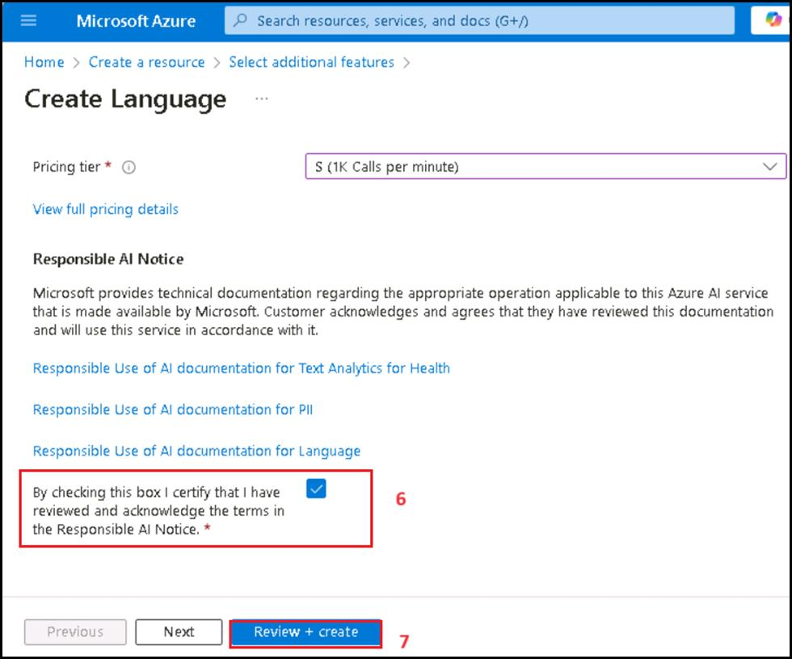
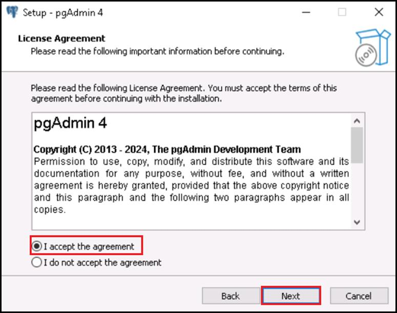

# 用例 12 - 将生成式 AI 功能与 Azure Database for PostgreSQL 灵活服务器集成，以评估对给定 AI 列表的评论

**实验室持续时间 --** 40 分钟

**实验室类型 --** 讲师指导

**介绍**

在本实验中，您将学习如何将 Azure AI 服务与 PostgreSQL 集成，以使用高级
AI 功能增强您的数据库。通过利用 Azure OpenAI 和 PostgreSQL 扩展（如
pgvector 和
PostGIS）的强大功能，您可以直接在数据库中启用复杂的文本分析、向量相似性搜索和地理空间查询。此实验室将指导你预配必要的
Azure 资源、配置数据库以及执行将 AI
驱动的见解与地理空间数据相结合的复杂查询。**目标**

- 预配和配置 Azure Database for PostgreSQL 灵活服务器。

- 使用 Azure OpenAI 服务创建和管理矢量嵌入。

- 执行向量相似性搜索以查找语义相似的文本数据。

- 利用 PostGIS 扩展进行地理空间数据分析。

- 集成 Azure AI 语言服务以进行情绪分析和其他认知功能。

- 使用索引和查询规划工具优化和分析查询性能。

**重要提示：**如果任何命令没有 **粘贴**到 **CloudShell**
中，请打开一个记事本，将光标保持在记事本的空白处，然后单击要粘贴的命令的
T 按钮。内容将被复制到记事本，然后您可以从记事本复制并粘贴到 CloudShell
上。

## 练习 0：了解 VM 和凭据

在此任务中，我们将识别并了解我们将在整个实验室中使用的凭证。

1.  **Instructions**选项卡包含实验室指南，其中包含在整个实验室中要遵循的说明。

2.  **Resources** 选项卡已获取执行实验室所需的凭证。

    - **URL** – Azure 门户的 URL

    - **Subscription** – 这是分配给你的订阅的 ID

    - **Username** – 登录 Azure 服务时需要使用的用户 ID。

    - **Password** – Azure 登录名的密码。让我们将此用户名和密码称为
      Azure 登录凭据。我们将在提及 Azure
      登录凭据的任何地方使用这些凭据。

    - **Resource Group** – 分配给您的**Resource Group** 。

>[！Alert] **重要提示：**请确保在此资源组下创建所有资源


3.  **Help** 选项卡包含 Support信息。此处的 **ID** 值是
    将在实验室执行期间使用的**Lab instance ID** 。

    

## 练习 1：预配 Azure Database for PostgreSQL 灵活服务器

### 任务 0：注册资源提供程序

1.  登录到 **Azure portal**- 使用 Azure
    登录凭据+++https://portal.azure.com+++。

2.  单击 **Subscriptions** 并选择 **Settings** 下的 **Resource
    Providers**。+++https://portal.azure.com+++

3.  搜索
    +++Microsoft.DBforPostgreSQL+++，然后单击**Registe**r以注册此资源提供程序。

    

### 任务 1：预配 Azure Database for PostgreSQL 灵活服务器

1.  打开 Web 浏览器并导航到
    +++[https://portal.azure.com+++](https://portal.azure.com+++/)

2.  选择 Azure 门户工具栏中的 **Cloud Shell**
    图标，在浏览器窗口顶部打开新的 Cloud Shell 窗格。

    

3.  首次打开 Cloud Shell 时，系统可能会提示您选择要使用的 shell
    类型（**Bash** 或 **PowerShell**）。选择 **Bash**。

    

4.  在**Getting started** 对话框中，选择**Mount storage
    account** ，然后选择你的 Azure 订阅。点击 **Apply** 按钮。

    

5.  在 **Mount storage account**对话框中，选择 **we will create a
    storage account for you**，然后单击 **Next** 按钮。

    

    

6.  在 Cloud Shell
    提示符下，运行以下命令以定义用于创建资源的变量。这些变量表示要分配给资源组和数据库的名称，并指定应将资源部署到的
    Azure 区域。

7.  将以下命令中的 Resource group Name
    替换为分配的资源组，然后执行命令。

  	+++RG_NAME= < Resource group Name >+++

    

8.  在数据库名称中，将 {SUFFIX} 令牌替换为您的**Lab instance
    ID**（例如您的姓名首字母缩写），以确保数据库服务器名称全局唯一。

    +++DATABASE_NAME=<pgsql-flex-@lab.LabInstance.Id>+++

    

9.  执行以下命令以设置 Region 值。

    +++REGION=@lab.CloudResourceGroup(ResourceGroup1).Location+++

    

10. 通过运行以下 Azure CLI 命令，在分配的资源组中预配 Azure Database for
    PostgreSQL 数据库实例（此命令需要 10 分钟才能完成）

    ```
    az postgres flexible-server create --name $DATABASE_NAME --location $REGION --resource-group $RG_NAME \
    --admin-user s2admin --admin-password Seattle123Seattle123 --database-name airbnb \
    --public-access 0.0.0.0-255.255.255.255 --version 16 \
    --sku-name Standard_D2s_v3 --storage-size 32 --yes
    ```

    

### 任务 2：使用 Azure Cloud Shell 中的 psql 连接到数据库

在此任务中，您将使用 Azure Cloud Shell 中的 psql
命令行实用程序连接到您的数据库。

1.  打开浏览器，转到 +++https://portal.azure.com+++，然后使用
    Azure 订阅帐户登录。

2.  在 **Home**上，单击 **Resource Groups**。

    

3.  单击**your assigned resource group**名称

    

4.  在资源组中，选择**PostgreSQL Flexible Server**资源

    

5.  在左侧导航菜单中，选择 **Settings** 下的 **Connect**。

    

6.  在 Azure 门户的数据库**的 Connect** 页面中，选择 **Airbnb** 作为
    **Database name**，然后复制 **Connection details**
    块并将其粘贴到记事本中，以便在即将到来的任务中使用这些信息。

    

7.  在 Azure Database for PostgresSQL 主页中，单击
    左侧导航菜单中的**Overview**，复制“服务器名称”并将其粘贴到记事本中，然后**Save**记事本以在即将到来的实验中使用信息。

    

8.  在 Azure Database for PostgreSQL 主页中，选择
    settings**下的** **Networking，**然后选择** Allow public access from
    any Azure service within Azure to this server**。点击 **Save**
    按钮。

    

    

9.  选择 Azure 门户工具栏中的 **Cloud Shell**
    图标，在浏览器窗口顶部打开新的 Cloud Shell 窗格。

10. 将**Connection details**信息粘贴到 Cloud Shell 中。

    

11. 在 Cloud Shell 提示符下，将 **{your_password}**
    令牌替换为您在创建数据库时分配给 **s2admin** 用户的密码，密码应为
    +++**Seattle123Seattle123**+++。

    

12. 通过在提示符处输入以下内容，使用 psql
    命令行实用程序连接到您的数据库：

    +++psql+++
    
    

从 Cloud Shell 连接到数据库需要在数据库的**Networking**页面上选中Allow
public access from any Azure service within Azure框
。如果您收到无法连接的消息，请确认是否已选中并重试。

### 任务 3：向数据库添加数据

使用 psql 命令提示符，您将创建表并使用数据填充它们以供实验室使用。

1.  运行以下命令以创建临时表，用于从公共 blob 存储帐户导入 JSON 数据。

    ```
    CREATE TABLE temp_calendar (data jsonb);
    CREATE TABLE temp_listings (data jsonb);
    CREATE TABLE temp_reviews (data jsonb);
    ```


2.  使用 COPY 命令，使用公共存储帐户中 JSON 文件中的数据填充每个临时表。

    +++\COPY temp_calendar (data) FROM PROGRAM 'curl https://solliancepublicdata.blob.core.windows.net/ms-postgresql-labs/calendar.json'+++
    
    +++\COPY temp_listings (data) FROM PROGRAM 'curl https://solliancepublicdata.blob.core.windows.net/ms-postgresql-labs/listings.json'+++
    
    +++\COPY temp_reviews (data) FROM PROGRAM 'curl https://solliancepublicdata.blob.core.windows.net/ms-postgresql-labs/reviews.json'+++

    

    

3.  运行以下命令，创建用于在此实验室使用的形状中存储数据的表：

    ```
    CREATE TABLE listings (
    listing_id int,
    name varchar(50),
    street varchar(50),
    city varchar(50),
    state varchar(50),
    country varchar(50),
    zipcode varchar(50),
    bathrooms int,
    bedrooms int,
    latitude decimal(10,5), 
    longitude decimal(10,5), 
    summary varchar(2000),
    description varchar(2000),
    host_id varchar(2000),
    host_url varchar(2000),
    listing_url varchar(2000),
    room_type varchar(2000),
    amenities jsonb,
    host_verifications jsonb,
    data jsonb
    );
    ```

    

    ```
     CREATE TABLE reviews (
        id int, 
        listing_id int, 
        reviewer_id int, 
        reviewer_name varchar(50), 
        date date,
        comments varchar(2000)
    );
    CREATE TABLE calendar (
        listing_id int, 
        date date,
        price decimal(10,2), 
        available boolean
    );
    ```

    

4.  最后，运行以下 **INSERT INTO** 语句，将数据从临时表加载到主表，将
    JSON 数据字段中的数据提取到各个列中：

    ```
    INSERT INTO listings
    SELECT 
        data['id']::int, 
        replace(data['name']::varchar(50), '"', ''),
        replace(data['street']::varchar(50), '"', ''),
        replace(data['city']::varchar(50), '"', ''),
        replace(data['state']::varchar(50), '"', ''),
        replace(data['country']::varchar(50), '"', ''),
        replace(data['zipcode']::varchar(50), '"', ''),
        data['bathrooms']::int,
        data['bedrooms']::int,
        data['latitude']::decimal(10,5),
        data['longitude']::decimal(10,5),
        replace(data['description']::varchar(2000), '"', ''),        
        replace(data['summary']::varchar(2000), '"', ''),        
        replace(data['host_id']::varchar(50), '"', ''),
        replace(data['host_url']::varchar(50), '"', ''),
        replace(data['listing_url']::varchar(50), '"', ''),
        replace(data['room_type']::varchar(50), '"', ''),
        data['amenities']::jsonb,
        data['host_verifications']::jsonb,
        data::jsonb
    FROM temp_listings;
    INSERT INTO reviews
    SELECT 
        data['id']::int,
        data['listing_id']::int,
        data['reviewer_id']::int,
        replace(data['reviewer_name']::varchar(50), '"', ''), 
        to_date(replace(data['date']::varchar(50), '"', ''), 'YYYY-MM-DD'),
        replace(data['comments']::varchar(2000), '"', '')
    FROM temp_reviews;
    INSERT INTO calendar
    SELECT 
        data['listing_id']::int,
        to_date(replace(data['date']::varchar(50), '"', ''), 'YYYY-MM-DD'),
        data['price']::decimal(10,2),
        replace(data['available']::varchar(50), '"', '')::boolean
    FROM temp_calendar;
    ```

    

## 练习 2：将 Azure AI 和 Vector 扩展添加到允许列表

在本实验中，您将使用 azure_ai 和 pgvector 扩展将生成式 AI 功能添加到
PostgreSQL
数据库中。在本练习中，您将这些扩展添加到服务器的* allowlist*中，如如何使用
PostgreSQL 扩展中所述。

1.  在 Home 上，单击 **Resource Groups** 。

    

2.  单击您的资源组名称

    

3.  在资源组中，选择**PostgreSQL Flexible Server** 资源

    

4.  在数据库的左侧导航菜单中，选择Settings下的**Server
    parameters** ，然后在搜索框中输入 +++**azure.extensions**+++。展开
    **VALUE** 下拉列表，然后找到并选中以下每个扩展名旁边的框：

    - AZURE_AI

    - POSTGIS

    - VECTOR

    

    

    

5.  在工具栏上选择 **Save** ，这将触发数据库上的部署。

    

## 练习 3：创建 Azure OpenAI 资源

azure_ai 扩展需要基础 Azure OpenAI
服务来创建矢量嵌入。在本练习中，您将在 Azure 门户中预配 Azure OpenAI
资源，并将嵌入模型部署到该服务中。

### 任务 1：预配 Azure OpenAI 服务

在此任务中，您将创建新的 Azure OpenAI 服务。

1.  在 Azure 门户主页中，单击 **Azure portal menu **，该菜单由 Microsoft
    Azure 命令栏左侧的三个水平条表示，如下图所示。

    

2.  导航并单击 **+ Create a resource**。

    

3.  在**Create a resource**  页上的**Search services and
    marketplace**搜索栏中，键入 +++**Azure OpenAI**+++，然后按 **Enter**
    按钮。

    

4.  在Marketplace页面中，导航到 **Azure OpenAI**
    部分，单击“创建”按钮下拉列表，然后选择 **Azure
    OpenAI**，如图所示。（如果您已经单击 **Azure OpenAI** 磁贴，然后单击
    **Azure OpenAI** 页面上的**Creat**e 按钮。

    

5.  在 Create Azure OpenAI **Basics** 选项卡上，输入以下信息，然后单击
    **Next** 按钮。

    | **Subscription** | 选择 Azure 订阅 |
    |:-----|:----|
    | **Resource group** | 选择已分配的Resource group |
    | **Region** | 选择 @lab.CloudResourceGroup(ResourceGroup1).Location |
    | Name | 输入全局唯一名称，例如 +++aoai-postgres-labs-XXXX+++ (将 XXXX 替换为Lab instance ID)  |
    | **Pricing tier** | 选择Standard S0 |   

    

7.  在 **Network** 选项卡中，将所有单选按钮保留为默认状态，然后单击
    **Next** 按钮。

   

8.  在 **Tags** 选项卡中，将所有字段保留为默认状态，然后单击 **Next**
    按钮。

    

9.  在 **Review+submit** 选项卡中，验证通过后，单击 **Create** 按钮。

    

10. 等待部署完成。部署大约需要 2-3 分钟。

  >[！Note] **注意** 如果您看到一条消息，指出 Azure OpenAI
服务当前可通过申请表提供给客户。尚未为服务启用所选订阅，并且没有任何定价层的配额;您需要单击链接以请求访问
Azure OpenAI 服务并填写申请表。

### 任务 2：检索 Azure OpenAI 服务的密钥和终结点

1.  在资源的 **Overview** 页面上，选择 **Go to resource**
    按钮。如果出现提示，请选择实验室凭据：

    

2.  在 **Azure OpenAI 主**窗口中，导航到 Resource **Management**
    部分，然后单击 **Keys and Endpoints**。

    

3.  在 **Keys and Endpoints** 页面中，复制 **KEY1、KEY 2** 和
    **Endpoint**
    值并将其粘贴到记事本中，如下图所示，然后**save**记事本以在即将到来的任务中使用这些信息。

    

    

**注：** 您可以使用 KEY1 或
KEY2。始终拥有两个密钥可以让您安全地轮换和重新生成密钥，而不会导致服务中断。

### 任务 3：部署嵌入模型

azure_ai 扩展允许从文本创建向量嵌入。要创建这些嵌入，需要在 Azure OpenAI
服务中部署文本嵌入-ada-002（版本 2）模型。在此任务中，您将使用 Azure
OpenAI Studio 创建可采用的模型部署。

1.  在 **Azure OpenAI** 页面中，单击 左侧导航菜单中的
    **Overview ，**向下滚动并单击**Go to Azure OpenAI
    Studio**按钮，如下图所示**。**

    

    

2.  在 **Azure AI Foundry |Azure Open AI 服务**主页，导航到
    **Components** 部分，然后单击 **Deployments**。

3.  在 **Deployments** 窗口中，下拉 **+Deploy model** ，然后选择
    **Deploy base model**

    

4.  在**Select a model**对话框中，导航并仔细选择
    **text-embedding-ada-002** ，然后单击 ** Confirm** 按钮。

    

5. 在 **Deploy model** 对话框中，设置以下内容，然后选择 **Create**以部署模型。

  - **Select a model**: 从列表中选择 **text-embedding-ada-002**。
  
  - **Model version**: 确保 **选中** 2 （Default）。
  
  - **Deployment name**: 进入 +++**embeddings**+++

    

    

6.  在 **Deployments** 窗口中，复制**Deployment
    name**并将其粘贴到记事本中（如图所示），然后**save**记事本以在即将到来的任务中使用这些信息。

    

## 练习 4：安装和配置 azure_ai 扩展

在本练习中，您将 azure_ai 扩展安装到数据库中，并将其配置为连接到 Azure
OpenAI 服务。

### 任务 1：使用 Azure Cloud Shell 中的 psql 连接到数据库

在此任务中，您将使用 Azure Cloud Shell 中的 psql
命令行实用程序连接到您的数据库。

1.  选择 Azure 门户工具栏中的 **Cloud Shell**
    图标，在浏览器窗口顶部打开新的 Cloud Shell 窗格。

2.  将** Connection details**信息粘贴到 Cloud Shell 中。

    

3.  在 Cloud Shell 提示符下，将 **{your_password}**
    令牌替换为您在创建数据库时分配给 **s2admin** 用户的密码，密码应为
    **Seattle123Seattle123。**

    

4.  通过在提示符处输入以下内容，使用 psql
    命令行实用程序连接到您的数据库：

    +++**psql**+++

    

### 任务 2：安装 azure_ai 扩展

azure_ai 扩展允许您将 Azure OpenAI 和 Azure
认知服务集成到数据库中。要在数据库中启用扩展，请执行以下步骤：

1.  通过在 psql
    命令提示符下运行以下命令，验证扩展是否已成功添加到允许列表：

    +++SHOW azure.extensions;+++

    

2.  使用 CREATE EXTENSION 命令安装 azure_ai 扩展。

    +++CREATE EXTENSION IF NOT EXISTS azure_ai;+++

    

### 任务 3：查看 azure_ai 扩展中包含的对象

查看 azure_ai
扩展中的对象可以更好地了解其功能。在此任务中，您将检查扩展添加到数据库的各种架构、用户定义的函数
（UDF） 和复合类型。

1.  您可以在 **psql** 命令提示符下使用 \dx 元命令 列出扩展中包含的对象。

  >[！Note] **注意：**当 Cloud Shell 提示 **More...**

  +++\dx+ azure_ai+++

  

  

  元命令输出显示 azure_ai 扩展在数据库中创建三个架构、多个用户定义函数
（UDF） 和多个复合类型。下表列出了扩展添加的架构，并描述了每个架构。

    | **Schema** | **描述** |
    |:-----|:-------|
    | azure_ai | 配置表和用于与之交互的 UDF 所在的主体架构。 |
    | azure_openai | 包含支持调用 Azure OpenAI 终结点的 UDF。|
    | azure_cognitive | 提供与将数据库与 Azure 认知服务集成相关的 UDF 和复合类型。|

2.  函数和类型都与其中一个架构相关联。要查看 azure_ai
    架构中定义的函数，请使用 \df 元命令，指定应显示其函数的架构。\df
    前面的 \x auto
    命令允许在必要时自动应用扩展显示，以使命令的输出更易于在 Azure Cloud
    Shell 中查看。

    +++\x auto+++ +++\df+ azure_ai.*+++

    

    azure_ai.set_setting（） 函数允许您设置 Azure AI
服务的端点和键值。它接受一个**Key**和
**value**它的值。azure_ai.get_setting（） 函数提供了一种检索您使用
set_setting（） 函数设置的值的方法。它接受
您要查看的设置的键。对于这两种方法，键必须是以下值之一：

### 任务 4：设置 Azure OpenAI 终结点和密钥

在使用 azure_openai 函数之前，请将扩展配置为 Azure OpenAI
服务终结点和密钥。

1.  在下面的命令中，将 **{endpoint}** 和 **{api-key}** 令牌替换为从
    Azure 门户检索的值，然后从 Cloud Shell 窗格中的 psql
    命令提示符运行命令，以将值添加到配置表中。


    ```
    SELECT azure_ai.set_setting('azure_openai.endpoint','{endpoint}');
    SELECT azure_ai.set_setting('azure_openai.subscription_key', '{api-key}');
    ```

    

2.  使用以下查询验证配置表中写入的设置:

    ```
    SELECT azure_ai.get_setting('azure_openai.endpoint');
    SELECT azure_ai.get_setting('azure_openai.subscription_key');
    ```

    azure_ai 扩展现已连接到你的 Azure OpenAI 帐户，并准备好生成向量嵌入。

    

## 练习 5：使用 Azure OpenAI 生成向量嵌入

azure_ai 扩展的 azure_openai 架构使 Azure OpenAI
能够为文本值创建向量嵌入。使用此架构，可以直接从数据库使用 Azure OpenAI
生成嵌入，以创建输入文本的矢量表示形式，然后可以将其用于矢量相似性搜索，并供机器学习模型使用。

嵌入是机器学习和自然语言处理 （NLP）
中的一个概念，涉及将对象（例如单词、文档或实体）表示为多维空间中的向量。嵌入允许机器学习模型评估相关信息的紧密程度。这种技术可以有效地识别数据之间的关系和相似性，使算法能够识别模式并做出准确的预测。

### 任务 1：使用 pgvector 扩展启用向量支持

azure_ai
扩展允许您为输入文本生成嵌入。要使生成的向量与数据库中的其余数据一起存储，您必须按照数据库中的启用向量支持文档中的指导安装
pgvector 扩展。

1.  使用 CREATE EXTENSION 命令安装 pgvector 扩展。

    +++CREATE EXTENSION IF NOT EXISTS vector; +++

    

2.  将 vector supported 添加到数据库中后，使用 vector 数据类型向
    listings 表添加新列，以在表中存储嵌入。text-embedding-ada-002
    模型生成具有 1536 个维度的向量，因此您必须指定 1536 作为向量大小。

    ```
    ALTER TABLE listings
    ADD COLUMN description_vector vector(1536);
    ```

    

### 任务 2：生成和存储向量嵌入

listings 表现在可以存储嵌入了。使用 azure_openai.create_embeddings（）
函数，您可以为 description 字段创建向量，并将它们插入到列表表中新创建的
description_vector 列中。

1.  在使用 create_embeddings（）
    函数之前，请运行以下命令来检查它并查看所需的参数：

    +++\df+ azure_openai.\* +++

    

    \df+ azure_openai.\* 命令输出中的 Argument
数据类型属性显示函数所需的参数列表。

    | **Argument** | **类型** | **违约** | **描述**  |
    |:---|:----|:-------|:--------|
    | deployment_name | text |  | Azure OpenAI Studio 中包含 text-embeddings-ada-002 模型的部署名称。 |
    | input | text |  | 用于创建嵌入的输入文本。 |
    |timeout_ms  | integer | 3600000 | 超时（以毫秒为单位），超过此时间后作将停止。 |
    | throw_on_error |  boolean| true | 指示函数是否应在出错时引发异常，从而导致包装事务回滚的标志。 |

2.  使用部署名称，运行以下查询以更新 listings 表中的每条记录，使用
    azure_openai.create_embeddings（） 函数将 description
    字段生成的向量嵌入插入到 description_vector 列中。将
    {your-deployment-name} 替换为 您从 Azure OpenAI Studio
    **Deployments**页面复制的**Deployment
    name **值。请注意，此查询大约需要 5 分钟才能完成。

    ```
    DO $$
    
    DECLARE counter integer := (SELECT COUNT(*) FROM listings WHERE description <> '' AND description_vector IS NULL);
    DECLARE r record;
    BEGIN
        RAISE NOTICE 'Total descriptions to embed: %', counter;
        WHILE counter > 0 LOOP
            BEGIN
                FOR r IN
                    SELECT listing_id FROM listings WHERE description <> '' AND description_vector IS NULL
                LOOP
                    BEGIN
                        UPDATE listings
                        SET description_vector = azure_openai.create_embeddings('{your-deployment-name}', description)
                        WHERE listing_id = r.listing_id;
                    EXCEPTION
                        WHEN OTHERS THEN
                            RAISE NOTICE 'Waiting 1 second before trying again...';
                            PERFORM pg_sleep(1);
                    END;
                    counter := (SELECT COUNT(*) FROM listings WHERE description <> '' AND description_vector IS NULL);
                    IF counter % 25 = 0 THEN
                        RAISE NOTICE 'Remaining descriptions to embed: %', counter;
                    END IF;
                END LOOP;
            END;
        END LOOP;
    END;
    $$;
    ```

    

上述查询使用 WHILE 循环从 listings 表中检索记录，其中 description_vector
字段为 null，并且 description 字段不是空字符串。然后，查询尝试使用
azure_openai.create_embeddings 函数使用 description 列的向量表示形式更新
description_vector
列。执行此更新时使用循环，以防止对创建嵌入函数的调用超过 Azure OpenAI
服务的调用速率限制。如果超出调用速率限制，您将在输出中看到类似于以下内容的警告:

  >[！Note] **注意**：等待 1 秒后再试一次...
    
   
    
  

3.  您可以通过运行以下查询来验证是否已为所有列表记录填充
    description_vector 列:

    +++SELECT COUNT(*) FROM listings WHERE description_vector IS NULL AND description <> '';+++

    查询结果应为 count 0。

    

### 任务 3：执行向量相似性搜索

向量相似度是一种通过将两个项目表示为向量（一系列数字）来衡量它们相似度的方法。向量通常用于使用
LLM
执行搜索。向量相似度通常使用距离度量计算，例如欧几里得距离或余弦相似度。欧几里得距离测量
n
维空间中两个向量之间的直线距离，而余弦相似度测量两个向量之间角度的余弦距离。每个嵌入都是一个浮点数向量，因此向量空间中两个嵌入向量之间的距离与原始格式中两个输入之间的语义相似性相关。

1.  在执行向量相似性搜索之前，请使用 ILIKE
    子句运行以下查询，以观察使用自然语言查询搜索记录而不使用向量相似性的结果:

    +++SELECT listing_id, name, description FROM listings
ORDER BY description_vector <=> azure_openai.create_embeddings('{your-deployment-name}', 'Properties with a private room near Discovery Park')::vector
LIMIT 3;+++

    

    该查询返回零个结果，因为它尝试将 description
字段中的文本与提供的自然语言查询进行匹配。

2.  现在，对列表表执行余弦相似性搜索查询，以对列表描述执行向量相似性搜索。为输入问题生成嵌入，然后转换为向量数组
    （：：vector），这允许将其与列表表中存储的向量进行比较。将
    {your-deployment-name} 替换为 您从 Azure OpenAI Studio
    Deployment页面复制的**Deployment name**值。

    +++SELECT listing_id, name, description FROM listings
ORDER BY description_vector <=> azure_openai.create_embeddings('{your-deployment-name}', 'Properties with a private room near Discovery Park')::vector
LIMIT 3;+++


  查询使用 \<=\> [vector
operator](https://github.com/pgvector/pgvector#vector-operators)，它表示用于计算多维空间中两个向量之间距离的
\cosine distance\\ 运算符。

3.  使用 EXPLAIN ANALYZE
    子句再次运行相同的查询，以查看查询计划和执行时间。将
    **{your-deployment-name}** 替换为 您从 Azure OpenAI Studio
    Deployment页面复制的**Deployment name**值。

    ```
    EXPLAIN ANALYZE
    SELECT listing_id, name, description FROM listings
    ORDER BY description_vector <=> azure_openai.create_embeddings('{your-deployment-name}', 'Properties with a private room near Discovery Park')::vector
    LIMIT 3;
    ```

  

  

  

    在输出中，请注意 query plan，它将以类似于:

    Limit (cost=1098.54..1098.55 rows=3 width=261) (actual
time=10.505..10.507 rows=3 loops=1) -\> Sort (cost=1098.54..1104.10
rows=2224 width=261) (actual time=10.504..10.505 rows=3 loops=1)

    …

    Sort Method: top-N heapsort Memory: 27kB -\> Seq Scan on listings
(cost=0.00..1069.80 rows=2224 width=261) (actual time=0.005..9.997
rows=2224 loops=1)
查询正在使用顺序扫描排序来执行查找。计划和执行时间将列在结果的末尾，应类似于以下内容：
规划时间：62.020 毫秒 执行时间：10.530 毫秒

4.  为了更有效地搜索向量字段，请使用余弦距离和
    [HNSW](https://github.com/pgvector/pgvector#hnsw)（Hierarchical
    Navigable Small World 的缩写）在列表上创建索引。HNSW 允许 pgvector
    利用最新的基于图形的算法来近似最近邻查询。

    +++CREATE INDEX ON listings USING hnsw (description_vector
vector_cosine_ops);+++


5.  要观察 hnsw 索引对表的影响，请使用 EXPLAIN ANALYZE
    子句再次运行查询，以比较查询计划和执行时间。将
    **{your-deployment-name}** 替换为 您从 Azure OpenAI Studio
    **Deployment** 复制的**Deployment name**值。

    ```
    EXPLAIN ANALYZE
    SELECT listing_id, name, description FROM listings
    ORDER BY description_vector <=> azure_openai.create_embeddings('{your-deployment-name}', 'Properties with a private room near Discovery Park')::vector
    LIMIT 3;
    ```

  

  

  

  在输出中，请注意查询计划现在包含更高效的索引扫描：

  Limit (cost=116.48..119.33 rows=3 width=261) (actual time=1.112..1.130
rows=3 loops=1) -\> Index Scan using listings_description_vector_idx on
listings (cost=116.48..2228.28 rows=2224 width=261) (actual
time=1.111..1.128 rows=3 loops=1)

  查询执行时间应反映计划和运行查询所花费的时间的显著减少：
  
  规划时间：56.802 ms
  
  执行时间：1.167 ms

## 练习 6：集成 Azure AI 服务

azure_ai 扩展的 azure_cognitive 架构中包含的 Azure AI
服务集成提供了一组丰富的 AI
语言功能，可直接从数据库访问。这些功能包括情感分析、语言检测、关键短语提取、实体识别和文本摘要。这些功能是通过
Azure AI 语言服务启用的。

若要查看可通过扩展访问的 Azure AI 功能的完整列表，请查看将 Azure
Database for PostgreSQL 灵活服务器与 Azure 认知服务集成文档。

### 任务 1：预配 Azure AI 语言服务

需要 Azure AI Languageservice 才能利用 azure_ai
扩展认知功能。在本练习中，您将创建一个 Azure AI 语言服务。

1.  在 Azure 门户主页中，单击 **Azure portal menu**，该菜单由 Microsoft
    Azure 命令栏左侧的三个水平条表示，如下图所示。

  

2.  在 **Create a resource** 页面上，从左侧菜单中选择 **AI + Machine
    Learning**，然后选择 **Language service**。

  

  

3.  在 **Select additional features**对话框中，选择 **Continue to create
    your resource**。

  

4.  在 Create Language **Basics** 选项卡上，输入以下内容:

    | **参数** | **价值** | 
    |:---|:----|
    |**项目详情** | |
    | 订阅 | 选择已分配的订阅 | 
    |Resource group  | 选择您分配的 ResourceGroup | 
    | **Instance details** |  |
    | 地区 | 选择 @lab.CloudResourceGroup(ResourceGroup1).Location |
    | 名字 | 输入全局唯一名称，例如 +++lang-postgres-labs-SUFFIX+++, 将 SUFFIX 替换为您的Lab instance ID。 |
    | 定价层 | 选择标准定价套餐 S（每分钟 1K 次调用）。 |
    |负责任的 AI 通知  | 选中该框以证明您已查看并确认负责任 AI 通知。|

    

    

7.  默认设置将用于语言服务配置的其余选项卡，因此请选择 **Review +
    create**按钮。

8.  选择**Review + create**选项卡上的**Create**按钮 以预配语言服务。

    

9.  语言服务部署完成后，在部署页上选择**Go to resource group**。

    

### 任务 2：设置 Azure AI 语言服务终结点和密钥

与 azure_openai 函数一样，要使用 azure_ai 扩展成功调用 Azure AI
服务，您必须为 Azure AI 语言服务提供终端节点和密钥。

1.  在 Language （语言） 主页中，从 左侧导航菜单中选择 **Resource
    Management** 下的 **Keys and Endpoint** 项。

2.  在 **Keys and Endpoints** 页面中，复制 **KEY1、KEY 2** 和
    **Endpoint**
    值并将其粘贴到记事本中，如下图所示，然后**Save**记事本以在即将到来的任务中使用这些信息。

    

3.  复制终结点和访问密钥值，然后在下面的命令中，将 {endpoint} 和
    {api-key} 令牌替换为从 Azure 门户检索的值。从 Cloud Shell 中的 psql
    命令提示符运行命令，以将您的值添加到配置表中。

  >[!Note] **注意：**在执行以下命令之前，请连接到 psql 命令提示符。

    ```
    SELECT azure_ai.set_setting('azure_cognitive.endpoint','{endpoint}');
    SELECT azure_ai.set_setting('azure_cognitive.subscription_key', '{api-key}');
    ```

    

### 任务 3：分析评论的情绪

在此任务中，您将使用 azure_cognitive.analyze_sentiment
函数来评估Airbnb列表的评论。

1.  要使用 azure_ai 扩展中的 azure_cognitive 架构执行情绪分析，请使用
    analyze_sentiment 函数。运行以下命令以查看该函数：

    +++\df azure_cognitive.analyze_sentiment+++

    

    输出显示函数的架构、名称、结果数据类型和参数数据类型。此信息有助于了解如何使用该功能。

2.  了解函数输出的结果数据类型的结构也很重要，这样才能正确处理其返回值。运行以下命令以检查
    sentiment_analysis_result 类型:

    +++\dT+ azure_cognitive.sentiment_analysis_result+++

    

3.  上述命令的输出显示 sentiment_analysis_result
    类型是一个元组。要了解该元组的结构，请运行以下命令以查看
    sentiment_analysis_result 复合类型中包含的列：

    +++\d+ azure_cognitive.sentiment_analysis_result+++

    

该命令的输出应类似于以下内容： Composite type
"azure_cognitive.sentiment_analysis_result"

Column | Type | Collation | Nullable | Default | Storage | Description
----------------+------------------+-----------+----------+---------+----------+-------------

sentiment | text | | | | extended |

positive_score | double precision | | | | plain |

neutral_score | double precision | | | | plain |

negative_score | double precision | | | | plain |

azure_cognitive.sentiment_analysis_result
是包含输入文本的情绪预测的复合类型。它包括情绪，可以是积极的、消极的、中性的或混合的，以及文本中发现的积极、中立和消极方面的分数。分数表示为介于
0 和 1 之间的实数。例如，在 （neutral，0.26,0.64,0.09）
中，情绪是中性的，正分 0.26，中性分 0.64，负分 0.09。

## 练习 7：执行最终查询以将其全部联系在一起

在本练习中，您将连接到 **pgAdmin**
中的数据库并执行最终查询，该查询将您的工作与实验 3 和 4 中的
azure_ai、postgis 和 pgvector 扩展联系在一起。

### 任务 1：安装 pgAdmin

1.  打开 Web
    浏览器并导航到<https://www.pgadmin.org/download/pgadmin-4-windows/>

2.  单击最新版本的 **pgAdmin**

    

3.  选择 **pgadmin4-8.9-x64.exe**

    

4.  运行并安装下载的文件

    

5.  在 Select Setup Install Mode 选项卡上，选择 **Install only for me
    （recommended）**

    

7.  单击 **Next** 按钮

    

7.  选择 **I accept the agreement** 并单击 **Next** 按钮

    

8.  选择路径并单击 **Next ** 按钮

    

9.  在 **Setup-pgAdmin 4** 窗口中，单击 **Next** 按钮

    

10. 点击 **Install** 按钮

    

11. 在 **Setup-pgAdmin 4** 窗口中，单击 **Finish** 按钮

    

### 任务 2：使用 pgAdmin 连接到数据库

在此任务中，您将打开 pgAdmin 并连接到您的数据库。

1.  在 Windows 搜索框中，键入 +++**pgAdmin**+++，然后单击 **pgAdmin**

    

    

2.  通过右键单击 Object Explorer 中的 **Servers** 并选择 **Register \>
    Server** 来注册服务器。

    

3.  在**Register - Server**对话框中，将 Azure Database for PostgreSQL
    灵活服务器服务器名称（已在练习 1\> 任务 1 中保存）粘贴到
    **General 选项卡上的Name**字段中。

    

4.  接下来，选择 **Connection** 选项卡，并将您的服务器名称粘贴到
    **Hostname/address** 字段中。在 **Username**  字段中输入
    +++**s2admin**+++ ，在 密码 框中输入 +++**Seattle123Seattle123**+++
    ，然后选择 **Save password**。

    

5.  最后，选择 **Parameters** 选项卡并将 **SSL mode**设置为
    **require**。选择 **Save** 以注册您的服务器。

    

    

6.  连接到您的服务器后，展开 **Databases** 节点并选择 **airbnb**
    数据库。右键单击 **airbnb** 数据库，然后从 上下文菜单中选择 **Query
    Tool**。

    

    

### 任务 3：验证数据库中是否安装了 PostGIS 扩展

要在数据库中安装 postgis 扩展，您将使用 CREATE EXTENSION 命令。

1.  在上面打开的查询窗口中，运行带有 IF NOT EXISTS 子句的 CREATE
    EXTENSION 命令，以在数据库中安装 postgis 扩展。

    +++CREATE EXTENSION IF NOT EXISTS postgis;+++

    

    现在加载了 PostGIS
扩展，您就可以开始处理数据库中的地理空间数据了。您在上面创建和填充的
listings
表包含所有列出的属性的纬度和经度。要将这些数据用于地理空间分析，必须更改
listings 表以添加接受 point 数据类型的 geometry 列。这些新数据类型包含在
postgis 扩展中。

2.  要容纳点数据，请向接受点数据的新 geometry
    列添加。将以下查询复制并粘贴到打开的 pgAdmin 查询窗口中:

3.  ALTER TABLE 列表

    +++ADD COLUMN listing_location geometry(point, 4326); +++

4.  接下来，通过将 longitude 和 latitude 值添加到 geometry
    列中，使用与每个列表关联的地理空间数据更新表。

5.  UPDATE 列表

    +++SET listing_location = ST_SetSRID(ST_Point(longitude, latitude),
4326);+++

    

### 任务 4：执行查询并在地图上查看结果

1.  将以下查询复制并粘贴到打开的查询编辑器中，然后运行它以查看存储在
    **listing_location** 列中的数据。

    +++SELECT listing_id, name, listing_location FROM listings LIMIT 50;+++

    在 Data Output面板中，选择 查询结果的 **listing_location** 列中显示的
**View all geometries** **in this column**按钮。

    

    

2.  现在，运行以下查询以执行** geospatial proximity query**，返回 2016
    年 1 月 13 日当周可用的房产，每晚价格低于 75.00
    美元，并且距离西雅图的 Discovery Park 不远。该查询使用 PostGIS
    扩展提供的 ST_DWithin
    函数来识别距公园给定距离内的列表，该距离的经度为 -122.410347，纬度为
    47.655598。

    ```
    SELECT name, listing_location, summary
    FROM listings l
    INNER JOIN calendar c ON l.listing_id = c.listing_id
    WHERE ST_DWithin(
        listing_location,
        ST_GeomFromText('POINT(-122.410347 47.655598)', 4326),
        0.025
    )
    AND c.date = '2016-01-13'
    AND c.available = 't'
    AND c.price <= 75.00;
    ```

    

    

**总结**

在本实验中，您已成功将 Azure AI 服务与 PostgreSQL 集成，以创建支持 AI
的强大数据库环境。您已开始预置 Azure 资源并使用必要的扩展配置 PostgreSQL
数据库。然后，您为文本数据生成向量嵌入，并执行向量相似性搜索以查找语义相似的记录。此外，你还利用
PostGIS 扩展进行地理空间数据分析，并使用 Azure AI
语言服务进行情绪分析。最后，您已使用索引优化了查询并分析了其性能，从而展示了此集成解决方案用于高级数据分析的效率和功能。

 
