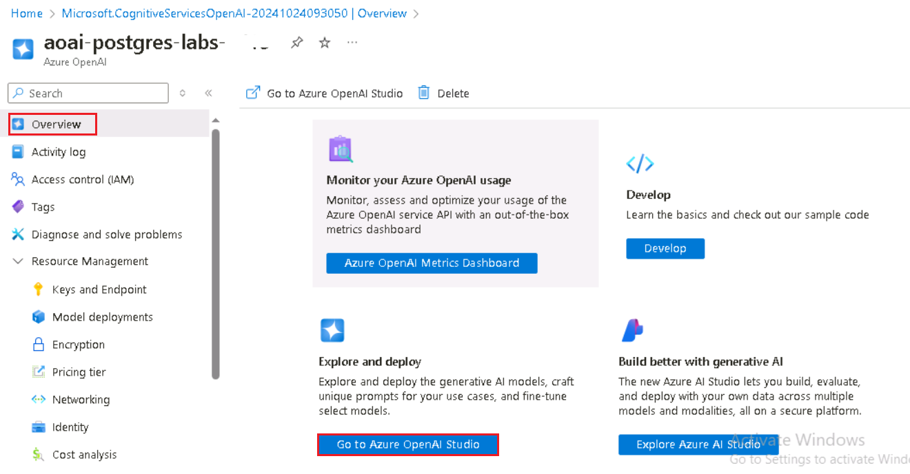

# Use case 12- Integrate generative AI capabilities with Azure Database for PostgreSQL Flexible Server to evaluate reviews of given AI listings

**Lab Duration --** 40 minutes

**Lab Type --** Instructor led

**Introduction**

In this lab, you will learn how to integrate Azure AI services with
PostgreSQL to enhance your database with advanced AI functionalities. By
leveraging the power of Azure OpenAI and PostgreSQL extensions such as
pgvector and PostGIS, you will enable sophisticated text analysis,
vector similarity searches, and geospatial queries directly within your
database. This lab guides you through provisioning the necessary Azure
resources, configuring your database, and executing complex queries that
combine AI-driven insights with geospatial data.**Objectives**

- To provision and configure Azure Database for PostgreSQL Flexible
  Server.

- To create and manage vector embeddings using the Azure OpenAI service.

- To perform vector similarity searches in order to find semantically
  similar text data.

- To utilize the PostGIS extension for geospatial data analysis.

- To integrate Azure AI Language services for sentiment analysis and
  other cognitive functions.

- To optimize and analyze query performance using indexing and query
  planning tools.

**Important:** If any of the commands does not get **pasted** in
the **CloudShell**, please open a notepad, keep the cursor at an empty
space of the notepad and then click on the T button of the command to be
pasted. The contents will get copied to the notepad and then you can
copy and paste from the notepad onto the CloudShell.

## Exercise 0: Understand the VM and the credentials

In this task, we will identify and understand the credentials that we will be using throughout the lab.

1.	**Instructions** tab hold the lab guide with the instructions to be followed throughout the lab.
   
2.	**Resources** tab has got the credentials that will be needed for executing the lab.
    -	**URL** – URL to the Azure portal
    -	**Subscription** – This is the ID of the subscription assigned to you
    -	**Username** – The user id with which you need to login to the Azure services.
    -	**Password** – Password to the Azure login.
Let us call this Username and password as Azure login credentials. We will use these creds wherever we mention Azure login credentials.
    
    -	**Resource Group** – The **Resource group** assigned to you. 

  	>[!Alert] **Important:** Make sure you create all your resources under this Resource group

    
  	
3.	**Help** tab holds the Support information. The **ID** value here is the **Lab instance ID** which will be used during the lab execution.
 
    


## Exercise 1: Provision an Azure Database for PostgreSQL Flexible Server

### Task 1: Provision an Azure Database for PostgreSQL Flexible Server

1.  Open a web browser and navigate to the +++https://portal.azure.com+++

2.  Select the **Cloud Shell** icon in the Azure portal toolbar to open
    a new Cloud Shell pane at the top of your browser window.

    

3.  The first time you open the Cloud Shell, you may be prompted to
    choose the type of shell you want to use
    (**Bash** or **PowerShell**). Select **Bash**.

    

4.  In **Getting started** dialog box, select **Mount storage
    account** and select your azure subscription. Click on
    the **Apply** button.

    

5.  In **Mount storage account** dialog box, select **we will create a
    storage account for you** and click on the **Next** button.

    
    
    

6.  At the cloud shell prompt, run the following commands to define
    variables for creating resources. The variables represent the names
    to assign to your resource group and database and specify the Azure
    region into which resources should be deployed.

7.	Replace the Resource group Name in the command below with the assigned Resource group and execute the command.

  	+++RG_NAME= < Resource group Name >+++

    
    

8.  In the database name, replace the {SUFFIX} token with your **Lab instance ID**, such as your initials, to ensure the database server name is
    globally unique.

    +++DATABASE_NAME=pgsql-flex-@lab.LabInstance.Id+++

    

9.	Execute the below command to set the Region value.

  	+++REGION=westus+++
  	
    

10.	Provision an Azure Database for PostgreSQL database instance within assigned the resource group by running the following Azure CLI command( This command will take 10 mins to complete)

    ```
    az postgres flexible-server create --name $DATABASE_NAME --location $REGION --resource-group $RG_NAME \
    --admin-user s2admin --admin-password Seattle123Seattle123 --database-name airbnb \
    --public-access 0.0.0.0-255.255.255.255 --version 16 \
    --sku-name Standard_D2s_v3 --storage-size 32 --yes
    ```

    

### Task 2: Connect to the database using psql in the Azure Cloud Shell

In this task, you use the psql command-line utility from the Azure Cloud
Shell to connect to your database.

1.  Open a browser go to +++https://portal.azure.com+++ and sign in with
    your Azure subscription account.

2.  On the **Home** page, click on **Resource Groups**.

    

3.  Click on **your assigned resource group** name

    

4.  In the resource group, select **PostgreSQL Flexible
    Server** resource

    

5.  In the left-hand navigation menu,
    select **Connect** under **Settings**.

    

6.  From the database's **Connect** page in the Azure portal,
    select **airbnb** for the **Database name**, then copy
    the **Connection details** block and paste it into the notepad to
    use the information in the upcoming tasks.

    

7.  In the Azure Database for PostgresSQL home page, click
    on **Overview** in the left-sided navigation menu and copy the
    Server name and paste it into notepad, then **Save** the notepad to
    use the information in the upcoming lab.

    

8.  In the Azure Database for PostgreSQL home page,
    select **Networking** under settings and select **Allow public
    access from any Azure service within Azure to this server**. Click
    on **Save** button.

    
    
    

9.  Select the **Cloud Shell** icon in the Azure portal toolbar to open
    a new Cloud Shell pane at the top of your browser window.

10. Paste **Connection details** into the Cloud Shell.

    

11. At the Cloud Shell prompt, replace the **{your_password}** token
    with the password you assigned to the **s2admin** user when creating
    your database, the password should be +++**Seattle123Seattle123**+++.

    

12. Connect to your database using the psql command-line utility by
    entering the following at the prompt:

    +++psql+++
    
    

Connecting to the database from the Cloud Shell requires that the Allow
public access from any Azure service within Azure to the server box is
checked on the **Networking** page of the database. If you receive a
message that you are unable to connect, please verify this is checked
and try again.

### Task 3: Add data to the database

Using the psql command prompt, you will create tables and populate them
with data for use in the lab.

1.  Run the following commands to create temporary tables for importing
    JSON data from a public blob storage account.

    ```
    CREATE TABLE temp_calendar (data jsonb);
    CREATE TABLE temp_listings (data jsonb);
    CREATE TABLE temp_reviews (data jsonb);
    ```
    
    

2.  Using the COPY command, populate each temporary table with data from
    JSON files in a public storage account.

    +++\COPY temp_calendar (data) FROM PROGRAM 'curl https://solliancepublicdata.blob.core.windows.net/ms-postgresql-labs/calendar.json'+++
    
    +++\COPY temp_listings (data) FROM PROGRAM 'curl https://solliancepublicdata.blob.core.windows.net/ms-postgresql-labs/listings.json'+++
    
    +++\COPY temp_reviews (data) FROM PROGRAM 'curl https://solliancepublicdata.blob.core.windows.net/ms-postgresql-labs/reviews.json'+++

    
    
    

4.  Run the following command to create the tables for storing data in
    the shape used by this lab:

    ```
    CREATE TABLE listings (
    listing_id int,
    name varchar(50),
    street varchar(50),
    city varchar(50),
    state varchar(50),
    country varchar(50),
    zipcode varchar(50),
    bathrooms int,
    bedrooms int,
    latitude decimal(10,5), 
    longitude decimal(10,5), 
    summary varchar(2000),
    description varchar(2000),
    host_id varchar(2000),
    host_url varchar(2000),
    listing_url varchar(2000),
    room_type varchar(2000),
    amenities jsonb,
    host_verifications jsonb,
    data jsonb
    );
    ```
    

    ```
     CREATE TABLE reviews (
        id int, 
        listing_id int, 
        reviewer_id int, 
        reviewer_name varchar(50), 
        date date,
        comments varchar(2000)
    );
    CREATE TABLE calendar (
        listing_id int, 
        date date,
        price decimal(10,2), 
        available boolean
    );
    ```

    

5.  Finally, run the following **INSERT INTO** statements to load data
    from the temporary tables to the main tables, extracting data from
    the JSON data field into individual columns:

    ```
    INSERT INTO listings
    SELECT 
        data['id']::int, 
        replace(data['name']::varchar(50), '"', ''),
        replace(data['street']::varchar(50), '"', ''),
        replace(data['city']::varchar(50), '"', ''),
        replace(data['state']::varchar(50), '"', ''),
        replace(data['country']::varchar(50), '"', ''),
        replace(data['zipcode']::varchar(50), '"', ''),
        data['bathrooms']::int,
        data['bedrooms']::int,
        data['latitude']::decimal(10,5),
        data['longitude']::decimal(10,5),
        replace(data['description']::varchar(2000), '"', ''),        
        replace(data['summary']::varchar(2000), '"', ''),        
        replace(data['host_id']::varchar(50), '"', ''),
        replace(data['host_url']::varchar(50), '"', ''),
        replace(data['listing_url']::varchar(50), '"', ''),
        replace(data['room_type']::varchar(50), '"', ''),
        data['amenities']::jsonb,
        data['host_verifications']::jsonb,
        data::jsonb
    FROM temp_listings;
    INSERT INTO reviews
    SELECT 
        data['id']::int,
        data['listing_id']::int,
        data['reviewer_id']::int,
        replace(data['reviewer_name']::varchar(50), '"', ''), 
        to_date(replace(data['date']::varchar(50), '"', ''), 'YYYY-MM-DD'),
        replace(data['comments']::varchar(2000), '"', '')
    FROM temp_reviews;
    INSERT INTO calendar
    SELECT 
        data['listing_id']::int,
        to_date(replace(data['date']::varchar(50), '"', ''), 'YYYY-MM-DD'),
        data['price']::decimal(10,2),
        replace(data['available']::varchar(50), '"', '')::boolean
    FROM temp_calendar;
    ```

    

## Exercise 2: Add Azure AI and Vector extensions to allowlist

Throughout this lab, you use the azure_ai and pgvector extensions to add
generative AI capabilities to your PostgreSQL database. In this
exercise, you add these extensions to your server's *allowlist*, as
described in how to use PostgreSQL extensions.

1.  On the Home page, click on **Resource Groups**.

    

2.  Click on your resource group name

    

3.  In the resource group, select **PostgreSQL Flexible
    Server** resource

    

4.  From the database's left-hand navigation menu, select **Server
    parameters** under **Settings**, then
    enter +++**azure.extensions**+++ into the search box. Expand
    the **VALUE** dropdown list, then locate and check the box next to
    each of the following extensions:

    - AZURE_AI

    - POSTGIS

    - VECTOR

    
    
    
    
    

5.  Select **Save** on the toolbar, which will trigger a deployment on
    the database.

    

## Exercise 3: Create an Azure OpenAI resource

The azure_ai extension requires an underlying Azure OpenAI service to
create vector embeddings. In this exercise, you will provision an Azure
OpenAI resource in the Azure portal and deploy an embedding model into
that service.

### Task 1: Provision an Azure OpenAI service

In this task, you create a new Azure OpenAI service.

1.  From the Azure portal home page, click on **Azure portal
    menu** represented by three horizontal bars on the left side of the
    Microsoft Azure command bar as shown in the below image.

    

2.  Navigate and click on **+ Create a resource**.

    

3.  On **Create a resource** page, in the **Search services and
    marketplace** search bar, type +++**Azure OpenAI**+++, then press
    the **Enter** button.

    

4.  In the **Marketplace** page, navigate to the **Azure
    OpenAI** section, click on the Create button dropdown, then
    select **Azure OpenAI** as shown in the image. (In case, you've
    already clicked on the **Azure** **OpenAI** tile, then click on
    the **Create** button on the **Azure OpenAI page**).

    

5.  On the Create Azure OpenAI **Basics** tab, enter the following
    information and click on **Next** button.

    | **Subscription** | Select **Azure subscription** |
    |:-----|:----|
    | **Resource group** | Select your assigned resource group|
    | **Region** | Select West US |
    | Name | Enter a globally unique name, such as +++aoai-postgres-labs-XXXX+++(Replace **XXXX** with your **Lab instance ID**) |
    | **Pricing tier** | Select Standard S0 |    

    

7.  In the **Network** tab, leave all the radio buttons in the default
    state, and click on the **Next** button.

    

8.  In the **Tags** tab, leave all the fields in the default state, and
    click on the **Next** button.

    

9.  In the **Review+submit** tab, once the Validation is Passed, click
    on the **Create** button.

    

10.  Wait for the deployment to complete. The deployment will take around
    2-3 minutes.

     >[!Note] **Note:** If you see a message that the Azure OpenAI Service is
currently available to customers via an application form. The selected
subscription has not been enabled for the service and does not have a
quota for any pricing tiers; you will need to click the link to request
access to the Azure OpenAI service and fill out the request form.

### Task 2: Retrieve the key and endpoint of Azure OpenAI service

1.  On the resource's **Overview** page, select the **Go to
    resource** button. If prompted, select the lab credentials:

    

2.  In your **Azure OpenAI home** window, navigate to the **Resource
    Management** section, and click on **Keys and Endpoints**.

    

3.  In **Keys and Endpoints** page, copy **KEY1, KEY
    2,** and **Endpoint** values and paste them in a notepad as shown in
    the below image, then **save** the notepad to use the information in
    the upcoming tasks.

    
    
    

    **Note:** You can use either KEY1 or KEY2. Always having two keys allows
    you to securely rotate and regenerate keys without causing a service
    disruption.

### Task 3: Deploy an embedding model

The azure_ai extension allows the creation of vector embeddings from
text. To create these embeddings requires a deployed
text-embedding-ada-002 (version 2) model within your Azure OpenAI
service. In this task, you will use Azure OpenAI Studio to create a
model deployment that you can employ.

1.  In **Azure OpenAI** page, click on **Overview** in the left-sided
    navigation menu, scroll down and click on **Go to Azure OpenAI
    Studio** button as shown in the below image.

    
 
    

2.  On the **Azure AI Foundry | Azure Open AI Service** homepage,
    navigate to **Components** section and click on **Deployments**.

3.  In the **Deployments** window, drop down the **+Deploy model** and
    select **Deploy base model**

    

4.  In the **Select a model** dialog box, navigate and carefully select
    **text-embedding-ada-002** , then click on **Confirm** button.

     

5.  In the **Deploy model** dialog, set the following and
    select **Create** to deploy the model.
    
    - **Select a model**: Choose **text-embedding-ada-002** from the
      list.

    - **Model version**: Ensure **2 (Default)** is selected.

    - **Deployment name**: Enter +++**embeddings**+++

     
 
     

7.  In the **Deployments** window, copy **Deployment name** and paste
    them in a notepad (as shown in the image), and then **save** the
    notepad to use the information in the upcoming task.

    

## Exercise 4: Install and configure the azure_ai extension

In this exercise, you install the azure_ai extension into your database
and configure it to connect to your Azure OpenAI service.

### Task 1: Connect to the database using psql in the Azure Cloud Shell

In this task, you use the psql command-line utility from the Azure Cloud
Shell to connect to your database.

1.  Select the **Cloud Shell** icon in the Azure portal toolbar to open
    a new Cloud Shell pane at the top of your browser window.

2.  Paste **Connection details** into the Cloud Shell.

    

3.  At the Cloud Shell prompt, replace the **{your_password}** token
    with the password you assigned to the **s2admin** user when creating
    your database, the password should be **Seattle123Seattle123**.

    

4.  Connect to your database using the psql command-line utility by
    entering the following at the prompt:

    +++**psql**+++
    
    

### Task 2: Install the azure_ai extension

The azure_ai extension allows you to integrate Azure OpenAI and Azure
Cognitive Services into your database. To enable the extension in your
database, follow the steps below:

1.  Verify that the extension was successfully added to the allowlist by
    running the following from the psql command prompt:

    +++SHOW azure.extensions;+++
    
    

2.  Install the azure_ai extension using the CREATE EXTENSION command.

    +++CREATE EXTENSION IF NOT EXISTS azure_ai;+++
    
    

### Task 3: Review the objects contained within the azure_ai extension

Reviewing the objects within the azure_ai extension can provide a better
understanding of its capabilities. In this task, you inspect the various
schemas, user-defined functions (UDFs), and composite types added to the
database by the extension.

1.  You can use the \dx meta-command from the **psql** command prompt to
    list the objects contained within the extension.

    >[!Note] **Note:** Click on any key to continue when the cloud shell prompts
with **More…**

    +++\dx+ azure_ai+++

    
    
    

    The meta-command output shows the azure_ai extension creates three
schemas, multiple user-defined functions (UDFs), and several composite
types in the database. The table below lists the schemas added by the
extension and describes each.

    | **Schema** | **Description** |
    |:-----|:-------|
    | azure_ai | The principal schema where the configuration table and UDFs for interacting with it reside. |
    | azure_openai | Contains the UDFs that enable calling an Azure OpenAI endpoint. |
    | azure_cognitive | Provides UDFs and composite types related to integrating the database with Azure Cognitive Services. |

2.  The functions and types are all associated with one of the schemas.
    To review the functions defined in the azure_ai schema, use the \df
    meta-command, specifying the schema whose functions should be
    displayed. The \x auto command preceding \df allows the expanded
    display to be automatically applied when necessary to make the
    output from the command easier to view in the Azure Cloud Shell.

     +++\x auto+++
     +++\df+ azure_ai.*+++

    

The azure_ai.set_setting() function lets you set the endpoint and key
values for Azure AI services. It accepts a **key** and the **value** to
assign it. The azure_ai.get_setting() function provides a way to
retrieve the values you set with the set_setting() function. It accepts
the **key** of the setting you want to view. For both methods, the key
must be one of the following:

### Task 4: Set the Azure OpenAI endpoint and key

Before using the azure_openai functions, configure the extension to your
Azure OpenAI service endpoint and key.

1.  In the command below, replace
    the **{endpoint}** and **{api-key}** tokens with values you
    retrieved from the Azure portal, then run the commands from the psql
    command prompt in the Cloud Shell pane to add your values to the
    configuration table.

    ```
    SELECT azure_ai.set_setting('azure_openai.endpoint','{endpoint}');
    SELECT azure_ai.set_setting('azure_openai.subscription_key', '{api-key}');
    ```

    

2.  Verify the settings written in the configuration table using the
    following queries:

    ```
    SELECT azure_ai.get_setting('azure_openai.endpoint');
    SELECT azure_ai.get_setting('azure_openai.subscription_key');
    ```

    The azure_ai extension is now connected to your Azure OpenAI account and
ready to generate vector embeddings.

    

## Exercise 5: Generate vector embeddings with Azure OpenAI

The azure_ai extension's azure_openai schema enables Azure OpenAI to
create vector embeddings for text values. Using this schema, you can
generate embeddings with Azure OpenAI directly from the database to
create vector representations of input text, which can then be used in
vector similarity searches, as well as consumed by machine learning
models.

Embeddings are a concept in machine learning and natural language
processing (NLP) that involves representing objects, such as words,
documents, or entities, as vectors in a multi-dimensional space.
Embeddings allow machine learning models to evaluate how closely related
information is. This technique efficiently identifies relationships and
similarities between data, allowing algorithms to identify patterns and
make accurate predictions.

### Task 1: Enable vector support with the pgvector extension

The azure_ai extension allows you to generate embeddings for input text.
To enable the generated vectors to be stored alongside the rest of your
data in the database, you must install the pgvector extension by
following the guidance in the enable vector support in your database
documentation.

1.  Install the pgvector extension using the CREATE EXTENSION command.

    +++CREATE EXTENSION IF NOT EXISTS vector; +++

    

2.  With vector supported added to your database, add a new column to
    the listings table using the vector data type to store embeddings
    within the table. The text-embedding-ada-002 model produces vectors
    with 1536 dimensions, so you must specify 1536 as the vector size.
    
    ```
    ALTER TABLE listings
    ADD COLUMN description_vector vector(1536);
    ```

    

### Task 2: Generate and store vector embeddings

The listings table is now ready to store embeddings. Using the
azure_openai.create_embeddings() function, you create vectors for the
description field and insert them into the newly created
description_vector column in the listings table.

1.  Before using the create_embeddings() function, run the following
    command to inspect it and review the required arguments:

    +++\df+ azure_openai.\* +++

    

    The Argument data types property in the output of the \df+
azure_openai.\* command reveals the list of arguments the function
expects.

    | **Argument** | **Type** | **Default** | **Description**  |
    |:---|:----|:-------|:--------|
    | deployment_name | text |  | Name of the deployment in Azure OpenAI studio that contains the text-embeddings-ada-002 model. |
    | input | text |  | Input text used to create embeddings. |
    |timeout_ms  | integer | 3600000 | Timeout in milliseconds after which the operation is stopped. |
    | throw_on_error |  boolean| true | Flag indicating whether the function should, on error, throw an exception resulting in a rollback of the wrapping transactions. |
    
2.  Using the deployment name, run the following query to update each
    record in the listings table, inserting the generated vector
    embeddings for the description field into the description_vector
    column using the azure_openai.create_embeddings() function. Replace
    {your-deployment-name} with the **Deployment name** value you copied
    from the Azure OpenAI Studio **Deployments** page. Note that this
    query takes approximately five minutes to complete.

    ```
    DO $$
    
    DECLARE counter integer := (SELECT COUNT(*) FROM listings WHERE description <> '' AND description_vector IS NULL);
    DECLARE r record;
    BEGIN
        RAISE NOTICE 'Total descriptions to embed: %', counter;
        WHILE counter > 0 LOOP
            BEGIN
                FOR r IN
                    SELECT listing_id FROM listings WHERE description <> '' AND description_vector IS NULL
                LOOP
                    BEGIN
                        UPDATE listings
                        SET description_vector = azure_openai.create_embeddings('{your-deployment-name}', description)
                        WHERE listing_id = r.listing_id;
                    EXCEPTION
                        WHEN OTHERS THEN
                            RAISE NOTICE 'Waiting 1 second before trying again...';
                            PERFORM pg_sleep(1);
                    END;
                    counter := (SELECT COUNT(*) FROM listings WHERE description <> '' AND description_vector IS NULL);
                    IF counter % 25 = 0 THEN
                        RAISE NOTICE 'Remaining descriptions to embed: %', counter;
                    END IF;
                END LOOP;
            END;
        END LOOP;
    END;
    $$;
    ```

    

    The above query uses a WHILE loop to retrieve records from the listings
table where the description_vector field is null, and the description
field is not an empty string. The query then attempts to update the
description_vector column with a vector representation of the
description column using the azure_openai.create_embeddings function.
The loop is used when performing this update to prevent calls to create
embeddings function from exceeding the call rate limit of the Azure
OpenAI service. If the call rate limit is exceeded, you will see
warnings similar to the following in the output:

    >[!Note] **NOTE**: Waiting 1 second before trying again...

    

    

3.  You can verify that the description_vector column has been populated
    for all listings records by running the following query:

    +++SELECT COUNT(*) FROM listings WHERE description_vector IS NULL AND description <> '';+++

    The result of the query should be a count of 0.

    

### Task 3: Perform a vector similarity search

Vector similarity is a method used to measure two items\\ similarity by
representing them as vectors, a series of numbers. Vectors are often
used to perform searches using LLMs. Vector similarity is commonly
calculated using distance metrics, such as Euclidean distance or cosine
similarity. Euclidean distance measures the straight-line distance
between two vectors in the n-dimensional space, while cosine similarity
measures the cosine of the angle between two vectors. Each embedding is
a vector of floating point numbers, so the distance between two
embeddings in the vector space correlates with the semantic similarity
between two inputs in the original format.

1.  Before executing a vector similarity search, run the below query
    using the ILIKE clause to observe the results of searching for
    records using a natural language query without using vector
    similarity:

    +++SELECT listing_id, name, description FROM listings WHERE description ILIKE '%Properties with a private room near Discovery Park%';+++

    

    The query returns zero results because it is attempting to match the
text in the description field with the natural language query provided.

2.  Now, execute a cosine similarity search query against the listings
    table to perform a vector similarity search against listing
    descriptions. The embeddings are generated for an input question and
    then cast to a vector array (::vector), which allows it to be
    compared against the vectors stored in the listings table. Replace
    {your-deployment-name} with the **Deployment name** value you copied
    from the Azure OpenAI Studio **Deployments** page.

    +++SELECT listing_id, name, description FROM listings
ORDER BY description_vector <=> azure_openai.create_embeddings('{your-deployment-name}', 'Properties with a private room near Discovery Park')::vector
LIMIT 3;+++

    

    The query uses the \<=\> [vector
operator](https://github.com/pgvector/pgvector#vector-operators), which
represents the \\cosine distance\\ operator used to calculate the
distance between two vectors in a multi-dimensional space.

3.  Run the same query again using the EXPLAIN ANALYZE clause to view
    the query planning and execution times.
    Replace **{your-deployment-name}** with the **Deployment
    name** value you copied from the Azure OpenAI
    Studio **Deployments** page.

    ```
    EXPLAIN ANALYZE
    SELECT listing_id, name, description FROM listings
    ORDER BY description_vector <=> azure_openai.create_embeddings('{your-deployment-name}', 'Properties with a private room near Discovery Park')::vector
    LIMIT 3;
    ```

    

    

    

    In the output, notice the query plan, which will start with something
    similar to:
    
    Limit (cost=1098.54..1098.55 rows=3 width=261) (actual
    time=10.505..10.507 rows=3 loops=1) -\> Sort (cost=1098.54..1104.10
    rows=2224 width=261) (actual time=10.504..10.505 rows=3 loops=1)
    
    …
    
    Sort Method: top-N heapsort Memory: 27kB -\> Seq Scan on listings
    (cost=0.00..1069.80 rows=2224 width=261) (actual time=0.005..9.997
    rows=2224 loops=1) The query is using a sequential scan sort to perform
    the lookup. The planning and execution times will be listed at the end
    of the results, and should look similar to the following: Planning Time:
    62.020 ms Execution Time: 10.530 ms

4.  To enable more efficient searching over the vector field, create an
    index on listings using cosine distance
    and [HNSW](https://github.com/pgvector/pgvector#hnsw), which is
    short for Hierarchical Navigable Small World. HNSW allows pgvector
    to utilize the latest graph-based algorithms to approximate
    nearest-neighbor queries.

    +++CREATE INDEX ON listings USING hnsw (description_vector
vector_cosine_ops);+++


5.  To observe the impact of the hnsw index on the table, run the query
    again with the EXPLAIN ANALYZE clause to compare the query planning
    and execution times. Replace **{your-deployment-name}** with
    the **Deployment name** value you copied from the Azure OpenAI
    Studio **Deployments** page.
    
    ```
    EXPLAIN ANALYZE
    SELECT listing_id, name, description FROM listings
    ORDER BY description_vector <=> azure_openai.create_embeddings('{your-deployment-name}', 'Properties with a private room near Discovery Park')::vector
    LIMIT 3;
    ```
    
    
    
    
    

    In the output, notice the query plan now includes a more efficient index
    scan:
    
    Limit (cost=116.48..119.33 rows=3 width=261) (actual time=1.112..1.130
    rows=3 loops=1) -\> Index Scan using listings_description_vector_idx on
    listings (cost=116.48..2228.28 rows=2224 width=261) (actual
    time=1.111..1.128 rows=3 loops=1)
    
    The query execution times should reflect a significant reduction in the
    time it took to plan and run the query:
    
    Planning Time: 56.802 ms
    
    Execution Time: 1.167 ms

## Exercise 6: Integrate Azure AI Services

The Azure AI services integrations included in the azure_cognitive
schema of the azure_ai extension provide a rich set of AI Language
features accessible directly from the database. The functionalities
include sentiment analysis, language detection, key phrase extraction,
entity recognition, and text summarization. These capabilities are
enabled through the Azure AI Language service.

To review the complete list of Azure AI capabilities accessible through
the extension, view the Integrate Azure Database for PostgreSQL Flexible
Server with Azure Cognitive Services documentation.

**Task 1: Provision an Azure AI Language service**

An Azure AI Languageservice is required to take advantage of the
azure_ai extensions cognitive functions. In this exercise, you will
create an Azure AI Language service.

1.  From the Azure portal home page, click on **Azure portal
    menu** represented by three horizontal bars on the left side of the
    Microsoft Azure command bar as shown in the below image.

    

2.  On the **Create a resource** page, select **AI + Machine
    Learning** from the left-hand menu, then select **Language
    service**.

    
    
    

3.  On the **Select additional features** dialog, select **Continue to
    create your resource**.

    

4.  On the Create Language **Basics** tab, enter the following:


    | **Parameter** | **Value** | 
    |:---|:----|
    |**Project details** | |
    | Subscription | Select your assigned subscription | 
    |Resource group  | Select your assigned ResourceGroup | 
    | **Instance details** |  |
    | Region | Select the **region** you used for your **Azure Database for PostgreSQL Flexible Server resource**. |
    | Name | Enter a globally unique name, such as +++lang-postgres-labs-SUFFIX+++, replacing **SUFFIX** with your **Lab instance ID**. |
    | Pricing tier | Select the standard pricing tier, S (1K Calls per minute). |
    |Responsible AI Notice  | Check the box to certify you have reviewed and acknowledged the Responsible AI Notice. |
    
    
    
    

6.  The default settings will be used for the remaining tabs of the
    Language service configuration, so select the **Review +
    create** button.

7.  Select the **Create** button on the **Review + create** tab to
    provision the Language service.

    

8.  Select **Go to resource group** on the deployment page when the
    language service deployment is complete.

    

**Task 2: Set the Azure AI Language service endpoint and key**

As with the azure_openai functions, to successfully make calls against
Azure AI services using the azure_ai extension, you must provide the
endpoint and a key for your Azure AI Language service.

1.  In the Language home page, select the **Keys and Endpoint** item
    under **Resource Management** from the left-hand navigation menu.

2.  In **Keys and Endpoints** page, copy **KEY1, KEY
    2,** and **Endpoint** values and paste them in a notepad as shown in
    the below image, then **Save** the notepad to use the information in
    the upcoming tasks.

    

3.  Copy your endpoint and access key values, then in the command below,
    replace the {endpoint} and {api-key} tokens with values you
    retrieved from the Azure portal. Run the commands from the psql
    command prompt in the Cloud Shell to add your values to the
    configuration table.

    >[!Note] **Note:** Connect to the psql command prompt before executing the below
commands.

    ```
    SELECT azure_ai.set_setting('azure_cognitive.endpoint','{endpoint}');
    SELECT azure_ai.set_setting('azure_cognitive.subscription_key', '{api-key}');
    ```

    

**Task 3: Analyze the sentiment of reviews**

In this task, you will use the azure_cognitive.analyze_sentiment
function to evaluate reviews of Airbnb listings.

1.  To perform sentiment analysis using the azure_cognitive schema in
    the azure_ai extension, you use the analyze_sentiment function. Run
    the command below to review that function:

     +++\df azure_cognitive.analyze_sentiment+++

    

    The output shows the function\\s schema, name, result data type, and
argument data types. This information helps in gaining an understanding
of how to use the function.

2.  It is also essential to understand the structure of the result data
    type the function outputs so you can correctly handle its return
    value. Run the following command to inspect the
    sentiment_analysis_result type:

    +++\dT+ azure_cognitive.sentiment_analysis_result+++

    

3.  The output of the above command reveals the
    sentiment_analysis_result type is a tuple. To understand the
    structure of that tuple, run the following command to look at the
    columns contained within the sentiment_analysis_result composite
    type:

    +++\d+ azure_cognitive.sentiment_analysis_result+++

    

    The output of that command should look similar to the following:
Composite type "azure_cognitive.sentiment_analysis_result"

    Column | Type | Collation | Nullable | Default | Storage | Description
    ----------------+------------------+-----------+----------+---------+----------+-------------
    
    sentiment | text | | | | extended |
    
    positive_score | double precision | | | | plain |
    
    neutral_score | double precision | | | | plain |
    
    negative_score | double precision | | | | plain |
    
    The azure_cognitive.sentiment_analysis_result is a composite type
    containing the sentiment predictions of the input text. It includes the
    sentiment, which can be positive, negative, neutral, or mixed, and the
    scores for positive, neutral, and negative aspects found in the text.
    The scores are represented as real numbers between 0 and 1. For example,
    in (neutral,0.26,0.64,0.09), the sentiment is neutral with a positive
    score of 0.26, neutral of 0.64, and negative at 0.09.

## Exercise 7: Execute a final query to tie it all together

In this exercise, you connect to your database in **pgAdmin** and
execute a final query that ties together your work with the azure_ai,
postgis, and pgvector extensions across labs 3 and 4.

### Task 1: Install pgAdmin

1.  Open a web browser and navigate to
    the https://www.pgadmin.org/download/pgadmin-4-windows/

2.  Click on the latest version of **pgAdmin**

    

3.  Select **pgadmin4-8.9-x64.exe**

    

4.  Run and install downloaded file

    

5.  On the Select Setup Install Mode tab, select **Install for me
    only(recommended)**

    

6.  Click on **Next** button

    

7.  Select the **I accept the agreement** and click on **Next** button

    

8.  Select the path and click on **Next** button

    

9.  In the **Setup-pgAdmin 4** window, click on the **Next** button

    

10. Click on the **Install** button

    

11. In the **Setup-pgAdmin 4** window, click on the **Finish** button

    

### Task 2: Connect to the database using pgAdmin

In this task, you will open pgAdmin and connect to your database.

1.  In your Windows search box, type +++**pgAdmin**+++, then click
    on **pgAdmin**

    
    
    

2.  Register your server by right-clicking **Servers** in the Object
    Explorer and selecting **Register \> Server**.

    

3.  In the **Register - Server** dialog, paste your Azure Database for
    PostgreSQL Flexible Server server name( which you have saved in
    Exercise 1\> Task 1)into the **Name** field on the **General** tab.

    

4.  Next, select the **Connection** tab and paste your server name into
    the **Hostname/address** field. Enter +++**s2admin**+++ into
    the **Username** field, enter +++**Seattle123Seattle123**+++ into
    the **Password** box, and optionally, select **Save password**.

    

5.  Finally, select the **Parameters** tab and set the **SSL
    mode** to **require**. Select **Save** to register your server.

    
    
    

6.  Once connected to your server, expand the **Databases** node and
    select the **airbnb** database. Right-click the **airbnb** database
    and select **Query Tool** from the context menu.

    
    
    

### **Task 3: Verify that the PostGIS extension is installed in your
database**

To install the postgis extension in your database, you will use the
CREATE EXTENSION command.

1.  In the query window you opened above, run the CREATE EXTENSION
    command with the IF NOT EXISTS clause to install the postgis
    extension in your database.

    +++CREATE EXTENSION IF NOT EXISTS postgis;+++

    

    With the PostGIS extension now loaded, you are ready to begin working with geospatial data in the database. The listings table you created and populated above contains the latitude and longitude of all listed properties. To use these data for geospatial analysis, you must alter the listings table to add a geometry column that accepts the point data type. These new data types are included in the postgis extension.

2.  To accommodate point data, add a new geometry column to the table
    that accepts point data. Copy and paste the following query into the
    open pgAdmin query window:

3.  ALTER TABLE listings

    +++ADD COLUMN listing_location geometry(point, 4326); +++

4.  Next, update the table with geospatial data associated with each
    listing by adding the longitude and latitude values into the
    geometry column.

5.  UPDATE listings

    +++SET listing_location = ST_SetSRID(ST_Point(longitude, latitude),
4326);+++

    

### Task 4: Execute a query and view results on a map

1.  Copy and paste the following query into the open query editor, then
    run it to view the data stored in the **listing_location** column.

    +++SELECT listing_id, name, listing_location FROM listings LIMIT 50;+++

    In the Data Output panel, select the **View all geometries** in this
    column button displayed in the **listing_location column** of the query
    results.
    
    
    
    

2.  Now, run the following query to perform a **geospatial proximity
    query**, returning properties that are available for the week of
    January 13, 2016, are under $75.00 per night, and are within a short
    distance of Discovery Park in Seattle. The query uses the ST_DWithin
    function provided by the PostGIS extension to identify listings
    within a given distance from the park, which has a longitude of
    -122.410347 and a latitude of 47.655598.

    ```
    SELECT name, listing_location, summary
    FROM listings l
    INNER JOIN calendar c ON l.listing_id = c.listing_id
    WHERE ST_DWithin(
        listing_location,
        ST_GeomFromText('POINT(-122.410347 47.655598)', 4326),
        0.025
    )
    AND c.date = '2016-01-13'
    AND c.available = 't'
    AND c.price <= 75.00;
    ```
    
    
    

**Summary**

In this lab, you've successfully integrated Azure AI services with
PostgreSQL to create a powerful AI-enabled database environment. You've
started by provisioning Azure resources and configuring your PostgreSQL
database with necessary extensions. You then generated vector embeddings
for textual data and performed vector similarity searches to find
semantically similar records. Additionally, you utilized the PostGIS
extension for geospatial data analysis and the Azure AI Language service
for sentiment analysis. Finally, you've optimized your queries using
indexing and analyzed their performance, demonstrating the efficiency
and capability of this integrated solution for advanced data analysis.

